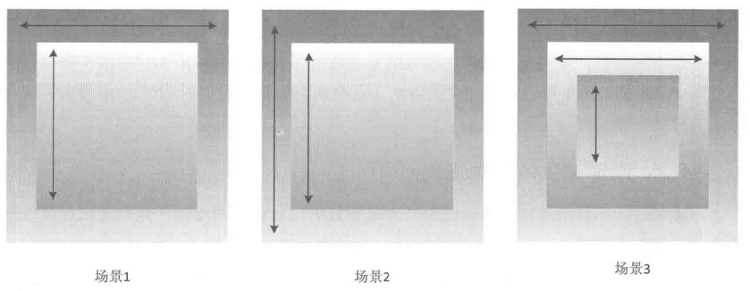
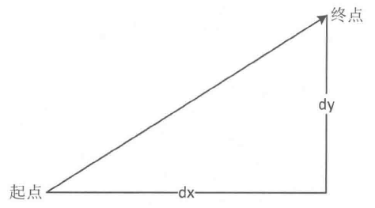
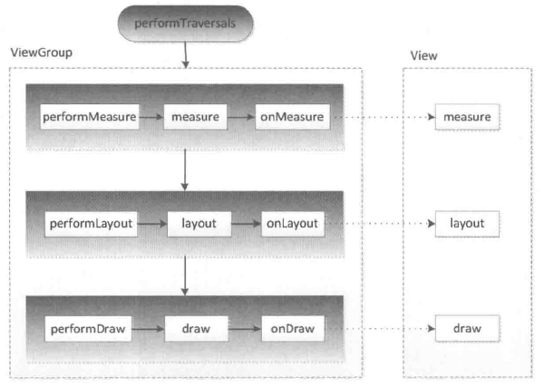
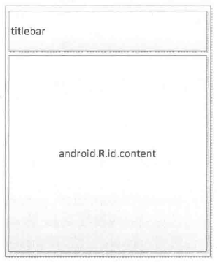
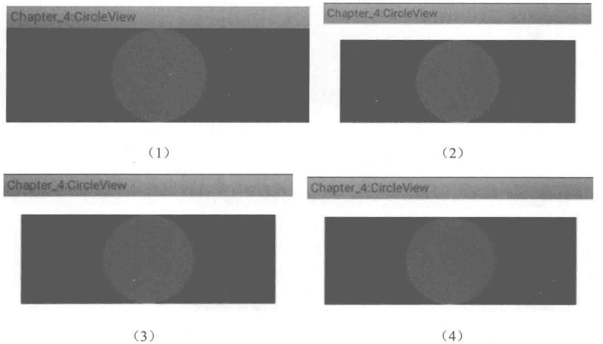
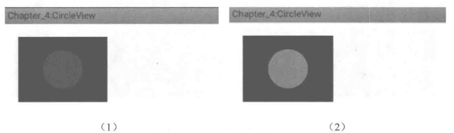

## 3.4 View的事件分发机制

上面几节介绍了View的基础知识以及View的滑动，本节将介绍View的一个核心知识点：事件分发机制。事件分发机制不仅仅是核心知识点更是难点，不少初学者甚至中级开发者面对这个问题时都会觉得困惑。另外，View的另一大难题滑动冲突，它的解决方法的理论基础就是事件分发机制，因此掌握好View的事件分发机制是十分重要的。本节将深入介绍View的事件分发机制，在3.4.1节会对事件分发机制进行概括性地介绍，而在3.4.2节将结合系统源码去进一步分析事件分发机制。

### 3.4.1 点击事件的传递规则

在介绍点击事件的传递规则之前，首先我们要明白这里要分析的对象就是MotionEvent，即点击事件，关于MotionEvent在3.1节中已经进行了介绍。所谓点击事件的事件分发，其实就是对MotionEvent事件的分发过程，即当一个MotionEvent产生了以后，系统需要把这个事件传递给一个具体的View，而这个传递的过程就是分发过程。点击事件的分发过程由三个很重要的方法来共同完成：dispatchTouchEvent、onInterceptTouchEvent和onTouchEvent，下面我们先介绍一下这几个方法。

public boolean  dispatchTouchEvent(MotionEvent ev)

用来进行事件的分发。如果事件能够传递给当前View，那么此方法一定会被调用，返回结果受当前View的onTouchEvent和下级View的dispatchTouchEvent方法的影响，表示是否消耗当前事件。

public boolean onInterceptTouchEvent(MotionEvent event)

在上述方法内部调用，用来判断是否拦截某个事件，如果当前View拦截了某个事件，那么在同一个事件序列当中，此方法不会被再次调用，返回结果表示是否拦截当前事件。

public boolean  onTouchEvent(MotionEvent event)

在dispatchTouchEvent方法中调用，用来处理点击事件，返回结果表示是否消耗当前事件，如果不消耗，则在同一个事件序列中，当前View无法再次接收到事件。

上述三个方法到底有什么区别呢？它们是什么关系呢？其实它们的关系可以用如下伪代码表示：

```
public boolean dispatchTouchEvent(MotionEvent ev) {
    boolean consume = false;
    if (onInterceptTouchEvent(ev)) {
        consume = onTouchEvent(ev);
    } else {
        consume = child.dispatchTouchEvent(ev);
    }

    return consume;
}
```

上述伪代码已经将三者的关系表现得淋漓尽致。通过上面的伪代码，我们也可以大致了解点击事件的传递规则：对于一个根ViewGroup来说，点击事件产生后，首先会传递给它，这时它的dispatchTouchEvent就会被调用，如果这个ViewGroup的onInterceptTouchEvent方法返回true就表示它要拦截当前事件，接着事件就会交给这个ViewGroup处理，即它的onTouchEvent方法就会被调用：如果这个ViewGroup的onInterceptTouchEvent方法返回false就表示它不拦截当前事件，这时当前事件就会继续传递给它的子元素，接着子元素的dispatchTouchEvent方法就会被调用，如此反复直到事件被最终处理。

当一个View需要处理事件时，如果它设置了OnTouchListener，那么OnTouchListener中的onTouch方法会被回调。这时事件如何处理还要看onTouch的返回值，如果返回false，则当前View的onTouchEvent方法会被调用；如果返回true，那么onTouchEvent方法将不会被调用。由此可见，给View设置的OnTouchListener，其优先级比onTouchEvent要高。在onTouchEvent方法中，如果当前设置的有OnClickListener，那么它的onClick方法会被调用。可以看出，平时我们常用的OnClickListener，其优先级最低，即处于事件传递的尾端。

当一个点击事件产生后，它的传递过程遵循如下顺序：Activity->Window->View，即事件总是先传递给Activity，Activity再传递给Window，最后Window再传递给顶级View。顶级View接收到事件后，就会按照事件分发机制去分发事件。考虑一种情况，如果一个View的onTouchEvent返回false，那么它的父容器的onTouchEvent将会被调用，依此类推。如果所有的元素都不处理这个事件，那么这个事件将会最终传递给Activity处理，即Activity的onTouchEvent方法会被调用。这个过程其实也很好理解，我们可以换一种思路，假如点击事件是一个难题，这个难题最终被上级领导分给了一个程序员去处理（这是事件分发过程），结果这个程序员搞不定（onTouchEvent返回了false），现在该怎么办呢？难题必须要解决，那只能交给水平更高的上级解决（上级的onTouchEvent被调用），如果上级再搞不定，那只能交给上级的上级去解决，就这样将难题一层层地向上抛，这是公司内部一种很常见的处理问题的过程。从这个角度来看，View的事件传递过程还是很贴近现实的，毕竟程序员也生活在现实中。

关于事件传递的机制，这里给出一些结论，根据这些结论可以更好地理解整个传递机制，如下所示。

（1）同一个事件序列是指从手指接触屏幕的那一刻起，到手指离开屏幕的那一刻结束，在这个过程中所产生的一系列事件，这个事件序列以down事件开始，中间含有数量不定的move事件，最终以up事件结束。

（2）正常情况下，一个事件序列只能被一个View拦截且消耗。这一条的原因可以参考

（3），因为一旦一个元素拦截了某此事件，那么同一个事件序列内的所有事件都会直接交给它处理，因此同一个事件序列中的事件不能分别由两个View同时处理，但是通过特殊手段可以做到，比如一个View将本该自己处理的事件通过onTouchEvent强行传递给其他View处理。

（3）某个View一旦决定拦截，那么这一个事件序列都只能由它来处理（如果事件序列能够传递给它的话），并且它的onInterceptTouchEvent不会再被调用。这条也很好理解，就是说当一个View决定拦截一个事件后，那么系统会把同一个事件序列内的其他方法都直接交给它来处理，因此就不用再调用这个View的onInterceptTouchEvent去询问它是否要拦截了。

（4）某个View一旦开始处理事件，如果它不消耗ACTION_DOWN事件（onTouchEvent返回了false），那么同一事件序列中的其他事件都不会再交给它来处理，并且事件将重新交由它的父元素去处理，即父元素的onTouchEvent会被调用。意思就是事件一旦交给一个View处理，那么它就必须消耗掉，否则同一事件序列中剩下的事件就不再交给它来处理了，这就好比上级交给程序员一件事，如果这件事没有处理好，短期内上级就不敢再把事情交给这个程序员做了，二者是类似的道理。

（5）如果View不消耗除ACTION_DOWN以外的其他事件，那么这个点击事件会消失，此时父元素的onTouchEvent并不会被调用，并且当前View可以持续收到后续的事件，最终这些消失的点击事件会传递给Activity处理。

（6）ViewGroup默认不拦截任何事件。Android源码中ViewGroup的onInterceptTouch Event方法默认返回false。

（7）View没有onInterceptTouchEvent方法，一旦有点击事件传递给它，那么它的onTouchEvent方法就会被调用。

（8）View的onTouchEvent默认都会消耗事件（返回true），除非它是不可点击的（clickable和longClickable同时为false）。View的longClickable属性默认都为false，clickable属性要分情况，比如Button的clickable属性默认为true，而TextView的clickable属性默认为false。

（9）View的enable属性不影响onTouchEvent的默认返回值。哪怕一个View是disable状态的，只要它的clickable或者longClickable有一个为true，那么它的onTouchEvent就返回true。

（10）onClick会发生的前提是当前View是可点击的，并且它收到了down和up的事件。

（11）事件传递过程是由外向内的，即事件总是先传递给父元素，然后再由父元素分发给子View，通过requestDisallowInterceptTouchEvent方法可以在子元素中干预父元素的事件分发过程，但是ACTION_DOWN事件除外。

### 3.4.2 事件分发的源码解析

上一节分析了View的事件分发机制，本节将会从源码的角度去进一步分析、证实上面的结论。

1.Activity对点击事件的分发过程

点击事件用MotionEvent来表示，当一个点击操作发生时，事件最先传递给当前Activity，由Activity的dispatchTouchEvent来进行事件派发，具体的工作是由Activity内部的Window来完成的。Window会将事件传递给decorview，decorview一般就是当前界面的底层容器（即 setContentView 所设置的 View 的父容器），通过 Activity.getWindow().getDecorView()可以获得。我们先从Activity的dispatchTouchEvent开始分析。

源码：Activity#dispatchTouchEvent

```
public boolean dispatchTouchEvent(MotionEvent ev) {
    if (ev.getAction() == MotionEvent.ACTION_DOWN) {
        onUserInteraction();
    }

    if (getWindow().superDispatchTouchEvent(ev)) {
        return true;
    }
    return onTouchEvent(ev);
}
```

现在分析上面的代码。首先事件开始交给Activity所附属的Window进行分发，如果返回true，整个事件循环就结束了，返回false意味着事件没人处理，所有View的onTouchEvent都返回了false，那么Activity的onTouchEvent就会被调用。

接下来看Window是如何将事件传递给ViewGroup的。通过源码我们知道，Window是个抽象类，而Window的superDispatchTouchEvent方法也是个抽象方法，因此我们必须找到Window的实现类才行。

源码：Window#superDispatchTouchEvent

```
public abstract boolean superDispatchTouchEvent(MotionEvent event);
```

那么到底Window的实现类是什么呢？其实是PhoneWindow，这一点从Window的源码中也可以看出来，在Window的说明中，有这么一段话：

> Abstract base class for a top-level window look and behavior policy. An instance of this class should be used as the top-level view added to the window manager. It provides standard UI policies such as a background, title area, default key processing, etc.
> 
> The only existing implementation of this abstract class is android.policy.PhoneWindow, which you should instantiate when needing a Window. Eventually that class will be refactored and a factory method added for creating Window instances without knowing about a particular implementation.

上面这段话的大概意思是：Window类可以控制顶级View的外观和行为策略，它的唯一实现位于android.policy.PhoneWindow中，当你要实例化这个Window类的时候，你并不知道它的细节，因为这个类会被重构，只有一个工厂方法可以使用。尽管这看起来有点模糊，不过我们可以看一下android.policy.PhoneWindow这个类，尽管实例化的时候此类会被重构，仅是重构而已，功能是类似的。

由于Window的唯一实现是PhoneWindow，因此接下来看一下PhoneWindow是如何处理点击事件的，如下所示。

源码：PhoneWindow#superDispatchTouchEvent

```
public boolean superDispatchTouchEvent(MotionEvent event) {
    return mDecor.superDispatchTouchEvent(event);
}
```

到这里逻辑就很清晰了，PhoneWindow将事件直接传递给了DecorView，这个DecorView是什么呢？请看下面：

```
private final class DecorView extends FrameLayout implements RootViewSurfaceTaker

    // This is the top-level view of the window, containing the window decor.
private DecorView mDecor;

@Override
public final View getDecorView() {
    if (mDecor == null) {
        installDecor();
    }
    return mDecor;
}
```

我们知道，通过（(ViewGroup)getWindow().getDecorView().findViewById（android.R.id.content)).getChildAt(0)这种方式就可以获取Activity所设置的View，这个mDecor显然就是getWindow().getDecorView()返回的View，而我们通过setContentView设置的View是它的一个子View。目前事件传递到了DecorView这里，由于DecorView继承自FrameLayout且是父View，所以最终事件会传递给View。换句话来说，事件肯定会传递到View，不然应用如何响应点击事件呢？不过这不是我们的重点，重点是事件到了View以后应该如何传递，这对我们更有用。从这里开始，事件已经传递到顶级View了，即在Activity中通过setContentView所设置的View，另外顶级View也叫根View，顶级View一般来说都是ViewGroup。

3.顶级View对点击事件的分发过程

关于点击事件如何在View中进行分发，上一节已经做了详细的介绍，这里再大致回顾一下。点击事件达到顶级View（一般是一个ViewGroup）以后，会调用ViewGroup的dispatchTouchEvent方法，然后的逻辑是这样的：如果顶级ViewGroup拦截事件即onInterceptTouchEvent 返回true，则事件由ViewGroup处理，这时如果ViewGroup的mOnTouchListener被设置，则onTouch会被调用，否则onTouchEvent会被调用。也就是说，如果都提供的话，onTouch会屏蔽掉onTouchEvent。在onTouchEvent中，如果设置了mOnClickListener，则onClick会被调用。如果顶级ViewGroup不拦截事件，则事件会传递给它所在的点击事件链上的子View，这时子View的dispatchTouchEvent会被调用。到此为止，事件已经从顶级View传递给了下一层View，接下来的传递过程和顶级View是一致的，如此循环，完成整个事件的分发。

首先看ViewGroup对点击事件的分发过程，其主要实现在ViewGroup的dispatchTouch Event方法中，这个方法比较长，这里分段说明。先看下面一段，很显然，它描述的是当前View是否拦截点击事情这个逻辑。

```
// Check for interception.
final boolean intercepted;
if (actionMasked == MotionEvent.ACTION_DOWN
        || mFirstTouchTarget != null) {
    final boolean disallowIntercept = (mGroupFlags & FLAG_DISALLOW_INTERCEPT) != 0;
    if (!disallowIntercept) {
        intercepted = onInterceptTouchEvent(ev);
        ev.setAction(action); // restore action in case it was changed
    } else {
        intercepted = false;
    }
} else {
    // There are no touch targets and this action is not an initial down
    // so this view group continues to intercept touches.
    intercepted = true;
}
```

从上面代码我们可以看出，ViewGroup在如下两种情况下会判断是否要拦截当前事件：事件类型为ACTION_DOWN或者mFirstTouchTarget！=null。ACTION_DOWN事件好理解，那么mFirstTouchTarget！=null是什么意思呢？这个从后面的代码逻辑可以看出来，当事件由ViewGroup的子元素成功处理时，mFirstTouchTarget会被赋值并指向子元素，换种方式来说，当ViewGroup不拦截事件并将事件交由子元素处理时mFirstTouchTarget！=null。反过来，一旦事件由当前ViewGroup拦截时，mFirstTouchTarget！=null就不成立。那么当ACTION_MOVE和ACTION_UP事件到来时，由于（actionMasked==MotionEvent.ACTION_DOWNl|mFirstTouchTarget!=null)这个条件为false，将导致ViewGroup的onInterceptTouchEvent不会再被调用，并且同一序列中的其他事件都会默认交给它处理。

当然，这里有一种特殊情况，那就是FLAG_DISALLOW_INTERCEPT标记位，这个标记位是通过requestDisallowInterceptTouchEvent方法来设置的，一般用于子View中。FLAG_DISALLOW_INTERCEPT一旦设置后， ViewGroup将无法拦截除了ACTION_DOWN以外的其他点击事件。为什么说是除了ACTION_DOWN以外的其他事件呢？这是因为ViewGroup在分发事件时，如果是ACTION_DOWN就会重置FLAG_DISALLOW_INTERCEPT这个标记位，将导致子View中设置的这个标记位无效。因此，当面对ACTION_DOWN事件时，ViewGroup总是会调用自己的onInterceptTouchEvent方法来询问自己是否要拦截事件，这一点从源码中也可以看出来。在下面的代码中，ViewGroup会在ACTION_DOWN事件到来时做重置状态的操作，而在resetTouchState方法中会对FLAG_DISALLOW_INTERCEPT进行重置，因此子View调用request-DisallowInterceptTouchEvent方法并不能影响ViewGroup对ACTION_DOWN事件的处理。

```
// Handle an initial down.
if (actionMasked == MotionEvent.ACTION_DOWN) {
    // Throw away all previous state when starting a new touch gesture.
    // The framework may have dropped the up or cancel event for the previous gesture
    // due to an app switch, ANR, or some other state change.
    cancelAndClearTouchTargets(ev);
    resetTouchState();
}
```

从上面的源码分析，我们可以得出结论：当ViewGroup决定拦截事件后，那么后续的点击事件将会默认交给它处理并且不再调用它的onInterceptTouchEvent方法，这证实了

3.4.1节末尾处的第3条结论。FLAG_DISALLOW_INTERCEPT这个标志的作用是让ViewGroup不再拦截事件，当然前提是ViewGroup不拦截ACTION_DOWN事件，这证实了3.4.1节末尾处的第11条结论。那么这段分析对我们有什么价值呢？总结起来有两点：第一点，onInterceptTouchEvent不是每次事件都会被调用的，如果我们想提前处理所有的点击事件，要选择dispatchTouchEvent方法，只有这个方法能确保每次都会调用，当然前提是事件能够传递到当前的ViewGroup：另外一点，FLAG_DISALLOW_INTERCEPT标记位的作用给我们提供了一个思路，当面对滑动冲突时，我们可以是不是考虑用这种方法去解决问题？关于滑动冲突，将在3.5节进行详细分析。

接着再看当ViewGroup不拦截事件的时候，事件会向下分发交由它的子View进行处理，这段源码如下所示。

```
final View[] children = mChildren;
for (int i = childrenCount - 1; i >= 0; i--) {
    final int childIndex = customOrder
            ? getChildDrawingOrder(childrenCount, i) : i;
    final View child = (preorderedList == null)
            ? children[childIndex] : preorderedList.get(childIndex);
    if (!canViewReceivePointerEvents(child)
            || !isTransformedTouchPointInView(x, y, child, null)) {
        continue;
    }

    newTouchTarget = getTouchTarget(child);
    if (newTouchTarget != null) {
        // Child is already receiving touch within its bounds.
        // Give it the new pointer in addition to the ones it is handling.
        newTouchTarget.pointerIdBits |= idBitsToAssign;
        break;
    }

    resetCancelNextUpFlag(child);
    if (dispatchTransformedTouchEvent(ev, false, child, idBitsToAssign)) {
        // Child wants to receive touch within its bounds.
        mLastTouchDownTime = ev.getDownTime();
        if (preorderedList != null) {
            // childIndex points into presorted list, find original index
            for (int j = 0; j < childrenCount; j++) {
                if (children[childIndex] == mChildren[j]) {
                    mLastTouchDownIndex = j;
                    break;
                }
            }
        } else {
            mLastTouchDownIndex = childIndex;
        }
        mLastTouchDownX = ev.getX();
        mLastTouchDownY = ev.getY();
        newTouchTarget = addTouchTarget(child, idBitsToAssign);
        alreadyDispatchedToNewTouchTarget = true;
        break;
    }
}
```

上面这段代码逻辑也很清晰，首先遍历ViewGroup的所有子元素，然后判断子元素是否能够接收到点击事件。是否能够接收点击事件主要由两点来衡量：子元素是否在播动画和点击事件的坐标是否落在子元素的区域内。如果某个子元素满足这两个条件，那么事件就会传递给它来处理。可以看到，dispatchTransformedTouchEvent实际上调用的就是子元素的dispatchTouchEvent方法，在它的内部有如下一段内容，而在上面的代码中child传递的不是null，因此它会直接调用子元素的dispatchTouchEvent方法，这样事件就交由子元素处理了，从而完成了一轮事件分发。

```
if (child == null) {
    handled = super.dispatchTouchEvent(event);
} else {
    handled = child.dispatchTouchEvent(event);
}
```

如果子元素的dispatchTouchEvent返回true，这时我们暂时不用考虑事件在子元素内部是怎么分发的，那么mFirstTouchTarget就会被赋值同时跳出for循环，如下所示。

```
 newTouchTarget = addTouchTarget(child, idBitsToAssign);
 alreadyDispatchedToNewTouchTarget = true;
break;
```

这几行代码完成了mFirstTouchTarget的赋值并终止对子元素的遍历。如果子元素的dispatchTouchEvent返回false，ViewGroup就会把事件分发给下一个子元素（如果还有下一个子元素的话）。

其实mFirstTouchTarget真正的赋值过程是在addTouchTarget内部完成的，从下面的addTouchTarget方法的内部结构可以看出，mFirstTouchTarget其实是一种单链表结构。mFirstTouchTarget是否被赋值，将直接影响到ViewGroup对事件的拦截策略，如果mFirstTouchTarget为null，那么ViewGroup就默认拦截接下来同一序列中所有的点击事件，这一点在前面已经做了分析。

```
private TouchTarget addTouchTarget(View child, int pointerIdBits) {
    TouchTarget target = TouchTarget.obtain(child, pointerIdBits);
    target.next = mFirstTouchTarget;
    mFirstTouchTarget = target;
    return target;
}
```

如果遍历所有的子元素后事件都没有被合适地处理，这包含两种情况：第一种是ViewGroup没有子元素；第二种是子元素处理了点击事件，但是在dispatchTouchEvent中返回了false，这一般是因为子元素在onTouchEvent中返回了false。在这两种情况下，ViewGroup会自己处理点击事件，这里就证实了3.4.1节中的第4条结论，代码如下所示。

```
 // Dispatch to touch targets.
 if(mFirstTouchTarget == null) {
    // No touch targets so treat this as an ordinary view.
    handled = dispatchTransformedTouchEvent(ev, canceled, null,
            TouchTarget.ALL_POINTER_IDS);
}
```

注意上面这段代码，这里第三个参数child为null，从前面的分析可以知道，它会调用super.dispatchTouchEvent（event)，很显然，这里就转到了View的dispatchTouchEvent方法，即点击事件开始交由View来处理，请看下面的分析。

4.View对点击事件的处理过程

View对点击事件的处理过程稍微简单一些，注意这里的View不包含ViewGroup。先看它的dispatchTouchEvent方法，如下所示。

```
public boolean dispatchTouchEvent(MotionEvent event) {
    boolean result = false;
    ...

    if (onFilterTouchEventForSecurity(event)) {
        //noinspection SimplifiableIfStatement
        ListenerInfo li = mListenerInfo;
        if (li != null && li.mOnTouchListener != null
                && (mViewFlags & ENABLED_MASK) == ENABLED
                && li.mOnTouchListener.onTouch(this, event)) {
            result = true;
        }

        if (!result && onTouchEvent(event)) {
            result = true;
        }
    }
    ...

    return result;
}
```

View对点击事件的处理过程就比较简单了，因为View（这里不包含ViewGroup）是一个单独的元素，它没有子元素因此无法向下传递事件，所以它只能自己处理事件。从上面的源码可以看出View对点击事件的处理过程，首先会判断有没有设置OnTouchListener，如果OnTouchListener中的onTouch方法返回true，那么onTouchEvent就不会被调用，可见OnTouchListener的优先级高于onTouchEvent，这样做的好处是方便在外界处理点击事件。

接着再分析onTouchEvent的实现。先看当View处于不可用状态下点击事件的处理过程，如下所示。很显然，不可用状态下的View照样会消耗点击事件，尽管它看起来不可用。

```
if ((viewFlags & ENABLED_MASK) == DISABLED) {
    if (event.getAction() == MotionEvent.ACTION_UP && (mPrivateFlags & PFLAG_PRESSED) != 0) {
        setPressed(false);
    }
    // A disabled view that is clickable still consumes the touch
    // events, it just doesn't respond to them.
    return (((viewFlags & CLICKABLE) == CLICKABLE ||
            (viewFlags & LONG_CLICKABLE) == LONG_CLICKABLE));
}
```

接着，如果View设置有代理，那么还会执行TouchDelegate的onTouchEvent方法，这个onTouchEvent的工作机制看起来和OnTouchListener类似，这里不深入研究了。

```
if (mTouchDelegate != null) {
    if (mTouchDelegate.onTouchEvent(event)) {
        return true;
    }
}
```

下面再看一下onTouchEvent中对点击事件的具体处理，如下所示。

```
if (((viewFlags & CLICKABLE) == CLICKABLE ||
        (viewFlags & LONG_CLICKABLE) == LONG_CLICKABLE)) {
    switch (event.getAction()) {
        case MotionEvent.ACTION_UP:
            boolean prepressed = (mPrivateFlags & PFLAG_PREPRESSED) != 0;
            if ((mPrivateFlags & PFLAG_PRESSED) != 0 || prepressed) {
                ...
                if (!mHasPerformedLongPress) {
                    // This is a tap, so remove the longpress check
                    removeLongPressCallback();

                    // Only perform take click actions if we were in the pressed state
                    if (!focusTaken) {
                        // Use a Runnable and post this rather than calling
                        // performClick directly. This lets other visual state
                        // of the view update before click actions start.
                        if (mPerformClick == null) {
                            mPerformClick = new PerformClick();
                        }
                        if (!post(mPerformClick)) {
                            performClick();
                        }
                    }
                }
                ...
            }
            ...
            break;
        ...
    }
    ...
    return true;
```

那么它就会消耗这个事件，即onTouchEvent方法返回true，不管它是不是DISABLE状态，这就证实了3.4.1节末尾处的第8、第9和第10条结论。然后就是当ACTION_UP事件发生时，会触发performClick方法，如果View设置了OnClickListener，那么performClick方法内部会调用它的onClick方法，如下所示。

```
public boolean performClick() {
    final boolean result;
    final ListenerInfo li = mListenerInfo;
    if (li != null && li.mOnClickListener != null) {
        playSoundEffect(SoundEffectConstants.CLICK);
        li.mOnClickListener.onClick(this);
        result = true;
    } else {
        result = false;
    }
    sendAccessibilityEvent(AccessibilityEvent.TYPE_VIEW_CLICKED);
    return result;
}
```

View的LONG_CLICKABLE属性默认为false，而CLICKABLE属性是否为false和具体的View有关，确切来说是可点击的View其CLICKABLE为true，不可点击的View其CLICKABLE为false，比如Button是可点击的，TextView是不可点击的。通过setClickable和setLongClickable可以分别改变View的CLICKABLE和LONG_CLICKABLE属性。另外，setOnClickListener会自动将View的CLICKABLE设为true，setOnLongClickListener则会自动将View的LONG_CLICKABLE设为true，这一点从源码中可以看出来，如下所示。

```
public void setOnClickListener(OnClickListener l) {
    if (!isClickable()) {
        setClickable(true);
    }
    getListenerInfo().mOnClickListener = l;
}

public void setOnLongClickListener(OnLongClickListener l) {
    if (!isLongClickable()) {
        setLongClickable(true);
    }
    getListenerInfo().mOnLongClickListener = l;
}
```

到这里，点击事件的分发机制的源码实现已经分析完了，结合3.4.1节中的理论分析和相关结论，读者就可以更好地理解事件分发了。在3.5节将介绍滑动冲突相关的知识，具体情况请看下面的分析。

## 3.5 View的滑动冲突

本节开始介绍View体系中一个深入的话题：滑动冲突。相信开发Android的人都会有这种体会：滑动冲突实在是太坑人了，本来从网上下载的demo运行得好好的，但是只要出现滑动冲突，demo就无法正常工作了。那么滑动冲突是如何产生的呢？其实在界面中只要内外两层同时可以滑动，这个时候就会产生滑动冲突。如何解决滑动冲突呢？这既是一件困难的事又是一件简单的事，说困难是因为许多开发者面对滑动冲突都会显得束手无策，说简单是因为滑动冲突的解决有固定的套路，只要知道了这个固定套路问题就好解决了。本节是View体系的核心章节，前面4节均是为本节服务的，通过本节的学习，滑动冲突将不再是个问题。

### 3.5.1 常见的滑动冲突场景

常见的滑动冲突场景可以简单分为如下三种（详情请参看图3-4）：

●场景1—外部滑动方向和内部滑动方向不一致；

场景2——外部滑动方向和内部滑动方向一致；

）场景3——上面两种情况的嵌套。



图 3-4 滑动冲突的场景

先说场景1，主要是将ViewPager和Fragment配合使用所组成的页面滑动效果，主流应用几乎都会使用这个效果。在这种效果中，可以通过左右滑动来切换页面，而每个页面内部往往又是一个ListView。本来这种情况下是有滑动冲突的，但是ViewPager内部处理了这种滑动冲突，因此采用ViewPager时我们无须关注这个问题，如果我们采用的不是ViewPager而是ScrollView等，那就必须手动处理滑动冲突了，否则造成的后果就是内外两层只能有一层能够滑动，这是因为两者之间的滑动事件有冲突。除了这种典型情况外，还存在其他情况，比如外部上下滑动、内部左右滑动等，但是它们属于同一类滑动冲突。

再说场景2，这种情况就稍微复杂一些，当内外两层都在同一个方向可以滑动的时候，显然存在逻辑问题。因为当手指开始滑动的时候，系统无法知道用户到底是想让哪一层滑动，所以当手指滑动的时候就会出现问题，要么只有一层能滑动，要么就是内外两层都滑动得很卡顿。在实际的开发中，这种场景主要是指内外两层同时能上下滑动或者内外两层同时能左右滑动。

最后说下场景3，场景3是场景1和场景2两种情况的嵌套，因此场景3的滑动冲突看起来就更加复杂了。比如在许多应用中会有这么一个效果：内层有一个场景1中的滑动效果，然后外层又有一个场景2中的滑动效果。具体说就是，外部有一个SlideMenu效果，然后内部有一个ViewPager，ViewPager的每一个页面中又是一个ListView。虽然说场景3的滑动冲突看起来更复杂，但是它是几个单一的滑动冲突的叠加，因此只需要分别处理内层和中层、中层和外层之间的滑动冲突即可，而具体的处理方法其实是和场景1、场景2相同的。

从本质上来说，这三种滑动冲突场景的复杂度其实是相同的，因为它们的区别仅仅是滑动策略的不同，至于解决滑动冲突的方法，它们几个是通用的，在3.5.2节中将会详细介绍这个问题。

### 3.5.2 滑动冲突的处理规则

一般来说，不管滑动冲突多么复杂，它都有既定的规则，根据这些规则我们就可以选择合适的方法去处理。

如图3-4所示，对于场景1，它的处理规则是：当用户左右滑动时，需要让外部的View拦截点击事件，当用户上下滑动时，需要让内部View拦截点击事件。这个时候我们就可以根据它们的特征来解决滑动冲突，具体来说是：根据滑动是水平滑动还是竖直滑动来判断到底由谁来拦截事件，如图3-5所示，根据滑动过程中两个点之间的坐标就可以得出到底是水平滑动还是竖直滑动。如何根据坐标来得到滑动的方向呢？这个很简单，有很多可以参考，比如可以依据滑动路径和水平方向所形成的夹角，也可以依据水平方向和竖直方向上的距离差来判断，某些特殊时候还可以依据水平和竖直方向的速度差来做判断。这里我们可以通过水平和竖直方向的距离差来判断，比如竖直方向滑动的距离大就判断为竖直滑动，否则判断为水平滑动。根据这个规则就可以进行下一步的解决方法制定了。

对于场景2来说，比较特殊，它无法根据滑动的角度、距离差以及速度差来做判断，但是这个时候一般都能在业务上找到突破点，比如业务上有规定：当处于某种状态时需要外部View响应用户的滑动，而处于另外一种状态时则需要内部View来响应View的滑动，根据这种业务上的需求我们也能得出相应的处理规则，有了处理规则同样可以进行下一步处理。这种场景通过文字描述可能比较抽象，在下一节会通过实际的例子来演示这种情况的解决方案，那时就容易理解了，这里先有这个概念即可。



图 3-5 滑动过程示意

对于场景3来说，它的滑动规则就更复杂了，和场景2一样，它也无法直接根据滑动的角度、距离差以及速度差来做判断，同样还是只能从业务上找到突破点，具体方法和场景2一样，都是从业务的需求上得出相应的处理规则，在下一节将会通过实际的例子来演示这种情况的解决方案。

### 3.5.3 滑动冲突的解决方式

在3.5.1节中描述了三种典型的滑动冲突场景，在本节将会一一分析各种场景并给出具体的解决方法。首先我们要分析第一种滑动冲突场景，这也是最简单、最典型的一种滑动冲突，因为它的滑动规则比较简单，不管多复杂的滑动冲突，它们之间的区别仅仅是滑动规则不同而已。抛开滑动规则不说，我们需要找到一种不依赖具体的滑动规则的通用的解决方法，在这里，我们就根据场景1的情况来得出通用的解决方案，然后场景2和场景3我们只需要修改有关滑动规则的逻辑即可。

上面说过，针对场景1中的滑动，我们可以根据滑动的距离差来进行判断，这个距离差就是所谓的滑动规则。如果用ViewPager去实现场景1中的效果，我们不需要手动处理滑动冲突，因为ViewPager已经帮我们做了，但是这里为了更好地演示滑动冲突的解决思想，没有采用ViewPager。其实在滑动过程中得到滑动的角度这个是相当简单的，但是到底要怎么做才能将点击事件交给合适的View去处理呢？这时就要用到3.4节所讲述的事件分发机制了。针对滑动冲突，这里给出两种解决滑动冲突的方式：外部拦截法和内部拦截法。

1．外部拦截法

所谓外部拦截法是指点击事情都先经过父容器的拦截处理，如果父容器需要此事件就拦截，如果不需要此事件就不拦截，这样就可以解决滑动冲突的问题，这种方法比较符合点击事件的分发机制。外部拦截法需要重写父容器的onlnterceptTouchEvent方法，在内部做相应的拦截即可，这种方法的伪代码如下所示。

```
 public boolean onInterceptTouchEvent(MotionEvent event) {
     boolean intercepted = false;
     int x = (int) event.getX();
     int y = (int) event.getY();
     switch(event.getAction()) {
     case MotionEvent.ACTION_DOWN: {
         intercepted = false;
         break;
     }
     case MotionEvent.ACTION_MOVE: {
         if (父容器需要当前点击事件) {
             intercepted = true;
         } else {
             intercepted = false;
         }
         break;
     }
     case MotionEvent.ACTION_UP: {
         intercepted = false;
         break;
     }
     default:
         break;
     }
     mLastXIntercept = x;
     mLastYIntercept = y;
     return intercepted;
 }
```

上述代码是外部拦截法的典型逻辑，针对不同的滑动冲突，只需要修改父容器需要当前点击事件这个条件即可，其他均不需做修改并且也不能修改。这里对上述代码再描述一下，在onInterceptTouchEvent方法中，首先是ACTION_DOWN这个事件，父容器必须返回false，即不拦截ACTION_DOWN事件，这是因为一旦父容器拦截了ACTION_DOWN，那么后续的ACTION_MOVE和ACTION_UP事件都会直接交由父容器处理，这个时候事件没法再传递给子元素了；其次是ACTION_MOVE事件，这个事件可以根据需要来决定是否拦截，如果父容器需要拦截就返回true，否则返回false；最后是ACTION_UP事件，这里必须要返回false，因为ACTION_UP事件本身没有太多意义。

考虑一种情况，假设事件交由子元素处理，如果父容器在ACTION_UP时返回了true，就会导致子元素无法接收到ACTION_UP事件，这个时候子元素中的onClick事件就无法触发，但是父容器比较特殊，一旦它开始拦截任何一个事件，那么后续的事件都会交给它来处理，而ACTION_UP作为最后一个事件也必定可以传递给父容器，即便父容器的onlnterceptTouchEvent方法在ACTION_UP时返回了false。

2.内部拦截法

内部拦截法是指父容器不拦截任何事件，所有的事件都传递给子元素，如果子元素需要此事件就直接消耗掉，否则就交由父容器进行处理，这种方法和Android中的事件分发机制不一致，需要配合requestDisallowInterceptTouchEvent方法才能正常工作，使用起来较外部拦截法稍显复杂。它的伪代码如下，我们需要重写子元素的dispatchTouchEvent方法：

```
public boolean dispatchTouchEvent(MotionEvent event) {
     int x = (int) event.getX();
     int y = (int) event.getY();
     switch(event.getAction()) {
     case MotionEvent.ACTION_DOWN: {
         parent .requestDisallowInterceptTouchEvent(true) ;
         break;
     }
     case MotionEvent.ACTION_MOVE: {
         int deltaX = x - mLastX;
         int deltaY = y - mLastY;
         if (父容器需要此类点击事件) {
             parent.requestDisallowInterceptTouchEvent(false);
         }
         break;
     }
     case MotionEvent.ACTION_UP: {
         break;
     }
     default:
         break;
     }
    mLastX = x;
    mLastY = y;
     return super.dispatchTouchEvent(event) ;
 }
```

上述代码是内部拦截法的典型代码，当面对不同的滑动策略时只需要修改里面的条件即可，其他不需要做改动而且也不能有改动。除了子元素需要做处理以外，父元素也要默认拦截除了ACTION_DOWN以外的其他事件，这样当子元素调用parent.requestDisal lowInterceptTouchEvent(false）方法时，父元素才能继续拦截所需的事件。

为什么父容器不能拦截ACTION_DOWN事件呢？那是因为ACTION_DOWN事件并不受FLAG_DISALLOW_INTERCEPT这个标记位的控制，所以一旦父容器拦截ACTION_DOWN事件，那么所有的事件都无法传递到子元素中去，这样内部拦截就无法起作用了。父元素所做的修改如下所示。

```
 public boolean onInterceptTouchEvent(MotionEvent event) {
     int action = event.getAction();
     if(action == MotionEvent.ACTION_DOWN) {
         return false;
     } else {
         return true;
     }
 }
```

下面通过一个实例来分别介绍这两种方法。我们来实现一个类似于ViewPager中嵌套ListView的效果，为了制造滑动冲突，我们写一个类似于ViewPager的控件即可，名字就叫HorizontalScrollViewEx，这个控件的具体实现思想会在第4章进行详细介绍，这里只讲述滑动冲突的部分。

为了实现ViewPager的效果，我们定义了一个类似于水平的LinearLayout的东西，只不过它可以水平滑动，初始化时我们在它的内部添加若干个ListView，这样一来，由于它内部的Listview可以竖直滑动。而它本身又可以水平滑动，因此一个典型的滑动冲突场景就出现了，并且这种冲突属于类型1的冲突。根据滑动策略，我们可以选择水平和竖直的滑动距离差来解决滑动冲突。

首先来看一下Activity中的初始化代码，如下所示。

```
public class DemoActivity_1 extends Activity {
    private static final String TAG = "SecondActivity";
    private HorizontalScrollViewEx mListContainer;
    @Override
    protected void onCreate(Bundle savedInstanceState) {
        super.onCreate(savedInstanceState) ;
        setContentView(R.layout.demo_1);
       Log.d(TAG, "onCreate");
        initView();
    }
    private void initView() {
        LayoutInflater inflater = getLayoutInflater();
       mListContainer = (HorizontalScrollViewEx) findViewById(R.id.
        container) ;
        final int screenWidth = MyUtils.getScreenMetrics(this) .widthPixels;
        final int screenHeight = MyUtils.getScreenMetrics(this) .heightPixels;
        for(int i = 0; i < 3; i++) {
           ViewGroup layout = (ViewGroup) inflater.inflate(
                  R.layout.content_layout, mListContainer, false);
           layout.getLayoutParams() .width = screenWidth;
           TextView textView = (TextView) layout.findViewById(R.id.title);
           textView.setText("page " + (i + 1));
           layout.setBackgroundColor(Color.rgb(255/ (i+1),255/ (i +1), 0));
           createList(layout) ;
           mListContainer.addView(layout) ;
        }
    }
    private void createList(ViewGroup layout) {
       ListView listView = (ListView) layout.findViewById(R.id.list);
       ArrayList<String> datas = new ArrayList<String>();
        for (int i = 0; i < 50; i++) {
           datas.add("name " + i);
        }
       ArrayAdapter<String> adapter = new ArrayAdapter<String> (this,
              R.layout.content_list_item, R.id.name, datas);
        listView.setAdapter(adapter) ;
    }
 }
```

上述初始化代码很简单，就是创建了3个ListView并且把ListView加入到我们自定义的HorizontalScrollViewEx中，这里HorizontalScrollViewEx是父容器，而ListView则是子元素，这里就不再多介绍了。

首先采用外部拦截法来解决这个问题，按照前面的分析，我们只需要修改父容器需要拦截事件的条件即可。对于本例来说，父容器的拦截条件就是滑动过程中水平距离差比竖直距离差大，在这种情况下，父容器就拦截当前点击事件，根据这一条件进行相应修改，修改后的HorizontalScrollViewEx的onInterceptTouchEvent方法如下所示。

```
public boolean onInterceptTouchEvent(MotionEvent event) {
    boolean intercepted = false;
     int x = (int) event.getX();
     int y = (int) event.getY();
     switch(event.getAction()) {
     case MotionEvent.ACTION_DOWN: {
         intercepted = false;
         if(!mScroller.isFinished()) {
             mScroller.abortAnimation();
             intercepted = true;
         }
         break;
     }
     case MotionEvent .ACTION_MOVE: {
         int deltaX = x - mLastXIntercept;
         int deltaY = y - mLastYIntercept;
         if(Math.abs(deltaX) > Math.abs(deltaY)) {
             intercepted = true;
         } else {
             intercepted = false;
         }
        break;
     }
    case MotionEvent.ACTION_UP: {
         intercepted = false;
        break;
     }
    default:
        break;
     }
    Log.d(TAG, "intercepted=" + intercepted);
    mLastXIntercept = x;
    mLastYIntercept = y;
    return intercepted;
}
```

从上面的代码来看，它和外部拦截法的伪代码的差别很小，只是把父容器的拦截条件换成了具体的逻辑。在滑动过程中，当水平方向的距离大时就判断为水平滑动，为了能够水平滑动所以让父容器拦截事件；而竖直距离大时父容器就不拦截事件，于是事件就传递给了ListView，所以ListView也能上下滑动，如此滑动冲突就解决了。至于mScroller.abortAnimationO这一句话主要是为了优化滑动体验而加入的。

考虑一种情况，如果此时用户正在水平滑动，但是在水平滑动停止之前如果用户再迅速进行竖直滑动，就会导致界面在水平方向无法滑动到终点从而处于一种中间状态。为了避免这种不好的体验，当水平方向正在滑动时，下一个序列的点击事件仍然交给父容器处理，这样水平方向就不会停留在中间状态了。

下面是HorizontalScrollViewEx的具体实现，只展示了和滑动冲突相关的代码：

```
 public class HorizontalScrollViewEx extends ViewGroup {
    private static final String TAG = "HorizontalScrollViewEx";
    private int mChildrenSize;
    private int mChildWidth;
    private int mChildIndex;
    //分别记录上次滑动的坐标
    private int mLastX = 0;
    private int mLastY = 0;
    //分别记录上次滑动的坐标(onInterceptTouchEvent)
    private int mLastXIntercept = 0;
    private int mLastYIntercept = 0;
    private Scroller mScroller;
    private VelocityTracker mVelocityTracker;
    ...
    private void init() {
       mScroller = new Scroller(getContext());
       mVelocityTracker = VelocityTracker.obtain();
    }
    @Override
    public boolean onInterceptTouchEvent(MotionEvent event) {
       boolean intercepted = false;
int x = (int) event.getX();
        int y = (int) event.getY();
        switch(event.getAction()) {
        case MotionEvent.ACTION_DOWN: {
           intercepted = false;
           if(!mScroller.isFinished()) {
              mScroller.abortAnimation();
               intercepted = true;
           }
           break;
        }
        case MotionEvent.ACTION_MOVE: {
           int deltaX = x - mLastXIntercept;
           int deltaY = y - mLastYIntercept;
           if(Math.abs(deltaX) > Math.abs(deltaY)) {
               intercepted = true;
           } else {
               intercepted = false;
           }
           break;
        }
       case MotionEvent.ACTION_UP: {
           intercepted = false;
           break;
        }
       default:
           break;
        }
       Log.d(TAG, "intercepted=" + intercepted);
       mLastX = x;
       mLastY = y;
       mLastXIntercept = x;
       mLastYIntercept = y;
       return intercepted;
    }
    @Override
    public boolean onTouchEvent(MotionEvent event) {
       mVelocityTracker.addMovement(event) ;
       int x = (int) event.getX();
       int y = (int) event.getY();
        switch(event.getAction()) {
        case MotionEvent.ACTION_DOWN: {
           if(!mScroller.isFinished()) {
               mScroller.abortAnimation();
           }
           break;
        }
        case MotionEvent.ACTION_MOVE: {
           int deltaX = x - mLastX;
           int deltaY = y - mLastY;
           scrollBy(-deltaX, 0);
           break;
        }
        case MotionEvent.ACTION_UP: {
           int scrollX = getScrollX();
           int scrollToChildIndex = scrollX / mChildWidth;
           mVelocityTracker.computeCurrentVelocity(1000) ;
           float xVelocity = mVelocityTracker.getXVelocity();
           if(Math.abs(xVelocity) >= 50) {
              mChildIndex = xVelocity>0? mChildIndex - 1 : mChildIndex + 1;
           } else {
              mChildIndex = (scrollX + mChildWidth / 2) / mChildWidth;
           }
           mChildIndex = Math.max(0, Math.min(mChildIndex, mChildrenSize -
           1));
           int dx = mChildIndex * mChildWidth - scrollX;
           smoothScrollBy(dx, 0);
           mVelocityTracker.clear();
           break;
        }
       default:
           break;
       }
       mLastX = x;
       mLastY = y;
       return true;
    }
    private void smoothScrollBy(int dx, int dy) {
       mScroller.startScroll(getScrollX(), 0, dx, 0, 500);
        invalidate();
    }
    @Override
    public void computeScroll() {
        if(mScroller.computeScrollOffset()) {
           scrollTo(mScroller.getCurrX(), mScroller.getCurrY());
           postInvalidate();
        }
    }
    ...
}
```

如果采用内部拦截法也是可以的，按照前面对内部拦截法的分析，我们只需要修改ListView的dispatchTouchEvent方法中的父容器的拦截逻辑，同时让父容器拦截ACTION MOVE和ACTION_UP事件即可。为了重写ListView的dispatchTouchEvent方法，我们必须自定义一个ListView，称为ListViewEx，然后对内部拦截法的模板代码进行修改，根据需要，ListViewEx的实现如下所示。

```
public class ListViewEx extends ListView {
    private static final String TAG = "ListViewEx";
    private HorizontalScrollViewEx2 mHorizontalScrollViewEx2;
    //分别记录上次滑动的坐标
    private int mLastX = 0;
    private int mLastY = 0;
    @Override
    public boolean dispatchTouchEvent(MotionEvent event) {
        int x = (int) event.getX();
        int y = (int) event.getY();
        switch(event.getAction()) {
        case MotionEvent.ACTION_DOWN: {
           mHorizontalScrollViewEx2.requestDisallowInterceptTouchEvent
           (true) ;
           break;
        }
        case MotionEvent.ACTION_MOVE: {
           int deltaX = x - mLastX;
           int deltaY = y - mLastY;
           if(Math.abs(deltaX) > Math.abs(deltaY)) {
              mHorizontalScrollViewEx2.requestDisallowInterceptTouchEvent(false);
           }
           break;
        }
        case MotionEvent.ACTION_UP: {
           break;
        }
        default:
           break;
        }
       mLastX = x;
       mLastY = y;
        return super.dispatchTouchEvent(event) ;
    }
 }
```

除了上面对ListView所做的修改，我们还需要修改HorizontalScrollViewEx的onInte rceptTouchEvent方法，修改后的类暂且叫HorizontalScrollViewEx2，其onInterceptTouchEvent方法如下所示。

```
 public boolean onInterceptTouchEvent(MotionEvent event) {
     int x = (int) event.getX();
     int y = (int) event.getY();
     int action = event.getAction();
     if(action == MotionEvent.ACTION_DOWN) {
         mLastX = x;
         mLastY = y;
         if(!mScroller.isFinished()) {
             mScroller.abortAnimation();
             return true;
         }
         return false;
     } else {
         return true;
     }
 }
```

上面的代码就是内部拦截法的示例，其中mScroller.abortAnimationO这一句不是必须的，在当前这种情形下主要是为了优化滑动体验。从实现上来看，内部拦截法的操作要稍微复杂一些，因此推荐采用外部拦截法来解决常见的滑动冲突。

前面说过，只要我们根据场景1的情况来得出通用的解决方案，那么对于场景2和场景3来说我们只需要修改相关滑动规则的逻辑即可，下面我们就来演示如何利用场景1得出的通用的解决方案来解决更复杂的滑动冲突。这里只详细分析场景2中的滑动冲突，对于场景3中的叠加型滑动冲突，由于它可以拆解为单一的滑动冲突，所以其滑动冲突的解决思想和场景1、场景2中的单一滑动冲突的解决思想一致，只需要分别解决每层之间的滑动冲突即可，再加上本书的篇幅有限，这里就不对场景3进行详细分析了。

对于场景2来说，它的解决方法和场景1一样，只是滑动规则不同而已，在前面我们已经得出了通用的解决方案，因此这里我们只需要替换父容器的拦截规则即可。注意，这里不再演示如何通过内部拦截法来解决场景2中的滑动冲突，因为内部拦截法没有外部拦截法简单易用，所以推荐采用外部拦截法来解决常见的滑动冲突。

下面通过一个实际的例子来分析场景2，首先我们提供一个可以上下滑动的父容器，这里就叫StickyLayout，它看起来就像是可以上下滑动的竖直的LinearLayout，然后在它的内部分别放一个Header和一个ListView，这样内外两层都能上下滑动，于是就形成了场景2中的滑动冲突了。当然这个StickyLayout是有滑动规则的：当Header显示时或者ListView滑动到顶部时，由StickyLayout拦截事件；当Header隐藏时，这要分情况，如果ListView已经滑动到顶部并且当前手势是向下滑动的话，这个时候还是StickyLayout拦截事件，其他情况则由ListView拦截事件。这种滑动规则看起来有点复杂，为了解决它们之间的滑动冲突，我们还是需要重写父容器StickyLayout的onInterceptTouchEvent方法，至于ListView则不用做任何修改，我们来看一下StickyLayout的具体实现，滑动冲突相关的主要代码如下所示。

```
public class StickyLayout extends LinearLayout {
    private int mTouchSlop;
    //分别记录上次滑动的坐标
    private int mLastX = 0;
    private int mLastY = 0;
    //分别记录上次滑动的坐标(onInterceptTouchEvent)
    private int mLastXIntercept = 0;
    private int mLastYIntercept = 0;
    ...
    @Override
    public boolean onInterceptTouchEvent(MotionEvent event) {
        int intercepted = 0;
        int x = (int) event.getX();
        int y = (int) event.getY();
        switch(event.getAction()) {
        case MotionEvent.ACTION_DOWN: {
           mLastXIntercept = x;
           mLastYIntercept = y;
           mLastX = x;
           mLastY = y;
           intercepted = 0;
           break;
        }
       case MotionEvent.ACTION_MOVE: {
           int deltaX = x - mLastXIntercept;
           int deltaY = y - mLastYIntercept;
           if(mDisallowInterceptTouchEventOnHeader && y <= getHeaderHeight()) {
              intercepted = 0;
           } else if(Math.abs(deltaY) <= Math.abs(deltaX)) {
              intercepted = 0;
           } else if(mStatus == STATUS_EXPANDED && deltaY <= -mTouchSlop) {
              intercepted = 1;
           } else if(mGiveUpTouchEventListener != null) {
              if(mGiveUpTouchEventListener.giveUpTouchEvent(event) &&
              deltaY >= mTouchSlop) {
                  intercepted = 1;
              }
           }
          break;
       }
       case MotionEvent.ACTION_UP: {
          intercepted = 0;
           mLastXIntercept = mLastYIntercept = 0;
           break;
        }
        default:
           break;
        }
        if(DEBUG) {
           Log.d(TAG, "intercepted=" + intercepted);
        }
        return intercepted != 0 && mIsSticky;
    }
    @Override
    public boolean onTouchEvent(MotionEvent event) {
        if(!mIsSticky) {
           return true;
        }
        int x = (int) event.getX();
        int y = (int) event.getY();
       switch(event.getAction()) {
       case MotionEvent .ACTION_DOWN: {
           break;
        }
       case MotionEvent.ACTION_MOVE: {
           int deltaX = x - mLastX;
           int deltaY = y - mLastY;
           if(DEBUG) {
              Log.d(TAG, "mHeaderHeight=" + mHeaderHeight + " deltaY=" +
              deltaY + " mlastY=" + mLastY);
           }
           mHeaderHeight += deltaY;
           setHeaderHeight(mHeaderHeight) ;
           break;
        }
       case MotionEvent.ACTION_UP: {
           //这里做了一下判断,当松开手的时候,会自动向两边滑动,具体向哪边滑,要看当前所处的位置
           int destHeight = 0;
           if(mHeaderHeight <= mOriginalHeaderHeight * 0.5) {
               destHeight = 0;
              mStatus = STATUS_COLLAPSED;
           } else {
              destHeight = mOriginalHeaderHeight;
              mStatus = STATUS_EXPANDED;
           }
           //慢慢滑向终点
           this.smoothSetHeaderHeight(mHeaderHeight, destHeight, 500);
           break;
        }
        default:
           break;
        }
       mLastX = x;
       mLastY = y;
        return true;
    }
    ...
}
```

从上面的代码来看，这个StickyLayout的实现有点复杂，在第4章会详细介绍这个自定义View的实现思想，这里先有大概的印象即可。下面我们主要看它的onIntercept TouchEvent方法中对ACTION_MOVE的处理，如下所示。

```
 case MotionEvent.ACTION_MOVE: {
     int deltaX = x - mLastXIntercept;
     int deltaY = y - mLastYIntercept;
     if(mDisallowInterceptTouchEventOnHeader && y <= getHeaderHeight()) {
         intercepted = 0;
     } else if(Math.abs(deltaY) <= Math.abs(deltaX)) {
         intercepted = 0;
     } else if(mStatus == STATUS_EXPANDED && deltaY <= -mTouchSlop) {
         intercepted = 1;
     } else if(mGiveUpTouchEventListener != null) {
         if(mGiveUpTouchEventListener.giveUpTouchEvent(event) && deltaY >=
         mTouchSlop) {
             intercepted = 1;
         }
     }
    break;
 }
```

我们来分析上面这段代码的逻辑，这里的父容器是StickyLayout，子元素是ListView。首先，当事件落在Header上面时父容器不会拦截事件：接着，如果竖直距离差小于水平距离差，那么父容器也不会拦截事件；然后，当Header是展开状态并且向上滑动时父容器拦截事件。另外一种情况，当ListView滑动到顶部了并且向下滑动时，父容器也会拦截事件，经过这些层层判断就可以达到我们想要的效果了。另外，giveUpTouchEvent是一个接口方法，由外部实现，在本例中主要是用来判断ListView是否滑动到顶部，它的具体实现如下：

```
public boolean giveUpTouchEvent(MotionEvent event) {
     if(expandableListView.getFirstVisiblePosition() == 0) {
         View view = expandableListView.getChildAt(0);
         if(view != null && view.getTop() >= 0) {
             return true;
         }
     }
     return false;
 }
```

上面这个例子比较复杂，需要读者多多体会其中的写法和思想。到这里滑动冲突的解决方法就介绍完毕了，至于场景3中的滑动冲突，利用本节所给出的通用的方法是可以轻松解决的，读者可以自己练习一下。在第4章会介绍View的底层工作原理，并且会介绍如何写出一个好的自定义View。同时，在本节中所提到的两个自定义View：Horizontal ScrollViewEx和StickyLayout将会在第4章中进行详细的介绍，它们的完整源码请查看本书所提供的示例代码。

# 第4章 View的工作原理

在本章中主要介绍两方面的内容，首先介绍View的工作原理，接着介绍自定义View的实现方式。在Android的知识体系中，View扮演着很重要的角色，简单来理解，View是Android在视觉上的呈现。在界面上Android提供了一套GUI库，里面有很多控件，但是很多时候我们并不满足于系统提供的控件，因为这样就意味这应用界面的同类化比较严重。那么怎么才能做出与众不同的效果呢？答案是自定义View，也可以叫自定义控件，通过自定义View我们可以实现各种五花八门的效果。但是自定义View是有一定难度的，尤其是复杂的自定义View，大部分时候我们仅仅了解基本控件的使用方法是无法做出复杂的自定义控件的。为了更好地自定义View，还需要掌握View的底层工作原理，比如View的测量流程、布局流程以及绘制流程，掌握这几个基本流程后，我们就对View的底层更加了解，这样我们就可以做出一个比较完善的自定义View。

除了View的三大流程以外，View常见的回调方法也是需要熟练掌握的，比如构造方法、onAttach、onVisibilityChanged、onDetach等。另外对于一些具有滑动效果的自定义View，我们还需要处理View的滑动，如果遇到滑动冲突就还需要解决相应的滑动冲突，关于滑动和滑动冲突这一块内容已经在第3章中进行了全面介绍。自定义View的实现看起来很复杂，实际上说简单也简单。总结来说，自定义View是有几种固定类型的，有的直接继承自View和ViewGroup，而有的则选择继承现有的系统控件，这些都可以，关键是要选择最适合当前需要的方式，选对自定义View的实现方式可以起到事半功倍的效果，下面就围绕着这些话题一一展开。

## 4.1 初识ViewRoot和DecorView

在正式介绍View的三大流程之前，我们必须先介绍一些基本概念，这样才能更好地理解View的measure、layout和draw过程，本节主要介绍ViewRoot和DecorView的概念。

ViewRoot对应于ViewRootImpl类，它是连接WindowManager和DecorView的纽带，View的三大流程均是通过ViewRoot来完成的。在ActivityThread中，当Activity对象被创建完毕后，会将DecorView添加到Window中，同时会创建ViewRootImpl对象，并将ViewRootlmpl对象和DecorView建立关联，这个过程可参看如下源码：

```
 root = new ViewRootImpl(view.getContext(), display);
 root.setView(view, wparams, panelParentView);
```

View的绘制流程是从ViewRoot的performTraversals方法开始的，它经过measure、layout和draw三个过程才能最终将一个View绘制出来，其中measure用来测量View的宽和高，layout用来确定View在父容器中的放置位置，而draw则负责将View绘制在屏幕上。针对performTraversals的大致流程，可用流程图4-1来表示。



图 4-1 performTraversals 的工作流程图

如图4-1所示，performTraversals会依次调用performMeasure、performLayout和performDraw三个方法，这三个方法分别完成顶级View的measure、layout和draw这三大流程，其中在performMeasure中会调用measure方法，在measure方法中又会调用onMeasure方法，在onMeasure方法中则会对所有的子元素进行measure过程，这个时候measure流程就从父容器传递到子元素中了，这样就完成了一次measure过程。接着子元素会重复父容器的measure过程，如此反复就完成了整个View树的遍历。同理，performLayout和performDraw的传递流程和performMeasure是类似的，唯一不同的是，performDraw的传递过程是在draw方法中通过dispatchDraw来实现的，不过这并没有本质区别。

measure过程决定了View的宽/高，Measure完成以后，可以通过getMeasuredWidth和getMeasuredHeight方法来获取到View测量后的宽/高，在几乎所有的情况下它都等同于View最终的宽/高，但是特殊情况除外，这点在本章后面会进行说明。Layout过程决定了View的四个顶点的坐标和实际的View的宽/高，完成以后，可以通过getTop、getBottom、getLeft和getRight来拿到View的四个顶点的位置，并可以通过getWidth和getHeight方法来拿到View的最终宽/高。Draw过程则决定了View的显示，只有draw方法完成以后View的内容才能呈现在屏幕上。

如图4-2所示，DecorView作为顶级View，一般情况下它内部会包含一个竖直方向的LinearLayout，在这个LinearLayout里面有上下两个部分（具体情况和Android版本及主题有关），上面是标题栏，下面是内容栏。在Activity中我们通过setContentView所设置的布局文件其实就是被加到内容栏之中的，而内容栏的id是content，因此可以理解为Activity指定布局的方法不叫setview而叫setContentView，因为我们的布局的确加到了id为content的FrameLayout中。如何得到content呢？可以这样：ViewGroupcontent=findViewById(R.android.id.content)。如何得到我们设置的View呢？可以这样：content.getChildAt(O)。同时，通过源码我们可以知道，DecorView其实是一个FrameLayout，View层的事件都先经过DecorView，然后才传递给我们的View。



图 4-2 顶级 View：DecorView 的结构

## 4.2 理解 MeasureSpec

为了更好地理解View的测量过程，我们还需要理解MeasureSpec。从名字上来看，MeasureSpec看起来像“测量规格”或者“测量说明书”，不管怎么翻译，它看起来都好像是或多或少地决定了View的测量过程。通过源码可以发现，MeasureSpec的确参与了View的measure过程。读者可能有疑问，MeasureSpec是干什么的呢？确切来说，MeasureSpec在很大程度上决定了一个View的尺寸规格，之所以说是很大程度上是因为这个过程还受父容器的影响，因为父容器影响View的MeasureSpec的创建过程。在测量过程中，系统会将View的LayoutParams根据父容器所施加的规则转换成对应的MeasureSpec，然后再根据这个measureSpec来测量出View的宽/高。上面提到过，这里的宽/高是测量宽/高，不一定等于View的最终宽/高。MeasureSpec看起来有点复杂，其实它的实现是很简单的，下面会详细地分析MeasureSpec。

### 4.2.1 MeasureSpec

MeasureSpec代表一个32位int值，高2位代表SpecMode，低30位代表SpecSize，SpecMode 是指测量模式，而SpecSize 是指在某种测量模式下的规格大小。下面先看一下MeasureSpec内部的一些常量的定义，通过下面的代码，应该不难理解MeasureSpec的工作原理：

```
private static final int MODE_SHIFT = 30;
private static final int MODE_MASK = 0x3 << MODE_SHIFT;
public static final int UNSPECIFIED = 0 << MODE_SHIFT;
public static final int EXACTLY = 1 << MODE_SHIFT;
public static final int AT_MOST = 2 << MODE_SHIFT;
public static int makeMeasureSpec(int size, int mode) {
     if(sUseBrokenMakeMeasureSpec) {
         return size + mode;
     } else {
         return(size & ~MODE_MASK) | (mode & MODE_MASK) ;
     }
 }
 public static int getMode(int measureSpec) {
     return(measureSpec & MODE_MASK) ;
 }
 public static int getSize(int measureSpec) {
     return(measureSpec & ~MODE_MASK) ;
 }
```

MeasureSpec通过将SpecMode和SpecSize打包成一个int值来避免过多的对象内存分配，为了方便操作，其提供了打包和解包方法。SpecMode和SpecSize也是一个int值，一组SpecMode和SpecSize可以打包为一个MeasureSpec，而一个MeasureSpec可以通过解包的形式来得出其原始的SpecMode和SpecSize，需要注意的是这里提到的MeasureSpec是指MeasureSpec所代表的int值，而并非MeasureSpec本身。

SpecMode有三类，每一类都表示特殊的含义，如下所示。

UNSPECIFIED

父容器不对View有任何限制，要多大给多大，这种情况一般用于系统内部，表示一种测量的状态。

EXACTLY

父容器已经检测出View所需要的精确大小，这个时候View的最终大小就是SpecSize所指定的值。它对应于LayoutParams中的match_parent和具体的数值这两种模式。

AT_MOST

父容器指定了一个可用大小即SpecSize，View的大小不能大于这个值，具体是什么值要看不同View的具体实现。它对应于LayoutParams中的wrap_content。

### 4.2.2 MeasureSpec和LayoutParams的对应关系

上面提到，系统内部是通过MeasureSpec来进行View的测量，但是正常情况下我们使用View指定MeasureSpec，尽管如此，但是我们可以给View设置LayoutParams。在View测量的时候，系统会将LayoutParams在父容器的约束下转换成对应的MeasureSpec，然后再根据这个MeasureSpec来确定View测量后的宽/高。需要注意的是，MeasureSpec不是唯一由LayoutParams决定的，LayoutParams需要和父容器一起才能决定View的MeasureSpec，从而进一步决定View的宽/高。另外，对于顶级View（即DecorView）和普通View来说，MeasureSpec的转换过程略有不同。对于DecorView，其MeasureSpec由窗口的尺寸和其自身的LayoutParams来共同确定；对于普通View，其MeasureSpec由父容器的MeasureSpec和自身的LayoutParams来共同决定，MeasureSpec一旦确定后，onMeasure中就可以确定View的测量宽/高。

对于DecorView来说，在ViewRootlmpl中的measureHierarchy方法中有如下一段代码，它展示了DecorView的MeasureSpec的创建过程，其中desiredWindowWidth和desired WindowHeight是屏幕的尺寸：

```
 childWidthMeasureSpec = getRootMeasureSpec(desiredWindowWidth, lp.width);
 childHeightMeasureSpec = getRootMeasureSpec(desiredWindowHeight, lp.
 height) ;
 performMeasure(childWidthMeasureSpec, childHeightMeasureSpec);
```

接着再看一下getRootMeasureSpec方法的实现：

```
private static int getRootMeasureSpec(int windowSize, int rootDimension) {
     int measureSpec;
     switch(rootDimension) {
     case ViewGroup.LayoutParams.MATCH_PARENT:
         // Window can't resize. Force root view to be windowSize.
        measureSpec = MeasureSpec.makeMeasureSpec(windowSize, MeasureSpec.
         EXACTLY) ;
        break;
    case ViewGroup.LayoutParams.WRAP_CONTENT:
         // Window can resize. Set max size for root view.
        measureSpec = MeasureSpec.makeMeasureSpec(windowSize, MeasureSpec.
        AT_MOST) ;
        break;
    default:
         // Window wants to be an exact size. Force root view to be that size.
        measureSpec = MeasureSpec.makeMeasureSpec(rootDimension, MeasureSpec .EXACTLY) ;
         break;
     }
     return measureSpec;
 }
```

通过上述代码，DecorView的MeasureSpec的产生过程就很明确了，具体来说其遵守如下规则，根据它的LayoutParams中的宽/高的参数来划分。

LayoutParams.MATCH_PARENT：精确模式，大小就是窗口的大小；

LayoutParams.WRAP_CONTENT：最大模式，大小不定，但是不能超过窗口的大小；

固定大小（比如100dp）：精确模式，大小为LayoutParams中指定的大小。

对于普通View来说，这里是指我们布局中的View，View的measure过程由ViewGroup传递而来，先看一下ViewGroup的measureChildWithMargins方法：

```
protected void measureChildWithMargins(View child,
        int parentWidthMeasureSpec, int widthUsed,
        int parentHeightMeasureSpec, int heightUsed) {
    final MarginLayoutParams lp = (MarginLayoutParams) child.getLayoutParams();

    final int childWidthMeasureSpec = getChildMeasureSpec(parentWidthMeasureSpec,mPaddingLeft + mPaddingRight + lp.leftMargin + lp.rightMargin
                    + widthUsed, lp.width);
    final int childHeightMeasureSpec = getChildMeasureSpec(parentHeightMeasureSpec,mPaddingTop + mPaddingBottom + lp.topMargin + lp.bottomMargin
                    + heightUsed, lp.height);

    child.measure(childWidthMeasureSpec, childHeightMeasureSpec);
}
```

上述方法会对子元素进行measure，在调用子元素的measure方法之前会先通过getChildMeasureSpec方法来得到子元素的MeasureSpec。从代码来看，很显然，子元素的MeasureSpec的创建与父容器的MeasureSpec和子元素本身的LayoutParams有关，此外还和View的margin及padding有关，具体情况可以看一下ViewGroup的getChildMeasureSpec方法，如下所示。

```
public static int getChildMeasureSpec(int spec, int padding, int childDimension) {
     int specMode = MeasureSpec.getMode(spec);
     int specSize = MeasureSpec.getSize(spec);
     int size = Math.max(0, specSize - padding);
     int resultSize = 0;
     int resultMode = 0;
     switch (specMode) {
     // Parent has imposed an exact size on us
     case MeasureSpec.EXACTLY:
         if(childDimension >= 0) {
             resultSize = childDimension;
             resultMode = MeasureSpec.EXACTLY;
         } else if(childDimension == LayoutParams.MATCH_PARENT) {
             // Child wants to be our size. So be it.
             resultSize = size;
             resultMode = MeasureSpec.EXACTLY;
         } else if(childDimension == LayoutParams.WRAP_CONTENT) {
             // Child wants to determine its own size. It can't be
             // bigger than us.
             resultSize = size;
             resultMode = MeasureSpec.AT_MOST;
         }
         break;
     // Parent has imposed a maximum size on us
     case MeasureSpec.AT_MOST:
         if(childDimension >= 0) {
             // Child wants a specific size... so be it
             resultSize = childDimension;
             resultMode = MeasureSpec.EXACTLY;
         } else if(childDimension == LayoutParams.MATCH_PARENT) {
             // Child wants to be our size, but our size is not fixed.
             // Constrain child to not be bigger than us.
             resultSize = size;
             resultMode = MeasureSpec.AT_MOST;
         } else if(childDimension == LayoutParams.WRAP_CONTENT) {
             // Child wants to determine its own size. It can't be
             // bigger than us.
             resultSize = size;
             resultMode = MeasureSpec.AT_MOST;
         }
         break;
     // Parent asked to see how big we want to be
     case MeasureSpec.UNSPECIFIED:
         if(childDimension >= 0) {
             // Child wants a specific size... let him have it
             resultSize = childDimension;
           resultMode = MeasureSpec.EXACTLY;
         } else if(childDimension == LayoutParams.MATCH_PARENT) {
             // Child wants to be our size... find out how big it should
             // be
             resultSize = 0;
             resultMode = MeasureSpec.UNSPECIFIED;
         } else if(childDimension == LayoutParams.WRAP_CONTENT) {
             // Child wants to determine its own size.... find out how
             // big it should be
             resultSize = 0;
             resultMode = MeasureSpec.UNSPECIFIED;
         }
         break;
     }
     return MeasureSpec.makeMeasureSpec(resultSize, resultMode) ;
 }
```

上述方法不难理解，它的主要作用是根据父容器的MeasureSpec同时结合View本身的LayoutParams来确定子元素的MeasureSpec，参数中的padding是指父容器中已占用的空间大小，因此子元素可用的大小为父容器的尺寸减去padding，具体代码如下所示。

```
 int specSize = MeasureSpec.getSize(spec);
 int size = Math.max(0, specSize - padding);
```

getChildMeasureSpec清楚展示了普通View的MeasureSpec的创建规则，为了更清晰地理解getChildMeasureSpec的逻辑，这里提供一个表，表中对getChildMeasureSpec的工作原理进行了梳理，请看表4-1。注意，表中的parentSize是指父容器中目前可使用的大小。

表 4-1 普通 View 的 MeasureSpec 的创建规则

| childLayoutParams / parentSpecMode | EXACTLY | AT_MOST | UNSPECIFIED |
| --- | --- | --- | --- |
| dp/px | EXACTLY<br>childSize | EXACTLY<br>childSize | EXACTLY<br>childSize |
| match_parent | EXACTLY<br>parentSize | AT_MOST<br>parentSize | UNSPECIFIED<br>0 |
| wrap_content | AT_MOST<br>parentSize | AT_MOST<br>parentSize | UNSPECIFIED<br>0 |

针对表4-1，这里再做一下说明。前面已经提到，对于普通View，其MeasureSpec由父容器的MeasureSpec和自身的LayoutParams来共同决定，那么针对不同的父容器和View本身不同的LayoutParams，View就可以有多种MeasureSpec。这里简单说一下，当View采用固定宽/高的时候，不管父容器的MeasureSpec是什么，View的MeasureSpec都是精确模式并且其大小遵循Layoutparams中的大小。当View的宽/高是match_parent时，如果父容器的模式是精准模式，那么View也是精准模式并且其大小是父容器的剩余空间；如果父容器是最大模式，那么View也是最大模式并且其大小不会超过父容器的剩余空间。当View的宽/高是wrap_content时，不管父容器的模式是精准还是最大化，View的模式总是最大化并且大小不能超过父容器的剩余空间。可能读者会发现，在我们的分析中漏掉了UNSPECIFIED模式，那是因为这个模式主要用于系统内部多次Measure的情形，一般来说，我们不需要关注此模式。

通过表4-1可以看出，只要提供父容器的MeasureSpec和子元素的LayoutParams，就可以快速地确定出子元素的MeasureSpec了，有了MeasureSpec就可以进一步确定出子元素测量后的大小了。需要说明的是，表4-1并非是什么经验总结，它只是getChildMeasureSpec这个方法以表格的方式呈现出来而已。

## 4.3 View的工作流程

View的工作流程主要是指measure、layout、draw这三大流程，即测量、布局和绘制，其中measure确定View的测量宽/高，layout确定View的最终宽/高和四个顶点的位置，而draw则将View绘制到屏幕上。

### 4.3.1 measure过程

measure过程要分情况来看，如果只是一个原始的View，那么通过measure方法就完成了其测量过程，如果是一个ViewGroup，除了完成自已的测量过程外，还会遍历去调用所有子元素的measure方法，各个子元素再递归去执行这个流程，下面针对这两种情况分别讨论。

1.View的measure过程

View的measure过程由其measure方法来完成，measure方法是一个final类型的方法，这意味着子类不能重写此方法，在View的measure方法中会去调用View的onMeasure方法，因此只需要看onMeasure的实现即可，View的onMeasure方法如下所示。

```
 protected void onMeasure(int widthMeasureSpec, int heightMeasureSpec) {
     setMeasuredDimension(getDefaultSize(getSuggestedMinimumWidth(),
     widthMeasureSpec),getDefaultSize(getSuggestedMinimumHeight(),
     heightMeasureSpec)) ;
 }
```

上述代码很简洁，但是简洁并不代表简单，setMeasuredDimension方法会设置View宽/高的测量值，因此我们只需要看getDefaultSize这个方法即可：

```
 public static int getDefaultSize(int size, int measureSpec) {
     int result = size;
     int specMode = MeasureSpec.getMode(measureSpec) ;
     int specSize = MeasureSpec.getSize(measureSpec) ;
     switch(specMode) {
     case MeasureSpec.UNSPECIFIED:
         result = size;
         break;
     case MeasureSpec.AT_MOST:
     case MeasureSpec.EXACTLY:
         result = specSize;
         break;
     }
     return result;
 }
```

可以看出，getDefaultSize这个方法的逻辑很简单，对于我们来说，我们只需要看AT_MOST和.EXACTLY这两种情况。简单地理解，其实getDefaultSize返回的大小就是measureSpec中的specSize，而这个specSize就是View测量后的大小，这里多次提到测量后的大小，是因为View最终的大小是在layout阶段确定的，所以这里必须要加以区分，但是几乎所有情况下View的测量大小和最终大小是相等的。

至于UNSPECIFIED这种情况，一般用于系统内部的测量过程，在这种情况下，View的大小为getDefaultSize的第一个参数size，即宽/高分别为getSuggestedMinimumWidth和getSuggestedMinimumHeight这两个方法的返回值，看一下它们的源码：

```
protected int getSuggestedMinimumWidth() {
     return(mBackground == null) ? mMinWidth : max(mMinWidth, mBackground.
     getMinimumWidth() ) ;
 }
protected int getSuggestedMinimumHeight() {
     return(mBackground == null) ? mMinHeight : max(mMinHeight, mBackground.
     getMinimumHeight()) ;
 }
```

这里只分析getSuggestedMinimumWidth方法的实现，getSuggestedMinimumHeight和它的实现原理是一样的。从getSuggestedMinimumWidth的代码可以看出，如果View没有设置背景，那么View的宽度为mMinWidth，而mMinWidth对应于android：minWidth这个属性所指定的值，因此View的宽度即为android:minWidth属性所指定的值。这个属性如果不指定，那么mMinWidth则默认为0；如果View指定了背景，则View的宽度为max（mMinWidth,mBackground.getMinimumWidth())。mMinWidth的含义我们已经知道了，那么mBackground.getMinimumWidth()是什么呢？我们看一下Drawable的getMinimumWidth方法，如下所示。

```
 public int getMinimumWidth() {
     final int intrinsicWidth = getIntrinsicWidth();
     return intrinsicWidth > 0 ? intrinsicWidth : 0;
 }
```

可以看出，getMinimumWidth返回的就是Drawable的原始宽度，前提是这个Drawable有原始宽度，否则就返回0。那么Drawable在什么情况下有原始宽度呢？这里先举个例子说明一下，ShapeDrawable无原始宽/高，而BitmapDrawable有原始宽/高（图片的尺寸），详细内容会在第6章进行介绍。

这里再总结一下getSuggestedMinimumWidth的逻辑：如果View没有设置背景，那么返回android：minWidth这个属性所指定的值，这个值可以为0：如果View设置了背景，则返回android:minWidth和背景的最小宽度这两者中的最大值，getSuggestedMinimumWidth和getSuggestedMinimumHeight的返回值就是View在UNSPECIFIED情况下的测量宽/高。

从getDefaultSize方法的实现来看，View的宽/高由specSize决定，所以我们可以得出如下结论：直接继承View的自定义控件需要重写onMeasure方法并设置wrap_content时的自身大小，否则在布局中使用wrap_content就相当于使用match_parent。为什么呢？这个原因需要结合上述代码和表4-1才能更好地理解。从上述代码中我们知道，如果View在布局中使用wrap_content，那么它的specMode是AT_MOST模式，在这种模式下，它的宽/高等于specSize；查表4-1可知，这种情况下View的specSize是parentSize，而parentSize是父容器中目前可以使用的大小，也就是父容器当前剩余的空间大小。很显然，View的宽/高就等于父容器当前剩余的空间大小，这种效果和在布局中使用matchparent完全一致。如何解决这个问题呢？也很简单，代码如下所示。

```
 protected void onMeasure(int widthMeasureSpec, int heightMeasureSpec) {
     super.onMeasure(widthMeasureSpec, heightMeasureSpec) ;
     int widthSpecMode = MeasureSpec.getMode(widthMeasureSpec) ;
     int widthSpecSize = MeasureSpec.getSize(widthMeasureSpec) ;
     int heightSpecMode = MeasureSpec.getMode(heightMeasureSpec) ;
     int heightSpecSize = MeasureSpec.getSize(heightMeasureSpec) ;
     if(widthSpecMode == MeasureSpec.AT_MOST && heightSpecMode ==
     MeasureSpec.AT_MOST) {
         setMeasuredDimension(mWidth, mHeight) ;
     } else if(widthSpecMode == MeasureSpec.AT_MOST) {
         setMeasuredDimension(mWidth, heightSpecSize);
     } else if(heightSpecMode == MeasureSpec.AT_MOST) {
         setMeasuredDimension(widthSpecSize, mHeight);
     }
 }
```

在上面的代码中，我们只需要给View指定一个默认的内部宽/高（mWidth和mHeight），并在wrap_content时设置此宽/高即可。对于非wrap_content情形，我们沿用系统的测量值即可，至于这个默认的内部宽/高的大小如何指定，这个没有固定的依据，根据需要灵活指定即可。如果查看TextView、ImageView等的源码就可以知道，针对wrap_content情形，它们的onMeasure方法均做了特殊处理，读者可以自行查看它们的源码。

2.ViewGroup的measure过程

对于ViewGroup来说，除了完成自己的measure过程以外，还会遍历去调用所有子元素的measure方法，各个子元素再递归去执行这个过程。和View不同的是，ViewGroup是一个抽象类，因此它没有重写View的onMeasure方法，但是它提供了一个叫measureChildren的方法，如下所示。

```
protected void measureChildren(int widthMeasureSpec, int heightMeasureSpec) {
     final int size = mChildrenCount;
     final View[] children = mChildren;
    for (int i = 0; i < size; ++i) {
        final View child = children[i];
        if ((child.mViewFlags & VISIBILITY_MASK) != GONE) {
            measureChild(child, widthMeasureSpec, heightMeasureSpec);
        }
    }
}
```

从上述代码来看，ViewGroup在measure时，会对每一个子元素进行measure，measureChild这个方法的实现也很好理解，如下所示。

```
 protected void measureChild(View child, int parentWidthMeasureSpec,
         int parentHeightMeasureSpec) {
     final LayoutParams lp = child.getLayoutParams();
     final int childWidthMeasureSpec = getChildMeasureSpec(parentWidthMeasureSpec,
             mPaddingLeft + mPaddingRight, lp.width);
     final int childHeightMeasureSpec = getChildMeasureSpec(parentHeightMeasureSpec,
             mPaddingTop + mPaddingBottom, lp.height);
     child.measure(childWidthMeasureSpec, childHeightMeasureSpec) ;
 }
```

很显然，measureChild的思想就是取出子元素的LayoutParams，然后再通过getChildMeasureSpec来创建子元素的MeasureSpec，接着将MeasureSpec直接传递给View的measure方法来进行测量。getChildMeasureSpec的工作过程已经在上面进行了详细分析，通过表4-1可以更清楚地了解它的逻辑。

我们知道，ViewGroup并没有定义其测量的具体过程，这是因为ViewGroup是一个抽象类，其测量过程的onMeasure方法需要各个子类去具体实现，比如LinearLayout、RelativeLayout等，为什么ViewGroup不像View一样对其onMeasure方法做统一的实现呢？那是因为不同的ViewGroup子类有不同的布局特性，这导致它们的测量细节各不相同，比如LinearLayout和RelativeLayout这两者的布局特性显然不同，因此ViewGroup无法做统一实现。下面就通过LinearLayout的onMeasure方法来分析ViewGroup的measure过程，其他Layout类型读者可以自行分析。

首先来看LinearLayout的onMeasure方法，如下所示。

```
protected void onMeasure(int widthMeasureSpec, int heightMeasureSpec) {
     if(mOrientation == VERTICAL) {
         measureVertical(widthMeasureSpec, heightMeasureSpec) ;
     } else {
         measureHorizontal(widthMeasureSpec, heightMeasureSpec);
     }
 }
```

上述代码很简单，我们选择一个来看一下，比如选择查看竖直布局的LinearLayout的测量过程，即measureVertical方法，measureVertical的源码比较长，下面只描述其大概逻辑，首先看一段代码：

```
 // See how tall everyone is. Also remember max width.
 for(int i = 0; i < count; ++i) {
     final View child = getVirtualChildAt(i);
    ...
     // Determine how big this child would like to be. If this or
     // previous children have given a weight, then we allow it to
     // use all available space(and we will shrink things later
     // if needed).
    measureChildBeforeLayout(
           child, i, widthMeasureSpec, 0, heightMeasureSpec,
           totalWeight == 0 ? mTotalLength : 0);
     if(oldHeight != Integer.MIN_VALUE) {
       lp.height = oldHeight;
     }
     final int childHeight = child.getMeasuredHeight();
     final int totalLength = mTotalLength;
    mTotalLength=Math.max(totalLength, totalLength+childHeight+lp.topMargin +
           lp.bottomMargin + getNextLocationOffset(child));
 }
```

从上面这段代码可以看出，系统会遍历子元素并对每个子元素执行measureChild BeforeLayout方法，这个方法内部会调用子元素的measure方法，这样各个子元素就开始依次进入measure过程，并且系统会通过mTotalLength这个变量来存储LinearLayout在竖直方向的初步高度。每测量一个子元素，mTotalLength就会增加，增加的部分主要包括了子元素的高度以及子元素在竖直方向上的margin等。当子元素测量完毕后，LinearLayout会测量自已的大小，源码如下所示。

```
     // Add in our padding
mTotalLength += mPaddingTop + mPaddingBottom;
 int heightSize = mTotalLength;
 // Check against our minimum height
heightSize = Math.max(heightSize, getSuggestedMinimumHeight());
 // Reconcile our calculated size with the heightMeasureSpec
 int heightSizeAndState=resolveSizeAndState(heightSize, heightMeasureSpec,
 0);
heightSize = heightSizeAndState & MEASURED_SIZE_MASK;
 ...
 setMeasuredDimension(resolveSizeAndState(maxWidth, widthMeasureSpec,
 childState),
heightSizeAndState) ;
```

这里对上述代码进行说明，当子元素测量完毕后，LinearLayout会根据子元素的情况来测量自己的大小。针对竖直的LinearLayout而言，它在水平方向的测量过程遵循View的测量过程，在竖直方向的测量过程则和View有所不同。具体来说是指，如果它的布局中高度采用的是match_parent或者具体数值，那么它的测量过程和View一致，即高度为specSize；如果它的布局中高度采用的是wrap_content，那么它的高度是所有子元素所占用的高度总和，但是仍然不能超过它的父容器的剩余空间，当然它的最终高度还需要考虑其在竖直方向的padding，这个过程可以进一步参看如下源码：

```
public static int resolveSizeAndState(int size, int measureSpec, int
 childMeasuredState) {
     int result = size;
     int specMode = MeasureSpec.getMode(measureSpec) ;
     int specSize = MeasureSpec.getSize(measureSpec);
     switch(specMode) {
     case MeasureSpec.UNSPECIFIED:
         result = size;
         break;
     case MeasureSpec.AT_MOST:
         if(specSize < size) {
             result = specSize | MEASURED_STATE_TOO_SMALL;
         } else {
             result = size;
         }
         break;
     case MeasureSpec.EXACTLY:
         result = specSize;
         break;
     }
     return result | (childMeasuredState&MEASURED_STATE_MASK) ;
 }
```

View的measure过程是三大流程中最复杂的一个，measure完成以后，通过getMeasured Width/Height方法就可以正确地获取到View的测量宽/高。需要注意的是，在某些极端情况下，系统可能需要多次measure才能确定最终的测量宽/高，在这种情形下，在onMeasure方法中拿到的测量宽/高很可能是不准确的。一个比较好的习惯是在onLayout方法中去获取View的测量宽/高或者最终宽/高。

上面已经对View的measure过程进行了详细的分析，现在考虑一种情况，比如我们想在Activity已启动的时候就做一件任务，但是这一件任务需要获取某个View的宽/高。读者可能会说，这很简单啊，在onCreate或者onResume里面去获取这个View的宽/高不就行了？读者可以自行试一下，实际上在onCreate、onStart、onResume中均无法正确得到某个View的宽/高信息，这是因为View的measure过程和Activity的生命周期方法不是同步执行的，因此无法保证Activity执行了onCreate、onStart、onResume时某个View已经测量完毕了，如果View还没有测量完毕，那么获得的宽/高就是0。有没有什么方法能解决这个问题呢？答案是有的，这里给出四种方法来解决这个问题：

(1)Activity/View#onWindowFocusChanged

onWindowFocusChanged这个方法的含义是：View已经初始化完毕了，宽/高已经准备好了，这个时候去获取宽/高是没问题的。需要注意的是，onWindowFocusChanged会被调用多次，当Activity的窗口得到焦点和失去焦点时均会被调用一次。具体来说，当Activity继续执行和暂停执行时，onWindowFocusChanged均会被调用，如果频繁地进行onResume和onPause，那么onWindowFocusChanged也会被频繁地调用。典型代码如下：

```
public void onWindowFocusChanged(boolean hasFocus) {
     super.onWindowFocusChanged(hasFocus) ;
     if(hasFocus) {
         int width = view.getMeasuredWidth();
         int height = view.getMeasuredHeight();
     }
 }
```

(2)view.post(runnable)。

通过post可以将一个runnable投递到消息队列的尾部，然后等待Looper调用此runnable的时候，View也已经初始化好了。典型代码如下：

```
protected void onStart() {
     super.onStart();
     view.post(new Runnable() {
         @Override
         public void run() {
             int width = view.getMeasuredWidth();
             int height = view.getMeasuredHeight();
         }
     });
 }
```

(3)ViewTreeObserver.

使用ViewTreeObserver的众多回调可以完成这个功能，比如使用OnGlobalLayoutListener这个接口，当View树的状态发生改变或者View树内部的View的可见性发现改变时，onGlobalLayout方法将被回调，因此这是获取View的宽/高一个很好的时机。需要注意的是，伴随着View树的状态改变等，onGlobalLayout会被调用多次。典型代码如下：

```
 protected void onStart() {
     super.onStart();
     ViewTreeObserver observer = view.getViewTreeObserver();
     observer .addOnGlobalLayoutListener(new OnGlobalLayoutListener() {
         @SuppressWarnings("deprecation")
         @Override
         public void onGlobalLayout() {
            view.getViewTreeObserver().removeGlobalOnLayoutListener(this);
            int width = view.getMeasuredWidth();
            int height = view.getMeasuredHeight();
        }
    });
}
```

(4)view.measure(intwidthMeasureSpec,intheightMeasureSpec)。

通过手动对View进行measure来得到View的宽/高。这种方法比较复杂，这里要分情况处理，根据View的LayoutParams来分：

match_parent

直接放弃，无法measure出具体的宽/高。原因很简单，根据View的measure过程，如表4-1所示，构造此种MeasureSpec需要知道parentSize，即父容器的剩余空间，而这个时候我们无法知道parentSize的大小，所以理论上不可能测量出View的大小。

具体的数值（dp/px）

比如宽/高都是100px，如下measure：

```
 int widthMeasureSpec = MeasureSpec.makeMeasureSpec(100, MeasureSpec.
 EXACTLY) ;
 int heightMeasureSpec = MeasureSpec.makeMeasureSpec(100, MeasureSpec.
 EXACTLY) ;
    view.measure(widthMeasureSpec, heightMeasureSpec) ;
```

wrap_content

如下measure:

```
 int widthMeasureSpec = MeasureSpec.makeMeasureSpec( (1 << 30) - 1,
MeasureSpec.AT_MOST) ;
 int heightMeasureSpec = MeasureSpec.makeMeasureSpec( (1 << 30) - 1,
MeasureSpec.AT_MOST) ;
    view.measure(widthMeasureSpec, heightMeasureSpec) ;
```

注意到（1<<30)-1，通过分析MeasureSpec的实现可以知道，View的尺寸使用30位二进制表示，也就是说最大是30个1（即2^30-1），也就是（1<<30)-1，在最大化模式下，我们用View理论上能支持的最大值去构造MeasureSpec是合理的。

关于View的measure，网络上有两个错误的用法。为什么说是错误的，首先其违背了系统的内部实现规范（因为无法通过错误的MeasureSpec去得出合法的SpecMode，从而导致measure过程出错），其次不能保证一定能measure出正确的结果。

第一种错误用法：

```
 int widthMeasureSpec = MeasureSpec.makeMeasureSpec(-1, MeasureSpec.
UNSPECIFIED) ;
 int heightMeasureSpec = MeasureSpec.makeMeasureSpec(-1, MeasureSpec.
UNSPECIFIED) ;
view.measure(widthMeasureSpec, heightMeasureSpec) ;
```

第二种错误用法：

```
view.measure(LayoutParams.WRAP_CONTENT, LayoutParams.WRAP_CONTENT)
```

### 4.3.2 layout 过程

Layout的作用是ViewGroup用来确定子元素的位置，当ViewGroup的位置被确定后，它在onLayout中会遍历所有的子元素并调用其layout方法，在layout方法中onLayout方法又会被调用。Layout过程和measure过程相比就简单多了，layout方法确定View本身的位置，而onLayout方法则会确定所有子元素的位置，先看View的layout方法，如下所示。

```
public void layout(int l, int t, int r, int b) {
    if ((mPrivateFlags3 & PFLAG3_MEASURE_NEEDED_BEFORE_LAYOUT) != 0) {
        onMeasure(mOldWidthMeasureSpec, mOldHeightMeasureSpec);
        mPrivateFlags3 &= ~PFLAG3_MEASURE_NEEDED_BEFORE_LAYOUT;
    }

    int oldL = mLeft;
    int oldT = mTop;
    int oldB = mBottom;
    int oldR = mRight;

    boolean changed = isLayoutModeOptical(mParent) ?
            setOpticalFrame(l, t, r, b) : setFrame(l, t, r, b);
    if (changed || (mPrivateFlags & PFLAG_LAYOUT_REQUIRED) == PFLAG_LAYOUT_REQUIRED) {
        onLayout(changed, l, t, r, b);
        mPrivateFlags &= ~PFLAG_LAYOUT_REQUIRED;

        ListenerInfo li = mListenerInfo;
        if (li != null && li.mOnLayoutChangeListeners != null) {
            ArrayList<OnLayoutChangeListener> listenersCopy =
                    (ArrayList<OnLayoutChangeListener>)li.mOnLayoutChangeListeners.clone();
            int numListeners = listenersCopy.size();
            for (int i = 0; i < numListeners; ++i) {
                listenersCopy.get(i).onLayoutChange(this, l, t, r, b, oldL,
                oldT, oldR, oldB);
            }
        }
    }

    mPrivateFlags &= ~PFLAG_FORCE_LAYOUT;
    mPrivateFlags3 |= PFLAG3_IS_LAID_OUT;
}
```

layout方法的大致流程如下：首先会通过setFrame方法来设定View的四个顶点的位置，即初始化mLeft、mRight、mTop和mBottom这四个值，View的四个顶点一旦确定，那么View在父容器中的位置也就确定了：接着会调用onLayout方法，这个方法的用途是父容器确定子元素的位置，和onMeasure方法类似，onLayout的具体实现同样和具体的布局有关，所以View和ViewGroup均没有真正实现onLayout方法。接下来，我们可以看一下LinearLayout的onLayout方法，如下所示。

```
protected void onLayout(boolean changed, int l, int t, int r, int b) {
    if (mOrientation == VERTICAL) {
        layoutVertical(l, t, r, b);
    } else {
        layoutHorizontal(l, t, r, b);
    }
}
```

LinearLayout中onLayout的实现逻辑和onMeasure的实现逻辑类似，这里选择layoutVertical继续讲解，为了更好地理解其逻辑，这里只给出了主要的代码：

```
void layoutVertical(int left, int top, int right, int bottom) {
    ...
    final int count = getVirtualChildCount();
    for (int i = 0; i < count; i++) {
        final View child = getVirtualChildAt(i);
        if (child == null) {
            childTop += measureNullChild(i);
        } else if (child.getVisibility() != GONE) {
            final int childWidth = child.getMeasuredWidth();
            final int childHeight = child.getMeasuredHeight();

            final LinearLayout.LayoutParams lp =
                    (LinearLayout.LayoutParams) child.getLayoutParams();
            ...
            if (hasDividerBeforeChildAt(i)) {
                childTop += mDividerHeight;
            }
            ...
            childTop += lp.topMargin;
            setChildFrame(child, childLeft, childTop + getLocationOffset(child),childWidth, childHeight);
            childTop += childHeight + lp.bottomMargin + getNextLocationOffset(child);

            i += getChildrenSkipCount(child, i);
        }
    }
}
```

这里分析一下layoutVertical的代码逻辑，可以看到，此方法会遍历所有子元素并调用setChildFrame方法来为子元素指定对应的位置，其中childTop会逐渐增大，这就意味着后面的子元素会被放置在靠下的位置，这刚好符合竖直方向的LinearLayout的特性。至于setChildFrame，它仅仅是调用子元素的layout方法而已，这样父元素在layout方法中完成自己的定位以后，就通过onLayout方法去调用子元素的layout方法，子元素又会通过自己的layout方法来确定自己的位置，这样一层一层地传递下去就完成了整个View树的layout过程。setChildFrame方法的实现如下所示。

```
private void setChildFrame(View child, int left, int top, int width, int
 height) {
     child.layout(left, top, left + width, top + height);
 }
```

我们注意到，setChildFrame中的width和height实际上就是子元素的测量宽/高，从下面的代码可以看出这一点：

```
 final int childWidth = child.getMeasuredWidth();
 final int childHeight = child.getMeasuredHeight();
 setChildFrame(child, childLeft, childTop + getLocationOffset(child),
 childWidth, childHeight) ;
```

而在layout方法中会通过setFrame去设置子元素的四个顶点的位置，在setFrame中有如下几句赋值语句，这样一来子元素的位置就确定了：

```
 mLeft = left;
 mTop = top;
mRight = right;
 mBottom = bottom;
```

下面我们来回答一个在4.3.2节中提到的问题：View的测量宽/高和最终/宽高有什么区别？这个问题可以具体为：View的getMeasuredWidth和getWidth这两个方法有什么区别，至于getMeasuredHeight和getHeight的区别和前两者完全一样。为了回答这个问题，首先，我们看一下getwidth和getHeight这两个方法的具体实现：

```
public final int getWidth() {
     return mRight - mLeft;
 }
public final int getHeight() {
     return mBottom - mTop;
 }
```

从getWidth和getHeight的源码再结合mLeft、mRight、mTop和mBottom这四个变量的赋值过程来看，getWidth方法的返回值刚好就是View的测量宽度，而getHeight方法的返回值也刚好就是View的测量高度。经过上述分析，现在我们可以回答这个问题了：在View的默认实现中，View的测量宽/高和最终宽/高是相等的，只不过测量宽/高形成于View的measure过程，而最终宽/高形成于View的layout过程，即两者的赋值时机不同，测量宽/高的赋值时机稍微早一些。因此，在日常开发中，我们可以认为View的测量宽/高就等于最终宽/高，但是的确存在某些特殊情况会导致两者不一致，下面举例说明。

如果重写View的layout方法，代码如下：

```
public void layout(int l, int t, int r, int b) {
    super.layout(l, t, r + 100, b + 100);
}
```

上述代码会导致在任何情况下View的最终宽/高总是比测量宽/高大100px，虽然这样做会导致View显示不正常并且也没有实际意义，但是这证明了测量宽/高的确可以不等于最终宽/高。另外一种情况是在某些情况下，View需要多次measure才能确定自己的测量宽/高，在前几次的测量过程中，其得出的测量宽/高有可能和最终宽/高不一致，但最终来说，测量宽/高还是和最终宽/高相同。

### 4.3.3 draw过程

Draw过程就比较简单了，它的作用是将View绘制到屏幕上面。View的绘制过程遵循如下几步：

（1）绘制背景background.draw（canvas)。

（2）绘制自己（onDraw）。

（3）绘制children（dispatchDraw）。

（4）绘制装饰（onDrawScrollBars）。

这一点通过draw方法的源码可以明显看出来，如下所示。

```
public void draw(Canvas canvas) {
    final int privateFlags = mPrivateFlags;
    final boolean dirtyOpaque = (privateFlags & PFLAG_DIRTY_MASK) == PFLAG_DIRTY_OPAQUE &&
            (mAttachInfo == null || !mAttachInfo.mIgnoreDirtyState);
    mPrivateFlags = (privateFlags & ~PFLAG_DIRTY_MASK) | PFLAG_DRAWN;

    /*
     * Draw traversal performs several drawing steps which must be executed
     * in the appropriate order:
     *
     * 1. Draw the background
     * 2. If necessary, save the canvas' layers to prepare for fading
     * 3. Draw view's content
     * 4. Draw children
     * 5. If necessary, draw the fading edges and restore layers
     * 6. Draw decorations (scrollbars for instance)
     */

    // Step 1, draw the background, if needed
    int saveCount;

    if (!dirtyOpaque) {
        drawBackground(canvas);
    }

    // skip step 2 & 5 if possible (common case)
    final int viewFlags = mViewFlags;
    boolean horizontalEdges = (viewFlags & FADING_EDGE_HORIZONTAL) != 0;
    boolean verticalEdges = (viewFlags & FADING_EDGE_VERTICAL) != 0;
    if (!verticalEdges && !horizontalEdges) {
        // Step 3, draw the content
        if (!dirtyOpaque) onDraw(canvas);

        // Step 4, draw the children
        dispatchDraw(canvas);

        // Step 6, draw decorations (scrollbars)
        onDrawScrollBars(canvas);

        if (mOverlay != null && !mOverlay.isEmpty()) {
            mOverlay.getOverlayView().dispatchDraw(canvas);
        }

        // we're done...
        return;
    }
    ...
}
```

View绘制过程的传递是通过dispatchDraw来实现的，dispatchDraw会遍历调用所有子元素的draw方法，如此draw事件就一层层地传递了下去。View有一个特殊的方法setWilINotDraw，先看一下它的源码，如下所示。

```
/**
 * If this view doesn't do any drawing on its own, set this flag to
 * allow further optimizations. By default, this flag is not set on
 * View, but could be set on some View subclasses such as ViewGroup.
 *
 * Typically, if you override {@link #onDraw(android.graphics.Canvas)}
 * you should clear this flag.
 *
 * @param willNotDraw whether or not this View draw on its own
 */
public void setWillNotDraw(boolean willNotDraw) {
    setFlags(willNotDraw ? WILL_NOT_DRAW : 0, DRAW_MASK);
}
```

从setWillNotDraw这个方法的注释中可以看出，如果一个View不需要绘制任何内容，那么设置这个标记位为true以后，系统会进行相应的优化。默认情况下，View没有启用这个优化标记位，但是ViewGroup会默认启用这个优化标记位。这个标记位对实际开发的意义是：当我们的自定义控件继承于ViewGroup并且本身不具备绘制功能时，就可以开启这个标记位从而便于系统进行后续的优化。当然，当明确知道一个ViewGroup需要通过onDraw来绘制内容时，我们需要显式地关闭WILL_NOT_DRAW这个标记位。

## 4.4 自定义View

本节将详细介绍自定义View相关的知识。自定义View的作用不用多说，这个读者都应该清楚，如果想要做出绚丽的界面效果仅仅靠系统的控件是远远不够的，这个时候就必须通过自定义View来实现这些绚丽的效果。自定义View是一个综合的技术体系，它涉及View的层次结构、事件分发机制和View的工作原理等技术细节，而这些技术细节每一项又都是初学者难以掌握的，因此就不难理解为什么初学者都觉得自定义View很难这一现状了。考虑到这一点，本书在第3章和第4章的前半部分对自定义View的各种技术细节都做了详细的分析，目的就是为了让读者更好地掌握本节的内容。尽管自定义View很难，甚至面对各种复杂的效果时往往还会觉得有点无章可循。但是，本节将从一定高度来重新审视自定义View，并以综述的形式介绍自定义View的分类和须知，旨在帮助初学者能够透过现象看本质，避免陷入只见树木不见森林的状态之中。同时为了让读者更好地理解自定义View，在本节最后还会针对自定义View的不同类别分别提供一个实际的例子，通过这些例子能够让读者更深入地掌握自定义View。

### 4.4.1 自定义View的分类

自定义View的分类标准不唯一，而笔者则把自定义View分为4类。

1.继承View重写onDraw方法

这种方法主要用于实现一些不规则的效果，即这种效果不方便通过布局的组合方式来达到，往往需要静态或者动态地显示一些不规则的图形。很显然这需要通过绘制的方式来实现，即重写onDraw方法。采用这种方式需要自己支持wrap_content，并且padding也需要自己处理。

2.继承ViewGroup派生特殊的Layout

这种方法主要用于实现自定义的布局，即除了LinearLayout、RelativeLayout、FrameLayout这几种系统的布局之外，我们重新定义一种新布局，当某种效果看起来很像几种View组合在一起的时候，可以采用这种方法来实现。采用这种方式稍微复杂一些，需要合适地处理ViewGroup的测量、布局这两个过程，并同时处理子元素的测量和布局过程。

3.继承特定的View（比如TextView）

这种方法比较常见，一般是用于扩展某种已有的View的功能，比如TextView，这种方法比较容易实现。这种方法不需要自己支持wrap_content和padding等。

4.继承特定的ViewGroup（比如LinearLayout）

这种方法也比较常见，当某种效果看起来很像几种View组合在一起的时候，可以采用这种方法来实现。采用这种方法不需要自己处理ViewGroup的测量和布局这两个过程。需要注意这种方法和方法2的区别，一般来说方法2能实现的效果方法4也都能实现，两者的主要差别在于方法2更接近View的底层。

上面介绍了自定义View的4种方式，读者可以仔细体会一下，是不是的确可以这么划分？但是这里要说的是，自定义View讲究的是灵活性，一种效果可能多种方法都可以实现，我们需要做的就是找到一种代价最小、最高效的方法去实现，在4.4.2节会列举一些自定义View过程中常见的注意事项。

### 4.4.2 自定义View须知

本节将介绍自定义View过程中的一些注意事项，这些问题如果处理不好，有些会影响View的正常使用，而有些则会导致内存泄露等，具体的注意事项如下所示。

1.让View支持wrap_content

这是因为直接继承View或者ViewGroup的控件，如果不在onMeasure中对wrap_content做特殊处理，那么当外界在布局中使用wrap_content时就无法达到预期的效果，具体情形已经在4.3.1节中进行了详细的介绍，这里不再重复了。

2.如果有必要，让你的View支持padding

这是因为直接继承View的控件，如果不在draw方法中处理padding，那么padding属性是无法起作用的。另外，直接继承自ViewGroup的控件需要在onMeasure和onLayout中考虑padding和子元素的margin对其造成的影响，不然将导致padding和子元素的margin失效。

3.尽量不要在View中使用Handler，没必要

这是因为View内部本身就提供了post系列的方法，完全可以替代Handler的作用，当然除非你很明确地要使用Handler来发送消息。

4.View中如果有线程或者动画，需要及时停止，参考View#onDetachedFromWindow

这一条也很好理解，如果有线程或者动画需要停止时，那么onDetachedFromWindow是一个很好的时机。当包含此View的Activity退出或者当前View被remove时，View的onDetachedFromWindow方法会被调用，和此方法对应的是onAttachedToWindow，当包含此View的Activity启动时，View的onAttachedToWindow方法会被调用。同时，当View变得不可见时我们也需要停止线程和动画，如果不及时处理这种问题，有可能会造成内存泄漏。

5.View带有滑动嵌套情形时，需要处理好滑动冲突

如果有滑动冲突的话，那么要合适地处理滑动冲突，否则将会严重影响View的效果，具体怎么解决滑动冲突请参看第3章。

### 4.4.3 自定义View示例

4.4.1节和4.4.2节分别介绍了自定义View的类别和注意事项，本节将通过几个实际的例子来演示如何自定义一个规范的View，通过本节的例子再结合上面两节的内容，可以让读者更好地掌握自定义View。下面仍然按照自定义View的分类来介绍具体的实现细节。

1.继承View重写onDraw方法

这种方法主要用于实现一些不规则的效果，一般需要重写onDraw方法。采用这种方式需要自己支持wrap_content，并且padding也需要自己处理。下面通过一个具体的例子来演示如何实现这种自定义View。

为了更好地展示一些平时不容易注意到的问题，这里选择实现一个很简单的自定义控件，简单到只是绘制一个圆，尽管如此，需要注意的细节还是很多的。为了实现一个规范的控件，在实现过程中必须考虑到wrap_content模式以及padding，同时为了提高便捷性，还要对外提供自定义属性。我们先来看一下最简单的实现，代码如下所示。

```
public class CircleView extends View {

    private int mColor = Color.RED;
    private Paint mPaint = new Paint(Paint.ANTI_ALIAS_FLAG);

    public CircleView(Context context) {
        super(context);
        init();
    }

    public CircleView(Context context, AttributeSet attrs) {
        super(context, attrs);
        init();
    }

    public CircleView(Context context, AttributeSet attrs, int defStyleAttr) {
        super(context, attrs, defStyleAttr);
        init();
    }
    private void init() {
       mPaint.setColor(mColor) ;
    }
    @Override
    protected void onDraw(Canvas canvas) {
       super .onDraw(canvas) ;
       int width = getWidth();
       int height = getHeight();
       int radius = Math.min(width, height) / 2;
       canvas.drawCircle(width / 2, height / 2, radius, mPaint);
    }
 }
```

上面的代码实现了一个具有圆形效果的自定义View，它会在自己的中心点以宽/高的最小值为直径绘制一个红色的实心圆，它的实现很简单，并且上面的代码相信大部分初学者都能写出来，但是不得不说，上面的代码只是一种初级的实现，并不是一个规范的自定义View，为什么这么说呢？我们通过调整布局参数来对比一下。

请看下面的布局：

```
 <LinearLayout xmlns:android="http://schemas.android.com/apk/res/android"
    xmlns:tools="http://schemas.android.com/tools"
    android:layout_width="match parent"
    android:layout_height="match parent"
    android:background="#ffffff"
    android:orientation="vertical" >
    <com.ryg.chapter_4.ui.CircleView
       android:id="@+id/circleView1"
       android:layout_width="match parent"
       android:layout_height="100dp"
       android:background="#000000"/>
</LinearLayout>
```

再看一下运行的效果，如图4-3中的（1）所示，这是我们预期的效果。接着再调整CircleView的布局参数，为其设置20dp的margin，调整后的布局如下所示。

```
<com.ryg.chapter_4.ui.CircleView
     android:id="@+id/circleView1"
     android:layout_width=" match parent"
     android:layout_height="100dp"
     android:layout_margin="20dp"
     android:background="#000000"/>
```

运行后看一下效果，如图4-3中的（2）所示，这也是我们预期的效果，这说明margin属性是生效的。这是因为margin属性是由父容器控制的，因此不需要在CircleView中做特殊处理。再调整CircleView的布局参数，为其设置20dp的padding，如下所示。

```
 <com.ryg.chapter_4.ui.CircleView
     android:id="@+id/circleView1"
     android:layout_width="match_ parent"
     android:layout_height="100dp"
     android:layout_margin="20dp"
    android:padding="20dp"
    android:background="#000000"/>
```

运行后看一下效果，如图4-3中的（3）所示。结果发现padding根本没有生效，这就是我们在前面提到的直接继承自View和ViewGroup的控件，padding是默认无法生效的，需要自己处理。再调整一下CircleView的布局参数，将其宽度设置为wrap_content，如下所示。

```
 <com.ryg.chapter_4.ui.CircleView
     android:id="@+id/circleView1"
     android:layout_width="wrap content"
     android:layout_height="100dp"
     android:layout_margin="20dp"
     android:padding="20dp"
     android:background="#000000"/>
```

运行后看一下效果，如图4-3中的（4）所示，结果发现wrap_content并没有达到预期的效果。对比下（3）和（4）的效果图，发现宽度使用wrap_content和使用match_parent没有任何区别。的确是这样的，这一点在前面也已经提到过：对于直接继承自View的控件，如果不对wrap_content做特殊处理，那么使用wrap_content就相当于使用match_parent。

为了解决上面提到的几种问题，我们需要做如下处理：

首先，针对wrap_content的问题，其解决方法在4.3.1节中已经做了详细的介绍，这里只需要指定一个wrap_content模式的默认宽/高即可，比如选择200px作为默认的宽/高。



图 4-3 CircleView 运行效果图

其次，针对padding的问题，也很简单，只要在绘制的时候考虑一下padding即可，因此我们需要对onDraw稍微做一下修改，修改后的代码如下所示。

```
 protected void onDraw(Canvas canvas) {
     super .onDraw(canvas) ;
     final int paddingLeft = getPaddingLeft();
     final int paddingRight = getPaddingLeft();
     final int paddingTop = getPaddingLeft();
     final int paddingBottom = getPaddingLeft();
     int width = getWidth() - paddingLeft - paddingRight;
     int height = getHeight() - paddingTop - paddingBottom;
     int radius = Math.min(width, height) / 2;
     canvas.drawCircle(paddingLeft + width / 2, paddingTop + height/2, radius,
    mPaint) ;
 }
```

上面的代码很简单，中心思想就是在绘制的时候考虑到View四周的空白即可，其中圆心和半径都会考虑到View四周的padding，从而做相应的调整。

```
 <com.ryg.chapter_4.ui.CircleView
     android:id="@+id/circleView1"
     android:layout_width="wrap_ content"
     android:layout_height="100dp"
     android:layout_margin="20dp"
     android:padding="20dp"
     android:background="#000000"/>
```

针对上面的布局参数，我们再次运行一下，结果如图4-4中的（1）所示，可以发现布局参数中的wrap_content和padding均生效了。



图 4-4 CircleView 运行效果图

最后，为了让我们的View更加容易使用，很多情况下我们还需要为其提供自定义属性，像android:layoutwidth和android:padding这种以android开头的属性是系统自带的属性，那么如何添加自定义属性呢？这也不是什么难事，遵循如下几步：

第一步，在values目录下面创建自定义属性的XML，比如attrs.xml，也可以选择类似于attrscircleview.xml等这种以attrs开头的文件名，当然这个文件名并没有什么限制，可以随便取名字。针对本例来说，选择创建attrs.xml文件，文件内容如下：

```
 <?xml version="1.0" encoding="utf-8"?>
 <resources>
    <declare-styleable name="CircleView">
        <attr name="circle_color" format="color" />
    </declare-styleable>
 </resources>
```

在上面的XML中声明了一个自定义属性集合“CircleView”，在这个集合里面可以有很多自定义属性，这里只定义了一个格式为“color”的属性“circlecolor”，这里的格式color指的是颜色。除了颜色格式，自定义属性还有其他格式，比如reference是指资源id，dimension是指尺寸，而像string、integer和boolean 这种是指基本数据类型。除了列举的这些还有其他类型，这里就不一一描述了，读者查看一下文档即可，这并没有什么难度。

第二步，在View的构造方法中解析自定义属性的值并做相应处理。对于本例来说，我们需要解析circlecolor这个属性的值，代码如下所示。

```
 public CircleView(Context context, AttributeSet attrs, int defStyleAttr) {
     super(context, attrs, defStyleAttr);
     TypedArray a = context.obtainStyledAttributes(attrs, R.styleable.
     CircleView) ;
     mColor = a.getColor(styleable.CircleView_circle_color, Color.RED);
     a.recycle();
     init();
 }
```

这看起来很简单，首先加载自定义属性集合CircleView，接着解析CircleView属性集合中的circle color属性，它的id为R.styleable.CircleView_circle_color。在这一步骤中，如果在使用时没有指定circlecolor这个属性，那么就会选择红色作为默认的颜色值，解析完自定义属性后，通过recycle方法来实现资源，这样CircleView中所做的工作就完成了。

第三步，在布局文件中使用自定义属性，如下所示。

```
 <LinearLayout xmlns:android="http://schemas.android.com/apk/res/android"
    xmlns:app="http://schemas.android.com/apk/res-auto"
    android:layout_width="match_parent"
    android:layout_height="match_ parent"
    android:background="#ffffff"
    android:orientation="vertical" >
    <com.ryg.chapter_4.ui.CircleView
        android:id="@+id/circleView1"
        android:layout_width="wrap_content"
        android:layout_height="100dp"
        android:layout_margin="20dp"
        app:circle_color="@color/light_green"
        android:padding="20dp"
        android:background="#000000"/>
 </LinearLayout>
```

上面的布局文件中有一点需要注意，首先，为了使用自定义属性，必须在布局文件中添加schemas声明：xmlns:app=http://schemas.android.com/apk/res-auto。在这个声明中，app是自定义属性的前缀，当然可以换其他名字，但是CircleView中的自定义属性的前缀必须和这里的一致，然后就可以在CircleView中使用自定义属性了，比如：app:circle_color="@color/light_green"。另外，也有按照如下方式声明schemas：xmlns:app=http://schemas.android.com/apk/res/com.ryg.chapter_4，这种方式会在apk/res/后面附加应用的包名。但是这两种方式并没有本质区别，笔者比较喜欢的是xmlns:app=http://schemas.android.com/apk/res-auto这种声明方式。

到这里自定义属性的使用过程就完成了，运行一下程序，效果如图4-4中的（2）所示很显然，CircleView的自定义属性circlecolor生效了。下面给出CircleView的完整代码，这时的CircleView已经是一个很规范的自定义View了，如下所示。

```
 public class CircleView extends View {
    private int mColor = Color.RED;
    private Paint mPaint = new Paint(Paint.ANTI_ALIAS_FLAG);
    public CircleView(Context context) {
        super(context) ;
        init();
    }
    public CircleView(Context context, AttributeSet attrs) {
        this(context, attrs, 0);
    }
    public CircleView(Context context, AttributeSet attrs, int defStyleAttr)
{
        super(context, attrs, defStyleAttr);
        TypedArray a = context.obtainStyledAttributes(attrs, R.styleable.
       CircleView) ;
       mColor = a.getColor(R.styleable.CircleView_circle_color, Color.RED);
        a.recycle();
        init();
    }
    private void init() {
       mPaint.setColor(mColor) ;
    }
    @Override
    protected void onMeasure(int widthMeasureSpec, int heightMeasureSpec) {
        super .onMeasure(widthMeasureSpec, heightMeasureSpec) ;
        int widthSpecMode = MeasureSpec.getMode(widthMeasureSpec) ;
        int widthSpecSize = MeasureSpec.getSize(widthMeasureSpec) ;
        int heightSpecMode = MeasureSpec.getMode(heightMeasureSpec) ;
        int heightSpecSize = MeasureSpec.getSize(heightMeasureSpec) ;
        if(widthSpecMode == MeasureSpec.AT_MOST && heightSpecMode ==
       MeasureSpec.AT_MOST) {
           setMeasuredDimension(200, 200);
        } else if(widthSpecMode == MeasureSpec.AT_MOST) {
           setMeasuredDimension(200, heightSpecSize);
        } else if(heightSpecMode == MeasureSpec.AT_MOST) {
           setMeasuredDimension(widthSpecSize, 200);
        }
    }
    @Override
    protected void onDraw(Canvas canvas) {
        super .onDraw(canvas) ;
        final int paddingLeft = getPaddingLeft();
        final int paddingRight = getPaddingLeft();
        final int paddingTop = getPaddingLeft();
        final int paddingBottom = getPaddingLeft();
       int width = getWidth() - paddingLeft - paddingRight;
       int height = getHeight() - paddingTop - paddingBottom;
       int radius = Math.min(width, height) / 2;
       canvas.drawCircle(paddingLeft + width / 2, paddingTop + height / 2,
       radius, mPaint);
    }
 }
```

2.继承ViewGroup派生特殊的Layout

这种方法主要用于实现自定义的布局，采用这种方式稍微复杂一些，需要合适地处理ViewGroup的测量、布局这两个过程，并同时处理子元素的测量和布局过程。在第3章的

3.5.3节中，我们分析了滑动冲突的两种方式并实现了两个自定义View：HorizontalScroll ViewEx和StickyLayout，其中HorizontalScrollViewEx就是通过继承ViewGroup来实现的自定义View，这里会再次分析它的measure和layout过程。

需要说明的是，如果要采用此种方法实现一个很规范的自定义View，是有一定的代价的，这点通过查看LinearLayout等的源码就知道，它们的实现都很复杂。对于Horizontal ScrollViewEx来说，这里不打算实现它的方方面面，仅仅是完成主要功能，但是需要规范化的地方会给出说明。

这里再回顾一下HorizontalScrollViewEx的功能，它主要是一个类似于ViewPager的控件，也可以说是一个类似于水平方向的LinearLayout的控件，它内部的子元素可以进行水平滑动并且子元素的内部还可以进行竖直滑动，这显然是存在滑动冲突的，但是HorizontalScrollViewEx内部解决了水平和竖直方向的滑动冲突问题。关于HorizontalScrollViewEx是如何解决滑动冲突的，请参看第3章的相关内容。这里有一个假设，那就是所有子元素的宽/高都是一样的。下面主要看一下它的onMeasure和onLayout方法的实现，先看onMeasure，如下所示。

```
 protected void onMeasure(int widthMeasureSpec, int heightMeasureSpec) {
     super .onMeasure(widthMeasureSpec, heightMeasureSpec) ;
     int measuredWidth = 0;
     int measuredHeight = 0;
     final int childCount = getChildCount();
    measureChildren(widthMeasureSpec, heightMeasureSpec);
     int widthSpaceSize = MeasureSpec.getSize(widthMeasureSpec);
     int widthSpecMode = MeasureSpec.getMode(widthMeasureSpec) ;
     int heightSpaceSize = MeasureSpec.getSize(heightMeasureSpec) ;
     int heightSpecMode = MeasureSpec.getMode(heightMeasureSpec) ;
     if(childCount == 0) {
         setMeasuredDimension(0, 0);
     } else if(widthSpecMode == MeasureSpec.AT_MOST && heightSpecMode ==
    MeasureSpec.AT_MOST) {
         final View childView = getChildAt(0);
        measuredWidth = childView.getMeasuredWidth() * childCount;
        measuredHeight = childView.getMeasuredHeight();
         setMeasuredDimension(measuredWidth, measuredHeight);
     } else if(heightSpecMode == MeasureSpec.AT_MOST) {
         final View childView = getChildAt(0);
        measuredHeight = childView.getMeasuredHeight();
         setMeasuredDimension(widthSpaceSize, childView.getMeasuredHeight());
     } else if(widthSpecMode == MeasureSpec.AT_MOST) {
         final View childView = getChildAt(0);
         measuredWidth = childView.getMeasuredWidth() * childCount;
         setMeasuredDimension(measuredWidth, heightSpaceSize);
     }
 }
```

这里说明一下上述代码的逻辑，首先会判断是否有子元素，如果没有子元素就直接把自己的宽/高设为0；然后就是判断宽和高是不是采用了wrap_content，如果宽采用了wrap_content，那么HorizontalScrollViewEx的宽度就是所有子元素的宽度之和；如果高度采用了wrap_content，那么HorizontalScrollViewEx的高度就是第一个子元素的高度。

上述代码不太规范的地方有两点：第一点是没有子元素的时候不应该直接把宽/高设为0，而应该根据LayoutParams中的宽/高来做相应处理；第二点是在测量HorizontalScrollViewEx的宽/高时没有考虑到它的padding以及子元素的margin，因为它的padding以及子元素的margin会影响到HorizontalScrollViewEx的宽/高。这是很好理解的，因为不管是自己的padding还是子元素的margin，占用的都是HorizontalScrollViewEx的空间。

接着再看一下HorizontalScrollViewEx的onLayout方法，如下所示。

```
protected void onLayout(boolean changed, int l, int t, int r, int b) {
     int childLeft = 0;
     final int childCount = getChildCount();
    mChildrenSize = childCount;
     for(int i = 0; i < childCount; i++) {
         final View childView = getChildAt(i);
         if(childView.getVisibility() != View.GONE) {
             final int childWidth = childView.getMeasuredWidth();
             mChildWidth = childWidth;
             childView.layout(childLeft, 0, childLeft + childWidth,
                     childView.getMeasuredHeight());
             childLeft += childWidth;
         }
     }
 }
```

上述代码的逻辑并不复杂，其作用是完成子元素的定位。首先会遍历所有的子元素，如果这个子元素不是处于GONE这个状态，那么就通过layout方法将其放置在合适的位置上。从代码上来看，这个放置过程是由左向右的，这和水平方向的LinearLayout比较类似。上述代码的不完美之处仍然在于放置子元素的过程没有考虑到自身的padding以及子元素的margin，而从一个规范的控件的角度来看，这些都是应该考虑的。下面给出Horizontal ScrollViewEx的完整代码，如下所示。

```
 public class HorizontalScrollViewEx extends ViewGroup {
    private static final String TAG = "HorizontalScrollViewEx";
    private int mChildrenSize;
    private int mChildWidth;
    private int mChildIndex;
    //分别记录上次滑动的坐标
    private int mLastX = 0;
    private int mLastY = 0;
    //分别记录上次滑动的坐标(onInterceptTouchEvent)
    private int mLastXIntercept = 0;
    private int mLastYIntercept = 0;
    private Scroller mScroller;
    private VelocityTracker mVelocityTracker;
    public HorizontalScrollViewEx(Context context) {
        super(context) ;
        init();
    }
    public HorizontalScrollViewEx(Context context, AttributeSet attrs) {
        super(context, attrs);
        init();
    }
    public HorizontalScrollViewEx(Context context, AttributeSet attrs,
           int defStyle) {
        super(context, attrs, defStyle);
        init();
     }
     private void init() {
        if(mScroller == null) {
           mScroller = new Scroller(getContext());
           mVelocityTracker = VelocityTracker.obtain();
        }
     }
    @Override
    public boolean onInterceptTouchEvent(MotionEvent event) {
        boolean intercepted = false;
        int x = (int) event.getX();
        int y = (int) event.getY();
       switch(event.getAction()) {
       case MotionEvent.ACTION_DOWN: {
           intercepted = false;
           if(!mScroller.isFinished()) {
              mScroller.abortAnimation();
              intercepted = true;
           }
          break;
       }
       case MotionEvent.ACTION_MOVE: {
          int deltaX = x - mLastXIntercept;
          int deltaY = y - mLastYIntercept;
          if(Math.abs(deltaX) > Math.abs(deltaY) ) {
              intercepted = true;
           } else {
              intercepted = false;
          }
          break;
       }
       case MotionEvent.ACTION_UP: {
          intercepted = false;
          break;
       }
      default:
          break;
        }
        Log.d(TAG, "intercepted=" + intercepted);
       mLastX = x;
       mLastY = y;
       mLastXIntercept = x;
       mLastYIntercept = y;
        return intercepted;
    }
    @Override
    public boolean onTouchEvent(MotionEvent event) {
       mVelocityTracker.addMovement(event) ;
        int x = (int) event.getX();
        int y = (int) event.getY();
        switch (event.getAction()) {
        case MotionEvent.ACTION_DOWN: {
           if(!mScroller.isFinished()) {
              mScroller.abortAnimation();
           }
           break;
        }
        case MotionEvent.ACTION_MOVE: {
           int deltaX = x - mLastX;
           int deltaY = y - mLastY;
           scrollBy(-deltaX, 0);
           break;
        }
        case MotionEvent.ACTION_UP: {
           int scrollX = getScrollX();
           mVelocityTracker.computeCurrentVelocity(1000);
           float xVelocity = mVelocityTracker.getXVelocity();
           if(Math.abs(xVelocity) >= 50) {
              mChildIndex = xVelocity > 0 ? mChildIndex - 1 : mChildIndex + 1;
           } else {
              mChildIndex = (scrollX + mChildWidth / 2) / mChildWidth;
           }
           mChildIndex = Math.max(0, Math.min(mChildIndex, mChildrenSize - 1)) ;
           int dx = mChildIndex * mChildWidth - scrollX;
            smoothScrollBy(dx, 0);
           mVelocityTracker.clear();
           break;
        }
        default:
           break;
        }
        mLastX = x;
        mLastY = y;
        return true;
    }
    @Override
    protected void onMeasure(int widthMeasureSpec, int heightMeasureSpec) {
       super.onMeasure(widthMeasureSpec, heightMeasureSpec) ;
       int measuredWidth = 0;
       int measuredHeight = 0;
       final int childCount = getChildCount();
       measureChildren(widthMeasureSpec, heightMeasureSpec) ;
       int widthSpaceSize = MeasureSpec.getSize(widthMeasureSpec) ;
       int widthSpecMode = MeasureSpec.getMode(widthMeasureSpec) ;
       int heightSpaceSize = MeasureSpec.getSize(heightMeasureSpec) ;
       int heightSpecMode = MeasureSpec.getMode(heightMeasureSpec) ;
       if(childCount == 0) {
           setMeasuredDimension(0, 0);
       } else if(widthSpecMode == MeasureSpec.AT_MOST && heightSpecMode ==
       MeasureSpec.AT_MOST) {
          final View childView = getChildAt(0);
          measuredWidth = childView.getMeasuredWidth() * childCount;
          measuredHeight = childView.getMeasuredHeight();
          setMeasuredDimension(measuredWidth, measuredHeight) ;
       } else if(heightSpecMode == MeasureSpec.AT_MOST) {
          final View childView = getChildAt(0);
          measuredHeight = childView.getMeasuredHeight();
          setMeasuredDimension(widthSpaceSize, childView.getMeasuredHeight());
       } else if(widthSpecMode == MeasureSpec.AT_MOST) {
          final View childView = getChildAt(0);
           measuredWidth = childView.getMeasuredWidth() * childCount;
           setMeasuredDimension(measuredWidth, heightSpaceSize);
        }
    }
    @Override
    protected void onLayout(boolean changed, int l, int t, int r, int b) {
        int childLeft = 0;
        final int childCount = getChildCount();
        mChildrenSize = childCount;
        for(int i = 0; i < childCount; i++) {
           final View childView = getChildAt(i);
           if(childView.getVisibility() != View.GONE) {
               final int childWidth = childView.getMeasuredWidth();
              mChildWidth = childWidth;
              childView. layout(childLeft, 0, childLeft + childWidth,
                     childView.getMeasuredHeight());
              childLeft += childWidth;
           }
        }
    }
    private void smoothScrollBy(int dx, int dy) {
       mScroller.startScroll(getScrollX(), 0, dx, 0, 500);
       invalidate();
    }
    @Override
    public void computeScroll() {
       if(mScroller.computeScrollOffset()) {
           scrollTo(mScroller.getCurrX(), mScroller.getCurrY());
           postInvalidate();
        }
    }
    @Override
    protected void onDetachedFromWindow() {
       mVelocityTracker.recycle();
       super.onDetachedFromWindow();
    }
}
```

继承特定的View（比如TextView）和继承特定的ViewGroup（比如LinearLayout）这两种方式比较简单，这里就不再举例说明了，关于第3章中提到的StickyLayout的具体实现，大家可以参看笔者在Github上的开源项目：https://github.com/singwhatiwanna/Pinned HeaderExpandableListView。

### 4.4.4 自定义View的思想

到这里，自定义View相关的知识都已经介绍完了，可能读者还是觉得有点模糊。前面说过，自定义View是一个综合的技术体系，很多情况下需要灵活地分析从而找出最高效的方法，因此本章不可能去分析一个个具体的自定义View的实现，因为自定义View五花八门，是不可能全部分析一遍的。虽然我们不能把自定义View都分析一遍，但是我们能够提取出一种思想，在面对陌生的自定义View时，运用这个思想去快速地解决问题。这种思想的描述如下：首先要掌握基本功，比如View的弹性滑动、滑动冲突、绘制原理等，这些东西都是自定义View所必须的，尤其是那些看起来很炫的自定义View，它们往往对这些技术点的要求更高；熟练掌握基本功以后，在面对新的自定义View时，要能够对其分类并选择合适的实现思路，自定义View的实现方法的分类在4.4.1节中已经介绍过了；另外平时还需要多积累一些自定义View相关的经验，并逐渐做到融会贯通，通过这种思想慢慢地就可以提高自定义View的水平了。
