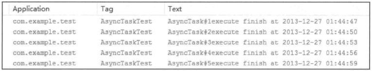
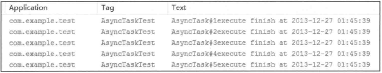
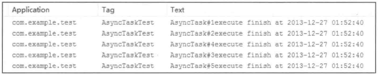

# 第11章 Android的线程和线程池

本章的主题是Android中的线程和线程池。线程在Android中是一个很重要的概念，从用途上来说，线程分为主线程和子线程，主线程主要处理和界面相关的事情，而子线程则往往用于执行耗时操作。由于Android的特性，如果在主线程中执行耗时操作那么就会导致程序无法及时地响应，因此耗时操作必须放在子线程中去执行。除了Thread本身以外，在Android中可以扮演线程角色的还有很多，比如AsyncTask和IntentService，同时HandlerThread也是一种特殊的线程。尽管AsyncTask、IntentService以及HandlerThread的表现形式都有别于传统的线程，但是它们的本质仍然是传统的线程。对于AsyncTask来说，它的底层用到了线程池，对于IntentService和HandlerThread来说，它们的底层则直接使用了线程。

不同形式的线程虽然都是线程，但是它们仍然具有不同的特性和使用场景。AsyncTask封装了线程池和Handler，它主要是为了方便开发者在子线程中更新UI。HandlerThread是一种具有消息循环的线程，在它的内部可以使用Handler。IntentService是一个服务，系统对其进行了封装使其可以更方便地执行后台任务，IntentService内部采用HandlerThread来执行任务，当任务执行完毕后IntentService会自动退出。从任务执行的角度来看，IntentService的作用很像一个后台线程，但是IntentService是一种服务，它不容易被系统杀死从而可以尽量保证任务的执行，而如果是一个后台线程，由于这个时候进程中没有活动的四大组件，那么这个进程的优先级就会非常低，会很容易被系统杀死，这就是IntentService的优点。

在操作系统中，线程是操作系统调度的最小单元，同时线程又是一种受限的系统资源，即线程不可能无限制地产生，并且线程的创建和销毁都会有相应的开销。当系统中存在大量的线程时，系统会通过时间片轮转的方式调度每个线程，因此线程不可能做到绝对的并行，除非线程数量小于等于CPU的核心数，一般来说这是不可能的。试想一下，如果在一个进程中频繁地创建和销毁线程，这显然不是高效的做法。正确的做法是采用线程池，一个线程池中会缓存一定数量的线程，通过线程池就可以避免因为频繁创建和销毁线程所带来的系统开销。Android中的线程池来源于Java，主要是通过Executor来派生特定类型的线程池，不同种类的线程池又具有各自的特性，详细内容会在11.3节中进行介绍。

## 11.1 主线程和子线程

主线程是指进程所拥有的线程，在Java中默认情况下一个进程只有一个线程，这个线程就是主线程。主线程主要处理界面交互相关的逻辑，因为用户随时会和界面发生交互，因此主线程在任何时候都必须有较高的响应速度，否则就会产生一种界面卡顿的感觉。为了保持较高的响应速度，这就要求主线程中不能执行耗时的任务，这个时候子线程就派上用场了。子线程也叫工作线程，除了主线程以外的线程都是子线程。

Android沿用了Java的线程模型，其中的线程也分为主线程和子线程，其中主线程也叫UI线程。主线程的作用是运行四大组件以及处理它们和用户的交互，而子线程的作用则是执行耗时任务，比如网络请求、I/O操作等。从Android3.0开始系统要求网络访问必须在子线程中进行，否则网络访问将会失败并抛出NetworkOnMainThreadException这个异常，这样做是为了避免主线程由于被耗时操作所阻塞从而出现ANR现象。

## 11.2 Android中的线程形态

本节将对Android中的线程形态做一个全面的介绍，除了传统的Thread以外，还包含AsyncTask、HandlerThread以及IntentService，这三者的底层实现也是线程，但是它们具有特殊的表现形式，同时在使用上也各有优缺点。为了简化在子线程中访问UI的过程，系统提供了AsyncTask，AsyncTask经过几次修改，导致了对于不同的API版本AsyncTask具有不同的表现，尤其是多任务的并发执行上。由于这个原因，很多开发者对AsyncTask的使用上存在误区，本节将详细介绍使用AsyncTask时的注意事项，并从源码的角度来分析AsyncTask的执行过程。

### 11.2.1 AsyncTask

AsyncTask是一种轻量级的异步任务类，它可以在线程池中执行后台任务，然后把执行的进度和最终结果传递给主线程并在主线程中更新UI。从实现上来说，AsyncTask封装了Thread和Handler，通过AsyncTask可以更加方便地执行后台任务以及在主线程中访问UI，但是AsyncTask并不适合进行特别耗时的后台任务，对于特别耗时的任务来说，建议使用线程池。

AsyncTask是一个抽象的泛型类，它提供了Params、Progress和Result这三个泛型参数，其中Params表示参数的类型，Progress表示后台任务的执行进度的类型，而Result则表示后台任务的返回结果的类型，如果AsyncTask确实不需要传递具体的参数，那么这三个泛型参数可以用Void来代替。AsyncTask这个类的声明如下所示。

```
public abstract class AsyncTask<Params, Progress, Result>。
```

AsyncTask提供了4个核心方法，它们的含义如下所示。

（1）onPreExecute()，在主线程中执行，在异步任务执行之前，此方法会被调用，一般可以用于做一些准备工作。

（2）doInBackground(Params...params)，在线程池中执行，此方法用于执行异步任务，params参数表示异步任务的输入参数。在此方法中可以通过publishProgress方法来更新任务的进度，publishProgress方法会调用onProgressUpdate方法。另外此方法需要返回计算结果给onPostExecute方法。

（3）onProgressUpdate(Progress...values)，在主线程中执行，当后台任务的执行进度发生改变时此方法会被调用。

（4）onPostExecute(Result result)，在主线程中执行，在异步任务执行之后，此方法会被调用，其中result参数是后台任务的返回值，即doInBackground的返回值。

上面这几个方法，onPreExecute先执行，接着是doInBackground，最后才是onPostExecute。除了上述四个方法以外，AsyncTask还提供了onCancelled()方法，它同样在主线程中执行，当异步任务被取消时，onCancelled()方法会被调用，这个时候onPostExecute则不会被调用。下面提供一个典型的示例，如下所示。

```
private class DownloadFilesTask extends AsyncTask<URL, Integer, Long> {
    protected Long doInBackground(URL... urls) {
         int count = urls.length;
         long totalSize = 0;
         for(int i = 0; i < count; i++) {
             totalSize += Downloader.downloadFile(urls[i]);
             publishProgress((int) ((i / (float) count) * 100));
             // Escape early if cancel() is called
             if(isCancelled())
                 break;
         }
         return totalSize;
     }
    protected void onProgressUpdate(Integer... progress) {
         setProgressPercent(progress[0]) ;
     }
    protected void onPostExecute(Long result) {
         showDialog("Downloaded " + result + " bytes");
     }
 }
```

在上面的代码中，实现了一个具体的AsyncTask类，这个类主要用于模拟文件的下载过程，它的输入参数类型为URL，后台任务的进程参数为Integer，而后台任务的返回结果为Long类型。注意到doInBackground和onProgressUpdate方法它们的参数中均包含...的字样，在Java中...表示参数的数量不定，它是一种数组型参数，...的概念和C语言中的..是一致的。当要执行上述下载任务时，可以通过如下方式来完成：

```
 new DownloadFilesTask().execute(url1, url2, url3);
```

在DownloadFilesTask中，doInBackground用来执行具体的下载任务并通过publishProgress 方法来更新下载的进度，同时还要判断下载任务是否被外界取消了。当下载任务完成后，doInBackground会返回结果，即下载的总字节数。需要注意的是，doInBackground是在线程池中执行的。onProgressUpdate用于更新界面中下载的进度，它运行在主线程，当publishProgress被调用时，此方法就会被调用。当下载任务完成后，onPostExecute方法就会被调用，它也是运行在主线程中，这个时候我们就可以在界面上做出一些提示，比如弹出一个对话框告知用户下载已经完成。

AsyncTask在具体的使用过程中也是有一些条件限制的，主要有如下几点：

（1）AsyncTask的类必须在主线程中加载，这就意味着第一次访问AsyncTask必须发生在主线程，当然这个过程在Android4.1及以上版本中已经被系统自动完成。在Android5.0的源码中，可以查看ActivityThread的main方法，它会调用AsyncTask的init方法，这就满足了AsyncTask的类必须在主线程中进行加载这个条件了。至于为什么必须要满足这个条件，在11.2.2节中会结合AsyncTask的源码再次分析这个问题。

（2）AsyncTask的对象必须在主线程中创建。

（3）execute方法必须在UI线程调用。

（4）不要在程序中直接调用onPreExecute()、onPostExecute、doInBackground和onProgressUpdate方法。

（5）一个AsyncTask对象只能执行一次，即只能调用一次execute方法，否则会报运行时异常。

（6）在Android1.6之前，AsyncTask是串行执行任务的，Android1.6的时候AsyncTask开始采用线程池里处理并行任务，但是从Android3.0开始，为了避免AsyncTask所带来的并发错误，AsyncTask又采用一个线程来串行执行任务。尽管如此，在Android3.0以及后续的版本中，我们仍然可以通过AsyncTask的executeOnExecutor方法来并行地执行任务。

### 11.2.2 AsyncTask的工作原理

为了分析AsyncTask的工作原理，我们从它的execute方法开始分析，execute方法又会调用executeOnExecutor方法，它们的实现如下所示。

```
public final AsyncTask<Params, Progress, Result> execute(Params... params) {
     return executeOnExecutor(sDefaultExecutor, params);
 }
 public final AsyncTask<Params, Progress, Result> executeOnExecutor(Executor
exec,
         Params... params) {
     if(mStatus != Status.PENDING) {
         switch(mStatus) {
             case RUNNING:
                 throw new IllegalStateException("Cannot execute task:"
                         + " the task is already running.");
             case FINISHED:
                 throw new IllegalStateException("Cannot execute task:"
                         + " the task has already been executed "
                         + "(a task can be executed only once)");
         }
     }
    mStatus = Status.RUNNING;
     onPreExecute();
    mWorker.mParams = params;
     exec.execute(mFuture) ;
     return this;
 }
```

在上面的代码中，sDefaultExecutor实际上是一个串行的线程池，一个进程中所有的AsyncTask全部在这个串行的线程池中排队执行，这个排队执行的过程后面会再进行分析。在executeOnExecutor方法中，AsyncTask的onPreExecute方法最先执行，然后线程池开始执行。下面分析线程池的执行过程，如下所示。

```
 public static final Executor SERIAL_EXECUTOR = new SerialExecutor();
 private static volatile Executor sDefaultExecutor = SERIAL_EXECUTOR;
 private static class SerialExecutor implements Executor {
     final ArrayDeque<Runnable> mTasks = new ArrayDeque<Runnable>();
     Runnable mActive;
     public synchronized void execute(final Runnable r) {
         mTasks.offer(new Runnable() {
             public void run() {
                 try {
                     r.run();
                 } finally {
                     scheduleNext();
                 }
             }
         });
         if(mActive == null) {
             scheduleNext();
         }
     }
    protected synchronized void scheduleNext() {
         if((mActive = mTasks.poll()) != null) {
             THREAD_POOL_EXECUTOR.execute(mActive) ;
         }
     }
 }
```

从SerialExecutor的实现可以分析AsyncTask的排队执行的过程。首先系统会把AsyncTask的Params参数封装为FutureTask对象，FutureTask是一个并发类，在这里它充当了Runnable的作用。接着这个FutureTask会交给SerialExecutor的execute方法去处理，SerialExecutor的execute方法首先会把FutureTask对象插入到任务队列mTasks中，如果这个时候没有正在活动的AsyncTask任务，那么就会调用SerialExecutor的scheduleNext方法来执行下一个AsyncTask任务。同时当一个AsyncTask任务执行完后，AsyncTask会继续执行其他任务直到所有的任务都被执行为止，从这一点可以看出，在默认情况下，AsyncTask是串行执行的。

AsyncTask中有两个线程池（SerialExecutor和THREAD_POOL_EXECUTOR）和一个Handler（InternalHandler），其中线程池SerialExecutor用于任务的排队，而线程池THREAD_POOL_EXECUTOR用于真正地执行任务，InternalHandler用于将执行环境从线程池切换到主线程，关于线程池的概念将在第11.3节中详细介绍，其本质仍然是线程的调用过程。在AsyncTask的构造方法中有如下这么一段代码，由于FutureTask的run方法会调用mWorker的call方法，因此mWorker的call方法最终会在线程池中执行。

```
mWorker = new WorkerRunnable<Params, Result>() {
     public Result call() throws Exception{
         mTaskInvoked.set(true);
         Process.setThreadPriority(Process.THREAD_PRIORITY_BACKGROUND) ;
         //noinspection unchecked
         return postResult(doInBackground(mParams)) ;
     }
 };
```

在mWorker的call方法中，首先将mTaskInvoked设为true，表示当前任务已经被调用过了，然后执行AsyncTask的doInBackground方法，接着将其返回值传递给postResult方法，它的实现如下所示。

```
private Result postResult(Result result) {
     @SuppressWarnings("unchecked")
    Message message = sHandler.obtainMessage(MESSAGE_POST_RESULT,
             new AsyncTaskResult<Result> (this, result));
     message.sendToTarget();
     return result;
 }
```

在上面的代码中，postResult方法会通过sHandler发送一个MESSAGE_POST_RESULT的消息，这个sHandler的定义如下所示。

```
private static final InternalHandler sHandler = new InternalHandler();
private static class InternalHandler extends Handler {
     @SuppressWarnings({ "unchecked", "RawUseOfParameterizedType"})
     @Override
     public void handleMessage(Message msg) {
         AsyncTaskResult result = (AsyncTaskResult) msg.obj;
         switch(msg.what) {
             case MESSAGE_POST_RESULT:
                 // There is only one result
                 result.mTask. finish(result.mData[0]);
                 break;
             case MESSAGE_POST_PROGRESS:
                 result.mTask.onProgressUpdate(result.mData) ;
                 break;
         }
     }
 }
```

可以发现，sHandler是一个静态的Handler对象，为了能够将执行环境切换到主线程，这就要求sHandler这个对象必须在主线程中创建。由于静态成员会在加载类的时候进行初始化，因此这就变相要求AsyncTask的类必须在主线程中加载，否则同一个进程中的AsyncTask都将无法正常工作。sHandler收到MESSAGE_POST_RESULT这个消息后会调用AsyncTask的finish方法，如下所示。

```
private void finish(Result result) {
     if(isCancelled()) {
         onCancelled(result);
     } else {
         onPostExecute(result) ;
     }
    mStatus = Status.FINISHED;
 }
```

AsyncTask的finish方法的逻辑比较简单，如果AsyncTask被取消执行了，那么就调用onCancelled方法，否则就会调用onPostExecute方法，可以看到doInBackground的返回结果会传递给onPostExecute方法，到这里AsyncTask的整个工作过程就分析完毕了。

通过分析AsyncTask的源码，可以进一步确定，从Android3.0开始，默认情况下AsyncTask的确是串行执行的，在这里通过一系列实验来证实这个判断。

请看如下实验代码，代码很简单，就是单击按钮的时候同时执行5个AsyncTask任务，每个AsyncTask会休眠3s来模拟耗时操作，同时把每个AsyncTask执行结束的时间打印出来，这样我们就能观察出AsyncTask到底是串行执行还是并行执行。

```
@Override
public void onClick(View v) {
    if(v == mButton) {
         new MyAsyncTask("AsyncTask#1").execute("");
         new MyAsyncTask("AsyncTask#2").execute("");
         new MyAsyncTask("AsyncTask#3").execute("");
         new MyAsyncTask("AsyncTask#4").execute("");
         new MyAsyncTask("AsyncTask#5").execute("");
     }
 }
private static class MyAsyncTask extends AsyncTask<String, Integer, String> {
    private String mName = "AsyncTask";
    public MyAsyncTask(String name) {
         super();
         mName = name;
     }
     @Override
     protected String doInBackground(String... params) {
         try {
             Thread.sleep(3000);
         } catch(InterruptedException e) {
             e.printStackTrace();
         }
         return mName;
     }
     @Override
     protected void onPostExecute(String result) {
         super.onPostExecute(result) ;
         SimpleDateFormat df = new SimpleDateFormat("yyyy-MM-dd HH:mm:ss") ;
         Log.e(TAG, result + "execute finish at " + df.format(new Date())) ;
     }
 }
```

分别在Android4.1.1和Android2.3.3的设备上运行程序，按照本节前面的描述，AsyncTask在4.1.1上应该是串行的，在2.3.3上应该是并行的，到底是不是这样呢？请看下面的运行结果。

Android4.1.1上执行：如图11-1所示，5个AsyncTask共耗时15s且时间间隔为3s，很显然是串行执行的。



图 11-1 AsyncTask 在 Android 4.1.1 上的执行顺序

Android2.3.3上执行：如图11-2所示，5个AsyncTask的结束时间是一样的，很显然是并行执行的。



图 11-2 AsyncTask 在 Android 2.3.3 上的执行顺序

为了让AsyncTask可以在Android3.0及以上的版本上并行，可以采用AsyncTask的executeOnExecutor方法，需要注意的是这个方法是Android3.0新添加的方法，并不能在低版本上使用，如下所示。

```
 @TargetApi(Build.VERSION_CODES.HONEYCOMB)
 @Override
public void onClick(View v) {
     if(v == mButton) {
         if(Build.VERSION.SDK_INT >= Build.VERSION_CODES.HONEYCOMB) {
             new MyAsyncTask("AsyncTask#1").
 executeOnExecutor(AsyncTask. THREAD_POOL_EXECUTOR, "") ;
             new MyAsyncTask("AsyncTask#2").
 executeOnExecutor(AsyncTask.THREAD_POOL_EXECUTOR, "");
             new MyAsyncTask("AsyncTask#3").
 executeOnExecutor(AsyncTask. THREAD_POOL_EXECUTOR, "");
             new MyAsyncTask("AsyncTask#4").
 executeOnExecutor(AsyncTask. THREAD_POOL_EXECUTOR, "") ;
             new MyAsyncTask("AsyncTask#5").
 executeOnExecutor(AsyncTask.THREAD_POOL_EXECUTOR,"") ;
         }
     }
 }
private static class MyAsyncTask extends AsyncTask<String, Integer, String> {
     private String mName = "AsyncTask";
     public MyAsyncTask(String name) {
         super();
         mName = name;
     }
     @Override
     protected String doInBackground(String... params) {
         try {
             Thread.sleep(3000);
         } catch(InterruptedException e) {
             e.printStackTrace();
         }
         return mName;
     }
     @Override
     protected void onPostExecute(String result) {
         super.onPostExecute(result) ;
         SimpleDateFormat df = new SimpleDateFormat("yyyy-MM-dd HH:mm:ss") ;
         Log.e(TAG, result + "execute finish at " + df. format(new Date()));
     }
 }
```

在Android4.1.1的设备上运行上述程序，日志如图11-3所示，很显然，我们的目的达到了，成功地让AsyncTask在4.1.1的手机上并行起来了。



图 11-3 AsyncTask 的 executeOnExecutor 方法的作用

### 11.2.3 HandlerThread

HandlerThread继承了Thread，它是一种可以使用Handler的Thread，它的实现也很简单，就是在run方法中通过Looper.prepare()来创建消息队列，并通过Looper.loop()来开启消息循环，这样在实际的使用中就允许在HandlerThread中创建Handler了。HandlerThread的run方法如下所示。

```
public void run() {
    mTid = Process.myTid();
     Looper.prepare();
     synchronized(this) {
        mLooper = Looper.myLooper();
         notifyAll();
     }
     Process.setThreadPriority(mPriority) ;
     onLooperPrepared();
     Looper. loop();
    mTid = -1;
 }
```

从HandlerThread的实现来看，它和普通的Thread有显著的不同之处。普通Thread主要用于在run方法中执行一个耗时任务，而HandlerThread在内部创建了消息队列，外界需要通过Handler的消息方式来通知HandlerThread执行一个具体的任务。HandlerThread是一个很有用的类，它在Android中的一个具体的使用场景是IntentService，IntentService将在11.2.4节中进行介绍。由于HandlerThread的run方法是一个无限循环，因此当明确不需要再使用HandlerThread时，可以通过它的quit或者quitSafely方法来终止线程的执行，这是一个良好的编程习惯。

### 11.2.4 IntentService

IntentService是一种特殊的Service，它继承了Service并且它是一个抽象类，因此必须创建它的子类才能使用IntentService。IntentService可用于执行后台耗时的任务，当任务执行后它会自动停止，同时由于IntentService是服务的原因，这导致它的优先级比单纯的线程要高很多，所以IntentService比较适合执行一些高优先级的后台任务，因为它优先级高不容易被系统杀死。在实现上，IntentService封装了HandlerThread和Handler，这一点可以从它的onCreate方法中看出来，如下所示。

```
public void onCreate() {
     // TODO: It would be nice to have an option to hold a partial wakelock
     // during processing, and to have a static startService(Context, Intent)
     // method that would launch the service & hand off a wakelock.
     super.onCreate();
    HandlerThread thread = new HandlerThread("IntentService[" +mName + "]") ;
     thread.start();
    mServiceLooper = thread.getLooper();
    mServiceHandler = new ServiceHandler(mServiceLooper) ;
 }
```

当IntentService被第一次启动时，它的onCreate方法会被调用，onCreate方法会创建一个HandlerThread，然后使用它的Looper来构造一个Handler对象mServiceHandler，这样通过mServiceHandler发送的消息最终都会在HandlerThread中执行，从这个角度来看，IntentService也可以用于执行后台任务。每次启动IntentService，它的onStartCommand方法就会调用一次，IntentService在onStartCommand中处理每个后台任务的Intent。下面看一下onStartCommand方法是如何处理外界的Intent的，onStartCommand调用了onStart，onStart方法的实现如下所示。

```
 public void onStart(Intent intent, int startId) {
    Message msg = mServiceHandler.obtainMessage();
    msg.arg1 = startId;
    msg.obj = intent;
    mServiceHandler.sendMessage(msg) ;
 }
```

可以看出，IntentService仅仅是通过mServiceHandler发送了一个消息，这个消息会在HandlerThread中被处理。mServiceHandler收到消息后，会将Intent对象传递给onHandleIntent方法去处理。注意这个Intent对象的内容和外界的startService(intent)中的intent的内容是完全一致的，通过这个Intent对象即可解析出外界启动IntentService时所传递的参数，通过这些参数就可以区分具体的后台任务，这样在onHandleIntent方法中就可以对不同的后台任务做处理了。当onHandleIntent方法执行结束后，IntentService会通过stopSelf(int startId)方法来尝试停止服务。这里之所以采用stopSelf(int startId)而不是stopSelf()来停止服务，那是因为stopSelf()会立刻停止服务，而这个时候可能还有其他消息未处理，stopSelf(int startId)则会等待所有的消息都处理完毕后才终止服务。一般来说，stopSelf(int startId)在尝试停止服务之前会判断最近启动服务的次数是否和startId相等，如果相等就立刻停止服务，不相等则不停止服务，这个策略可以从AMS的stopServiceToken方法的实现中找到依据，读者感兴趣的话可以自行查看源码实现。ServiceHandler的实现如下所示。

```
 private final class ServiceHandler extends Handler{
    public ServiceHandler(Looper looper) {
         super(looper) ;
     }
     @Override
    public void handleMessage(Message msg) {
         onHandleIntent( (Intent)msg.obj) ;
         stopSelf(msg.arg1) ;
     }
 }
```

IntentService的onHandleIntent方法是一个抽象方法，它需要我们在子类中实现，它的作用是从Intent参数中区分具体的任务并执行这些任务。如果目前只存在一个后台任务，那么onHandleIntent方法执行完这个任务后，stopSelf(int startId)就会直接停止服务；如果目前存在多个后台任务，那么当onHandleIntent方法执行完最后一个任务时，stopSelf(int startId)才会直接停止服务。另外，由于每执行一个后台任务就必须启动一次IntentService，而IntentService内部则通过消息的方式向HandlerThread请求执行任务，Handler中的Looper是顺序处理消息的，这就意味着IntentService也是顺序执行后台任务的，当有多个后台任务同时存在时，这些后台任务会按照外界发起的顺序排队执行。

下面通过一个示例来进一步说明IntentService的工作方式，首先派生一个IntentService的子类，比如LocalIntentService，它的实现如下所示。

```
 public class LocalIntentService extends IntentService {
    private static final String TAG = "LocalIntentService";
    public LocalIntentService() {
        super(TAG) ;
    }
    @Override
    protected void onHandleIntent(Intent intent) {
        String action = intent.getStringExtra("task_action");
       Log.d(TAG, "receive task :" + action);
        SystemClock.sleep(3000) ;
        if("com.ryg.action.TASK1".equals(action)) {
           Log.d(TAG, "handle task: " + action);
        }
    }
    @Override
    public void onDestroy() {
       Log.d(TAG, "service destroyed.");
        super.onDestroy();
    }
 }
```

这里对LocalIntentService的实现做一下简单的说明。在onHandleIntent方法中会从参数中解析出后台任务的标识，即task_action字段所代表的内容，然后根据不同的任务标识来执行具体的后台任务。这里为了简单起见，直接通过SystemClock.sleep(3000)来休眠3000毫秒从而模拟一种耗时的后台任务，另外为了验证IntentService的停止时机，这里在onDestroy()中打印了一句日志。LocalIntentService实现完成了以后，就可以在外界请求执行后台任务了，在下面的代码中先后发起了3个后台任务的请求：

```
 Intent service = new Intent(this, LocalIntentService.class);
 service.putExtra("task_action", "com.ryg.action.TASK1") ;
 startService(service) ;
 service.putExtra("task_action", "com.ryg.action.TASK2");
 startService(service) ;
 service.putExtra("task_action", "com.ryg.action.TASK3");
 startService(service) ;
```

运行程序，观察日志，如下所示。

```
 05-17 17:08:23.186 E/dalvikvm(25793): threadid=11: calling run(), name=
 IntentService [LocalIntentService]
 05-17 17:08:23.196 D/LocalIntentService(25793): receive task :com.ryg.
 action.TASK1
 05-17 17:08:26.199 D/LocalIntentService(25793): handle task: com.ryg.
 action.TASK1
 05-17 17:08:26.199 D/LocalIntentService(25793): receive task :com.ryg.
 action.TASK2
 05-17 17:08:29.192 D/LocalIntentService(25793): receive task :com.ryg.
 action.TASK3
 05-17 17:08:32.205 D/LocalIntentService(25793): service destroyed.
 05-17 17:08:32.205 E/dalvikvm(25793): threadid=11: exiting,name=
 IntentService[LocalIntentService]
```

从上面的日志可以看出，三个后台任务是排队执行的，它们的执行顺序就是它们发起请求对的顺序，即TASK1、TASK2、TASK3。另外一点就是当TASK3执行完毕后，LocalIntentService才真正地停止，从日志中可以看出LocalIntentService执行了onDestroy()，这也意味着服务正在停止。

## 11.3 Android中的线程池

提到线程池就必须先说一下线程池的好处，相信读者都有所体会，线程池的优点可以概括为以下三点：

（1）重用线程池中的线程，避免因为线程的创建和销毁所带来的性能开销。

（2）能有效控制线程池的最大并发数，避免大量的线程之间因互相抢占系统资源而导致的阻塞现象。

（3）能够对线程进行简单的管理，并提供定时执行以及指定间隔循环执行等功能。

Android中的线程池的概念来源于Java中的Executor，Executor是一个接口，真正的线程池的实现为ThreadPoolExecutor。ThreadPoolExecutor提供了一系列参数来配置线程池，通过不同的参数可以创建不同的线程池，从线程池的功能特性上来说，Android的线程池主要分为4类，这4类线程池可以通过Executors所提供的工厂方法来得到，具体会在11.3.2节中进行详细介绍。由于Android中的线程池都是直接或者间接通过配置ThreadPoolExecutor来实现的，因此在介绍它们之前需要先介绍ThreadPoolExecutor。

### 11.3.1 ThreadPoolExecutor

ThreadPoolExecutor是线程池的真正实现，它的构造方法提供了一系列参数来配置线程池，下面介绍ThreadPoolExecutor的构造方法中各个参数的含义，这些参数将会直接影响到线程池的功能特性，下面是ThreadPoolExecutor的一个比较常用的构造方法。

```
public ThreadPoolExecutor(int corePoolSize,
                           int maximumPoolSize,
                           long keepAliveTime,
                           TimeUnit unit,
                           BlockingQueue<Runnable> workQueue,
                           ThreadFactory threadFactory)
```

corePoolSize

线程池的核心线程数，默认情况下，核心线程会在线程池中一直存活，即使它们处于闲置状态。如果将ThreadPoolExecutor的allowCoreThreadTimeOut属性设置为true，那么闲置的核心线程在等待新任务到来时会有超时策略，这个时间间隔由keepAliveTime所指定，当等待时间超过keepAliveTime所指定的时长后，核心线程就会被终止。

maximumPoolSize

线程池所能容纳的最大线程数，当活动线程数达到这个数值后，后续的新任务将会被阻塞。

keepAliveTime

非核心线程闲置时的超时时长，超过这个时长，非核心线程就会被回收。当ThreadPool Executor的allowCoreThreadTimeOut属性设置为true时，keepAliveTime同样会作用于核心线程。

unit

用于指定keepAliveTime参数的时间单位，这是一个枚举，常用的有TimeUnit.MILLISECONDS（毫秒）、TimeUnit.SECONDS（秒）以及TimeUnit.MINUTES（分钟）等。

workQueue

线程池中的任务队列，通过线程池的execute方法提交的Runnable对象会存储在这个参数中。

threadFactory

线程工厂，为线程池提供创建新线程的功能。ThreadFactory是一个接口，它只有一个方法：Thread newThread(Runnable r)

除了上面的这些主要参数外，ThreadPoolExecutor还有一个不常用的参数Rejected ExecutionHandlerhandler。当线程池无法执行新任务时，这可能是由于任务队列已满或者是无法成功执行任务，这个时候ThreadPoolExecutor会调用handler的rejectedExecution方法来通知调用者，默认情况下rejectedExecution方法会直接抛出一个RejectedExecution Exception。ThreadPoolExecutor为RejectedExecutionHandler提供了几个可选值：CallerRunsPolicy、AbortPolicy、DiscardPolicy 和 DiscardOldestPolicy，其中 AbortPolicy 是默认值，它会直接抛出RejectedExecutionException，由于handler这个参数不常用，这里就不再具体介绍了。

ThreadPoolExecutor执行任务时大致遵循如下规则：

（1）如果线程池中的线程数量未达到核心线程的数量，那么会直接启动一个核心线程来执行任务。

（2）如果线程池中的线程数量已经达到或者超过核心线程的数量，那么任务会被插入到任务队列中排队等待执行。

（3）如果在步骤2中无法将任务插入到任务队列中，这往往是由于任务队列已满，这个时候如果线程数量未达到线程池规定的最大值，那么会立刻启动一个非核心线程来执行任务。

（4）如果步骤3中线程数量已经达到线程池规定的最大值，那么就拒绝执行此任务，ThreadPoolExecutor会调用RejectedExecutionHandler的rejectedExecution方法来通知调用者。

ThreadPoolExecutor的参数配置在AsyncTask中有明显的体现，下面是AsyncTask中的线程池的配置情况：

```
private static final int CPU_COUNT = Runtime.getRuntime().availableProcessors();
private static final int CORE_POOL_SIZE = CPU_COUNT + 1;
private static final int MAXIMUM_POOL_SIZE = CPU_COUNT * 2 + 1;
private static final int KEEP_ALIVE = 1;

private static final ThreadFactory sThreadFactory = new ThreadFactory() {
    private final AtomicInteger mCount = new AtomicInteger(1);

    public Thread newThread(Runnable r) {
        return new Thread(r, "AsyncTask #" + mCount.getAndIncrement());
    }
};

private static final BlockingQueue<Runnable> sPoolWorkQueue =
        new LinkedBlockingQueue<Runnable>(128);

/**
 * An {@link Executor} that can be used to execute tasks in parallel.
 */
public static final Executor THREAD_POOL_EXECUTOR
        = new ThreadPoolExecutor(CORE_POOL_SIZE, MAXIMUM_POOL_SIZE, KEEP_ALIVE,
                TimeUnit.SECONDS, sPoolWorkQueue, sThreadFactory);
```

从上面的代码可以知道，AsyncTask对THREAD_POOL_EXECUTOR这个线程池进行了配置，配置后的线程池规格如下：

核心线程数等于CPU核心数+1；

线程池的最大线程数为CPU核心数的2倍+1；

核心线程无超时机制，非核心线程在闲置时的超时时间为1秒；

任务队列的容量为128。

### 11.3.2 线程池的分类

在11.3.1节中对ThreadPoolExecutor的配置细节进行了详细的介绍，本节将接着介绍Android中最常见的四类具有不同功能特性的线程池，它们都直接或间接地通过配置ThreadPoolExecutor来实现自己的功能特性，这四类线程池分别是FixedThreadPool、CachedThreadPool、ScheduledThreadPool以及SingleThreadExecutor

1.FixedThreadPool

通过Executors的newFixedThreadPool方法来创建。它是一种线程数量固定的线程池，当线程处于空闲状态时，它们并不会被回收，除非线程池被关闭了。当所有的线程都处于活动状态时，新任务都会处于等待状态，直到有线程空闲出来。由于FixedThreadPool只有核心线程并且这些核心线程不会被回收，这意味着它能够更加快速地响应外界的请求。newFixedThreadPool方法的实现如下，可以发现FixedThreadPool中只有核心线程并且这些核心线程没有超时机制，另外任务队列也是没有大小限制的。

```
public static ExecutorService newFixedThreadPool(int nThreads) {
     return new ThreadPoolExecutor(nThreads, nThreads,
                                   0L, TimeUnit.MILLISECONDS,
                                   new LinkedBlockingQueue<Runnable>());
 }
```

2.CachedThreadPool

通过Executors的newCachedThreadPool方法来创建。它是一种线程数量不定的线程池，它只有非核心线程，并且其最大线程数为Integer.MAX_VALUE。由于Integer.MAX_VALUE是一个很大的数，实际上就相当于最大线程数可以任意大。当线程池中的线程都处于活动状态时，线程池会创建新的线程来处理新任务，否则就会利用空闲的线程来处理新任务。线程池中的空闲线程都有超时机制，这个超时时长为60秒，超过60秒闲置线程就会被回收。和FixedThreadPool不同的是，CachedThreadPool的任务队列其实相当于一个空集合，这将导致任何任务都会立即被执行，因为在这种场景下SynchronousQueue是无法插入任务的。SynchronousQueue是一个非常特殊的队列，在很多情况下可以把它简单理解为一个无法存储元素的队列，由于它在实际中较少使用，这里就不深入探讨它了。从CachedThreadPool的特性来看，这类线程池比较适合执行大量的耗时较少的任务。当整个线程池都处于闲置状态时，线程池中的线程都会超时而被停止，这个时候CachedThreadPool之中实际上是没有任何线程的，它几乎是不占用任何系统资源的。newCachedThreadPool方法的实现如下所示。

```
public static ExecutorService newCachedThreadPool() {
     return new ThreadPoolExecutor(0, Integer.MAX_VALUE,
                                   60L, TimeUnit.SECONDS,
                                   new SynchronousQueue<Runnable>());
 }
```

3.ScheduledThreadPool

通过Executors的newScheduledThreadPool方法来创建。它的核心线程数量是固定的，而非核心线程数是没有限制的，并且当非核心线程闲置时会被立即回收。ScheduledThreadPool这类线程池主要用于执行定时任务和具有固定周期的重复任务，newScheduledThreadPool方法的实现如下所示。

```
public static ScheduledExecutorService newScheduledThreadPool(int
 corePoolSize) {
     return new ScheduledThreadPoolExecutor(corePoolSize);
 }
public ScheduledThreadPoolExecutor(int corePoolSize) {
     super(corePoolSize, Integer.MAX_VALUE, 0, NANOSECONDS,
          new DelayedWorkQueue()) ;
 }
```

4.SingleThreadExecutor

通过Executors的newSingleThreadExecutor方法来创建。这类线程池内部只有一个核心线程，它确保所有的任务都在同一个线程中按顺序执行。SingleThreadExecutor的意义在于统一所有的外界任务到一个线程中，这使得在这些任务之间不需要处理线程同步的问题。newSingleThreadExecutor方法的实现如下所示。

```
public static ExecutorService newSingleThreadExecutor() {
     return new FinalizableDelegatedExecutorService
         (new ThreadPoolExecutor(1, 1,
                                 0L, TimeUnit.MILLISECONDS,
                                 new LinkedBlockingQueue<Runnable>()));
 }
```

上面对Android中常见的4种线程池进行了详细的介绍，除了上面系统提供的4类线程池以外，也可以根据实际需要灵活地配置线程池。下面的代码演示了系统预置的4种线程池的典型使用方法。

```
Runnable command = new Runnable() {
    @Override
    public void run() {
        SystemClock.sleep(2000);
    }
};

ExecutorService fixedThreadPool = Executors.newFixedThreadPool(4);
fixedThreadPool.execute(command);

ExecutorService cachedThreadPool = Executors.newCachedThreadPool();
cachedThreadPool.execute(command);

ScheduledExecutorService scheduledThreadPool = Executors.newScheduledThreadPool(4);
// 2000ms 后执行 command
scheduledThreadPool.schedule(command, 2000, TimeUnit.MILLISECONDS);
// 延迟 10ms 后，每隔 1000ms 执行一次 command
scheduledThreadPool.scheduleAtFixedRate(command, 10, 1000, TimeUnit.MILLISECONDS);

ExecutorService singleThreadExecutor = Executors.newSingleThreadExecutor();
singleThreadExecutor.execute(command);
```
