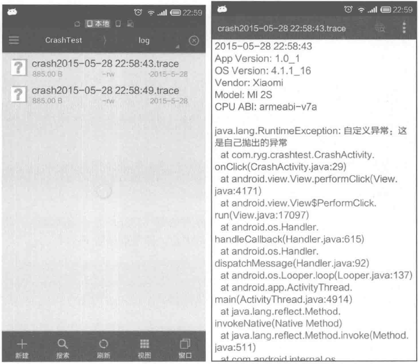
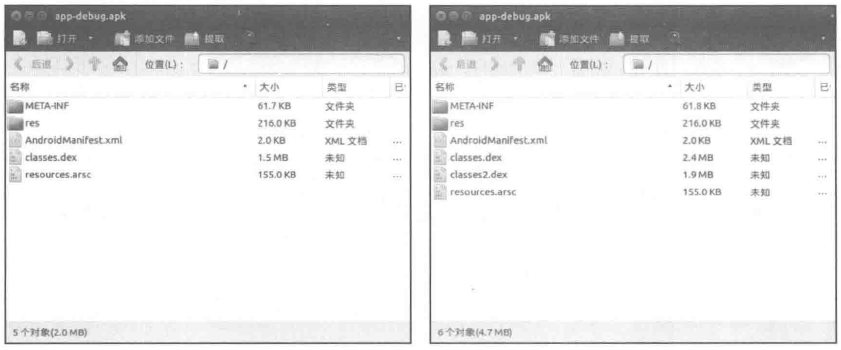
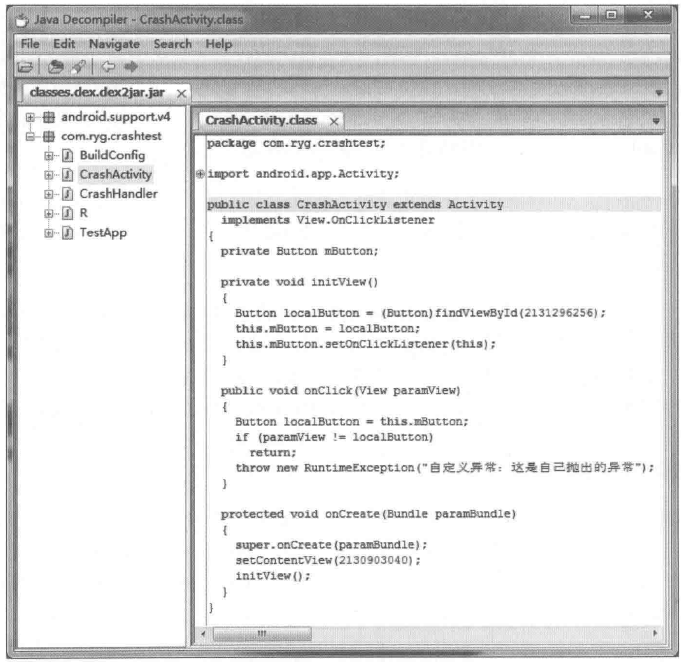

# 第13章 综合技术

本章介绍的主题在日常开发中使用频率略低，但是对它们有一定的了解仍然是很有必要的，下面分别介绍它们的使用场景。

我们知道，不管程序怎么写都很难避免不crash，当程序crash后虽然无法让其再继续运行，但是如果能够知道程序crash的原因，那么就可以修复错误。但是很多时候产品发布后，如果用户在使用时发生了crash，这个crash信息是很难获取到的，这非常不利于一个产品的持续发展。其实可以通过CrashHandler来监视应用的crash信息，给程序设置一个CrashHandler，这样当程序crash时就会调用CrashHandler的uncaughtException方法。在这个方法中我们可以获取crash信息并上传到服务器，通过这种方式服务端就能监控程序的运行状况了，在后续的版本开发中，开发人员就可以对一些错误进行修复了。

在Android中，有一个限制，那就是整个应用的方法数不能超过65536，否则就会出现编译错误，并且程序也无法成功地安装到手机上。当项目日益庞大后这个问题就比较容易遇到，Google提供了multidex方案专门用于解决这个问题，通过将一个dex文件拆分为多个dex文件来避免单个dex文件方法数越界的问题。

方法数越界的另一种解决方案是动态加载。动态加载可以直接加载一个dex形式的文件，将部分代码打包到一个单独的dex文件中（也可以是dex格式的jar或者apk），并在程序运行时根据需要去动态加载dex中的类，这种方式既可以解决缓解方法数越界的问题，也可以为程序提供按需加载的特性，同时这还为应用按模块更新提供了可能性。

反编译在应用开发中用得不是很多，但是很多时候我们需要研究其他产品的实现思路，这个时候就需要反编译了。在Android中反编译主要通过dex2jar以及apktool来完成。dex2jar可以将一个apk转成一个jar包，这个jar包再通过反编译工具jd-gui来打开就可以查看到反编译后的Java代码了。Apktool主要用于应用的解包和二次打包，实际上通过Apktool的二次打包可以做很多事情，甚至是一些违法的事情。目前不少公司都有专门的反编译团队，也称逆向团队，他们做的事情会更加深入，但是对于应用开发者来说并不需要了解那么多深入的逆向知识，因此本章仅仅介绍一些简单常用的反编译方法。

## 13.1 使用CrashHandler来获取应用的crash信息

Android应用不可避免地会发生crash，也称之为崩溃，无论你的程序写得多么完美，总是无法完全避免crash的发生，可能是由于Android系统底层的bug，也可能是由于不充分的机型适配或者是糟糕的网络状况。当crash发生时，系统会kill掉正在执行的程序，现象就是闪退或者提示用户程序已停止运行，这对用户来说是很不友好的，也是开发者所不愿意看到的。更糟糕的是，当用户发生了crash，开发者却无法得知程序为何crash，即便开发人员想去解决这个crash，但是由于无法知道用户当时的crash信息，所以往往也无能为力。幸运的是，Android提供了处理这类问题的方法，请看下面Thread类中的一个方法setDefaultUncaughtExceptionHandler:

```
 /**
  * Sets the default uncaught exception handler. This handler is invoked in
  * case any Thread dies due to an unhandled exception.
  *
  * @param handler
  * The handler to set or null.
 */
public static void setDefaultUncaughtExceptionHandler(UncaughtExceptionHandler handler) {
     Thread.defaultUncaughtHandler = handler;
 }
```

从方法的字面意义来看，这个方法好像可以设置系统的默认异常处理器，其实这个方法就可以解决上面所提到的crash问题。当crash发生的时候，系统就会回调UncaughtExceptionHandler的uncaughtException方法，在uncaughtException方法中就可以获取到异常信息，可以选择把异常信息存储到SD卡中，然后在合适的时机通过网络将crash信息上传到服务器上，这样开发人员就可以分析用户crash的场景从而在后面的版本中修复此类crash。我们还可以在crash发生时，弹出一个对话框告诉用户程序crash了，然后再退出，这样做比闪退要温和一点。

有了上面的分析，现在读者肯定知道获取应用crash信息的方式了。首先需要实现一个UncaughtExceptionHandler对象，在它的uncaughtException方法中获取异常信息并将其存储在SD卡中或者上传到服务器供开发人员分析，然后调用Thread的setDefaultUncaught ExceptionHandler方法将它设置为线程默认的异常处理器，由于默认异常处理器是Thread类的静态成员，因此它的作用对象是当前进程的所有线程。这么来看监听应用的crash信息实际上是很简单的一件事，下面是一个典型的异常处理器的实现：

```
 public class CrashHandler implements UncaughtExceptionHandler {
    private static final String TAG = "CrashHandler";
    private static final boolean DEBUG = true;
    private static final String PATH = Environment.getExternalStorageDirectory().getPath() + "/CrashTest/log/";
    private static final String FILE_NAME = "crash";
    private static final String FILE_NAME_SUFFIX = ".trace";
    private static CrashHandler sInstance = new CrashHandler();
    private UncaughtExceptionHandler mDefaultCrashHandler;
    private Context mContext;
    private CrashHandler() {
    }
    public static CrashHandler getInstance() {
        return sInstance;
    }
    public void init(Context context) {
       mDefaultCrashHandler = Thread.getDefaultUncaughtExceptionHandler();
        Thread.setDefaultUncaughtExceptionHandler(this);
       mContext = context.getApplicationContext();
    }
    /**
     *这个是最关键的函数,当程序中有未被捕获的异常,系统将会自动调用#uncaughtException方法
     *thread为出现未捕获异常的线程,ex为未捕获的异常,有了这个ex,我们就可以得到异
       常信息
     */
    @Override
    public void uncaughtException(Thread thread, Throwable ex) {
        try {
           //导出异常信息到SD卡中
           dumpExceptionToSDCard(ex) ;
           //这里可以上传异常信息到服务器,便于开发人员分析日志从而解决bug
           uploadExceptionToServer();
        } catch(IOException e) {
           e.printStackTrace();
        }
       ex.printStackTrace();
       //如果系统提供了默认的异常处理器,则交给系统去结束程序,否则就由自己结束自己
       if(mDefaultCrashHandler != null) {
           mDefaultCrashHandler.uncaughtException(thread, ex);
        } else {
           Process.killProcess(Process.myPid()) ;
        }
    }
    private void dumpExceptionToSDCard(Throwable ex) throws IOException{
       //如果SD卡不存在或无法使用,则无法把异常信息写入SD卡
       if(!Environment.getExternalStorageState().equals(Environment.
       MEDIA_MOUNTED) ) {
           if(DEBUG) {
              Log.w(TAG, "sdcard unmounted, skip dump exception");
              return;
           }
        }
       File dir = new File(PATH);
       if(!dir.exists()) {
           dir.mkdirs();
        }
       long current = System.currentTimeMillis();
       String time = new SimpleDateFormat("yyyy-MM-dd HH:mm:ss").format(new
       Date(current) ) ;
       File file = new File(PATH + FILE_NAME + time + FILE_NAME_SUFFIX);
       try {
           PrintWriter pw = new PrintWriter(new BufferedWriter(new
           FileWriter(file)));
           pw.println(time) ;
           dumpPhoneInfo(pw) ;
           pw.println();
           ex.printStackTrace(pw) ;
           pw.close();
        } catch(Exception e) {
           Log.e(TAG, "dump crash info failed");
        }
    }
    private void dumpPhoneInfo(PrintWriter pw) throws NameNotFoundException {
       PackageManager pm = mContext.getPackageManager();
       PackageInfo pi = pm.getPackageInfo(mContext.getPackageName(),
       PackageManager.GET_ACTIVITIES) ;
       pw.print("App Version: ");
       pw.print(pi.versionName) ;
       pw.print(' ');
       pw.println(pi.versionCode) ;
        //Android版本号
       pw.print("OS Version: ");
       pw.print(Build.VERSION.RELEASE) ;
       pw.print("_");
        pw.println(Build.VERSION.SDK_INT);
        //手机制造商
        pw.print("Vendor: ");
        pw.println(Build.MANUFACTURER) ;
        //手机型号
        pw.print("Model: ");
        pw.println(Build.MODEL) ;
        //CPU架构
       pw.print("CPU ABI: ");
       pw.println(Build.CPU_ABI) ;
    }
    private void uploadExceptionToServer() {
      //TODO Upload Exception Message To Your Web Server
    }
 }
```

从上面的代码可以看出，当应用崩溃时，CrashHandler会将异常信息以及设备信息写入SD卡，接着将异常交给系统处理，系统会帮我们中止程序，如果系统没有默认的异常处理机制，那么就自行中止。当然也可以选择将异常信息上传到服务器，本节中的CrashHandler并没有实现这个逻辑，但是在实际开发中一般都需要将异常信息上传到服务器。

如何使用上面的CrashHandler呢？也很简单，可以选择在Application初始化的时候为线程设置CrashHandler，如下所示。

```
public class TestApp extends Application{
    private static TestApp sInstance;
   @Override
    public void onCreate() {
        super.onCreate();
        sInstance = this;
        //在这里为应用设置异常处理,然后程序才能获取未处理的异常
       CrashHandler crashHandler = CrashHandler.getInstance();
        crashHandler.init(this);
    }
    public static TestApp getInstance() {
        return sInstance;
    }
 }
```

经过上面两个步骤，程序就可以处理未处理的异常了，就再也不怕程序crash了，同时还可以很方便地从服务器上查看用户的crash信息。需要注意的是，代码中被catch的异常不会交给CrashHandler处理，CrashHandler只能收到那些未被捕获的异常。下面我们就模拟一下发生crash的情形，看程序是如何处理的，如下所示。

```
 public class CrashActivity extends Activity implements OnClickListener {
    private Button mButton;
    @Override
    protected void onCreate(Bundle savedInstanceState) {
        super.onCreate(savedInstanceState);
        setContentView(R.layout.activity_crash);
        initView();
    }
    private void initView() {
       mButton = (Button) findViewById(R.id.button1);
       mButton.setOnClickListener(this);
    }
    @Override
    public void onClick(View v) {
        if(v == mButton) {
           //在这里模拟异常抛出情况,人为地抛出一个运行时异常
           throw new RuntimeException("自定义异常：这是自己抛出的异常");
        }
    }
 }
```

在上面的测试代码中，给按钮加一个单击事件，在onClick中人为抛出一个运行时异常，这个时候程序就crash了，看看异常处理器为我们做了什么。从图13-1中可以看出，异常处理器为我们创建了一个日志文件，打开日志文件，可以看到手机的信息以及异常发生时的调用栈，有了这些内容，开发人员就很容易定位问题了。从图13-1中的函数调用栈可以看出，CrashActivity的28行发生了RuntimeException，再看一下CrashActivity的代码，发现28行的确抛出了一个RuntimeException，这说明CrashHandler已经成功地获取了未被捕获的异常信息，从现在开始，为应用加上默认异常事件处理器吧。



图 13-1 CrashHandler 获取的异常信息

## 13.2 使用multidex来解决方法数越界

在Android中单个dex文件所能够包含的最大方法数为65536，这包含Android FrameWork、依赖的jar包以及应用本身的代码中的所有方法。65536是一个很大的数，一般来说一个简单应用的方法数的确很难达到65536，但是对于一些比较大型的应用来说，65536就很容易达到了。当应用的方法数达到65536后，编译器就无法完成编译工作并抛出类似下面的异常：

```
UNEXPECTED TOP-LEVEL EXCEPTION:
com.android.dex.DexIndexOverflowException: method ID not in [0, 0xffff]:
 65536
     at com.android.dx.merge.DexMerger$6.updateIndex(DexMerger.java:502)
     at com.android.dx.merge.DexMerger$IdMerger.mergeSorted(DexMerger.
     java:283)
     at com.android.dx.merge.DexMerger.mergeMethodIds(DexMerger.java:491)
     at com.android.dx.merge.DexMerger.mergeDexes(DexMerger.java:168)
     at com.android.dx.merge.DexMerger.merge(DexMerger.java:189)
     at com.android.dx.command.dexer.Main.mergeLibraryDexBuffers(Main.
     java:454)
     at com.android.dx.command.dexer.Main.runMonoDex(Main. java:303)
     at com.android.dx.command.dexer.Main.run(Main.java:246)
     at com.android.dx.command.dexer.Main.main(Main. java:215)
     at com.android.dx.command.Main.main(Main.java:106)
```

另外一种情况有所不同，有时候方法数并没有达到65536，并且编译器也正常地完成了编译工作，但是应用在低版本手机安装时异常中止，异常信息如下：

```
E/dalvikvm: Optimization failed
E/installd: dexopt failed on '/data/dalvik-cache/data@app@com.ryg.multidextest-2.apk@classes.dex' res = 65280
```

为什么会出现这种情况呢？其实是这样的，dexopt是一个程序，应用在安装时，系统会通过dexopt来优化dex文件，在优化过程中dexopt采用一个固定大小的缓冲区来存储应用中所有方法的信息，这个缓冲区就是LinearAlloc。LinearAlloc缓冲区在新版本的Android系统中其大小是8MB或者16MB，但是在Android2.2和2.3中却只有5MB，当待安装的apk中的方法数比较多时，尽管它还没有达到65536这个上限，但是它的存储空间仍然有可能超出5MB，这种情况下dexopt程序就会报错，从而导致安装失败，这种情况主要在

2.x系列的手机上出现。

可以看到，不管是编译时方法数越界还是安装时的dexopt错误，它们都给开发过程带来了很大的困扰。从目前的Android版本的市场占有率来说，Android3.0以下的手机仍然占据着不到10%的比率，目前主流的应用都不可能放弃Android3.0以下的用户，对于这些应用来说，方法数越界就是一个必须要解决的问题了。

如何解决方法数越界的问题呢？我们首先想到的肯定是删除无用的代码和第三方库。没错，这的确是必须要做的工作，但是很多情况下即使删除了无用的代码，方法数仍然越界，这个时候该怎么办呢？针对这个问题，之前很多应用都会考虑采用插件化的机制来动态加载部分dex，通过将一个dex拆分成两个或多个dex，这就在一定程度上解决了方法数越界的问题。但是插件化是一套重量级的技术方案，并且其兼容性问题往往较多，从单纯解决方法数越界的角度来说，插件化并不是一个非常适合的方案，关于插件化的意义将在第13.3节中进行介绍。为了解决这个问题，Google在2014年提出了multidex的解决方案，通过multidex可以很好地解决方法数越界的问题，并且使用起来非常简单。

在Android5.0以前使用multidex需要引入Google提供的android-support-multidex.jar这个jar包，这个jar包可以在AndroidSDK目录下的extras/android/support/multidex/library/libs下面找到。从Android5.0开始，Android默认支持了multidex，它可以从apk中加载多个dex文件。Multidex方案主要是针对AndroidStudio和Gradle编译环境的，如果是Eclipse和ant那就复杂一些，而且由于AndroidStudio作为官方IDE其最终会完全替代EclipseADT，因此本节中也不再介绍Eclipse中配置multidex的细节了。

在AndroidStudio和Gradle编译环境中，如果要使用multidex，首先要使用AndroidSDK BuildTools21.1及以上版本，接着修改工程中app目录下的build.gradle文件，在defaultConfig中添加multiDexEnabled true这个配置项，如下所示。关于如何使用AndroidStudio和Gradle请读者自行查看相关资料，这里不再介绍。

```
 android{
    compileSdkVersion 22
    buildToolsVersion "22.0.1"
    defaultConfig {
        applicationId "com.ryg.multidextest"
       minSdkVersion 8
        targetSdkVersion 22
        versionCode 1
        versionName "1.0"
        // enable multidex support
       multiDexEnabled true
    }
     ...
 }
```

接着还需要在 dependencies 中添加 multidex 的依赖：compile 'com.android.support:multidex:1.0.0'，如下所示。

```
dependencies {
    compile fileTree(dir: 'libs', include: ['*.jar'])
    compile 'com.android.support:appcompat-v7:22.1.1'
    compile 'com.android.support:multidex:1.0.0'
 }
```

最终配置完成的build.gradle文件如下所示，其中加粗的部分是专门为multidex所添加的配置项：

```
 apply plugin: 'com.android.application'
 android {
    compileSdkVersion 22
    buildToolsVersion "22.0.1"
    defaultConfig{
        applicationId "com.ryg.multidextest"
       minSdkVersion 8
        targetSdkVersion 22
       versionCode 1
       versionName "1.0"
        // enable multidex support
       multiDexEnabled true
    }
    buildTypes {
        release {
           minifyEnabled false
           proguardFiles getDefaultProguardFile('proguard-android.txt'),
           'proguard-rules.pro'
        }
    }
 }
 dependencies {
    compile fileTree(dir: 'libs', include: ['*.jar'])
    compile 'com.android.support:appcompat-v7:22.1.1'
    compile 'com.android.support:multidex:1.0.0'
 }
```

经过了上面的过程，还需要做另一项工作，那就是在代码中加入支持multidex的功能，这个过程是比较简单的，有三种方案可以选。

第一种方案，在manifest文件中指定Application为MultiDexApplication，如下所示。

```
 <application
     android:name="android.support.multidex.MultiDexApplication"
     android:allowBackup="true"
     android:icon="@mipmap/ic_launcher"
     android:label="@string/app_name"
     android:theme="@style/AppTheme" >
     ...
</application>
```

第二种方案，让应用的Application继承MultiDexApplication，比如：

```
public class TestApplication extends MultiDexApplication{
 }
```

第三种方案，如果不想让应用的Application继承MultiDexApplication，还可以选择重写Application的attachBaseContext方法，这个方法比Application的onCreate要先执行，如下所示。

```
public class TestApplication extends Application {
    @Override
    protected void attachBaseContext(Context base) {
        super.attachBaseContext(base) ;
       MultiDex.install(this);
    }
 }
```

现在所有的工作都已经完成了，可以发现应用不但可以编译通过了并且还可以在Android2.x手机上面正常安装了。可以发现，multidex使用起来还是很简单的，对于一个使用multidex方案的应用，采用了上面的配置项，如果这个应用的方法数没有越界，那么Gradle并不会生成多个dex文件，如果方法数越界后，Gradle就会在apk中打包2个或多个dex文件，具体会打包多少个dex文件要看当前项目的代码规模。图13-2展示了采用multidex方案的apk中多个dex的分布情形。



图 13-2 普通 apk 和采用 multidex 方案的 apk

上面介绍的是multidex默认的配置，还可以通过build.gradle文件中一些其他配置项来定制dex文件的生成过程。在有些情况下，可能需要指定主dex文件中所要包含的类，这个时候就可以通过--main-dex-list选项来实现这个功能。下面是修改后的build.gradle文件，在里面添加了afterEvaluate区域，在afterEvaluate区域内部采用了--main-dex-list选项来指定主dex中要包含的类，如下所示。

```
 apply plugin: 'com.android.application'
 android {
    compileSdkVersion 22
    buildToolsVersion "22.0.1"
    defaultConfig {
        applicationId "com.ryg.multidextest"
       minSdkVersion 8
        targetSdkVersion 22
        versionCode 1
        versionName "1.0"
        // enable multidex support
        multiDexEnabled true
    }
    buildTypes {
        release {
           minifyEnabled false
           proguardFiles getDefaultProguardFile('proguard-android.txt'),
          'proguard-rules.pro'
        }
    }
 }
 afterEvaluate {
    println "afterEvaluate"
    tasks.matching {
        it.name.startsWith('dex')
    }.each { dx ->
       def listFile = project.rootDir.absolutePath + '/app/maindexlist.txt'
       println "root dir:" + project.rootDir.absolutePath
       println "dex task found: " + dx.name
        if(dx.additionalParameters == null) {
           dx.additionalParameters = []
        }
       dx.additionalParameters += '--multi-dex'
       dx.additionalParameters += '--main-dex-list=' + listFile
       dx.additionalParameters += '--minimal-main-dex'
    }
 }
dependencies {
    compile fileTree(dir: 'libs', include: ['*.jar'])
    compile 'com.android.support:appcompat-v7:22.1.1'
    compile 'com.android.support:multidex:1.0.0'
 }
```

在上面的配置文件中，--multi-dex表示当方法数越界时则生成多个dex文件，--main-dex-list指定了要在主dex中打包的类的列表，--minimal-main-dex表明只有--main-dex-list所指定的类才能打包到主dex中。它的输入是一个文件，在上面的配置中，它的输入是工程中app目录下的maindexlist.txt这个文件，在maindexlist.txt中则指定了一系列的类，所有在maindexlist.txt中的类都会被打包到主dex中。注意maindexlist.txt这个文件名是可以修改的，但是它的内容必须要遵守一定的格式，下面是一个示例，这种格式是固定的。

```
 com/ryg/multidextest/TestApplication.class
 com/ryg/multidextest/MainActivity.class
 // multidex
 android/support/multidex/MultiDex.class
android/support/multidex/MultiDexApplication.class
 android/support/multidex/MultiDexExtractor.class
 android/support/multidex/MultiDexExtractor$1.class
 android/support/multidex/MultiDex$V4.class
 android/support/multidex/MultiDex$V14.class
 android/support/multidex/MultiDex$V19.class
 android/support/multidex/ZipUtil.class
 android/support/multidex/ZipUtil$CentralDirectory.class
```

程序编译后可以反编译apk中生成的主dex文件，可以发现主dex文件的确只有maindexlist.txt文件中所声明的类，读者可以自行尝试。maindexlist.txt这个文件很多时候都是可以通过脚本来自动生成内容的，这个脚本需要根据当前的项目自行实现，如果不采用脚本，人工编辑maindexlist.txt也是可以的。

需要注意的是，multidex的jar包中的9个类必须也要打包到主dex中，否则程序运行时会抛出异常，告知无法找到multidex相关的类。这是因为Application对象被创建以后会在attachBaseContext方法中通过MultiDex.install(this)来加载其他dex文件，这个时候如果MultiDex相关的类不在主dex中，很显然这些类是无法被加载的，那么程序执行就会出错。同时由于Application的成员和代码块会先于attachBaseContext方法而初始化，而这个时候其他dex文件还没有被加载，因此不能在Application的成员以及代码块中访问其他dex中的类，否则程序也会因为无法加载对应的类而中止执行。在下面的代码中，模拟了这种场景，在Application的成员中使用了其他dex文件中的类View1。

```
public class TestApplication extends Application{
    private View1 view1 = new View1();
    @Override
    protected void attachBaseContext(Context base) {
        super.attachBaseContext(base);
       MultiDex.install(this);
    }
 }
```

上面的代码会导致如下运行错误，因此在实际开发中要避免这个错误。

```
 E/AndroidRuntime : FATAL EXCEPTION: main
 Process: com.ryg.multidextest, PID: 12709
 java.lang.NoClassDefFoundError: com.ryg.multidextest.ui.View1
         at com.ryg.multidextest.TestApplication.<init>(TestApplication.
         java:14)
         at java.lang.Class.newInstanceImpl(Native Method)
         at java.lang.Class.newInstance(Class.java:1208)
         at android.app.Instrumentation.newApplication(Instrumentation.
         java: 990)
         at android.app.Instrumentation.newApplication(Instrumentation.
         java:975)
        at android.app.LoadedApk.makeApplication(LoadedApk.java:504)
         ...
```

Multidex方法虽然很好地解决了方法数越界这个问题，但它也是有一些局限性的，下面是采用multidex可能带来的问题：

（1）应用启动速度会降低。由于应用启动时会加载额外的dex文件，这将导致应用的启动速度降低，甚至可能出现ANR现象，尤其是其他dex文件较大的时候，因此要避免生成较大的dex文件。

（2）由于Dalvik linearAlloc的bug，这可能导致使用multidex的应用无法在Android4.0以前的手机上运行，因此需要做大量的兼容性测试。同时由于Dalvik linearAlloc的bug，有可能出现应用在运行中由于采用了multidex方案从而产生大量的内存消耗的情况，这会导致应用崩溃。

在实际的项目中，（1）中的现象是客观存在的，但是（2）中的现象目前极少遇到，综合来说，multidex还是一个解决方法数越界非常好的方案，可以在实际项目中使用。

## 13.3 Android的动态加载技术

动态加载技术（也叫插件化技术）在技术驱动型的公司中扮演着相当重要的角色，当项目越来越庞大的时候，需要通过插件化来减轻应用的内存和CPU占用，还可以实现热插拔，即在不发布新版本的情况下更新某些模块。动态加载是一项很复杂的技术，这里主要介绍动态加载技术中的三个基础性问题，至于完整的动态加载技术的实现请参考笔者发起的开源插件化框架DL：https://github.com/singwhatiwanna/dynamic-load-apk。项目期间有多位开发人员一起贡献代码。

不同的插件化方案各有各的特色，但是它们都必须要解决三个基础性问题：资源访问、Activity生命周期的管理和ClassLoader的管理。在介绍它们之前，首先要明白宿主和插件的概念，宿主是指普通的apk，而插件一般是指经过处理的dex或者apk，在主流的插件化框架中多采用经过特殊处理的apk来作为插件，处理方式往往和编译以及打包环节有关，另外很多插件化框架都需要用到代理Activity的概念，插件Activity的启动大多数是借助一个代理Activity来实现的。

1.资源访问

我们知道，宿主程序调起未安装的插件apk，一个很大的问题就是资源如何访问，具体来说就是插件中凡是以R开头的资源都不能访问了。这是因为宿主程序中并没有插件的资源，所以通过R来加载插件的资源是行不通的，程序会抛出异常：无法找到某某id所对应的资源。针对这个问题，有人提出了将插件中的资源在宿主程序中也预置一份，这虽然能解决问题，但是这样就会产生一些弊端。首先，这样就需要宿主和插件同时持有一份相同的资源，增加了宿主apk的大小；其次，在这种模式下，每次发布一个插件都需要将资源复制到宿主程序中，这意味着每发布一个插件都要更新一下宿主程序，这就和插件化的思想相违背了。因为插件化的目的就是要减小宿主程序apk包的大小，同时降低宿主程序的更新频率并做到自由装载模块，所以这种方法不可取，它限制了插件的线上更新这一重要特性。还有人提供了另一种方式，首先将插件中的资源解压出来，然后通过文件流去读取资源，这样做理论上是可行的，但是实际操作起来还是有很大难度的。首先不同资源有不同的文件流格式，比如图片、XML等，其次针对不同设备加载的资源可能是不一样的，如何选择合适的资源也是一个需要解决的问题，基于这两点，这种方法也不建议使用，因为它实现起来有较大难度。为了方便地对插件进行资源管理，下面给出一种合理的方式。

我们知道，Activity的工作主要是通过ContextImpl来完成的，Activity中有一个叫mBase的成员变量，它的类型就是ContextImpl。注意到Context中有如下两个抽象方法，看起来是和资源有关的，实际上Context就是通过它们来获取资源的。这两个抽象方法的真正实现在ContextImpl中，也就是说，只要实现这两个方法，就可以解决资源问题了。

```
 /** Return an AssetManager instance for your application's package. */
 public abstract AssetManager getAssets();
 /** Return a Resources instance for your application's package. */
public abstract Resources getResources() ;
```

下面给出具体的实现方式，首先要加载apk中的资源，如下所示。

```
 protected void loadResources() {
     try {
         AssetManager assetManager = AssetManager.class.newInstance();
         Method addAssetPath = assetManager.getClass().getMethod
         ("addAssetPath", String.class);
         addAssetPath.invoke(assetManager, mDexPath);
         mAssetManager = assetManager;
     } catch(Exception e) {
         e.printStackTrace();
     }
     Resources superRes = super.getResources();
    mResources = new Resources(mAssetManager, superRes.getDisplayMetrics(),
             superRes.getConfiguration());
    mTheme = mResources.newTheme();
    mTheme.setTo(super.getTheme()) ;
 }
```

从loadResources()的实现可以看出，加载资源的方法是通过反射，通过调用AssetManager中的addAssetPath方法，我们可以将一个apk中的资源加载到Resources对象中，由于addAssetPath是隐藏API我们无法直接调用，所以只能通过反射。下面是它的声明，通过注释我们可以看出，传递的路径可以是zip文件也可以是一个资源目录，而apk就是一个zip，所以直接将apk的路径传给它，资源就加载到AssetManager中了。然后再通过AssetManager来创建一个新的Resources对象，通过这个对象我们就可以访问插件apk中的资源了，这样一来问题就解决了。

```
 /**
  * Add an additional set of assets to the asset manager. This can be
  * either a directory or ZIP file. Not for use by applications. Returns
  * the cookie of the added asset, or 0 on failure.
  * {@hide}
  */
public final int addAssetPath(String path) {
     synchronized(this) {
         int res = addAssetPathNative(path);
         makeStringBlocks(mStringBlocks) ;
         return res;
     }
 }
```

接着在代理Activity中实现getAssets()和getResources()，如下所示。关于代理Activity的含义请参看DL开源插件化框架的实现细节，这里不再详细描述了。

```
 @Override
 public AssetManager getAssets() {
     return mAssetManager == null ? super.getAssets() : mAssetManager;
 }
 @Override
 public Resources getResources() {
     return mResources == null ? super.getResources() : mResources;
 }
```

通过上述这两个步骤，就可以通过R来访问插件中的资源了。

2.Activity生命周期的管理

管理Activity生命周期的方式各种各样，这里只介绍两种：反射方式和接口方式。反射的方式很好理解，首先通过Java的反射去获取Activity的各种生命周期方法，比如onCreate、onStart、onResume等，然后在代理Activity中去调用插件Activity对应的生命周期方法即可，如下所示。

```
 @Override
protected void onResume() {
     super.onResume();
    Method onResume = mActivityLifecircleMethods.get("onResume") ;
     if(onResume != null) {
         try {
             onResume. invoke(mRemoteActivity, new Object[] { });
         } catch(Exception e) {
             e.printStackTrace();
         }
     }
 }
 @Override
 protected void onPause() {
    Method onPause = mActivityLifecircleMethods.get("onPause");
     if(onPause != null) {
         try {
             onPause. invoke(mRemoteActivity, new Object[] { });
         } catch(Exception e) {
             e.printStackTrace();
         }
     }
     super.onPause();
 }
```

使用反射来管理插件Activity的生命周期是有缺点的，一方面是反射代码写起来比较复杂，另一方面是过多使用反射会有一定的性能开销。下面介绍接口方式，接口方式很好地解决了反射方式的不足之处，这种方式将Activity的生命周期方法提取出来作为一个接口（比如叫DLPlugin），然后通过代理Activity去调用插件Activity的生命周期方法，这样就完成了插件Activity的生命周期管理，并且没有采用反射，这就解决了性能问题。同时接口的声明也比较简单，下面是DLPlugin的声明：

```
public interface DLPlugin{
    public void onStart();
    public void onRestart();
    public void onActivityResult(int requestCode, int resultCode, Intent
    data) ;
    public void onResume();
    public void onPause();
    public void onStop();
    public void onDestroy();
    public void onCreate(Bundle savedInstanceState);
    public void setProxy(Activity proxyActivity, String dexPath);
    public void onSaveInstanceState(Bundle outState);
    public void onNewIntent(Intent intent);
    public void onRestoreInstanceState(Bundle savedInstanceState);
    public boolean onTouchEvent(MotionEvent event);
    public boolean onKeyUp(int keyCode, KeyEvent event);
    public void onWindowAttributesChanged(LayoutParams params) ;
    public void onWindowFocusChanged(boolean hasFocus) ;
 public void onBackPressed();
 }
```

在代理Activity中只需要按如下方式即可调用插件Activity的生命周期方法，这就完成了插件Activity的生命周期的管理。

```
 ...
 @Override
 protected void onStart() {
     mRemoteActivity.onStart();
     super.onStart();
 }
 @Override
 protected void onRestart() {
     mRemoteActivity.onRestart();
     super.onRestart();
 }
 @Override
 protected void onResume() {
    mRemoteActivity.onResume();
     super.onResume();
 }
 ...
```

通过上述代码应该不难理解接口方式对插件Activity生命周期的管理思想，其中mRemoteActivity就是DLPlugin的实现。

3.插件ClassLoader的管理

为了更好地对多插件进行支持，需要合理地去管理各个插件的DexClassLoader，这样同一个插件就可以采用同一个ClassLoader去加载类，从而避免了多个ClassLoader加载同一个类时所引发的类型转换错误。在下面的代码中，通过将不同插件的ClassLoader存储在一个HashMap中，这样就可以保证不同插件中的类彼此互不干扰。

```
public class DLClassLoader extends DexClassLoader{
    private static final String TAG = "DLClassLoader";
    private static final HashMap<String, DLClassLoader> mPluginClassLoaders
    = new HashMap<String, DLClassLoader>();
    protected DLClassLoader(String dexPath, String optimizedDirectory,
String libraryPath, ClassLoader parent) {
        super(dexPath, optimizedDirectory, libraryPath, parent);
    }
    /**
     * return a available classloader which belongs to different apk
     */
    public static DLClassLoader getClassLoader(String dexPath, Context
    context, ClassLoader parentLoader) {
       DLClassLoader dLClassLoader = mPluginClassLoaders.get(dexPath) ;
       if(dLClassLoader != null)
           return dLClassLoader;
       File dexOutputDir = context.getDir("dex", Context.MODE_PRIVATE);
       final String dexOutputPath = dexOutputDir.getAbsolutePath();
       dLClassLoader = new DLClassLoader(dexPath, dexOutputPath, null,
       parentLoader) ;
       mPluginClassLoaders.put(dexPath, dLClassLoader);
       return dLClassLoader;
    }
 }
```

事实上插件化的技术细节非常多，这绝非一个章节的内容所能描述清楚的，另外插件化作为一种核心技术，需要开发者有较深的开发功底才能够很好地理解，因此本节的内容更多是让读者对插件化开发有一个感性的了解，细节上还需要读者自己去钻研，也可以通过DL插件化框架去深入地学习。

## 13.4 反编译初步

反编译属于逆向工程中的一种，反编译有很多高级的手段和工具，本节只是为了让读者掌握初级的反编译手段，毕竟对于一个不是专业做逆向的开发人员来说，的确没有必要花大量时间去研究反编译的一些高级技巧。本节主要介绍两方面的内容，一方面是介绍使用dex2jar和jd-gui来反编译apk的方式，另一方面是介绍使用apktool来对apk进行二次打包的方式。下面是这三个反编译工具的下载地址。

apktool:http://ibotpeaches.github.io/Apktool/

dex2jar:https://github.com/pxb1988/dex2jar

jd-gui:http://jd.benow.ca/

### 13.4.1 使用dex2jar和jd-gui反编译apk

Dex2jar和jd-gui在很多操作系统上都可以使用，本节只介绍它们在Windows和Linux上的使用方式。Dex2jar是一个将dex文件转换为jar包的工具，它在Windows和Linux上都有对应的版本，dex文件来源于apk，将apk通过zip包的方式解压缩即可提取出里面的dex文件。有了jar包还不行，因为jar包中都是class文件，这个时候还需要jd-gui将jar包进一步转换为Java代码，jd-gui仍然支持Windows和Linux，不管是dex2jar还是jd-gui，它们在不同的操作系统中的使用方式都是一致的。

Dex2jar是命令行工具，它的使用方式如下：

```
 Linux(Ubuntu):./dex2jar.sh classes.dex
 Windows: dex2jar.bat classes.dex
```

Jd-gui是图形化工具，直接双击打开后通过菜单打开jar包即可查看jar包的源码。下面做一个示例，通过dex2jar和jd-gui来反编译13.1节中的示例程序的apk。首先将apk解压后提取出classes.dex文件，接着通过dex2jar反编译classes.dex，然后通过jd-gui来打开反编译后的jar包，如图13-3所示。可以发现反编译后的结果和第13.1节中CrashActivity的源代码已经比较接近了，通过左边的菜单可以查看其他类的反编译结果。

### 13.4.2 使用apktool对apk进行二次打包

在13.4.1节中介绍了dex2jar和jd-gui的使用方式，通过它们可以将一个dex文件反编译为Java代码，但是它们无法反编译出apk中的二进制数据资源，但是采用apktool就可以做到这一点。apktool另外一个常见的用途是二次打包，也就是常见的山寨版应用。将官方应用二次打包为山寨应用，这是一种不被提倡的行为，甚至是违法的，建议开发者不要去这么做，但是掌握以下二次打包的技术对于个人技术的提高还是很有意义的。apktool同样有多个版本，这里同样只介绍Windows版和Linux版，apktool是一个命令行工具，它的使用方式如下所示。这里仍然拿13.1节中的示例程序为例，假定apk的文件名为CrashTest.apk。

Linux (Ubuntu)

解包：./apktool d -f CrashTest.apk CrashTest。



图 13-3 使用 jd-gui 反编译 jar 包

二次打包：./apktool b CrashTest CrashTest-fake.apk。

签名：java -jar signapk.jar testkey.x509.pem testkey.pk8 CrashTest-fake.apk CrashTest-fake-signed.apk。

Windows

解包：apktool.bat d -f CrashTest.apk CrashTest。

二次打包：apktool.bat b CrashTest CrashTest-fake.apk。

签名：java -jar signapk.jar testkey.x509.pem testkey.pk8 CrashTest-fake.apk CrashTest-fake-signed.apk。

需要注意的是，由于Windows系统的兼容性问题，有时候会导致apktool.bat无法在Windows的一些版本上正常工作，比如Windows8，这个时候可以安装Cygwin，然后采用Linux的方式来进行打包即可。除此之外，部分apk也可能会打包失败，以笔者的个人经验来说，apktool在Linux上的打包成功率要比Windows高。

这里对上面的二次打包的命令稍作解释，解包命令中，d表示解包，CrashTest.apk表示待解包的apk，CrashTest表示解包后的文件的存储路径，-f表示如果CrashTest目录已经存在，那么直接覆盖它。

打包命令中，b表示打包，CrashTest表示解包后的文件的存储路径，CrashTest-fake.apk表示二次打包后的文件名。通过apktool解包以后，可以查看到apk中的资源以及smali文件，smali文件是dex文件反编译（不同于dex2jar的反编译过程）的结果。smali有自已的语法并且可以修改，修改后可以被二次打包为apk，通过这种方式就可以修改apk的执行逻辑，显然这让山寨应用变得十分危险。需要注意的是，apk经过二次打包后并不能直接安装，必须要经过签名后才能安装。

签名命令中，采用signapk.jar来完成签名，签名后生成的apk就是一个山寨版的 apk，因为签名过程中所采用的签名文件不是官方的，最终CrashTest-fake-signed.apk就是二次打包形成的一个山寨版的apk。对于本文中的例子来说，CrashTest-fake-signed.apk安装后其功能和正版的CrashTest.apk是没有区别的。

在实际开发中，很多产品都会做签名校验，简单的二次打包所得到的山寨版apk安装后无法运行。尽管如此，还是可以通过修改smali的方式来绕过签名校验，这就是为什么市面上仍然有那么多的山寨版应用的原因。一般来说山寨版应用都具有一定的危害性，我们要抵制山寨版应用以防止自己的财产遭受到损失。关于smali的语法以及如何修改smali，这就属于比较深入的话题了，本节不再对它们进行深入的介绍，感兴趣的话可以阅读逆向方面的专业书籍，也可以阅读笔者之前写的一篇介绍应用破解的文章：http://blog.csdn.net/singwhatiwanna/article/details/18797493。
