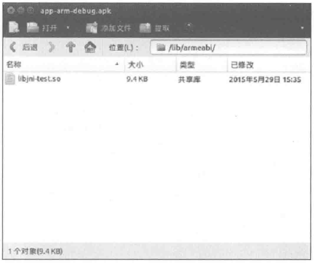

# 第14章 JNI和NDK编程

Java JNI的本意是Java Native Interface（Java本地接口），它是为了方便Java调用C、C++等本地代码所封装的一层接口。我们都知道，Java的优点是跨平台，但是作为优点的同时，其在和本地交互的时候就出现了短板。Java的跨平台特性导致其本地交互的能力不够强大，一些和操作系统相关的特性Java无法完成，于是Java提供了JNI专门用于和本地代码交互，这样就增强了Java语言的本地交互能力。通过Java JNI，用户可以调用用C、C++所编写的本地代码。

NDK是Android所提供的一个工具集合，通过NDK可以在Android中更加方便地通过JNI来访问本地代码，比如C或者C++。NDK还提供了交叉编译器，开发人员只需要简单地修改mk文件就可以生成特定CPU平台的动态库。使用NDK有如下好处：

（1）提高代码的安全性。由于so库反编译比较困难，因此NDK提高了Android程序的安全性。

（2）可以很方便地使用目前已有的C/C++开源库。

（3）便于平台间的移植。通过C/C++实现的动态库可以很方便地在其他平台上使用。

（4）提高程序在某些特定情形下的执行效率，但是并不能明显提升Android程序的性能。

由于JNI和NDK比较适合在Linux环境下开发，因此本文选择Ubuntu14.10（64位操作系统）作为开发环境，同时选择AndroidStuio作为IDE。至于Windows环境下的NDK开发，整体流程是类似的，有差别的只是和操作系统相关的特性，这里就不再单独介绍了。在Linux环境中，JNI和NDK开发所用到的动态库的格式是以.so为后缀的文件，下面统一简称为so库。另外，由于JNI和NDK主要用于底层和嵌入式开发，在Android的应用层开发中使用较少，加上它们本身更加侧重于C和C++方面的编程，因此本章只介绍JNI和NDK的基础知识，其他更加深入的知识点如果读者感兴趣的话可以查看专门介绍JNI和NDK的书籍。

## 14.1 JNI的开发流程

JNI的开发流程有如下几步，首先需要在Java中声明native方法，接着用C或者C++实现native方法，然后就可以编译运行了。

1.在Java中声明native方法

创建一个类，这里叫做JniTest.java，代码如下所示。

```
 package com.ryg;
 import java.lang.System;
 public class JniTest {
    static {
        System. loadLibrary("jni-test");
    }
    public static void main(String args[]) {
        JniTest jniTest = new JniTest();
        System.out.println(jniTest.get());
        jniTest.set("hello world");
    }
    public native String get();
    public native void set(String str);
 }
```

可以看到上面的代码中，声明了两个native方法：get和set(String)，这两个就是需要在JNI中实现的方法。在JniTest的头部有一个加载动态库的过程，其中jni-test是so库的标识，so库完整的名称为libjni-test.so，这是加载so库的规范。

2.编译Java源文件得到class文件，然后通过javah命令导出JNI的头文件

具体的命令如下：

```
javac com/ryg/JniTest.java
javah com.ryg.JniTest
```

在当前目录下，会产生一个com_ryg_JniTest.h的头文件，它是javah命令自动生成的，内容如下所示。

```
/* DO NOT EDIT THIS FILE - it is machine generated */
#include <jni.h>
/* Header for class com_ryg_JniTest */

#ifndef _Included_com_ryg_JniTest
#define _Included_com_ryg_JniTest
#ifdef __cplusplus
extern "C" {
#endif
/*
 * Class:     com_ryg_JniTest
 * Method:    get
 * Signature: ()Ljava/lang/String;
 */
JNIEXPORT jstring JNICALL Java_com_ryg_JniTest_get
  (JNIEnv *, jobject);

/*
 * Class:     com_ryg_JniTest
 * Method:    set
 * Signature: (Ljava/lang/String;)V
 */
JNIEXPORT void JNICALL Java_com_ryg_JniTest_set
  (JNIEnv *, jobject, jstring);

#ifdef __cplusplus
}
#endif
#endif
```

上面的代码需要做一下说明，首先函数名的格式遵循如下规则：Java_包名_类名_方法名。比如 JniTest 中的 set 方法，到这里就变成了 JNIEXPORT void JNICALL Java_com_ryg_JniTest_set(JNIEnv *, jobject, jstring)，其中 com_ryg 是包名，JniTest 是类名，jstring 是代表的是set方法的String类型的参数。关于Java和JNI的数据类型之间的对应关系会在14.3节中进行介绍，这里只需要知道Java的String对应于JNI的jstring即可。JNIEXPORT、JNICALL、JNIEnv和jobject都是JNI标准中所定义的类型或者宏，它们的含义如下：

JNIEnv*：表示一个指向JNI环境的指针，可以通过它来访问JNI提供的接口方法：

jobject：表示Java对象中的this；

JNIEXPORT和JNICALL：它们是JNI中所定义的宏，可以在jni.h这个头文件中查找到。

下面的宏定义是必需的，它指定extern"C"内部的函数采用C语言的命名风格来编译。否则当JNI采用C++来实现时，由于C和C++编译过程中对函数的命名风格不同，这将导致JNI在链接时无法根据函数名查找到具体的函数，那么JNI调用就无法完成。更多的细节实际上是有关C和C++编译时的一些问题，这里就不再展开了。

```
#ifdef __cplusplus
extern "C" {
#endif
```

3.实现JNI方法

JNI方法是指Java中声明的native方法，这里可以选择用C++或者C来实现，它们的实现过程是类似的，只有少量的区别，下面分别用C++和C来实现JNI方法。首先，在工程的主目录下创建一个子目录，名称随意，这里选择jni作为子目录的名称，然后将之前通过javah生成的头文件com_ryg_JniTest.h复制到jni目录下，接着创建test.cpp和test.c两个文件，它们的实现如下所示。

```
 // test.cpp
 #include "com_ryg_JniTest.h"
 #include <stdio.h>
 JNIEXPORT jstring JNICALL Java_com_ryg_JniTest_get(JNIEnv *env, jobject
 thiz) {
    printf("invoke get in c++\n");
    return env->NewStringUTF("Hello from JNI !");
 }
 JNIEXPORT void JNICALL Java_com_ryg_JniTest_set(JNIEnv *env, jobject thiz,
 jstring string) {
    printf("invoke set from C++\n");
    char* str = (char*)env->GetStringUTFChars(string, NULL) ;
    printf("%s\n", str);
    env->ReleaseStringUTFChars(string, str);
 }
 // test.c
 #include "com_ryg_JniTest.h"
 #include <stdio.h>
JNIEXPORT jstring JNICALL Java_com_ryg_JniTest_get(JNIEnv *env, jobject
thiz) {
    printf("invoke get from C\n");
    return(*env)->NewStringUTF(env, "Hello from JNI !");
 }
JNIEXPORT void JNICALL Java_com_ryg_JniTest_set(JNIEnv *env, jobject thiz,
jstring string) {
    printf("invoke set from C\n");
    char* str = (char*) (*env)->GetStringUTFChars(env,string,NULL) ;
    printf("%s\n", str);
    (*env) ->ReleaseStringUTFChars(env, string, str);
 }
```

可以发现，test.cpp和test.c的实现很类似，但是它们对env的操作方式有所不同，因此用C++和C来实现同一个JNI方法，它们的区别主要集中在对env的操作上，其他都是类似的，如下所示。

```
 C++: env->NewStringUTF("Hello from JNI !");
 C: (*env) ->NewStringUTF(env, "Hello from JNI !")
```

4.编译so库并在Java中调用

so库的编译这里采用gcc，切换到jni目录中，对于test.cpp和test.c来说，它们的编译指令如下所示。

```
C++: gcc -shared -I /usr/lib/jvm/java-7-openjdk-amd64/include -fPIC test.cpp -o libjni-test.so
C: gcc -shared -I /usr/lib/jvm/java-7-openjdk-amd64/include -fPIC test.c -o libjni-test.so
```

上面的编译命令中，/usr/lib/jvm/java-7-openjdk-amd64是本地的jdk的安装路径，在其他环境编译时将其指向本机的jdk路径即可。而libjni-test.so则是生成的so库的名字，在Java 中可以通过如下方式加载：System.loadLibrary("jni-test")，其中 so 库名字中的“lib”和“.so”是不需要明确指出的。so 库编译完成后，就可以在 Java 程序中调用 so 库了，这里通过 Java 指令来执行 Java 程序，切换到主目录，执行如下指令：java -Djava.library.path=jni com.ryg.JniTest，其中-Djava.library.path=jni指明了so库的路径。

首先，采用C++产生so库，程序运行后产生的日志如下所示。

```
 invoke get in c++
 Hello from JNI !
 invoke set from C++
 hello world
```

然后，采用C产生so库，程序运行后产生的日志如下所示。

```
 invoke get from C
 Hello from JNI !
 invoke set from C
 hello world
```

通过上面的日志可以发现，在Java中成功地调用了C/C++的代码，这就是JNI典型的工作流程。

## 14.2 NDK的开发流程

NDK的开发是基于JNI的，其主要由如下几个步骤。

1.下载并配置NDK

首先要从Android官网上下载NDK，下载地址为https://developer.android.com/ndk/downloads/index.html，本章中采用的NDK的版本是android-ndk-r10d。下载完成以后，将NDK解压到一个目录，然后为NDK配置环境变量，步骤如下所示。

首先打开当前用户的环境变量配置文件：

```
 vim ~/.bashrc
```

然后在文件后面添加如下信息：export PATH=~/Android/android-ndk-r10d:$PATH，其中~/Android/android-ndk-r10d是本地的NDK的存放路径。

添加完毕后，执行 source ~/.bashrc 来立刻刷新刚刚设置的环境变量。设置完环境变量后，ndk-build命令就可以使用了，通过ndk-build命令就可以编译产生so库。

2.创建一个Android项目，并声明所需的native方法

```
package com.ryg.JniTestApp;
import android.support.v7.app.ActionBarActivity;
import android.os.Bundle;
import android.util.Log;
import android.view.Menu;
import android.view.MenuItem;
 import android.widget.TextView;
public class MainActivity extends ActionBarActivity{
    static {
       System.loadLibrary("jni-test");
    }
    @Override
    protected void onCreate(Bundle savedInstanceState) {
       super.onCreate(savedInstanceState) ;
        setContentView(R.layout.activity_main);
       TextView textView = (TextView)findViewById(R.id.msg);
        textView.setText(get());
        set("hello world from JniTestApp");
    }
    public native String get();
    public native void set(String str);
 }
```

3.实现Android项目中所声明的native方法

在外部创建一个名为jni的目录，然后在jni目录下创建3个文件：test.cpp、Android.mk和Application.mk，它们的实现如下所示。

```
 // test.cpp
 #include <jni.h>
 #include <stdio.h>
 #ifdef __cplusplus
 extern "C" {
 #endif
 jstring Java_com_ryg_JniTestApp_MainActivity_get(JNIEnv *env, jobject thiz) {
    printf("invoke get in c++\n");
    return env->NewStringUTF("Hello from JNI in libjni-test.so !");
 }
 void Java_com_ryg_JniTestApp_MainActivity_set(JNIEnv *env, jobject thiz,
 jstring string) {
    printf("invoke set from C++\n");
    char* str = (char*)env->GetStringUTFChars(string, NULL) ;
    printf("%s\n", str);
    env->ReleaseStringUTFChars(string, str);
 }
 #ifdef __cplusplus
 }
 #endif
 // Android.mk
 # Copyright(C) 2009 The Android Open Source Project
 #
 # Licensed under the Apache License, Version 2.0 (the "License");
 # you may not use this file except in compliance with the License.
 # You may obtain a copy of the License at
 #
# http://www.apache.org/licenses/LICENSE-2.0
#
# Unless required by applicable law or agreed to in writing, software
# distributed under the License is distributed on an "AS IS" BASIS,
# WITHOUT WARRANTIES OR CONDITIONS OF ANY KIND, either express or implied.
# See the License for the specific language governing permissions and
# limitations under the License.
#
LOCAL_PATH := $(call my-dir)

include $(CLEAR_VARS)

LOCAL_MODULE := jni-test
LOCAL_SRC_FILES := test.cpp

include $(BUILD_SHARED_LIBRARY)

// Application.mk
APP_ABI := armeabi
```

这里对Android.mk和Application.mk做一下简单的介绍。在Android.mk中，LOCAL MODULE表示模块的名称，LOCAL_SRC_FILES表示需要参与编译的源文件。Application.mk中常用的配置项是APP_ABI，它表示CPU的架构平台的类型，目前市面上常见的架构平台有armeabi、x86和mips，其中在移动设备中占据主要地位的是armeabi，这也是大部分apk中只包含armeabi类型的so库的原因。默认情况下NDK会编译产生各个CPU平台的so库，通过APP_ABI选项即可指定so库的CPU平台的类型，比如armeabi，这样NDK就只会编译armeabi平台下的so库了，而all则表示编译所有CPU平台的so库。

4.切换到jni目录的父目录，然后通过ndk-build命令编译产生so库

这个时候NDK会创建一个和jni目录平级的目录libs，libs下面存放的就是so库的目录，如图14-1所示。需要注意的是，ndk-build命令会默认指定jni目录为本地源码的目录，如果源码存放的目录名不是jni，那么ndk-build则无法成功编译。


图 14-1 通过 NDK 编译产生的 so 库

然后在app/src/main中创建一个名为jniLibs的目录，将生成的so库复制到jniLibs目录中，然后通过AndroidStudio编译运行即可，运行效果如图14-2所示。这说明从Android中调用so库中的方法已经成功了。


图 14-2 Android 中调用 so 库中的方法示例

在上面的步骤中，需要将NDK编译的so库放置到jniLibs目录下，这个是AndroidStudio所识别的默认目录，如果想使用其他目录，可以按照如下方式修改App的build.gradle文件，其中jniLibs.srcDir选项指定了新的存放so库的目录。

```
android {
    ...
    sourceSets.main {
        jniLibs.srcDir 'src/main/jni_libs'
    }
}
```

除了手动使用ndk-build命令创建so库，还可以通过AndroidStudio来自动编译产生so库，这个操作过程要稍微复杂一些。为了能够让AndroidStudio自动编译JNI代码，首先需要在App的build.gradle的defaultConfig区域内添加NDK选项，其中moduleName指定了模块的名称，这个名称指定了打包后的so库的文件名，如下所示。

```
android {
    ...
    defaultConfig {
        applicationId "com.ryg.JniTestApp"
        minSdkVersion 8
        targetSdkVersion 22
        versionCode 1
        versionName "1.0"
         ndk {
             moduleName "jni-test"
         }
     }
 }
```

接着需要将JNI的代码放在app/src/main/jni目录下，注意存放JNI代码的目录名必须为jni，如果不想采用jni这个名称，可以通过如下方式来指定JNI的代码路径，其中jni.srcDirs指定了JNI代码的路径：

```
android {
    ...
    sourceSets.main {
        jni.srcDirs 'src/main/jni_src'
    }
}
```

经过了上面的步骤，AndroidStudio就可以自动编译JNI代码了，但是这个时候AndroidStudio会把所有CPU平台的so库都打包到apk中，一般来说实际开发中只需要打包armeabi平台的so库即可。要解决这个问题也很简单，按照如下方式修改build.gradle的配置，然后在BuildVariants面板中选择armDebug选项进行编辑就可以了。

```
android {
    ...
    productFlavors {
        arm {
            ndk {
                abiFilter "armeabi"
            }
        }
        x86 {
            ndk {
                abiFilter "x86"
            }
        }
    }
}
```

如图14-3所示，可以看到apk中就只有armeabi平台的so库了。



图 14-3 AndroidStudio 打包后的 apk

## 14.3 JNI的数据类型和类型签名

JNI的数据类型包含两种：基本类型和引用类型。基本类型主要有jboolean、jchar、jint等，它们和Java中的数据类型的对应关系如表14-1所示。

表 14-1 JNI 基本数据类型的对应关系

| JNI 类型 | Java 类型 | 描述 |
| --- | --- | --- |
| jboolean | boolean | 无符号 8 位整型 |
| jbyte | byte | 有符号 8 位整型 |
| jchar | char | 无符号 16 位整型 |
| jshort | short | 有符号 16 位整型 |
| jint | int | 32 位整型 |
| jlong | long | 64 位整型 |
| jfloat | float | 32 位浮点型 |
| jdouble | double | 64 位浮点型 |
| void | void | 无类型 |

JNI中的引用类型主要有类、对象和数组，它们和Java中的引用类型的对应关系如表14-2所示。

表 14-2 JNI 引用类型的对应关系

| JNI 类型 | Java 类型 | 描述 |
| --- | --- | --- |
| jobject | Object | Object 类型 |
| jclass | Class | Class 类型 |
| jstring | String | 字符串 |
| jobjectArray | Object[] | 对象数组 |
| jbooleanArray | boolean[] | boolean 数组 |
| jbyteArray | byte[] | byte 数组 |
| jcharArray | char[] | char 数组 |
| jshortArray | short[] | short 数组 |
| jintArray | int[] | int 数组 |
| jlongArray | long[] | long 数组 |
| jfloatArray | float[] | float 数组 |
| jdoubleArray | double[] | double 数组 |
| jthrowable | Throwable | Throwable 类型 |

JNI的类型签名标识了一个特定的Java类型，这个类型既可以是类和方法，也可以是数据类型。

类的签名比较简单，它采用“L+包名+类名+；”的形式，只需要将其中的.替换为/即可。比如java.lang.String，它的签名为Ljava/lang/String;，注意末尾的；也是签名的一部分。

基本数据类型的签名采用一系列大写字母来表示，如表14-3所示。

表 14-3 基本数据类型的签名

| Java 类型 | 签名 | Java 类型 | 签名 |
| --- | --- | --- | --- |
| boolean | Z | long | J |
| byte | B | float | F |
| char | C | double | D |
| short | S | void | V |
| int | I | | |

从表14-3可以看出，基本数据类型的签名是有规律的，一般为首字母的大写，但是boolean除外，因为B已经被byte占用了，而long的签名之所以不是L，那是因为L表示的是类的签名。

对象和数组的签名稍微复杂一些。对于对象来说，它的签名就是对象所属的类的签名，比如String对象，它的签名为Ljava/lang/String;。对于数组来说，它的签名为[+类型签名，比如 int 数组，其类型为 int，而 int 的签名为 I，所以 int 数组的签名就是 [I，同理就可以得出如下的签名对应关系：

```
char[]      [C
float[]     [F
double[]    [D
long[]      [J
String[]    [Ljava/lang/String;
Object[]    [Ljava/lang/Object;
```

对于多维数组来说，它的签名为 n 个 [+类型签名，其中 n 表示数组的维度，比如，int[][]的签名为 [[I，其他情况可以依此类推。

方法的签名为（参数类型签名）+返回值类型签名，这有点不好理解。举个例子，如下方法：boolean fun1(int a, double b, int[] c)，根据签名的规则可以知道，它的参数类型的签名连在一起是 ID[I，返回值类型的签名为 Z，所以整个方法的签名就是 (ID[I)Z。再举个例子，下面的方法：boolean fun1(int a, String b, int[] c)，它的签名是 (ILjava/lang/String;[I)Z。为了能够更好地理解方法的签名格式，下面再给出两个示例：

```
int fun1()       签名为 ()I
void fun1(int i) 签名为 (I)V
```

## 14.4 JNI调用Java方法的流程

JNI调用Java方法的流程是先通过类名找到类，然后再根据方法名找到方法的id，最后就可以调用这个方法了。如果是调用Java中的非静态方法，那么需要构造出类的对象后才能调用它。下面的例子演示了如何在JNI中调用Java的静态方法，至于调用非静态方法只是多了一步构造对象的过程，这里就不再介绍了。

首先需要在Java中定义一个静态方法供JNI调用，如下所示。

```
public static void methodCalledByJni(String msgFromJni) {
Log.d(TAG, "methodCalledByJni,msg: " + msgFromJni);
 }
```

然后在JNI中调用上面定义的静态方法：

```
 void callJavaMethod(JNIEnv *env, jobject thiz) {
    jclass clazz = env->FindClass("com/ryg/JniTestApp/MainActivity") ;
    if(clazz == NULL) {
       printf("find class MainActivity error!");
        return;
    }
    jmethodID id = env->GetStaticMethodID(clazz, "methodCalledByJni",
    "(Ljava/lang/String;)V");
    if(id == NULL) {
       printf("find method methodCalledByJni error!");
    }
    jstring msg = env->NewStringUTF("msg send by callJavaMethod in test.cpp.");
    env->CallStaticVoidMethod(clazz, id, msg);
 }
```

从callJavaMethod的实现可以看出，程序首先根据类名com/ryg/JniTestApp/MainActivity找到类，然后再根据方法名methodCalledByJni找到方法，其中(Ljava/lang/String;)V是methodCalledByJni方法的签名，接着再通过JNIEnv对象的CallStaticVoidMethod方法来完成最终的调用过程。

最后在Java_com_ryg_JniTestApp_MainActivity_get方法中调用callJavaMethod方法，如下所示。

```
 jstring Java_com_ryg_JniTestApp_MainActivity_get(JNIEnv *env, jobject thiz) {
    printf("invoke get in c++\n");
    callJavaMethod(env, thiz);
    return env->NewStringUTF("Hello from JNI in libjni-test.so !");
 }
```

由于MainActivity会调用JNI中的Java_com_ryg_JniTestApp_MainActivity_get方法，Java_com_ryg_JniTestApp_MainActivity_get方法又会调用callJavaMethod方法，而callJavaMethod方法又会反过来调用MainActivity的methodCalledByJni方法，这样一来就完成了一次从Java调用JNI然后再从JNI中调用Java方法的过程。安装运行程序，可以看到如下日志，这说明程序已经成功地从JNI中调用了Java中的methodCalledByJni方法。

```
 D/MainActivity : methodCalledByJni, msg: msg send by callJavaMethod in
 test.cpp.
```

我们可以发现，JNI调用Java的过程和Java中方法的定义有很大关联，针对不同类型的Java方法，JNIEnv提供了不同的接口去调用，本章作为一个JNI的入门章节就不再对它们一一进行介绍了，毕竟大部分应用层的开发人员并不需要那么深入地了解JNI，如果读者感兴趣可以自行阅读相关的JNI专业书籍。
