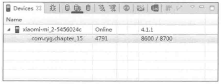
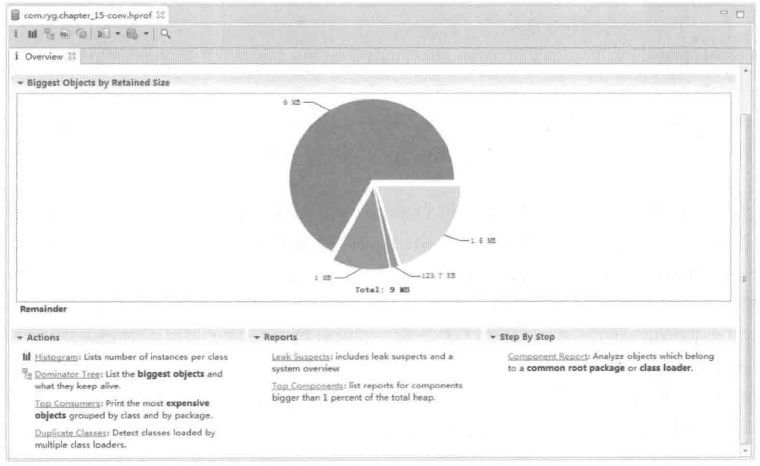
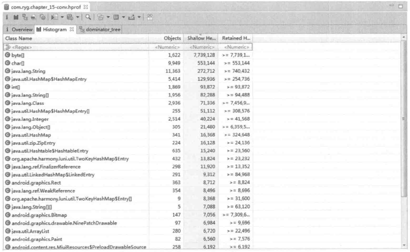
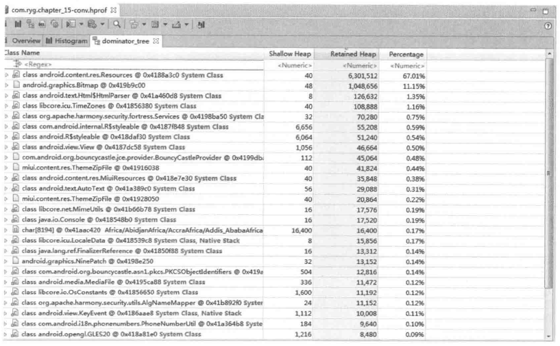
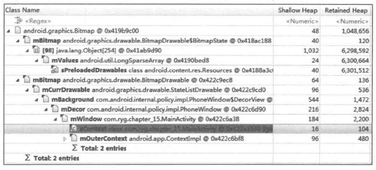
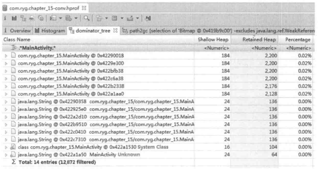

# 第15章 Android性能优化

本章是本书的最后一章，所介绍的主题是Android的性能优化方法和程序设计的一些思想。通过本章的内容，读者可以掌握常见的性能优化方法，这将有助于提高Android程序的性能；另一方面，本章还讲解了Android程序设计的一些思想，这将有助于提高程序的可维护性和可扩展性。另外，2015年Google在YouTube上发布了关于Android性能优化典范的专题，通过一系列短视频来帮助开发者创建更快更优秀的Android应用，课程专题不仅仅介绍了Android系统中有关性能问题的底层工作原理，同时也介绍了如何通过工具来找出性能问题以及提升性能的建议，地址是：

https://www.youtube.com/playlist?list=PLWz5rJ2EKKc9CBxr3BVjPTPoDPLdPIFCE。

Android设备作为一种移动设备，不管是内存还是CPU的性能都受到了一定的限制，无法做到像PC设备那样具有超大的内存和高性能的CPU。鉴于这一点，这也意味着Android程序不可能无限制地使用内存和CPU资源，过多地使用内存会导致程序内存溢出，即OOM。而过多地使用CPU资源，一般是指做大量的耗时任务，会导致手机变得卡顿甚至出现程序无法响应的情况，即ANR。由此来看，Android程序的性能问题就变得异常突出了，这对开发人员也提出了更高的要求。为了提高应用程序的性能，本章第一节介绍了一些有效的性能优化方法，主要内容包括布局优化、绘制优化、内存泄露优化、响应速度优化、ListView优化、Bitmap优化、线程优化以及一些性能优化建议，同时在介绍响应速度优化的同时还介绍了ANR日志的分析方法。

性能优化中一个很重要的问题就是内存泄露，内存泄露并不会导致程序功能异常，但是它会导致Android程序的内存占用过大，这将提高内存溢出的发生几率。如何避免写出内存泄露的代码，这和开发人员的水平和意识有很大关系，甚至很多情况下内存泄露的原因是很难直接发现的，这个时候就需要借助一些内存泄露分析工具，在本章的第二节将介绍内存泄露分析工具MAT的使用，通过MAT就可以发现一些开发过程中难以发现的内存泄露问题。

在做程序设计时，除了要完成功能开发、提高程序的性能以外，还有一个问题也是不容忽视的，那就是代码的可维护性和可扩展性。如果一个程序的可维护性和可扩展性很差，那就意味着后续的代码维护代价是相当高的，比如需要对一个功能做一些调整，这可能会出现牵一发而动全身的局面。另外添加新功能时也觉得无从下手，整个代码看起来可读性很差，这的确是一份很糟糕的代码。关于代码的可维护性和可扩展性，看起来是一个很抽象的问题，其实它并不抽象，它是可以通过一些合理的设计原则去完成的，比如良好的代码风格、清晰的代码层级、代码的可扩展性和合理的设计模式，在本章的第三节对这些设计原则做了介绍，这将在一定程度上提高程序的可维护性和可扩展性。

## 15.1 Android的性能优化方法

本节介绍了一些有效的性能优化方法，主要内容包括布局优化、绘制优化、内存泄露优化、响应速度优化、ListView优化、Bitmap优化、线程优化以及一些性能优化建议，在介绍响应速度优化的同时还介绍了ANR日志的分析方法。

### 15.1.1 布局优化

布局优化的思想很简单，就是尽量减少布局文件的层级，这个道理是很浅显的，布局中的层级少了，这就意味着Android绘制时的工作量少了，那么程序的性能自然就高了。

如何进行布局优化呢？首先删除布局中无用的控件和层级，其次有选择地使用性能较低的ViewGroup，比如RelativeLayout。如果布局中既可以使用LinearLayout也可以使用RelativeLayout，那么就采用LinearLayout，这是因为RelativeLayout的功能比较复杂，它的布局过程需要花费更多的CPU时间。FrameLayout和LinearLayout一样都是一种简单高效的ViewGroup，因此可以考虑使用它们，但是很多时候单纯通过一个LinearLayout或者FrameLayout无法实现产品效果，需要通过嵌套的方式来完成。这种情况下还是建议采用RelativeLayout，因为ViewGroup的嵌套就相当于增加了布局的层级，同样会降低程序的性能。

布局优化的另外一种手段是采用`<include>`标签、`<merge>`标签和ViewStub。`<include>`标签主要用于布局重用，`<merge>`标签一般和`<include>`配合使用，它可以降低减少布局的层级，而ViewStub则提供了按需加载的功能，当需要时才会将ViewStub中的布局加载到内存，这提高了程序的初始化效率，下面分别介绍它们的使用方法。

`<include>`标签

`<include>`标签可以将一个指定的布局文件加载到当前的布局文件中，如下所示。

```
 <LinearLayout xmlns:android="http://schemas.android.com/apk/res/android"
    android:orientation="vertical"
    android:layout_width="match_parent"
    android:layout_height="match_parent"
    android:background="@color/app_bg"
    android:gravity="center_horizontal">
    <include layout="@layout/titlebar"/>
    <TextView android:layout_width="match_parent"
             android:layout_height="wrap_content"
             android:text="@string/text"
             android:padding="5dp" />
    ...
 </LinearLayout>
```

上面的代码中，@layout/titlebar指定了另外一个布局文件，通过这种方式就不用把titlebar这个布局文件的内容再重复写一遍了，这就是`<include>`的好处。`<include>`标签只支持以android:layout_开头的属性，比如android:layout_width、android:layout_height，其他属性是不支持的，比如android:background。当然，android:id这个属性是个特例，如果`<include>`指定了这个id属性，同时被包含的布局文件的根元素也指定了id属性，那么以`<include>`指定的id属性为准。需要注意的是，如果`<include>`标签指定了`android:layout_*`这种属性，那么要求android:layout_width和android:layout_height必须存在，否则其他`android:layout_*`形式的属性无法生效，下面是一个指定了`android:layout_*`属性的示例。

```
 <include android:id="@+id/new_title"
        android:layout_width="match_parent"
        android:layout_height="match_parent"
        layout="@layout/title"/>
```

`<merge>`标签

`<merge>`标签一般和`<include>`标签一起使用从而减少布局的层级。在上面的示例中，由于当前布局是一个竖直方向的LinearLayout，这个时候如果被包含的布局文件中也采用了竖直方向的LinearLayout，那么显然被包含的布局文件中的LinearLayout是多余的，通过`<merge>`标签就可以去掉多余的那一层LinearLayout，如下所示。

```
 <merge xmlns:android="http://schemas.android.com/apk/res/android">
    <Button
        android:layout_width="wrap_content"
        android:layout_height="wrap_content"
        android:text="@string/one"/>
    <Button
        android:layout_width="wrap_content"
       android:layout_height="wrap_content"
        android:text="@string/two"/>
 </merge>
```

ViewStub

ViewStub继承了View，它非常轻量级且宽/高都是0，因此它本身不参与任何的布局和绘制过程。ViewStub的意义在于按需加载所需的布局文件，在实际开发中，有很多布局文件在正常情况下不会显示，比如网络异常时的界面，这个时候就没有必要在整个界面初始化的时候将其加载进来，通过ViewStub就可以做到在使用的时候再加载，提高了程序初始化时的性能。下面是一个ViewStub的示例：

```
 <ViewStub
    android:id="@+id/stub_import"
    android:inflatedId="@+id/panel_import"
    android:layout="@layout/layout_network_error"
    android:layout_width="match_parent"
    android:layout_height="wrap_content"
    android:layout_gravity="bottom" />
```

其中stub_import是ViewStub的id,而panel_import是layout/layout_network_error这个布局的根元素的id。如何做到按需加载呢？在需要加载ViewStub中的布局时，可以按照如下两种方式进行：

```
 ((ViewStub) findViewById(R.id.stub_import)).setVisibility(View.VISIBLE) ;
```

或者

```
 View importPanel = ((ViewStub) findViewById(R.id.stub_import)).inflate();
```

当ViewStub通过setVisibility或者inflate方法加载后，ViewStub就会被它内部的布局替换掉，这个时候ViewStub就不再是整个布局结构中的一部分了。另外，目前ViewStub还不支持`<merge>`标签。

### 15.1.2 绘制优化

绘制优化是指View的onDraw方法要避免执行大量的操作，这主要体现在两个方面。

首先，onDraw中不要创建新的局部对象，这是因为onDraw方法可能会被频繁调用，这样就会在一瞬间产生大量的临时对象，这不仅占用了过多的内存而且还会导致系统更加频繁gc，降低了程序的执行效率。

另外一方面，onDraw方法中不要做耗时的任务，也不能执行成千上万次的循环操作，尽管每次循环都很轻量级，但是大量的循环仍然十分抢占CPU的时间片，这会造成View的绘制过程不流畅。按照Google官方给出的性能优化典范中的标准，View的绘制帧率保证60fps是最佳的，这就要求每帧的绘制时间不超过16ms（16ms=1000/60），虽然程序很难保证16ms这个时间，但是尽量降低onDraw方法的复杂度总是切实有效的。

### 15.1.3 内存泄露优化

内存泄露在开发过程中是一个需要重视的问题，但是由于内存泄露问题对开发人员的经验和开发意识有较高的要求，因此这也是开发人员最容易犯的错误之一。内存泄露的优化分为两个方面，一方面是在开发过程中避免写出有内存泄露的代码，另一方面是通过一些分析工具比如MAT来找出潜在的内存泄露继而解决。本节主要介绍一些常见的内存泄露的例子，通过这些例子读者可以很好地理解内存泄露的发生场景并积累规避内存泄露的经验。关于如何通过工具分析内存泄露将在15.2节中专门介绍。

场景1：静态变量导致的内存泄露

下面这种情形是一种最简单的内存泄露，相信读者都不会这么干，下面的代码将导致Activity无法正常销毁，因此静态变量sContext引用了它。

```
 public class MainActivity extends Activity{
    private static final String TAG = "MainActivity";
    private static Context sContext;
    @Override
    protected void onCreate(Bundle savedInstanceState) {
        super.onCreate(savedInstanceState) ;
        setContentView(R.layout.activity_main);
        sContext = this;
    }
 }
```

上面的代码也可以改造一下，如下所示。sView是一个静态变量，它内部持有了当前Activity，所以Activity仍然无法释放，估计读者也都明白。

```
 public class MainActivity extends Activity{
    private static final String TAG = "MainActivity";
    private static View sView;
    @Override
    protected void onCreate(Bundle savedInstanceState) {
        super.onCreate(savedInstanceState) ;
        setContentView(R.layout.activity_main);
        sView = new View(this);
    }
 }
```

场景2：单例模式导致的内存泄露

静态变量导致的内存泄露都太过于明显，相信读者都不会犯这种错误，而单例模式所带来的内存泄露是我们容易忽视的，如下所示。首先提供一个单例模式的TestManager，TestManager可以接收外部的注册并将外部的监听器存储起来。

```
public class TestManager{
    private List<OnDataArrivedListener> mOnDataArrivedListeners = new
    ArrayList<OnDataArrivedListener>();
    private static class SingletonHolder{
        public static final TestManager INSTANCE = new TestManager();
    }.
    private TestManager() {
    }
    public static TestManager getInstance() {
        return SingletonHolder.INSTANCE;
    }
    public synchronized void registerListener(OnDataArrivedListener
    listener) {
       if(!mOnDataArrivedListeners.contains(listener)) {
           mOnDataArrivedListeners.add(listener) ;
        }
    }
    public synchronized void unregisterListener(OnDataArrivedListener
    listener) {
       mOnDataArrivedListeners.remove(listener);
    }
    public interface OnDataArrivedListener {
       public void onDataArrived(Object data);
    }
 }
```

接着再让Activity实现OnDataArrivedListener接口并向TestManager注册监听，如下所示。下面的代码由于缺少解注册的操作所以会引起内存泄露，泄露的原因是Activity的对象被单例模式的TestManager所持有，而单例模式的特点是其生命周期和Application保持一致，因此Activity对象无法被及时释放。

```
protected void onCreate(Bundle savedInstanceState) {
     super.onCreate(savedInstanceState) ;
     setContentView(R.layout.activity_main);
     TestManager.getInstance().registerListener(this);
 }
```

场景3：属性动画导致的内存泄露

从Android3.0开始，Google提供了属性动画，属性动画中有一类无限循环的动画，如果在Activity中播放此类动画且没有在onDestroy中去停止动画，那么动画会一直播放下去，尽管已经无法在界面上看到动画效果了，并且这个时候Activity的View会被动画持有，而View又持有了Activity，最终Activity无法释放。下面的动画是无限动画，会泄露当前Activity，解决方法是在Activity的onDestroy中调用animator.cancel()来停止动画。

```
 protected void onCreate(Bundle savedInstanceState) {
     super.onCreate(savedInstanceState) ;
     setContentView(R.layout.activity_main);
     mButton = (Button) findViewById(R.id.button1);
     ObjectAnimator animator = ObjectAnimator.ofFloat(mButton, "rotation",
             0, 360).setDuration(2000);
     animator.setRepeatCount(ValueAnimator. INFINITE) ;
     animator.start();
     //animator.cancel();
 }
```

### 15.1.4 响应速度优化和ANR日志分析

响应速度优化的核心思想是避免在主线程中做耗时操作，但是有时候的确有很多耗时操作，怎么办呢？可以将这些耗时操作放在线程中去执行，即采用异步的方式执行耗时操作。响应速度过慢更多地体现在Activity的启动速度上面，如果在主线程中做太多事情，会导致Activity启动时出现黑屏现象，甚至出现ANR。Android规定，Activity如果5秒钟之内无法响应屏幕触摸事件或者键盘输入事件就会出现ANR，而BroadcastReceiver如果10秒钟之内还未执行完操作也会出现ANR。在实际开发中，ANR是很难从代码上发现的，如果在开发过程中遇到了ANR，那么怎么定位问题呢？其实当一个进程发生ANR了以后，系统会在/data/anr目录下创建一个文件traces.txt，通过分析这个文件就能定位出ANR的原因，下面模拟一个ANR的场景。下面的代码在Activity的onCreate中休眠30s，程序运行后持续点击屏幕，应用一定会出现ANR：

```
protected void onCreate(Bundle savedInstanceState) {
     super.onCreate(savedInstanceState) ;
     setContentView(R.layout.activity_main) ;
     SystemClock.sleep(30 * 1000);
 }
```

这里先假定我们无法从代码中看出ANR，为了分析ANR的原因，可以到处traces文件，如下所示，其中.表示当前目录：

```
adb pull /data/anr/traces.txt .
```

traces文件一般是非常长的，下面是traces文件的部分内容：

```
----- pid 29395 at 2015-05-31 16:14:36 -----
Cmd line: com.ryg.chapter_15
DALVIK THREADS:
(mutexes: tll=0 tsl=0 tscl=0 ghl=0)
"main" prio=5 tid=1 TIMED_WAIT
| group="main" sCount=1 dsCount=0 obj=0x4185b700 self=0x4012d0b0
| sysTid=29395 nice=0 sched=0/0 cgrp=apps handle=1073954608
| schedstat=( 0 0 0 ) utm=3 stm=2 core=2
at java.lang.VMThread.sleep (Native Method)
at java.lang.Thread.sleep(Thread.java:1031)
at java.lang.Thread.sleep (Thread.java:1013)
at android.os.SystemClock.sleep (SystemClock.java:114)
at com.ryg.chapter_15.MainActivity.onCreate (MainActivity.java:42)
at android.app.Activity.performCreate (Activity.java:5086)
at android.app.Instrumentation.callActivityOnCreate (Instrumentation.
java:1079)
at android.app.ActivityThread.performLaunchActivity (ActivityThread.
java:2056)
at android.app.ActivityThread.handleLaunchActivity (ActivityThread.
java:2117)
at android.app.ActivityThread.access$600 (ActivityThread.java:140)
at android.app.ActivityThread$H.handleMessage (ActivityThread.java:1213)
at android.os.Handler.dispatchMessage (Handler.java:99)
at android.os.Looper.loop (Looper.java:137)
at android.app.ActivityThread.main (ActivityThread.java:4914)
at java.lang.reflect.Method.invokeNative (Native Method)
at java.lang.reflect.Method.invoke (Method.java:511)
at com.android.internal.os.ZygoteInit$MethodAndArgsCaller.run
(ZygoteInit.java:808)
at com.android.internal.os.ZygoteInit.main (ZygoteInit.java:575)
at dalvik.system.NativeStart.main (Native Method)
"Binder_2" prio=5 tid=10 NATIVE
| group="main" sCount=1 dsCount=0 obj=0x42296d80 self=0x69068848
| sysTid=29407 nice=0 sched=0/0 cgrp=apps handle=1750664088
| schedstat=( 0 0 0 ) utm=0 stm=0 core=1
#00 pc 0000cc50 /system/lib/libc.so (__ioctl+8)
#01 pc 0002816d /system/lib/libc.so (ioctl+16)
#02 pc 00016f9d /system/lib/libbinder.so (android::IPCThreadState::
talkWithDriver (bool) +124)
#03 pc 0001768f /system/lib/libbinder.so (android::IPCThreadState::
joinThreadPool (bool) +154)
#04 pc 0001b4e9 /system/lib/libbinder.so
#05 pc 00010f7f /system/lib/libutils.so (android::Thread::_threadLoop
(void*)+114)
#06 pc 00048ba5 /system/lib/libandroid_runtime.so (android::AndroidRuntime::javaThreadShell (void*) +44)
#07 pc 00010ae5 /system/lib/libutils.so
#08 pc 00012ff0 /system/lib/libc.so (__thread_entry+48)
#09 pc 00012748 /system/lib/libc.so (pthread_create+172)
at dalvik.system.NativeStart.run (Native Method)
```

从traces的内容可以看出，主线程直接sleep了，而原因就是MainActivity的42行。第42行刚好就是SystemClock.sleep(30 * 1000)，这样一来就可以定位问题了。当然这个例子太直接了，下面再模拟一个稍微复杂点的ANR的例子。

下面的代码也会导致ANR，原因是这样的，在Activity的onCreate中开启了一个线程，在线程中执行testANR()，而testANR()和initView()都被加了同一个锁，为了百分之百让testANR()先获得锁，特意在执行initView()之前让主线程休眠了10ms，这样一来initView()肯定会因为等待testANR()所持有的锁而被同步住，这样就产生了一个稍微复杂些的ANR。这个ANR是很参考意义的，这样的代码很容易在实际开发中出现，尤其是当调用关系比较复杂时，这个时候分析ANR日志就显得异常重要了。下面的代码中虽然已经将耗时操作放在线程中了，按道理就不会出现ANR了，但是仍然要注意子线程和主线程抢占同步锁的情况。

```
 protected void onCreate(Bundle savedInstanceState) {
     super.onCreate(savedInstanceState) ;
     setContentView(R.layout.activity_main);
     new Thread(new Runnable() {
         @Override
         public void run() {
             testANR();
         }
     }).start();
     SystemClock.sleep(10);
     initView();
 }
private synchronized void testANR() {
     SystemClock.sleep(30 * 1000);
 }
private synchronized void initView() {
 }
```

为了分析问题，需要从traces文件着手，如下所示。

```
----- pid 32662 at 2015-05-31 16:40:21 -----
Cmd line: com.ryg.chapter_15
DALVIK THREADS:
(mutexes: tll=0 tsl=0 tscl=0 ghl=0)
"main" prio=5 tid=1 MONITOR
| group="main" sCount=1 dsCount=0 obj=0x4185b700 self=0x4012d0b0
| sysTid=32662 nice=0 sched=0/0 cgrp=apps handle=1073954608
| schedstat=( 0 0 0 ) utm=0 stm=4 core=0
at com.ryg.chapter_15.MainActivity.initView(MainActivity.java:~62)
- waiting to lock <0x422a0120> (a com.ryg.chapter_15.MainActivity) held
by tid=11 (Thread-13248)
at com.ryg.chapter_15.MainActivity.onCreate(MainActivity.java:53)
at android.app.Activity.performCreate (Activity.java:5086)
at android.app.Instrumentation.callActivityOnCreate (Instrumentation.
java:1079)
at android.app.ActivityThread.performLaunchActivity(ActivityThread.
java:2056)                                                          I
at android.app.ActivityThread.handleLaunchActivity (ActivityThread.
java:2117)
at android.app.ActivityThread.access$600 (ActivityThread.java:140)
at android.app.ActivityThread$H.handleMessage (ActivityThread.java:1213)
at android.os.Handler.dispatchMessage (Handler.java: 99)
at android.os.Looper.loop (Looper.java:137)
at android.app.ActivityThread.main (ActivityThread.java:4914)
at java.lang.reflect.Method.invokeNative (Native Method)
at java.lang.reflect.Method. invoke (Method.java:511)
at com.android.internal.os.ZygoteInit$MethodAndArgsCaller. run
(ZygoteInit.java:808)
at com.android.internal.os.ZygoteInit.main(ZygoteInit.java:575)
at dalvik.system.NativeStart.main (Native Method)
"Thread-13248" prio=5 tid=11 TIMED_WAIT
| group="main" sCount=1 dsCount=0 obj=0x422b0ed8 self=0x683d20c0
| sysTid=32687 nice=0 sched=0/0 cgrp=apps handle=1751804288
| schedstat=( 0 0 0 ) utm=0 stm=0 core=0
at java.lang.VMThread.sleep (Native Method)
at java.lang.Thread.sleep (Thread.java:1031)
at java.lang.Thread.sleep(Thread.java:1013)
at android.os.SystemClock.sleep (SystemClock.java:114)
at com.ryg.chapter_15.MainActivity.testANR(MainActivity.java:57)
at com.ryg.chapter_15.MainActivity.access$0(MainActivity.java:56)
at com.ryg.chapter_15.MainActivity$1.run(MainActivity.java:49)
at java.lang.Thread.run (Thread.java:856)
```

上面的情况稍微复杂一些，需要逐步分析。首先看主线程，如下所示。可以看得出主线程在initView方法中正在等待一个锁<0x422a0120>，这个锁的类型是一个MainActivity对象，并且这个锁已经被线程id为11（即tid=11）的线程持有了，因此需要再看一下线程11的情况。

```
at com.ryg.chapter_15.MainActivity.initView(MainActivity.java:~62)
- waiting to lock <0x422a0120> (a com.ryg.chapter_15.MainActivity) held
by tid=11 (Thread-13248)
```

tid是11的线程就是“Thread-13248”，就是它持有了主线程所需的锁，可以看出“Thread-13248”正在sleep，sleep的原因是MainActivity的57行，即testANR方法。这个时候可以发现testANR方法和主线程的initView方法都加了synchronized关键字，表明它们在竞争同一个锁，即当前Activity的对象锁，这样一来ANR的原因就明确了，接着就可以修改代码了。

上面分析了两个ANR的实例，尤其是第二个ANR在实际开发中很容易出现，我们首先要有意识地避免出现ANR，其次出现ANR了也不要着急，通过分析traces文件即可定位问题。

### 15.1.5 ListView和Bitmap优化

ListView的优化在第12章已经做了介绍，这里再简单回顾一下。主要分为三个方面：首先要采用ViewHolder并避免在getView中执行耗时操作；其次要根据列表的滑动状态来控制任务的执行频率，比如当列表快速滑动时显然是不太适合开启大量的异步任务的；最后可以尝试开启硬件加速来使Listview的滑动更加流畅。注意Listview的优化策略完全适用于GridView。

Bitmap的优化同样在第12章已经做了详细的介绍，主要是通过BitmapFactory.Options来根据需要对图片进行采样，采样过程中主要用到了BitmapFactory.Options的inSampleSize参数，详情这里就不再重复了，请参考第12章的有关内容。

### 15.1.6 线程优化

线程优化的思想是采用线程池，避免程序中存在大量的Thread。线程池可以重用内部的线程，从而避免了线程的创建和销毁所带来的性能开销，同时线程池还能有效地控制线程池的最大并发数，避免大量的线程因互相抢占系统资源从而导致阻塞现象的发生。因此在实际开发中，我们要尽量采用线程池，而不是每次都要创建一个Thread对象，关于线程池的详细介绍请参考第11章的内容。

### 15.1.7 一些性能优化建议

本节介绍的是一些性能优化的小建议，通过它们可以在一定程度上提高性能。

- 避免创建过多的对象；

- 不要过多使用枚举，枚举占用的内存空间要比整型大；

- 常量请使用static final来修饰；

- 使用一些Android特有的数据结构，比如SparseArray和Pair等，它们都具有更好

的性能；

- 适当使用软引用和弱引用；

- 采用内存缓存和磁盘缓存；

- 尽量采用静态内部类，这样可以避免潜在的由于内部类而导致的内存泄露。

## 15.2 内存泄露分析之MAT工具

MAT的全称是Eclipse Memory Analyzer，它是一款强大的内存泄露分析工具，MAT不需要安装，下载后解压即可使用，下载地址为http://www.eclipse.org/mat/downloads.php。对于Eclipse来说，MAT也有插件版，但是不建议使用插件版，因为独立版使用起来更加方便，即使不安装Eclipse也可以正常使用，当然前提是有内存分析后的hprof文件。

为了采用MAT来分析内存泄露，下面模拟一种简单的内存泄露情况，下面的代码肯定会造成内存泄露：

```
 public class MainActivity extends Activity {
    private static final String TAG = "MainActivity";
    private static Context sContext;
    @Override
    protected void onCreate(Bundle savedInstanceState) {
        super.onCreate(savedInstanceState) ;
        setContentView(R.layout.activity_main);
        sContext = this;
     }
 }
```

编译安装，然后打开DDMS界面，其中AndroidStudio的DDMS位于Monitor中。接着用鼠标选中要分析的进程，然后使用待分析应用的一些功能，这样做是为了将尽量多的内存泄露暴露出来，然后单击Dump HPROF file这个按钮（对应图15-1中底部有黑线的按钮），等待一小段时间即可导出一个hprof后缀的文件，如图15-1所示。



图 15-1 DDMS 视图

导出hprof文件后并不能使用它来进行分析，因为它不能被MAT直接识别，需要通过hprof-conv命令转换一下。hprof-conv命令是AndroidSDK提供的工具，它位于AndroidSDK的platform-tools目录下：

```
hprof-conv com.ryg.chapter_15.hprof com.ryg.chapter_15-conv.hprof
```

当然如果使用的是Eclipse插件版的MAT的话，就可以不进行格式转换了，可以直接用MAT插件打开。

经过了上面的步骤，接下来就可以直接通过MAT来进行内存分析了。打开MAT，通过菜单打开刚才转换后的com.ryg.chapter_15-conv.hprof这个文件，打开后的界面如图15-2所示。



图 15-2 MAT 的内存分析主界面

如图15-2所示，MAT提供了很多功能，但是最常用的只有Histogram和Dominator Tree，通过Histogram可以直观地看出内存中不同类型的buffer的数量和占用的内存大小，而Dominator Tree则把内存中的对象按照从大到小的顺序进行排序，并且可以分析对象之间的引用关系，内存泄露分析就是通过Dominator Tree来完成的。图15-3和图15-4分别是MAT中Histogram和Dominator Tree的界面。



图 15-3 MAT 中 Histogram 的界面

为了分析内存泄露，我们需要分析Dominator Tree里面的内存信息，在Dominator Tree中内存泄露的原因一般不会直接显示出来，这个时候需要按照从大到小的顺序去排查一遍。一般来说Bitmap泄露往往都是由于程序的某个地方发生了内存泄露都引起的，在图15-4中的第2个结果就是一个Bitmap泄露，选中它然后单击鼠标右键->Path To GC Roots->exclude wake/soft references，如图15-5所示。可以看到sContext引用了Bitmap最终导致了Bitmap无法释放，但其实根本原因是sContext无法释放所导致的，这样我们就找出了内存泄露的地方。Path To GC Roots过程中之所以选择排除弱引用和软引用，是因为二者都有较大几率被gc回收掉，它们并不能造成内存泄露。



图 15-4 MAT 中 Dominator Tree 的界面



图 15-5 Path To GC Roots 后的结果

在Dominator Tree界面中是可以使用搜索功能的，比如我们尝试搜索MainActivity，因为这里我们已经知道MainActivity存在内存泄露了，搜索后的结果如图15-6所示。我们发现里面有6个MainActivity的对象，这是因为每次按back键退出再重新进入MainActivity，系统都会重新创建一个新的MainActivity，但是由于老的MainActivity无法被回收，所以就出现了多个MainActivity对象的情形。另外MAT还有很多其他功能，这里就不再一一介绍了，请读者自己体验吧。



图 15-6 Dominator Tree 的搜索功能

## 15.3 提高程序的可维护性

本节所讲述的内容是Android的程序设计思想，主旨是如何提高代码的可维护性和可扩展性，而程序的可维护性本质上也包含可扩展性。本节的切入点为：代码风格、代码的层次性和单一职责原则、面向扩展编程以及设计模式，下面围绕着它们分别展开。

可读性是代码可维护性的前提，一段别人很难读懂的代码的可维护性显然是极差的。而良好的代码风格在一定程度上可以提高程序的可读性。代码风格包含很多方面，比如命名规范、代码的排版以及是否写注释等。到底什么样的代码风格是良好的？这是个仁者见仁的问题，下面是笔者的一些看法。

（1）命名要规范，要能正确地传达出变量或者方法的含义，少用缩写，关于变量的前缀可以参考Android源码的命名方式，比如私有成员以m开头，静态成员以s开头，常量则全部用大写字母表示，等等。

（2）代码的排版上需要留出合理的空白来区分不同的代码块，其中同类变量的声明要放在一组，两类变量之间要留出一行空白作为区分。

（3）仅为非常关键的代码添加注释，其他地方不写注释，这就对变量和方法的命名风格提出了很高的要求，一个合理的命名风格可以让读者阅读源码就像在阅读注释一样，因此根本不需要为代码额外写注释。

代码的层次性是指代码要有分层的概念，对于一段业务逻辑，不要试图在一个方法或者一个类中去全部实现，而要将它分成几个子逻辑，然后每个子逻辑做自己的事情，这样既显得代码层次分明，又可以分解任务从而实现简化逻辑的效果。单一职责是和层次性相关联的，代码分层以后，每一层仅仅关注少量的逻辑，这样就做到了单一职责。代码的层次性和单一职责原则可以以公司的组织结构为例来说明，比如现在有一个复杂的需求来到了部门经理面前，如果部门经理需要给每个员工来安排具体的任务，那显然他会显得很累，因为他必须要了解每个员工的工作并最终收集每个员工的完成情况，这个时候整个工作过程就缺少了层次性，并且也违背了单一职责的原则，毕竟经理的主要工作是管理团队而不是给员工安排任务。如果采用分层的思想要怎么做呢？首先经理可以将复杂的任务分成若干份，每一份交给一个主管处理，然后剩下的事情经理就不用管了，他只需要管理主管即可。对于主管来说，分配给他的任务相对于整个任务就简单了不少，这个时候他再拆解任务给组员，这个时候真正到达组员手里的任务其实就没有那么复杂了，这其实类似于分治策略。这样一来整个工作过程就具有了三层的结构，并且每一层有不同的职责，一旦出现了错误也可以很方便地定位到具体的地方。

程序的扩展性标志着开发人员是否有足够的经验，很多时候在开发过程中我们无法保证已经做好的需求不在后面的版本发生变更，因此在写程序的过程中要时刻考虑到扩展，考虑着如果这个逻辑后面发生了改变那么需要做哪些修改，以及怎么样才能降低修改的工作量，面向扩展编程会使程序具有很好的扩展性。

恰当地使用设计模式可以提高代码的可维护性和可扩展性，但是Android程序容易有性能瓶颈，因此要控制设计的度，设计不能太牵强，否则就是过度设计了。常见的设计模式有很多，比如单例模式、工厂模式以及观察者模式等，由于本书不是专门介绍设计模式的书，因此这里就不对设计模式进行详细的介绍了，读者可以参看《大话设计模式》和《Android源码设计模式解析与实战》这两本书，另外设计模式需要理解后灵活运用才能发挥更好的效果。
