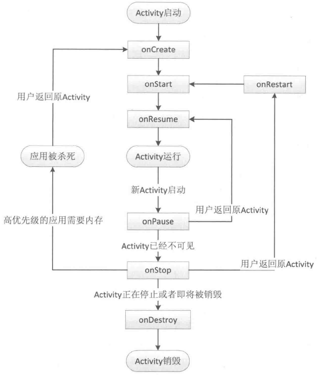
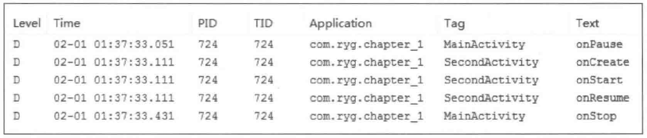
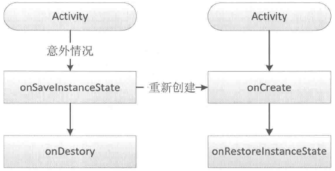
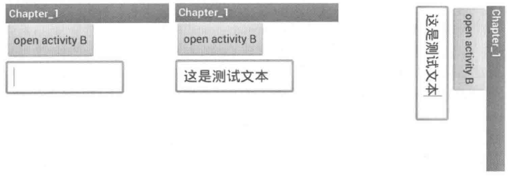
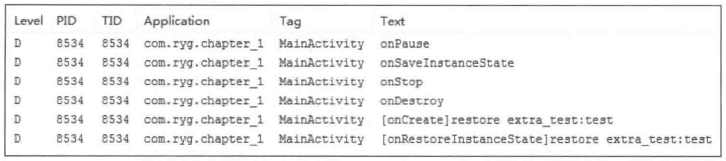
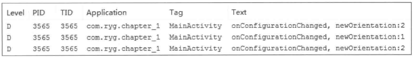
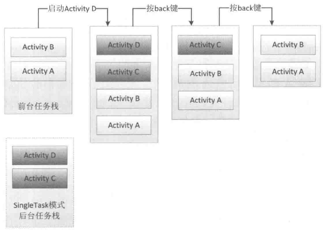
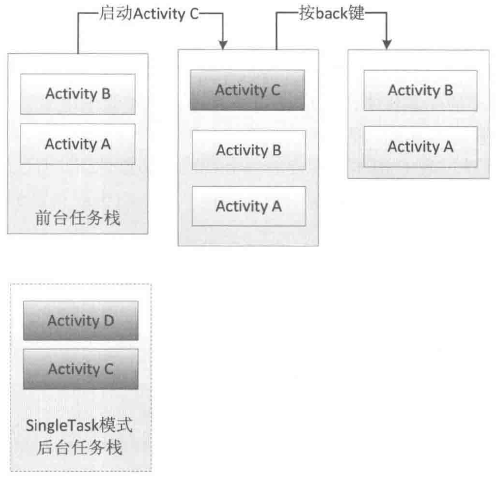
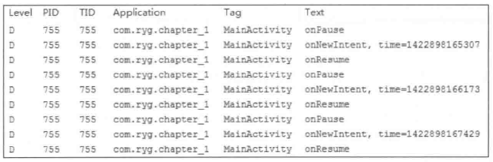
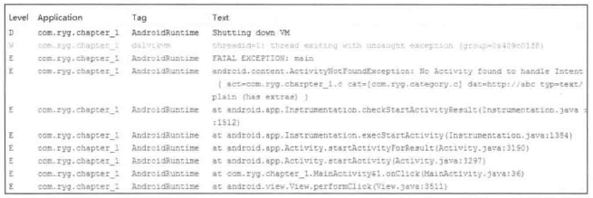

# 第1章 Activity的生命周期和启动模式

作为本书的第1章，本章主要介绍Activity相关的一些内容。Activity作为四大组件之首，是使用最为频繁的一种组件，中文直接翻译为“活动”，但是笔者认为这种翻译有些生硬，如果翻译成界面就会更好理解。正常情况下，除了Window、Dialog和Toast，我们能见到的界面的确只有Activity。Activity是如此重要，以至于本书开篇就不得不讲到它。当然，由于本书的定位为进阶书，所以不会介绍如何启动Activity这类入门知识，本章的侧重点是Activity在使用过程中的一些不容易搞清楚的概念，主要包括生命周期和启动模式以及IntentFilter的匹配规则分析。其中Activity在异常情况下的生命周期是十分微妙的，至于Activity的启动模式和形形色色的Flags更是让初学者摸不到头脑，就连隐式启动Activity中也有着复杂的Intent匹配过程，不过不用担心，本章接下来将一一解开这些疑难问题的神秘面纱。

## 1.1 Activity的生命周期全面分析

本节将Activity的生命周期分为两部分内容，一部分是典型情况下的生命周期，另一部分是异常情况下的生命周期。所谓典型情况下的生命周期，是指在有用户参与的情况下，Activity所经过的生命周期的改变；而异常情况下的生命周期是指Activity被系统回收或者由于当前设备的Configuration发生改变从而导致Activity被销毁重建，异常情况下的生命周期的关注点和典型情况下略有不同。

### 1.1.1 典型情况下的生命周期分析

在正常情况下，Activity会经历如下生命周期。

（1）onCreate：表示Activity正在被创建，这是生命周期的第一个方法。在这个方法中，我们可以做一些初始化工作，比如调用setContentView去加载界面布局资源、初始化Activity所需数据等。

（2）onRestart：表示Activity正在重新启动。一般情况下，当当前Activity从不可见重新变为可见状态时，onRestart就会被调用。这种情形一般是用户行为所导致的，比如用户按Home键切换到桌面或者用户打开了一个新的Activity，这时当前的Activity就会暂停，也就是onPause和onStop被执行了，接着用户又回到了这个Activity，就会出现这种情况。

（3）onStart：表示Activity正在被启动，即将开始，这时Activity已经可见了，但是还没有出现在前台，还无法和用户交互。这个时候其实可以理解为Activity已经显示出来了，但是我们还看不到。

（4）onResume：表示Activity已经可见了，并且出现在前台并开始活动。要注意这个和onStart的对比，onStart和onResume都表示Activity已经可见，但是onStart的时候Activity还在后台，onResume的时候Activity才显示到前台。

（5）onPause：表示Activity正在停止，正常情况下，紧接着onStop就会被调用。在特殊情况下，如果这个时候快速地再回到当前Activity，那么onResume会被调用。笔者的理解是，这种情况属于极端情况，用户操作很难重现这一场景。此时可以做一些存储数据、停止动画等工作，但是注意不能太耗时，因为这会影响到新Activity的显示，onPause必须先执行完，新Activity的onResume才会执行。

（6）onStop：表示Activity即将停止，可以做一些稍微重量级的回收工作，同样不能太耗时。

（7）onDestroy：表示Activity即将被销毁，这是Activity生命周期中的最后一个回调，在这里，我们可以做一些回收工作和最终的资源释放。

正常情况下，Activity的常用生命周期就只有上面7个，图1-1更详细地描述了Activity各种生命周期的切换过程。



图 1-1 Activity生命周期的切换过程

针对图1-1，这里再附加一下具体说明，分如下几种情况。

（1）针对一个特定的Activity，第一次启动，回调如下：onCreate->onStart->onResume。

（2）当用户打开新的Activity或者切换到桌面的时候，回调如下：onPause->onStop。这里有一种特殊情况，如果新Activity采用了透明主题，那么当前Activity不会回调onStop。

（3）当用户再次回到原Activity时，回调如下：onRestart->onStart->onResume。

（4）当用户按back键回退时，回调如下：onPause->onStop->onDestroy。

（5）当Activity被系统回收后再次打开，生命周期方法回调过程和（1）一样，注意只是生命周期方法一样，不代表所有过程都一样，这个问题在下一节会详细说明。

（6）从整个生命周期来说，onCreate和onDestroy是配对的，分别标识着Activity的创建和销毁，并且只可能有一次调用。从Activity是否可见来说，onStart和onStop是配对的，随着用户的操作或者设备屏幕的点亮和熄灭，这两个方法可能被调用多次；从Activity是否在前台来说，onResume和onPause是配对的，随着用户操作或者设备屏幕的点亮和熄灭，这两个方法可能被调用多次。

这里提出2个问题，不知道大家是否清楚。

问题1：onStart和onResume、onPause和onStop从描述上来看差不多，对我们来说有什么实质的不同呢？

问题2：假设当前Activity为A，如果这时用户打开一个新ActivityB，那么B的onResume和A的onPause哪个先执行呢？

先说第一个问题，从实际使用过程来说，onStart和onResume、onPause和onStop看起来的确差不多，甚至我们可以只保留其中一对，比如只保留onStart和onStop。既然如此，那为什么Android系统还要提供看起来重复的接口呢？根据上面的分析，我们知道，这两个配对的回调分别表示不同的意义，onStart和onStop是从Activity是否可见这个角度来回调的，而onResume和onPause是从Activity是否位于前台这个角度来回调的，除了这种区别，在实际使用中没有其他明显区别。

第二个问题可以从Android源码里得到解释。关于Activity的工作原理在本书后续章节会进行介绍，这里我们先大概了解即可。从Activity的启动过程来看，我们来看一下系统源码。Activity的启动过程的源码相当复杂，涉及Instrumentation、ActivityThread和ActivityManagerService（下面简称AMS）。这里不详细分析这一过程，简单理解，启动Activity的请求会由Instrumentation来处理，然后它通过Binder向AMS发请求，AMS内部维护着一个ActivityStack并负责栈内的Activity的状态同步，AMS通过ActivityThread去同步Activity的状态从而完成生命周期方法的调用。在ActivityStack中的resumeTopActivityInnerLocked方法中，有这么一段代码：

```
// We need to start pausing the current activity so the top one
// can be resumed...
boolean dontWaitForPause = (next.info.flags&ActivityInfo.FLAG_RESUME_WHILE_PAUSING) != 0;
boolean pausing = mStackSupervisor.pauseBackStacks(userLeaving, true,
dontWaitForPause);
if (mResumedActivity != null) {
    pausing |= startPausingLocked(userLeaving, false, true, dontWaitForPause);
    if (DEBUG_STATES) Slog.d(TAG, "resumeTopActivityLocked: Pausing " +
    mResumedActivity);
}
```

从上述代码可以看出，在新Activity启动之前，栈顶的Activity需要先onPause后，新Activity才能启动。最终，在ActivityStackSupervisor中的realStartActivityLocked方法会调用如下代码。

```
app.thread.scheduleLaunchActivity(new Intent(r.intent), r.appToken,
        System.identityHashCode(r), r.info, new Configuration(mService.
        mConfiguration),
        r.compat, r.task.voiceInteractor, app.repProcState, r.icicle,
        r.persistentState,
        results, newIntents, !andResume, mService.isNextTransitionForward(),
        profilerInfo);
```

我们知道，这个app.thread的类型是IApplicationThread，而IApplicationThread的具体实现是ActivityThread中的ApplicationThread。所以，这段代码实际上调到了ActivityThread的中，即ApplicationThread的scheduleLaunchActivity方法，而scheduleLaunchActivity方法最终会完成新Activity的onCreate、onStart、onResume的调用过程。因此，可以得出结论，是旧Activity先onPause，然后新Activity再启动。

至于ApplicationThread的scheduleLaunchActivity方法为什么会完成新Activity的onCreate、onStart、onResume的调用过程，请看下面的代码。scheduleLaunchActivity最终会调用如下方法，而如下方法的确会完成onCreate、onStart、onResume的调用过程。

源码：ActivityThread#handleLaunchActivity

```
private void handleLaunchActivity(ActivityClientRecord r, Intent customIntent) {
    // If we are getting ready to gc after going to the background, well
    // we are back active so skip it.
    unscheduleGcIdler();
    mSomeActivitiesChanged = true;

    if (r.profilerInfo != null) {
        mProfiler.setProfiler(r.profilerInfo);
        mProfiler.startProfiling();
    }

    // Make sure we are running with the most recent config.
    handleConfigurationChanged(null, null);

    if (localLOGV) Slog.v(
        TAG, "Handling launch of " + r);

    //这里新Activity被创建出来，其onCreate和onStart会被调用
Activity a = performLaunchActivity(r, customIntent);

    if (a != null) {
        r.createdConfig = new Configuration(mConfiguration);
        Bundle oldState = r.state;
        //这里新Activity的onResume会被调用
        handleResumeActivity(r.token, false, r.isForward,
                !r.activity.mFinished && !r.startsNotResumed);
    //省略
}
```

从上面的分析可以看出，当新启动一个Activity的时候，旧Activity的onPause会先执行，然后才会启动新的Activity。到底是不是这样呢？我们写个例子验证一下，如下是2个Activity的代码，在MainActivity中单击按钮可以跳转到SecondActivity，同时为了分析我们的问题，在生命周期方法中打印出了日志，通过日志我们就能看出它们的调用顺序。

代码：MainActivity.java

```
public class MainActivity extends Activity {

    private static final String TAG = "MainActivity";
    //省略
    @Override
    protected void onPause() {
        super.onPause();
        Log.d(TAG, "onPause");
    }

    @Override
    protected void onStop() {
        super.onStop();
       Log.d(TAG, "onStop");
    }
 }
```

代码：SecondActivity.java

```
public class SecondActivity extends Activity {
    private static final String TAG = "SecondActivity";

    @Override
    protected void onCreate(Bundle savedInstanceState) {
        super.onCreate(savedInstanceState) ;
        setContentView(R.layout.activity_second);
       Log.d(TAG, "onCreate");
    }

    @Override
    protected void onStart() {
        super.onStart();
       Log.d(TAG, "onStart");
    }

    @Override
    protected void onResume() {
        super.onResume();
       Log.d(TAG, "onResume");
    }
 }
```

我们来看一下log，是不是和我们上面分析的一样，如图1-2所示。



图 1-2 Activity生命周期方法的回调顺序

通过图1-2可以发现，旧Activity的onPause先调用，然后新Activity才启动，这也证实了我们上面的分析过程。也许有人会问，你只是分析了Android5.0的源码，你怎么知道所有版本的源码都是相同逻辑呢？关于这个问题，我们的确不大可能把所有版本的源码都分析一遍，但是作为Android运行过程的基本机制，随着版本的更新并不会有大的调整，因为Android系统也需要兼容性，不能说在不同版本上同一个运行机制有着截然不同的表现。关于这一点我们需要把握一个度，就是对于Android运行的基本机制在不同Android版本上具有延续性。从另一个角度来说，Android官方文档对onPause的解释有这么一句：不能在onPause中做重量级的操作，因为必须onPause执行完成以后新Activity才能Resume，从这一点也能间接证明我们的结论。通过分析这个问题，我们知道onPause和onStop都不能执行耗时的操作，尤其是onPause，这也意味着，我们应当尽量在onStop中做操作，从而使得新Activity尽快显示出来并切换到前台。

### 1.1.2 异常情况下的生命周期分析

上一节我们分析了典型情况下Activity的生命周期，本节我们接着分析Activity在异常情况下的生命周期。我们知道，Activity除了受用户操作所导致的正常的生命周期方法调度，还有一些异常情况，比如当资源相关的系统配置发生改变以及系统内存不足时，Activity就可能被杀死。下面我们具体分析这两种情况。

1.情况1：资源相关的系统配置发生改变导致Activity被杀死并重新创建

理解这个问题，我们首先要对系统的资源加载机制有一定了解，这里不详细分析系统的资源加载机制，只是简单说明一下。拿最简单的图片来说，当我们把一张图片放在drawable目录后，就可以通过Resources去获取这张图片。同时为了兼容不同的设备，我们可能还需要在其他一些目录放置不同的图片，比如drawable-mdpi、drawable-hdpi、drawable-land等。这样，当应用程序启动时，系统就会根据当前设备的情况去加载合适的Resources资源，比如说横屏手机和竖屏手机会拿到两张不同的图片（设定了landscape或者portrait状态下的图片）。比如说当前Activity处于竖屏状态，如果突然旋转屏幕，由于系统配置发生了改变，在默认情况下，Activity就会被销毁并且重新创建，当然我们也可以阻止系统重新创建我们的Activity。

在默认情况下，如果我们的Activity不做特殊处理，那么当系统配置发生改变后，Activity就会被销毁并重新创建，其生命周期如图1-3所示。



图 1-3 异常情况下Activity的重建过程

当系统配置发生改变后，Activity会被销毁，其onPause、onStop、onDestroy均会被调用，同时由于Activity是在异常情况下终止的，系统会调用onSaveInstanceState来保存当前Activity的状态。这个方法的调用时机是在onStop之前，它和onPause没有既定的时序关系，它既可能在onPause之前调用，也可能在onPause之后调用。需要强调的一点是，这个方法只会出现在Activity被异常终止的情况下，正常情况下系统不会回调这个方法。当Activity被重新创建后，系统会调用onRestoreInstanceState，并且把Activity销毁时onSaveInstanceState方法所保存的Bundle对象作为参数同时传递给onRestoreInstanceState和onCreate方法。因此，我们可以通过onRestoreInstanceState和onCreate方法来判断Activity是否被重建了，如果被重建了，那么我们就可以取出之前保存的数据并恢复，从时序上来说，onRestoreInstanceState的调用时机在onStart之后。

同时，我们要知道，在onSaveInstanceState和onRestoreInstanceState方法中，系统自动为我们做了一定的恢复工作。当Activity在异常情况下需要重新创建时，系统会默认为我们保存当前Activity的视图结构，并且在Activity重启后为我们恢复这些数据，比如文本框中用户输入的数据、ListView滚动的位置等，这些View相关的状态系统都能够默认为我们恢复。具体针对某一个特定的View系统能为我们恢复哪些数据，我们可以查看View的源码。和Activity一样，每个View都有onSaveInstanceState和onRestoreInstanceState这两个方法，看一下它们的具体实现，就能知道系统能够自动为每个View恢复哪些数据。

关于保存和恢复View层次结构，系统的工作流程是这样的：首先Activity被意外终止时，Activity会调用onSaveInstanceState去保存数据，然后Activity会委托Window去保存数据，接着Window再委托它上面的顶级容器去保存数据。顶层容器是一个ViewGroup，一般来说它很可能是DecorView。最后顶层容器再去一一通知它的子元素来保存数据，这样整个数据保存过程就完成了。可以发现，这是一种典型的委托思想，上层委托下层、父容器委托子元素去处理一件事情，这种思想在Android中有很多应用，比如View的绘制过程、事件分发等都是采用类似的思想。至于数据恢复过程也是类似的，这里就不再重复介绍了。接下来举个例子，拿TextView来说，我们分析一下它到底保存了哪些数据。

源码:TextView#onSaveInstanceState

```
 @Override
 public Parcelable onSaveInstanceState() {
     Parcelable superState = super.onSaveInstanceState();

     // Save state if we are forced to
     boolean save = mFreezesText;
     int start = 0;
     int end = 0;

     if(mText != null) {
         start = getSelectionStart();
         end = getSelectionEnd();
         if(start >= 0 || end >= 0) {
             // Or save state if there is a selection
             save = true;
         }
     }

     if(save) {
         SavedState ss = new SavedState(superState);
         // XXX Should also save the current scroll position!
         ss.selStart = start;
         ss.selEnd = end;

         if(mText instanceof Spanned) {
             Spannable sp = new SpannableStringBuilder(mText) ;

             if(mEditor != null) {
                 removeMisspelledSpans(sp) ;
                 sp.removeSpan(mEditor.mSuggestionRangeSpan) ;
             }

             ss.text = sp;
         } else {
             ss.text = mText.toString();
         }

         if(isFocused() && start >= 0 && end >= 0) {
             ss.frozenWithFocus = true;
         }

         ss.error = getError();

         return ss;
     }

    return superState;
 }
```

从上述源码可以很容易看出，TextView保存了自己的文本选中状态和文本内容，并且通过查看其onRestoreInstanceState方法的源码，可以发现它的确恢复了这些数据，具体源码就不再贴出了，读者可以去看看源码。下面我们看一个实际的例子，来对比一下Activity正常终止和异常终止的不同，同时验证系统的数据恢复能力。为了方便，我们选择旋转屏幕来异常终止Activity，如图1-4所示。



图 1-4 Activity旋转屏幕后数据的保存和恢复

通过图1-4可以看出，在我们选择屏幕以后，Activity被销毁后重新创建，我们输入的文本“这是测试文本”被正确地还原，这说明系统的确能够自动地做一些View层次结构方面的数据存储和恢复。下面再用一个例子，来验证我们自己做数据存储和恢复的情况，代码如下：

```
 @Override
 protected void onCreate(Bundle savedInstanceState) {
     super.onCreate(savedInstanceState) ;
     setContentView(R.layout.activity_main);
     if(savedInstanceState != null) {
         String test = savedInstanceState.getString("extra_test");
         Log.d(TAG, "[onCreate]restore extra_test:" + test);
     }
 }

 @Override
protected void onSaveInstanceState(Bundle outState) {
     super.onSaveInstanceState(outState) ;
     Log.d(TAG, "onSaveInstanceState");
     outState.putString("extra_test", "test");
 }

 @Override
protected void onRestoreInstanceState(Bundle savedInstanceState) {
     super.onRestoreInstanceState(savedInstanceState) ;
     String test = savedInstanceState.getString("extra_test");
     Log.d(TAG, "[onRestoreInstanceState]restore extra_test:" + test);
 }
```

上面的代码很简单，首先我们在onSaveInstanceState中存储一个字符串，然后当Activity被销毁并重新创建后，我们再去获取之前存储的字符串。接收的位置可以选择onRestoreInstanceState或者onCreate，二者的区别是：onRestoreInstanceState一旦被调用，其参数Bundle savedInstanceState一定是有值的，我们不用额外地判断是否为空；但是onCreate不行，onCreate如果是正常启动的话，其参数BundlesavedInstanceState为null，所以必须要额外判断。这两个方法我们选择任意一个都可以进行数据恢复，但是官方文档的建议是采用onRestoreInstanceState去恢复数据。下面我们看一下运行的日志，如图1-5所示。



图 1-5 系统日志

如图1-5所示，Activity被销毁了以后调用了onSaveInstanceState来保存数据，重新创建以后在onCreate和onRestoreInstanceState中都能够正确地恢复我们之前存储的字符串。这个例子很好地证明了上面我们的分析结论。针对onSaveInstanceState方法还有一点需要说明，那就是系统只会在Activity即将被销毁并且有机会重新显示的情况下才会去调用它。考虑这么一种情况，当Activity正常销毁的时候，系统不会调用onSaveInstanceState，因为被销毁的Activity不可能再次被显示。这句话不好理解，但是我们可以对比一下旋转屏幕所造成的Activity异常销毁，这个过程和正常停止Activity是不一样的，因为旋转屏幕后，Activity被销毁的同时会立刻创建新的Activity实例，这个时候Activity有机会再次立刻展示，所以系统要进行数据存储。这里可以简单地这么理解，系统只在Activity异常终止的时候才会调用onSaveInstanceState和onRestoreInstanceState来存储和恢复数据，其他情况不会触发这个过程。

2.情况2：资源内存不足导致低优先级的Activity被杀死

这种情况我们不好模拟，但是其数据存储和恢复过程和情况1完全一致。这里我们描述一下Activity的优先级情况。Activity按照优先级从高到低，可以分为如下三种：

（1）前台Activity一正在和用户交互的Activity，优先级最高。

（2）可见但非前台Activity一比如Activity中弹出了一个对话框，导致Activity可见但是位于后台无法和用户直接交互。

已经被暂停的Activity，比如执行了onStop，优先级最低。 （3）后台Activity

当系统内存不足时，系统就会按照上述优先级去杀死目标Activity所在的进程，并在后续通过onSaveInstanceState和onRestoreInstanceState来存储和恢复数数据。如果一个进程中没有四大组件在执行，那么这个进程将很快被系统杀死，因此，一些后台工作不适合脱离四大组件而独自运行在后台中，这样进程很容易被杀死。比较好的方法是将后台工作放入Service中从而保证进程有一定的优先级，这样就不会轻易地被系统杀死。

上面分析了系统的数据存储和恢复机制，我们知道，当系统配置发生改变后，Activity会被重新创建，那么有没有办法不重新创建呢？答案是有的，接下来我们就来分析这个问题。系统配置中有很多内容，如果当某项内容发生改变后，我们不想系统重新创建Activity，可以给Activity指定configChanges属性。比如不想让Activity在屏幕旋转的时候重新创建，就可以给configChanges属性添加orientation这个值，如下所示。

```
android:configChanges="orientation"
```

如果我们想指定多个值，可以用“|”连接起来，比如android:configChanges="orientation|keyboardHidden"。系统配置中所含的项目是非常多的，下面介绍每个项目的含义，如表1-1所示。

表 1-1 configChanges的项目和含义

| 项目 | 含义 |
| --- | --- |
| mcc | SIM卡唯一标识IMSI（国际移动用户识别码）中的国家代码，由三位数字组成，中国为460。此项标识mcc代码发生了改变 |
| mnc | SIM卡唯一标识IMSI（国际移动用户识别码）中的运营商代码，由两位数字组成，中国移动TD系统为00，中国联通为01，中国电信为03。此项标识mnc发生改变 |
| locale | 设备的本地位置发生了改变，一般指切换了系统语言 |
| touchscreen | 触摸屏发生了改变，这个很费解，正常情况下无法发生，可以忽略它 |
| keyboard | 键盘类型发生了改变，比如用户使用了外插键盘 |
| keyboardHidden | 键盘的可访问性发生了改变，比如用户调出了键盘 |
| navigation | 系统导航方式发生了改变，比如采用了轨迹球导航，这个有点费解，很难发生，可以忽略它 |
| screenLayout | 屏幕布局发生了改变，很可能是用户激活了另外一个显示设备 |
| fontScale | 系统字体缩放比例发生了改变，比如用户选择了一个新字号 |
| uiMode | 用户界面模式发生了改变，比如是否开启了夜间模式（API 8新添加） |
| orientation | 屏幕方向发生了改变，这个是最常用的，比如旋转了手机屏幕 |
| screenSize | 当屏幕的尺寸信息发生了改变，当旋转设备屏幕时，屏幕尺寸会发生变化，这个选项比较特殊，它和编译选项有关，当编译选项中的minSdkVersion和targetSdkVersion均低于13时，此选项不会导致Activity重启，否则会导致Activity重启（API 13新添加） |
| smallestScreenSize | 设备的物理屏幕尺寸发生改变，这个项目和屏幕的方向没关系，仅仅表示在实际的物理屏幕的尺寸改变的时候发生，比如用户切换到了外部的显示设备，这个选项和screenSize一样，当编译选项中的minSdkVersion和targetSdkVersion均低于13时，此选项不会导致Activity重启，否则会导致Activity重启（API 13新添加） |
| layoutDirection | 当布局方向发生变化，这个属性用的比较少，正常情况下无须修改布局的layoutDirection属性（API 17新添加） |

从表1-1可以知道，如果我们没有在Activity的configChanges属性中指定该选项的话，当配置发生改变后就会导致Activity重新创建。上面表格中的项目很多，但是我们常用的只有locale、orientation和keyboardHidden这三个选项，其他很少使用。需要注意的是screenSize和smallestScreenSize，它们两个比较特殊，它们的行为和编译选项有关，但和运行环境无关。下面我们再看一个demo，看看当我们指定了configChanges属性后，Activity是否真的不会重新创建了。我们所要修改的代码很简单，只需要在AndroidMenifest.xml中加入Activity的声明即可，代码如下：

```
<uses-sdk
    android:minSdkVersion="8"
    android:targetSdkVersion="19" />
<activity
    android:name="com.ryg.chapter_1.MainActivity"
    android:configChanges="orientation|screenSize"
    android:label="@string/app_name" >
    <intent-filter>
         <action android:name="android.intent.action.MAIN" />
         <category android:name="android.intent.category.LAUNCHER" />
     </intent-filter>
</activity>

 @Override
public void onConfigurationChanged(Configuration newConfig) {
     super.onConfigurationChanged(newConfig) ;
     Log.d(TAG, "onConfigurationChanged, newOrientation:" + newConfig.
     orientation) ;
 }
```

需要说明的是，由于编译时笔者指定的minSdkVersion和targetSdkVersion有一个大于13，所以为了防止旋转屏幕时Activity重启，除了orientation，我们还要加上screenSize，原因在上面的表格里已经说明了。其他代码还是不变，运行后看看log，如图1-6所示。



图 1-6 系统日志

由上面的日志可见，Activity的确没有重新创建，并且也没有调用onSaveInstanceState和onRestoreInstanceState来存储和恢复数据，取而代之的是系统调用了Activity的onConfigurationChanged方法，这个时候我们就可以做一些自己的特殊处理了。

## 1.2 Activity的启动模式

上一节介绍了Activity在标准情况下和异常情况下的生命周期，我们对Activity的生命周期应该有了深入的了解。除了Activity的生命周期外，Activity的启动模式也是一个难点，原因是形形色色的启动模式和标志位实在是太容易被混淆了，但是Activity作为四大组件之首，它的的确确非常重要，有时候为了满足项目的特殊需求，就必须使用Activity的启动模式，所以我们必须要搞清楚它的启动模式和标志位，本节将会一一介绍。

### 1.2.1 Activity的LaunchMode

首先说一下Activity为什么需要启动模式。我们知道，在默认情况下，当我们多次启动同一个Activity的时候，系统会创建多个实例并把它们一一放入任务栈中，当我们单击back键，会发现这些Activity会一一回退。任务栈是一种“后进先出”的栈结构，这个比较好理解，每按一下back键就会有一个Activity出栈，直到栈空为止，当栈中无任何Activity的时候，系统就会回收这个任务栈。关于任务栈的系统工作原理，这里暂时不做说明，在后续章节会专门介绍任务栈。知道了Activity的默认启动模式以后，我们可能就会发现一个问题：多次启动同一个Activity，系统重复创建多个实例，这样不是很傻吗？这样的确有点傻，Android在设计的时候不可能不考虑到这个问题，所以它提供了启动模式来修改系统的默认行为。目前有四种启动模式：standard、singleTop、singleTask 和singleInstance，下面先介绍各种启动模式的含义：

（1）standard：标准模式，这也是系统的默认模式。每次启动一个Activity都会重新创建一个新的实例，不管这个实例是否已经存在。被创建的实例的生命周期符合典型情况下Activity的生命周期，如上节描述，它的onCreate、onStart、onResume 都会被调用。这是一种典型的多实例实现，一个任务栈中可以有多个实例，每个实例也可以属于不同的任务栈。在这种模式下，谁启动了这个Activity，那么这个Activity就运行在启动它的那个Activity所在的栈中。比如ActivityA启动了ActivityB（B是标准模式），那么B就会进入到A所在的栈中。不知道读者是否注意到，当我们用ApplicationContext去启动standard模式的Activity的时候会报错，错误如下：

```
E/AndroidRuntime(674) : android.util.AndroidRuntimeException: Calling
 startActivity from outside of an Activity context requires the FLAG_ACTIVITY_NEW_TASK flag. Is this really what you want?
```

相信这句话读者一定不陌生，这是因为standard模式的Activity默认会进入启动它的Activity所属的任务栈中，但是由于非Activity类型的Context（如ApplicationContext）并没有所谓的任务栈，所以这就有问题了。解决这个问题的方法是为待启动Activity指定FLAG_ACTIVITY_NEW_TASK标记位，这样启动的时候就会为它创建一个新的任务栈，这个时候待启动Activity实际上是以singleTask模式启动的，读者可以仔细体会。

（2）singleTop：栈顶复用模式。在这种模式下，如果新Activity已经位于任务栈的栈顶，那么此Activity不会被重新创建，同时它的onNewIntent方法会被回调，通过此方法的参数我们可以取出当前请求的信息。需要注意的是，这个Activity的onCreate、onStart不会被系统调用，因为它并没有发生改变。如果新Activity的实例已存在但不是位于栈顶，那么新Activity仍然会重新重建。举个例子，假设目前栈内的情况为ABCD，其中ABCD为四个Activity，A位于栈底，D位于栈顶，这个时候假设要再次启动D，如果D的启动模式为singleTop，那么栈内的情况仍然为ABCD；如果D的启动模式为standard，那么由于D被重新创建，导致栈内的情况就变为ABCDD。

（3）singleTask：栈内复用模式。这是一种单实例模式，在这种模式下，只要Activity在一个栈中存在，那么多次启动此Activity都不会重新创建实例，和singleTop一样，系统也会回调其onNewIntent。具体一点，当一个具有singleTask模式的Activity请求启动后，比如ActivityA，系统首先会寻找是否存在A想要的任务栈，如果不存在，就重新创建一个任务栈，然后创建A的实例后把A放到栈中。如果存在A所需的任务栈，这时要看A是否在栈中有实例存在，如果有实例存在，那么系统就会把A调到栈顶并调用它的onNewIntent方法，如果实例不存在，就创建A的实例并把A压入栈中。举几个例子：

比如目前任务栈S1中的情况为ABC，这个时候Activity D以singleTask模式请求

启动，其所需要的任务栈为S2，由于S2和D的实例均不存在，所以系统会先创建

任务栈S2，然后再创建D的实例并将其入栈到S2。

）另外一种情况，假设D所需的任务栈为S1，其他情况如上面例子1所示，那么由

于S1已经存在，所以系统会直接创建D的实例并将其入栈到S1。

如果D所需的任务栈为S1，并且当前任务栈S1的情况为ADBC，根据栈内复用的

原则，此时D不会重新创建，系统会把D切换到栈顶并调用其onNewIntent方法，

同时由于singleTask默认具有clearTop的效果，会导致栈内所有在D上面的Activity

全部出栈，于是最终S1中的情况为AD。这一点比较特殊，在后面还会对此种情况

详细地分析。

通过上述3个例子，读者应该能比较清晰地理解singleTask的含义了。

（4）singleInstance：单实例模式。这是一种加强的singleTask模式，它除了具有singleTask模式的所有特性外，还加强了一点，那就是具有此种模式的Activity只能单独地位于一个任务栈中，换句话说，比如ActivityA是singleInstance模式，当A启动后，系统会为它创建一个新的任务栈，然后A独自在这个新的任务栈中，由于栈内复用的特性，后续的请求均不会创建新的Activity，除非这个独特的任务栈被系统销毁了。

上面介绍了几种启动模式，这里需要指出一种情况，我们假设目前有2个任务栈，前台任务栈的情况为AB，而后台任务栈的情况为CD，这里假设CD的启动模式均为singleTask。现在请求启动D，那么整个后台任务栈都会被切换到前台，这个时候整个后退列表变成了ABCD。当用户按back键的时候，列表中的Activity会一一出栈，如图1-7所示。如果不是请求启动D而是启动C，那么情况就不一样了，请看图1-8，具体原因在本节后面会再进行详细分析。



图 1-7 任务栈示例1



图 1-8 任务栈示例2

另外一个问题是，在singleTask启动模式中，多次提到某个Activity所需的任务栈，什么是Activity所需要的任务栈呢？这要从一个参数说起：TaskAffinity，可以翻译为任务相关性。这个参数标识了一个Activity所需要的任务栈的名字，默认情况下，所有Activity所需的任务栈的名字为应用的包名。当然，我们可以为每个Activity都单独指定TaskAffinity属性，这个属性值必须不能和包名相同，否则就相当于没有指定。TaskAffinity属性主要和singleTask启动模式或者allowTaskReparenting属性配对使用，在其他情况下没有意义。另外，任务栈分为前台任务栈和后台任务栈，后台任务栈中的Activity位于暂停状态，用户可以通过切换将后台任务栈再次调到前台。

当TaskAffinity和singleTask启动模式配对使用的时候，它是具有该模式的Activity的目前任务栈的名字，待启动的Activity会运行在名字和TaskAffinity相同的任务栈中。

当TaskAffinity和allowTaskReparenting结合的时候，这种情况比较复杂，会产生特殊的效果。当一个应用A启动了应用B的某个Activity后，如果这个Activity的allowTaskReparenting属性为true的话，那么当应用B被启动后，此Activity会直接从应用A的任务栈转移到应用B的任务栈中。这还是很抽象，再具体点，比如现在有2个应用A和B，A启动了B的一个ActivityC，然后按Home键回到桌面，然后再单击B的桌面图标，这个时候并不是启动了B的主Activity，而是重新显示了已经被应用A启动的ActivityC，或者说，C从A的任务栈转移到了B的任务栈中。可以这么理解，由于A启动了C，这个时候C只能运行在A的任务栈中，但是C属于B应用，正常情况下，它的TaskAffinity值肯定不可能和A的任务栈相同（因为包名不同）。所以，当B被启动后，B会创建自己的任务栈，这个时候系统发现C原本所想要的任务栈已经被创建了，所以就把C从A的任务栈中转移过来了。这种情况读者可以写个例子测试一下，这里就不做示例了。

如何给Activity指定启动模式呢？有两种方法，第一种是通过AndroidMenifest为Activity指定启动模式，如下所示。

```
 <activity
     android:name="com.ryg.chapter_1.SecondActivity"
     android:configChanges="screenLayout"
     android:launchMode="singleTask"
     android:label="@string/app_name" />
```

另一种情况是通过在Intent中设置标志位来为Activity指定启动模式，比如：

```
 Intent intent = new Intent();
 intent.setClass(MainActivity.this, SecondActivity.class);
 intent.addFlags(Intent .FLAG_ACTIVITY_NEW_TASK) ;
 startActivity(intent);
```

这两种方式都可以为Activity指定启动模式，但是二者还是有区别的。首先，优先级上，第二种方式的优先级要高于第一种，当两种同时存在时，以第二种方式为准；其次，上述两种方式在限定范围上有所不同，比如，第一种方式无法直接为Activity设定FLAG_ACTIVITY_CLEAR_TOP标识，而第二种方式无法为Activity指定singleInstance模式。

关于Intent中为Activity指定的各种标记位，在下面的小节中会继续介绍。下面通过一个例子来体验启动模式的使用效果。还是前面的例子，这里我们把MainActivity的启动模式设为singleTask，然后重复启动它，看看是否会重复创建，代码修改如下：

```
 <activity
     android:name="com.ryg.chapter_1.MainActivity"
     android:configChanges="orientation|screenSize"
     android:label="@string/app_name"
     android:launchMode="singleTask" >
     <intent-filter>
         <action android:name="android.intent.action.MAIN" />

         <category android:name="android.intent.category.LAUNCHER" />
     </intent-filter>
 </activity>

 @Override
protected void onNewIntent(Intent intent) {
     super.onNewIntent(intent) ;
    Log.d(TAG, "onNewIntent, time=" + intent.getLongExtra("time", 0));
 }

 findViewById(R.id.button1).setOnClickListener(new OnClickListener() {

    @Override
    public void onClick(View v) {
         Intent intent = new Intent();
         intent.setClass(MainActivity.this, MainActivity.class);
intent.putExtra("time", System.currentTimeMillis());
        startActivity(intent);
     }
 });
```

根据上述修改，我们做如下操作，连续单击三次按钮启动3次MainActivity，算上原本的MainActvity的实例，正常情况下，任务栈中应该有4个MainActivity的实例，但是我们为其指定了singleTask模式，现在来看一看到底有何不同。

执行adbshell dumpsys activity命令：

```
ACTIVITY MANAGER ACTIVITIES(dumpsys activity activities)
  Main stack;
    TaskRecord{41350dc8 #9 A com.ryg.chapter_1}
    Intent { cmp=com.ryg.chapter_1/.MainActivity(has extras) }
      Hist #1: ActivityRecord{412cc188 com.ryg.chapter_1/.MainActivity}
       Intent { act=android.intent.action.MAIN cat=[android.intent.
       category.LAUNCHER] flg=0x
 0 cmp=com.ryg.chapter_1/.MainActivity bnds=[160,235] [240,335] }
       ProcessRecord{411e6898 634:com.ryg.chapter_1/10052}
    TaskRecord{4125abc8 #2 A com.android.launcher}
    Intent { act=android.intent.action.MAIN cat=[android.intent.category.
    HOME] flg=0x10000000
m.android.launcher/com.android.launcher2.Launcher }
      Hist #0: ActivityRecord{412381f8 com.android.launcher/com.android.
      launcher2.Launcher}
        Intent { act=android.intent.action.MAIN cat=[android.intent.
        category.HOME] flg=0x1000
p=com.android.launcher/com.android.launcher2.Launcher }
        ProcessRecord{411d24c8 214:com.android.launcher/10013}

  Running activities(most recent first);
    TaskRecord{41350dc8 #9 A com.ryg.chapter_1}
      Run #1: ActivityRecord{412cc188 com.ryg.chapter_1/.MainActivity}
    TaskRecord{4125abc8 #2 A com.android.launcher}
      Run #0: ActivityRecord{412381f8 com.android.launcher/com.android.
      launcher2.Launcher}

  mResumedActivity: ActivityRecord{412cc188 com.ryg.chapter_1/.MainActivity])
  mFocusedActivity: ActivityRecord{412cc188 com.ryg.chapter_1/.MainActivity}

  Recent tasks;
  * Recent #0: TaskRecord{41350dc8 #9 A com.ryg.chapter_1}
  * Recent #1: TaskRecord{4125abc8 #2 A com.android.launcher}
  * Recent #2: TaskRecord{412b60a0 #5 A com.estrongs.android.pop.app.
    InstallMonitorActivity}
```

从上面导出的Activity信息可以看出，尽管启动了4次MainActivity，但是它始终只有一个实例在任务栈中.从图1-9的log可以看出，Activity的确没有重新创建，只是暂停了一下，然后调用了onNewIntent，接着调用onResume就又继续了。



图 1-9 系统日志

现在我们去掉singleTask，再来对比一下，还是同样的操作，单击三次按钮启动MainActivity三次。

执行adb shell dumpsys activity命令：

```
 ACTIVITY MANAGER ACTIVITIES(dumpsys activity activities)
  Main stack;
    TaskRecord{41325370 #17 A com.ryg.chapter_1}
    Intent { act=android.intent.action.MAIN cat=[android.intent.category.
    LAUNCHER] flg=0x100000
 p=com.ryg.chapter_1/.MainActivity }
 : Hist #4: ActivityRecord{41236968 com.ryg.chapter_1/.MainActivity}
        Intent { cmp=com,ryg.chapter_1/.MainActivity(has extras) }
        ProcessRecord{411e6898 803:com.ryg.chapter_1/10052}
      Hist #3: ActivityRecord{411f4b30 com.ryg.chapter_1/.MainActivity}
        Intent { cmp=com.ryg.chapter_1/.MainActivity(has extras) }
        ProcessRecord{411e6898 803:com.ryg.chapter_1/10052}
      Hist #2: ActivityRecord{411edcb8 com.ryg.chapter_1/.MainActivity}
        Intent { cmp=com.ryg.chapter_1/.MainActivity(has extras) }
        ProcessRecord{411e6898 803:com.ryg.chapter_1/10052}
      Hist #1: ActivityRecord{411e7588 com.ryg.chapter_1/.MainActivity}
        Intent { act=android.intent.action.MAIN cat=[android.intent.category.
        LAUNCHER] flg=0x10
 0 cmp=com.ryg.chapter_1/.MainActivity }
        ProcessRecord{411e6898 803:com.ryg.chapter_1/10052}
    TaskRecord{4125abc8 #2 A com.android.launcher}
    Intent { act=android.intent.action.MAIN cat=[android.intent.category.
    HOME] flg=0x10000000 c
m.android.launcher/com.android.launcher2.Launcher }
      Hist #0: ActivityRecord{412381f8 com.android.launcher/com.android.
      launcher2.Launcher}
        Intent { act=android.intent.action.MAIN cat=[android.intent.category.HOME] flg=0x100000
p=com.android.launcher/com.android.launcher2.Launcher }
        ProcessRecord{411d24c8 214:com.android.launcher/10013}

  Running activities(most recent first);
    TaskRecord{41325370 #17 A com.ryg.chapter_1}
      Run #4: ActivityRecord{41236968 com.ryg.chapter_1/.MainActivity)
      Run #3: ActivityRecord{411f4b30 com.ryg.chapter_1/.MainActivity}
      Run #2: ActivityRecord{411edcb8 com.ryg.chapter_1/.MainActivity}
      Run #1: ActivityRecord{411e7588 com.ryg.chapter_1/.MainActivity}
    TaskRecord{4125abc8 #2 A com.android.launcher}
      Run #0: ActivityRecord{412381f8 com.android.launcher/com.android.
      launcher2.Launcher}

  mResumedActivity: ActivityRecord{41236968 com.ryg.chapter_1/.MainActivity}
  mFocusedActivity: ActivityRecord{41236968 com.ryg.chapter_1/.MainActivity}

  Recent tasks;
  * Recent #0: TaskRecord{41325370 #17 A com.ryg.chapter_1}
  * Recent #1: TaskRecord{4125abc8 #2 A com.android.launcher}
  * Recent #2: TaskRecord{412c8d58 #16 A com.estrongs.android.pop.app.
    InstallMonitorActivity}
```

上面的导出信息很多，我们可以有选择地看，比如就看Runningactivities（mostrecent first)这一块，如下所示。

```
  Running activities(most recent first);
    TaskRecord{41325370 #17 A com.ryg.chapter_1}
      Run #4: ActivityRecord{41236968 com.ryg.chapter_1/.MainActivity}
      Run #3: ActivityRecord{411f4b30 com.ryg.chapter_1/.MainActivity}
      Run #2: ActivityRecord{411edcb8 com.ryg.chapter_1/.MainActivity}
      Run #1: ActivityRecord{411e7588 com.ryg.chapter_1/.MainActivity}
    TaskRecord{4125abc8 #2 A com.android.launcher}
      Run #0: ActivityRecord{412381f8 com.android.launcher/com.android.
      launcher2.Launcher}
```

我们能够得出目前总共有2个任务栈，前台任务栈的taskAffinity值为com.ryg.chapter_1，它里面有4个Activity，后台任务栈的taskAffinity值为com.android.launcher，它里面有1个Activity，这个Activity就是桌面。通过这种方式来分析任务栈信息就清晰多了。

从上面的导出信息中可以看到，在任务栈中有4个MainActivity，这也就验证了Activity的启动模式的工作方式。

上述四种启动模式，standard和singleTop都比较好理解，singleInstance由于其特殊性也好理解，但是关于singleTask有一种情况需要再说明一下。如图1-7所示，如果在Activity B中请求的不是D而是C，那么情况如何呢？这里可以告诉读者的是，任务栈列表变成了ABC，是不是很奇怪呢？ActivityD被直接出栈了。下面我们再用实例验证看看是不是这样。首先，还是使用上面的代码，但是我们做一下修改：

```
 <activity
     android:name="com.ryg.chapter_1.MainActivity"
     android:configChanges="orientation|screenSize" .
     android:label="@string/app_name"
     android:launchMode="standard" >
     <intent-filter>
         <action android:name="android.intent.action.MAIN" />
         <category android:name="android.intent.category.LAUNCHER" />
     </intent-filter>
 </activity>
 <activity
     android:name="com.ryg.chapter_1.SecondActivity"
     android:configChanges="screenLayout"
     android:label="@string/app_name"
     android:taskAffinity="com.ryg.task1"
     android:launchMode="singleTask" />

 <activity
     android:name="com.ryg.chapter_1.ThirdActivity"
     android:configChanges="screenLayout"
     android:taskAffinity="com.ryg.task1"
     android:label="@string/app_name"
     android:launchMode="singleTask" />
```

我们将SecondActivity和ThirdActivity都设成singleTask并指定它们的taskAffinity属性为“com.ryg.task1”，注意这个taskAffinity属性的值为字符串，且中间必须含有包名分隔符“.”。然后做如下操作，在MainActivity中单击按钮启动SecondActivity，在SecondActivity中单击按钮启动ThirdActivity，在ThirdActivity中单击按钮又启动MainActivity，最后再在MainActivity中单击按钮启动SecondActivity，现在按back键，然后看到的是哪个Activity？答案是回到桌面。是不是有点摸不到头脑了？没关系，接下来我们分析这个问题。

首先，从理论上分析这个问题，先假设MainActivity为A，SecondActivity为B，ThirdActivity为C。我们知道A为standard模式，按照规定，A的taskAffinity值继承自Application的taskAffinity，而Application默认taskAffinity为包名，所以A的 taskAffinity为包名。由于我们在XML中为B和C指定了taskAffinity和启动模式，所以B和C是singleTask模式且有相同的taskAffinity值“com.ryg.task1”。A启动B的时候，按照singleTask的规则，这个时候需要为B重新创建一个任务栈“com.ryg.task1”。B再启动C，按照singleTask的规则，由于C所需的任务栈（和B为同一任务栈）已经被B创建，所以无须再创建新的任务栈，这个时候系统只是创建C的实例后将C入栈了。接着C再启动A，A是standard模式，所以系统会为它创建一个新的实例并将到加到启动它的那个Activity的任务栈，由于是C启动了A，所以A会进入C的任务栈中并位于栈顶。这个时候已经有两个任务栈了，一个是名字为包名的任务栈，里面只有A，另一个是名字为“com.ryg.task1”的任务栈，里面的Activity为BCA。接下来，A再启动B，由于B是singleTask，B需要回到任务栈的栈顶，由于栈的工作模式为“后进先出”，B想要回到栈顶，只能是CA出栈。所以，到这里就很好理解了，如果再按back键，B就出栈了，B所在的任务栈已经不存在了，这个时候只能是回到后台任务栈并把A显示出来。注意这个A是后台任务栈的A，不是“com.ryg.task1”任务栈的A，接着再继续back，就回到桌面了。分析到这里，我们得出一条结论，singleTask模式的Activity切换到栈顶会导致在它之上的栈内的Activity出栈。

接着我们在实践中再次验证这个问题，还是采用dumpsys命令。我们省略中间的过程，直接看C启动A的那个状态，执行adb shell dumpsys activity命令，日志如下：

```
 Running activities(most recent first);
 TaskRecord{4132bd90 #12 A com.ryg.task1}
  Run #4: ActivityRecord{4133fd18 com.ryg.chapter_1/.MainActivity}
  Run #3: ActivityRecord{41349c58 com.ryg.chapter_1/.ThirdActivity}
  Run #2: ActivityRecord{4132bab0 com.ryg.chapter_1/.SecondActivity}
 TaskRecord{4125a008 #11 A com.ryg.chapter_1}
  Run #1: ActivityRecord{41328c60 com.ryg.chapter_1/.MainActivity}
 TaskRecord{41256440 #2 A com.android.launcher}
  Run #0: ActivityRecord{41231d30 com.android.launcher/com.android.launch
  er2.Launcher}
```

可以清楚地看到有2个任务栈，第一个（com.ryg.chapter_1)只有A，第二个（com.ryg.task1）有BCA，就如同我们上面分析的那样，然后再从A中启动B，再看一下日志：

```
 Running activities(most recent first);
 TaskRecord{4132bd90 #12 A com.ryg.task1}
  Run #2: ActivityRecord{4132bab0 com.ryg.chapter_1/.SecondActivity}
 TaskRecord{4125a008 #11 A com.ryg.chapter_1}
  Run #1: ActivityRecord{41328c60 com.ryg.chapter_1/.MainActivity}
 TaskRecord{41256440 #2 A com.android.launcher}
  Run #0: ActivityRecord{41231d30 com.android.launcher/com.android. launch
  er2.Launcher}
```

可以发现在任务栈com.ryg.task1中只剩下B了，C、A都已经出栈了，这个时候再按back键，任务栈com.ryg.chapter_1中的A就显示出来了，如果再back就回到桌面了。分析到这里，相信读者对Activity的启动模式已经有很深入的理解了。下面介绍Activity中常用的标志位。

### 1.2.2 Activity的Flags

Activity的Flags有很多，这里主要分析一些比较常用的标记位。标记位的作用很多，有的标记位可以设定Activity的启动模式，比如FLAG_ACTIVITY_NEW_TASK和FLAG_ACTIVITY_SINGLE_TOP等；还有的标记位可以影响Activity的运行状态，比如FLAG_ACTIVITY_CLEAR_TOP和FLAG_ACTIVITY_EXCLUDE_FROM_RECENTS等。下面主要介绍几个比较常用的标记位，剩下的标记位读者可以查看官方文档去了解，大部分情况下，我们不需要为Activity指定标记位，因此，对于标记位理解即可。在使用标记位的时候，要注意有些标记位是系统内部使用的，应用程序不需要去手动设置这些标记位以防出现问题。

FLAG_ACTIVITY_NEW_TASK

这个标记位的作用是为Activity指定“singleTask”启动模式，其效果和在XML中指定该启动模式相同。

FLAG_ACTIVITY_SINGLE_TOP

这个标记位的作用是为Activity指定“singleTop”启动模式，其效果和在XML中指定该启动模式相同。

FLAG_ACTIVITY_CLEAR_TOP

具有此标记位的Activity，当它启动时，在同一个任务栈中所有位于它上面的Activity都要出栈。这个模式一般需要和FLAG_ACTIVITY_NEW_TASK配合使用，在这种情况下，被启动Activity的实例如果已经存在，那么系统就会调用它的onNewIntent。如果被启动的Activity采用standard模式启动，那么它连同它之上的Activity都要出栈，系统会创建新的Activity实例并放入栈顶。通过1.2.1节中的分析可以知道，singleTask启动模式默认就具有此标记位的效果。

FLAG_ACTIVITY_EXCLUDE_FROM_RECENTS

具有这个标记的Activity不会出现在历史Activity的列表中，当某些情况下我们不希望用户通过历史列表回到我们的Activity的时候这个标记比较有用。它等同于在XML中指定Activity的属性android:excludeFromRecents="true"。

## 1.3 IntentFilter的匹配规则

我们知道，启动Activity分为两种，显式调用和隐式调用。二者的区别这里就不多说了，显式调用需要明确地指定被启动对象的组件信息，包括包名和类名，而隐式调用则不需要明确指定组件信息。原则上一个Intent不应该既是显式调用又是隐式调用，如果二者共存的话以显式调用为主。显式调用很简单，这里主要介绍一下隐式调用。隐式调用需要Intent能够匹配目标组件的IntentFilter中所设置的过滤信息，如果不匹配将无法启动目标Activity。IntentFilter中的过滤信息有action、category、data，下面是一个过滤规则的示例：

```
<activity
    android:name="com.ryg.chapter_1.ThirdActivity"
    android:configChanges="screenLayout"
    android:label="@string/app_name"
    android:launchMode="singleTask"
    android:taskAffinity="com.ryg.task1" >
    <intent-filter >
        <action android:name="com.ryg.charpter_1.c"/>
        <action android:name="com.ryg.charpter_1.d"/>
        <category android:name="com.ryg.category.c"/>
        <category android:name="com.ryg.category.d"/>
        <category android:name="android.intent.category.DEFAULT"/>
        <data android:mimeType="text/plain"/>
    </intent-filter>
</activity>
```

为了匹配过滤列表，需要同时匹配过滤列表中的 action、category、data信息，否则匹配失败。一个过滤列表中的 action、category和 data可以有多个，所有的 action、category、data分别构成不同类别，同一类别的信息共同约束当前类别的匹配过程。只有一个Intent同时匹配action类别、category类别、data类别才算完全匹配，只有完全匹配才能成功启动目标Activity。另外一点，一个Activity中可以有多个intent-filter，一个Intent只要能匹配任何一组intent-filter即可成功启动对应的Activity，如下所示。

```
<activity android:name="ShareActivity">
    <!-- This activity handles "SEND" actions with text data -->
    <intent-filter>
        <action android:name="android.intent.action.SEND"/>
        <category android:name="android.intent.category.DEFAULT"/>
        <data android:mimeType="text/plain"/>
    </intent-filter>
    <!-- This activity also handles "SEND" and "SEND_MULTIPLE" with media
    data -->
    <intent-filter>
        <action android:name="android.intent.action.SEND"/>
        <action android:name="android.intent.action.SEND_MULTIPLE"/>
        <category android:name="android.intent.category.DEFAULT"/>
        <data android:mimeType="application/vnd.google.panorama360+jpg"/>
        <data android:mimeType="image/*"/>
        <data android:mimeType="video/*"/>
    </intent-filter>
</activity>
```

下面详细分析各种属性的匹配规则。

1.action的匹配规则

action是一个字符串，系统预定义了一些action，同时我们也可以在应用中定义自己的action。action的匹配规则是Intent中的action必须能够和过滤规则中的action匹配，这里说的匹配是指action的字符串值完全一样。一个过滤规则中可以有多个action，那么只要Intent中的action能够和过滤规则中的任何一个action相同即可匹配成功。针对上面的过滤规则，只要我们的Intent中action值为“com.ryg.charpter_1.c”或者“com.ryg.charpter_1.d”都能成功匹配。需要注意的是，Intent中如果没有指定action，那么匹配失败。总结一下，action的匹配要求Intent中的action存在且必须和过滤规则中的其中一个action相同，这里需要注意它和category匹配规则的不同。另外，action区分大小写，大小写不同字符串相同的action会匹配失败。

2.category的匹配规则

category是一个字符串，系统预定义了一些category，同时我们也可以在应用中定义自已的category。category的匹配规则和action不同，它要求Intent 中如果含有category，那么所有的category都必须和过滤规则中的其中一个category相同。换句话说，Intent中如果出现了category，不管有几个category，对于每个category来说，它必须是过滤规则中已经定义了的category。当然，Intent中可以没有category，如果没有category的话，按照上面的描述，这个Intent仍然可以匹配成功。这里要注意下它和action匹配过程的不同，action是要求Intent中必须有一个action且必须能够和过滤规则中的某个action相同，而category要求Intent可以没有category，但是如果你一旦有category，不管有几个，每个都要能够和过滤规则中的任何一个category相同。为了匹配前面的过滤规则中的category，我们可以写出下面的 Intent,intent.addcategory("com.ryg.category.c")或者 Intent. addcategory("com.ryg.category.d"亦或者不设置category。为什么不设置category也可以匹配呢？原因是系统在调用startActivity或者startActivityForResult 的时候会默认为Intent加上“android.intent.category.DEFAULT”这个category，所以这个category就可以匹配前面的过滤规则中的第三个category。同时，为了我们的activity能够接收隐式调用，就必须在intent-filter中指定“android.intent.category.DEFAULT”这个category，原因刚才已经说明了。

3.data的匹配规则

data的匹配规则和action类似，如果过滤规则中定义了data，那么Intent中必须也要定义可匹配的data。在介绍data的匹配规则之前，我们需要先了解一下data的结构，因为data稍微有些复杂。

data的语法如下所示。

```
<data android:scheme="string"
    android:host="string"
    android:port="string"
    android:path="string"
    android:pathPattern="string"
    android:pathPrefix="string"
    android:mimeType="string" />
```

data 由两部分组成，mimeType 和URI。mimeType 指媒体类型，比如 image/jpeg、audio/mpeg4-generic和video/*等，可以表示图片、文本、视频等不同的媒体格式，而URI中包含的数据就比较多了，下面是URI的结构：

```
<scheme>://<host>:<port>/[<path>|<pathPrefix>|<pathPattern>]
```

这里再给几个实际的例子就比较好理解了，如下所示。

```
content://com.example.project:200/folder/subfolder/etc
http://www.baidu.com:80/search/info
```

看了上面的两个示例应该就瞬间明白了，没错，就是这么简单。不过下面还是要介绍一下每个数据的含义。

Scheme：URI的模式，比如http、file、content等，如果URI中没有指定scheme，那么整个URI的其他参数无效，这也意味着URI是无效的。

Host：URI的主机名，比如www.baidu.com，如果host未指定，那么整个URI中的其他参数无效，这也意味着URI是无效的。

Port：URI中的端口号，比如80，仅当URI中指定了scheme和host参数的时候port参数才是有意义的。

Path、pathPattern和pathPrefix：这三个参数表述路径信息，其中path表示完整的路径信息；pathPattern 也表示完整的路径信息，但是它里面可以包含通配符“*”，“*”表示0个或多个任意字符，需要注意的是，由于正则表达式的规范，如果想表示真实的字符串，那么“`*`”要写成“`\\*`”，“`\`”要写成“`\\\\`”；pathPrefix表示路径的前缀信息。

介绍完data的数据格式后，我们要说一下data的匹配规则了。前面说到，data的匹配规则和action类似，它也要求Intent中必须含有data数据，并且data数据能够完全匹配过滤规则中的某一个data.这里的完全匹配是指过滤规则中出现的data部分也出现在了Intent中的data中。下面分情况说明。

（1）如下过滤规则：

```
<intent-filter>
    <data android:mimeType="image/*" />
     ...
</intent-filter>
```

这种规则指定了媒体类型为所有类型的图片，那么Intent中的mimeType属性必须为“image/*”才能匹配，这种情况下虽然过滤规则没有指定URI，但是却有默认值，URI的默认值为content和file。也就是说，虽然没有指定URI，但是Intent中的URI部分的schema必须为content或者file才能匹配，这点是需要尤其注意的。为了匹配（1）中规则，我们可以写出如下示例：

```
intent.setDataAndType(Uri.parse("file://abc"), "image/png");
```

另外，如果要为Intent指定完整的data，必须要调用setDataAndType方法，不能先调用setData再调用setType，因为这两个方法彼此会清除对方的值，这个看源码就很容易理解，比如setData：

```
public Intent setData(Uri data) {
    mData = data;
    mType = null;
     return this;
 }
```

可以发现，setData会把mimeType置为null，同理setType也会把URI置为null。

（2）如下过滤规则：

```
 <intent-filter>
    <data android:mimeType="video/mpeg" android:scheme="http" ... />
    <data android:mimeType="audio/mpeg" android:scheme="http" ... />

 </intent-filter>
```

这种规则指定了两组data规则，且每个data都指定了完整的属性值，既有URI又有mimeType。为了匹配（2）中规则，我们可以写出如下示例：

```
intent.setDataAndType(Uri.parse("http://abc"), "video/mpeg")
```

或者

```
intent.setDataAndType(Uri.parse("http://abc"), "audio/mpeg")
```

通过上面两个示例，读者应该已经明白了data的匹配规则，关于data还有一个特殊情况需要说明下，这也是它和action不同的地方，如下两种特殊的写法，它们的作用是一样的：

```
<intent-filter . . . >
    <data android:scheme="file" android:host="www.baidu.com" />
    . . .
</intent-filter>

<intent-filter . . . >
    <data android:scheme="file" />
    <data android:host="www.baidu.com" />
    . . .
</intent-filter>
```

到这里我们已经把IntentFilter的过滤规则都讲解了一遍，还记得本节前面给出的一个intent-filter的示例吗？现在我们给出完全匹配它的Intent：

```
Intent intent = new Intent("com.ryg.charpter_1.c");
intent.addCategory("com.ryg.category.c");
intent.setDataAndType(Uri.parse("file://abc"), "text/plain");
startActivity(intent);
```

还记得URI的schema 是有默认值的吗？如果把上面的intent.setDataAndType(Uri.parse("file://abc"),"text/plain")这句改成intent.setDataAndType(Uri.parse("http://abc"),"text/plain")，打开Activity的时候就会报错，提示无法找到Activity，如图1-10所示。另外一点，Intent-filter的匹配规则对于Service和BroadcastReceiver也是同样的道理，不过系统对于Service的建议是尽量使用显式调用方式来启动服务。



图 1-10 系统日志

最后，当我们通过隐式方式启动一个Activity的时候，可以做一下判断，看是否有Activity能够匹配我们的隐式Intent，如果不做判断就有可能出现上述的错误了。判断方法有两种：采用PackageManager的resolveActivity方法或者Intent的resolveActivity方法，如果它们找不到匹配的Activity就会返回null，我们通过判断返回值就可以规避上述错误了。另外，PackageManager还提供了queryIntentActivities方法，这个方法和resolveActivity方法不同的是：它不是返回最佳匹配的Activity信息而是返回所有成功匹配的Activity信息。我们看一下queryIntentActivities和resolveActivity的方法原型：

```
public abstract List<ResolveInfo> queryIntentActivities(Intent intent, int
flags);
public abstract ResolveInfo resolveActivity(Intent intent, int flags);
```

上述两个方法的第一个参数比较好理解，第二个参数需要注意，我们要使用MATCH_DEFAULT_ONLY这个标记位，这个标记位的含义是仅仅匹配那些在intent-filter中声明了`<category android:name="android.intent.category.DEFAULT"/>`这个category的Activity。使用这个标记位的意义在于，只要上述两个方法不返回null，那么startActivity一定可以成功。如果不用这个标记位，就可以把intent-filter中category不含DEFAULT的那些Activity给匹配出来，从而导致startActivity可能失败。因为不含有DEFAULT这个category的Activity是无法接收隐式Intent的。在action和category中，有一类action和category比较重要，它们是：

```
<action android:name="android.intent.action.MAIN" />
<category android:name="android.intent.category.LAUNCHER" />
```

这二者共同作用是用来标明这是一个入口Activity并且会出现在系统的应用列表中，少了任何一个都没有实际意义，也无法出现在系统的应用列表中，也就是二者缺一不可。另外，针对Service和BroadcastReceiver，PackageManager同样提供了类似的方法去获取成功匹配的组件信息。
