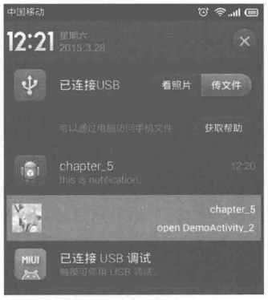
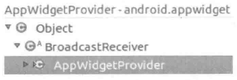
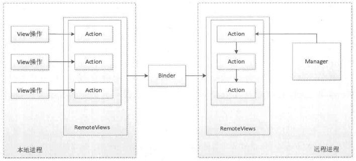
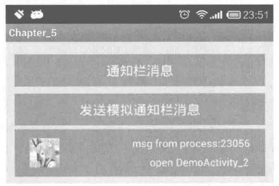
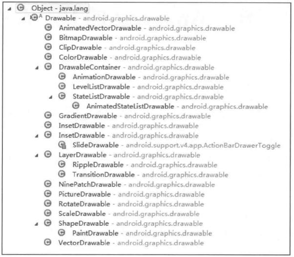
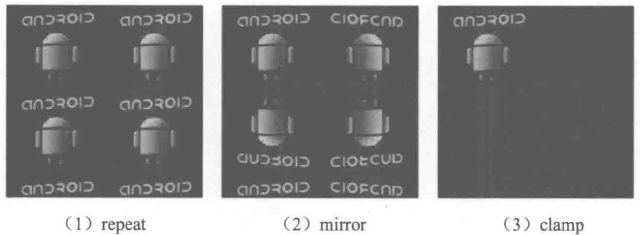
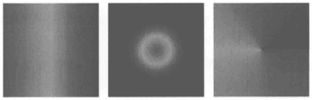
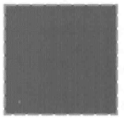
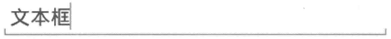
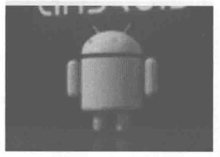

# 第5章 理解RemoteViews

本章所讲述的主题是RemoteViews，从名字可以看出，RemoteViews应该是一种远程View，那么什么是远程View呢？如果说远程服务可能比较好理解，但是远程View的确没听说过，其实它和远程Service是一样的，RemoteViews表示的是一个View结构，它可以在其他进程中显示，由于它在其他进程中显示，为了能够更新它的界面，RemoteViews提供了一组基础的操作用于跨进程更新它的界面。这听起来有点神奇，竟然能跨进程更新界面！但是RemoteViews的确能够实现这个效果。RemoteViews在Android中的使用场景有两种：通知栏和桌面小部件，为了更好地分析RemoteViews的内部机制，本章先简单介绍RemoteViews在通知栏和桌面小部件上的应用，接着分析RemoteViews的内部机制，最后分析RemoteViews的意义并给出一个采用RemoteViews来跨进程更新界面的示例。

## 5.1 RemoteViews的应用

RemoteViews在实际开发中，主要用在通知栏和桌面小部件的开发过程中。通知栏每个人都不陌生，主要是通过NotificationManager的notify方法来实现的，它除了默认效果外，还可以另外定义布局。桌面小部件则是通过AppWidgetProvider来实现的，AppWidget Provider本质上是一个广播。通知栏和桌面小部件的开发过程中都会用到RemoteViews，它们在更新界面时无法像在Activity里面那样去直接更新View，这是因为二者的界面都运行在其他进程中，确切来说是系统的SystemServer进程。为了跨进程更新界面，RemoteViews提供了一系列set方法，并且这些方法只是View全部方法的子集，另外RemoteViews中所支持的View类型也是有限的，这一点会在5.2节中进行详细说明。下面简单介绍一下RemoteViews在通知栏和桌面小部件中的使用方法，至于它们更详细的使用方法请读者阅读相关资料即可，本章的重点是分析RemoteViews的内部机制。

### 5.1.1 RemoteViews在通知栏上的应用

首先我们看一下RemoteViews在通知栏上的应用，我们知道，通知栏除了默认的效果外还支持自定义布局，下面分别说明这两种情况。

使用系统默认的样式弹出一个通知是很简单的，代码如下：

```
Notification notification = new Notification();
notification.icon = R.drawable.ic_launcher;
notification.tickerText = "hello world";
notification.when = System.currentTimeMillis();
notification.flags = Notification.FLAG_AUTO_CANCEL;
Intent intent = new Intent(this, DemoActivity_1.class);
PendingIntent pendingIntent = PendingIntent.getActivity(this,
        0, intent, PendingIntent.FLAG_UPDATE_CURRENT);
notification.setLatestEventInfo(this,"chapter_5","this is notification.",
pendingIntent);
NotificationManager manager = (NotificationManager)getSystemService
(Context.NOTIFICATION_SERVICE);
manager.notify(1, notification);
```

上述代码会弹出一个系统默认样式的通知，单击通知后会打开DemoActivity_1同时会清除本身。为了满足个性化需求，我们还可能会用到自定义通知。自定义通知也很简单，首先我们要提供一个布局文件，然后通过RemoteViews来加载这个布局文件即可改变通知的样式，代码如下所示。

```
Notification notification = new Notification();
notification.icon = R.drawable.ic_launcher;
notification.tickerText = "hello world";
notification.when = System.currentTimeMillis();
notification.flags = Notification.FLAG_AUTO_CANCEL;
Intent intent = new Intent(this, DemoActivity_1.class);
PendingIntent pendingIntent = PendingIntent.getActivity(this,
        0, intent, PendingIntent.FLAG_UPDATE_CURRENT);
RemoteViews remoteViews = new RemoteViews(getPackageName(), R.layout.layout_notification);
remoteViews.setTextViewText(R.id.msg, "chapter_5");
remoteViews.setImageViewResource(R.id.icon, R.drawable.icon1);
PendingIntent openActivity2PendingIntent = PendingIntent.getActivity(this,
        0, new Intent(this, DemoActivity_2.class), PendingIntent.FLAG_UPDATE_CURRENT);
remoteViews.setOnClickPendingIntent(R.id.open_activity2, openActivity2PendingIntent);
notification.contentView = remoteViews;
notification.contentIntent = pendingIntent;
NotificationManager manager = (NotificationManager)getSystemService
(Context.NOTIFICATION_SERVICE);
manager.notify(2, notification);
```

从上述内容来看，自定义通知的效果需要用到RemoteViews，自定义通知的效果如图5-1所示。



图 5-1 自定义通知栏样式

RemoteViews的使用也很简单，只要提供当前应用的包名和布局文件的资源id即可创建一个RemoteViews对象。如何更新RemoteViews呢？这一点和更新View有很大的不同，更新RemoteViews时，无法直接访问里面的View，而必须通过RemoteViews所提供的一系列方法来更新View。比如设置TextView的文本，要采用如下方式：remoteViews.setTextViewText(R.id.msg, "chapter_5")，其中setTextViewText的两个参数分别为TextView的id和要设置的文本。而设置ImageView的图片也不能直接访问ImageView，必须通过如下方式:remoteViews.setImageViewResource(R.id.icon,R.drawable.icon1),setImageViewResource的两个参数分别为ImageView的id和要设置的图片资源的id。如果要给一个控件加单击事件，则要使用PendingIntent并通过setOnClickPendingIntent方法来实现，比如remoteViews.setOnClickPendingIntent(R.id.open_activity2,openActivity2PendingIntent)这句代码会给id为open_activity2的View加上单击事件。关于PendingIntent，它表示的是一种待定的Intent，这个Intent中所包含的意图必须由用户来触发。为什么更新RemoteViews如此复杂呢？直观原因是因为RemoteViews并没有提供和View类似的findViewById这个方法，因此我们无法获取到RemoteViews中的子View，当然实际原因绝非如此，具体会在

5.2节中进行详细介绍。

### 5.1.2 RemoteViews在桌面小部件上的应用

AppWidgetProvider是Android中提供的用于实现桌面小部件的类，其本质是一个广播，即BroadcastReceiver，图5-2所示的是它的类继承关系。所以，在实际的使用中，把AppWidgetProvider当成一个BroadcastReceiver就可以了，这样许多功能就很好理解了。



图 5-2 AppWidgetProvider 的类继承关系

为了更好地展示RemoteViews在桌面小部件上的应用，我们先简单介绍桌面小部件的开发步骤，分为如下几步。

1.定义小部件界面

在res/layout/下新建一个XML文件，命名为widget.xml，名称和内容可以自定义，看这个小部件要做成什么样子，内容如下所示。

```
<?xml version="1.0" encoding="utf-8"?>
<LinearLayout xmlns:android="http://schemas.android.com/apk/res/android"
    android:layout_width="match_parent"
    android:layout_height="match_parent"
    android:orientation="vertical" >

    <ImageView
        android:id="@+id/imageView1"
        android:layout_width="wrap_content"
        android:layout_height="wrap_content"
        android:src="@drawable/icon1" />

</LinearLayout>
```

2.定义小部件配置信息

在res/xml/下新建appwidget_provider_info.xml，名称随意选择，添加如下内容：

```
<?xml version="1.0" encoding="utf-8"?>
<appwidget-provider xmlns:android="http://schemas.android.com/apk/res/android"
    android:initialLayout="@layout/widget"
    android:minHeight="84dp"
    android:minWidth="84dp"
    android:updatePeriodMillis="86400000" >

</appwidget-provider>
```

上面几个参数的意义很明确，initialLayout就是指小工具所使用的初始化布局，minHeight和minWidth定义小工具的最小尺寸，updatePeriodMillis定义小工具的自动更新周期，毫秒为单位，每隔一个周期，小工具的自动更新就会触发。

3.定义小部件的实现类

这个类需要继承AppWidgetProvider，代码如下：

```
public class MyAppWidgetProvider extends AppWidgetProvider {
    public static final String TAG = "MyAppWidgetProvider";
    public static final String CLICK_ACTION = "com.ryg.chapter_5.action.CLICK";

    public MyAppWidgetProvider() {
        super();
    }

    @Override
    public void onReceive(final Context context, Intent intent) {
        super.onReceive(context, intent);
        Log.i(TAG, "onReceive : action = " + intent.getAction());
        // 这里判断是自己的action，做自己的事情，比如小部件被单击了要干什么，这里是做一个动画效果
        if (intent.getAction().equals(CLICK_ACTION)) {
            Toast.makeText(context, "clicked it", Toast.LENGTH_SHORT).show();

            new Thread(new Runnable() {
                @Override
                public void run() {
                    Bitmap srcbBitmap = BitmapFactory.decodeResource(
                            context.getResources(), R.drawable.icon1);
                    AppWidgetManager appWidgetManager = AppWidgetManager.getInstance(context);
                    for (int i = 0; i < 37; i++) {
                        float degree = (i * 10) % 360;
                        RemoteViews remoteViews = new RemoteViews(context
                                .getPackageName(), R.layout.widget);
                        remoteViews.setImageViewBitmap(R.id.imageView1,
                                rotateBitmap(context, srcbBitmap, degree));
                        Intent intentClick = new Intent();
                        intentClick.setAction(CLICK_ACTION);
                        PendingIntent pendingIntent = PendingIntent
                                .getBroadcast(context, 0, intentClick, 0);
                        remoteViews.setOnClickPendingIntent(R.id.imageView1,
                        pendingIntent);
                        appWidgetManager.updateAppWidget(new ComponentName(
                                context, MyAppWidgetProvider.class),
                                remoteViews);
                        SystemClock.sleep(30);
                    }

                }
            }).start();
        }

    }

    /**
     * 每次桌面小部件更新时都调用一次该方法
     */
    @Override
    public void onUpdate(Context context, AppWidgetManager appWidgetManager,
            int[] appWidgetIds) {
        super.onUpdate(context, appWidgetManager, appWidgetIds);
        Log.i(TAG, "onUpdate");

        final int counter = appWidgetIds.length;
        Log.i(TAG, "counter = " + counter);
        for (int i = 0; i < counter; i++) {
            int appWidgetId = appWidgetIds[i];
            onWidgetUpdate(context, appWidgetManager, appWidgetId);
        }
    }

    /**
     * 桌面小部件更新
     *
     * @param context
     * @param appWidgeManger
     * @param appWidgetId
     */
    private void onWidgetUpdate(Context context,
            AppWidgetManager appWidgeManger, int appWidgetId) {

        Log.i(TAG, "appWidgetId = " + appWidgetId);
        RemoteViews remoteViews = new RemoteViews(context.getPackageName(),
                R.layout.widget);

        // “桌面小部件”单击事件发送的Intent广播
        Intent intentClick = new Intent();
        intentClick.setAction(CLICK_ACTION);
        PendingIntent pendingIntent = PendingIntent.getBroadcast(context, 0,
                intentClick, 0);
        remoteViews.setOnClickPendingIntent(R.id.imageView1, pendingIntent);
        appWidgeManger.updateAppWidget(appWidgetId, remoteViews);
    }

    private Bitmap rotateBitmap(Context context, Bitmap srcbBitmap, float degree) {
        Matrix matrix = new Matrix();
       matrix.reset();
       matrix.setRotate(degree) ;
       Bitmap tmpBitmap = Bitmap.createBitmap(srcbBitmap, 0, 0,
             srcbBitmap.getWidth(), srcbBitmap.getHeight(), matrix, true);
        return tmpBitmap;
    }
 }
```

上面的代码实现了一个简单的桌面小部件，在小部件上面显示一张图片，单击它后，这个图片就会旋转一周。当小部件被添加到桌面后，会通过RemoteViews来加载布局文件，而当小部件被单击后的旋转效果则是通过不断地更新RemoteViews来实现的，由此可见，桌面小部件不管是初始化界面还是后续的更新界面都必须使用RemoteViews来完成。

4.在AndroidManifest.xml中声明小部件

这是最后一步，因为桌面小部件本质上是一个广播组件，因此必须要注册，如下所示。

```
<receiver
    android:name=".MyAppWidgetProvider" >
    <meta-data
        android:name="android.appwidget.provider"
        android:resource="@xml/appwidget_provider_info" >
    </meta-data>

    <intent-filter>
        <action android:name="com.ryg.chapter_5.action.CLICK" />
        <action android:name="android.appwidget.action.APPWIDGET_UPDATE" />
    </intent-filter>
</receiver>
```

上面的代码中有两个Action，其中第一个Action用于识别小部件的单击行为，而第二个Action则作为小部件的标识而必须存在，这是系统的规范，如果不加，那么这个receiver就不是一个桌面小部件并且也无法出现在手机的小部件列表里。

AppWidgetProvider除了最常用的onUpdate方法，还有其他几个方法：onEnabled、onDisabled、onDeleted以及onReceive。这些方法会自动地被onReceive方法在合适的时间调用。确切来说，当广播到来以后，AppWidgetProvider 会自动根据广播的Action通过onReceive方法来自动分发广播，也就是调用上述几个方法。这几个方法的调用时机如下所示。

onEnable：当该窗口小部件第一次添加到桌面时调用该方法，可添加多次但只在第

一次调用。

onUpdate：小部件被添加时或者每次小部件更新时都会调用一次该方法，小部件的

更新时机由updatePeriodMillis来指定，每个周期小部件都会自动更新一次。

onDeleted：每删除一次桌面小部件就调用一次。

onDisabled：当最后一个该类型的桌面小部件被删除时调用该方法，注意是最后一个。

onReceive：这是广播的内置方法，用于分发具体的事件给其他方法。

关于AppWidgetProvider的onReceive方法的具体分发过程，可以参看源码中的实现，如下所示。通过下面的代码可以看出，onReceive中会根据不同的Action来分别调用onEnable、onDisable和onUpdate等方法。

```
public void onReceive(Context context, Intent intent) {
    // Protect against rogue update broadcasts (not really a security issue,
    // just filter bad broacasts out so subclasses are less likely to crash).
    String action = intent.getAction();
    if (AppWidgetManager.ACTION_APPWIDGET_UPDATE.equals(action)) {
        Bundle extras = intent.getExtras();
        if (extras != null) {
            int[] appWidgetIds = extras.getIntArray(AppWidgetManager.EXTRA_APPWIDGET_IDS);
            if (appWidgetIds != null && appWidgetIds.length > 0) {
                this.onUpdate(context, AppWidgetManager.getInstance
                (context), appWidgetIds);
            }
        }
    } else if (AppWidgetManager.ACTION_APPWIDGET_DELETED.equals(action)) {
        Bundle extras = intent.getExtras();
        if (extras != null && extras.containsKey(AppWidgetManager.EXTRA_APPWIDGET_ID)) {
            final int appWidgetId = extras.getInt(AppWidgetManager.EXTRA_APPWIDGET_ID);
            this.onDeleted(context, new int[] { appWidgetId });
        }
    } else if (AppWidgetManager.ACTION_APPWIDGET_OPTIONS_CHANGED.equals
    (action)) {
        Bundle extras = intent.getExtras();
        if (extras != null && extras.containsKey(AppWidgetManager.EXTRA_APPWIDGET_ID)
                && extras.containsKey(AppWidgetManager.EXTRA_APPWIDGET_OPTIONS)) {
            int appWidgetId = extras.getInt(AppWidgetManager.EXTRA_APPWIDGET_ID);
            Bundle widgetExtras = extras.getBundle(AppWidgetManager.EXTRA_APPWIDGET_OPTIONS);
            this.onAppWidgetOptionsChanged(context, AppWidgetManager.getInstance(context),
                    appWidgetId, widgetExtras);
        }
    } else if (AppWidgetManager.ACTION_APPWIDGET_ENABLED.equals(action)) {
        this.onEnabled(context);
    } else if (AppWidgetManager.ACTION_APPWIDGET_DISABLED.equals(action)) {
        this.onDisabled(context);
    } else if (AppWidgetManager.ACTION_APPWIDGET_RESTORED.equals(action)) {
        Bundle extras = intent.getExtras();
        if (extras != null) {
            int[] oldIds = extras.getIntArray(AppWidgetManager.EXTRA_APPWIDGET_OLD_IDS);
            int[] newIds = extras.getIntArray(AppWidgetManager.EXTRA_APPWIDGET_IDS);
            if (oldIds != null && oldIds.length > 0) {
                this.onRestored(context, oldIds, newIds);
                this.onUpdate(context, AppWidgetManager.getInstance
                (context), newIds);
            }
        }
    }
}
```

上面描述了开发一个桌面小部件的典型过程，例子比较简单，实际开发中会稍微复杂一些，但是开发流程是一样的。可以发现，桌面小部件在界面上的操作都要通过Remote Views，不管是小部件的界面初始化还是界面更新都必须依赖它。

### 5.1.3 PendingIntent 概述

在5.1.2节中，我们多次提到PendingIntent，那么PendingIntent到底是什么东西呢？它和Intent的区别是什么呢？在本节中将介绍PendingIntent的使用方法。

顾名思义，PendingIntent表示一种处于pending状态的意图，而pending状态表示的是一种待定、等待、即将发生的意思，就是说接下来有一个Intent（即意图）将在某个待定的时刻发生。可以看出PendingIntent和Intent的区别在于，PendingIntent是在将来的某个不确定的时刻发生，而Intent是立刻发生。PendingIntent典型的使用场景是给RemoteViews添加单击事件，因为RemoteViews运行在远程进程中，因此RemoteViews不同于普通的View，所以无法直接向View那样通过setOnClickListener方法来设置单击事件。要想给RemoteViews设置单击事件，就必须使用PendingIntent，PendingIntent通过send和cancel方法来发送和取消特定的待定Intent。

PendingIntent支持三种待定意图：启动Activity、启动Service和发送广播，对应着它的三个接口方法，如表5-1所示。

表 5-1 PendingIntent 的主要方法

| | |
| --- | --- |
| static PendingIntent | getActivity(Context context, int requestCode, Intent intent, int flags)<br>获得一个 PendingIntent，该待定意图发生时，效果相当于<br>Context.startActivity(Intent) |
| static PendingIntent | getService(Context context, int requestCode, Intent intent, int flags)<br>获得一个 PendingIntent，该待定意图发生时，效果相当于<br>Context.startService(Intent) |
| static PendingIntent | getBroadcast(Context context, int requestCode, Intent intent, int flags)<br>获得一个 PendingIntent，该待定意图发生时，效果相当于<br>Context.sendBroadcast(Intent) |

如表5-1所示，getActivity、getService和getBroadcast这三个方法的参数意义都是相同的，第一个和第三个参数比较好理解，这里主要说下第二个参数requestCode和第四个参数flags，其中requestCode表示PendingIntent发送方的请求码，多数情况下设为0即可，另外requestCode会影响到flags的效果。flags常见的类型有：FLAG_ONE_SHOT、FLAG_NO_CREATE、FLAG_CANCEL_CURRENT和FLAG_UPDATE_CURRENT。在说明这四个标记位之前，必须要明白一个概念，那就是PendingIntent的匹配规则，即在什么情况下两个PendingIntent是相同的。

PendingIntent的匹配规则为：如果两个PendingIntent它们内部的Intent相同并且requestCode也相同，那么这两个PendingIntent就是相同的。requestCode相同比较好理解，那么什么情况下Intent相同呢？Intent的匹配规则是：如果两个Intent的ComponentName和intent-filter都相同，那么这两个Intent就是相同的。需要注意的是Extras不参与Intent的匹配过程，只要Intent之间的ComponentName和intent-filter相同，即使它们的Extras不同，那么这两个Intent也是相同的。了解了PendingIntent的匹配规则后，就可以进一步理解flags参数的含义了，如下所示。

FLAG_ONE_SHOT

当前描述的PendingIntent只能被使用一次，然后它就会被自动cancel，如果后续还有相同的PendingIntent，那么它们的send方法就会调用失败。对于通知栏消息来说，如果采用此标记位，那么同类的通知只能使用一次，后续的通知单击后将无法打开。

FLAG_NO_CREATE

当前描述的PendingIntent不会主动创建，如果当前PendingIntent之前不存在，那么getActivity、getService和getBroadcast方法会直接返回null，即获取PendingIntent失败。这个标记位很少见，它无法单独使用，因此在日常开发中它并没有太多的使用意义，这里就不再过多介绍了。

FLAG_CANCEL_CURRENT

当前描述的PendingIntent如果已经存在，那么它们都会被cancel，然后系统会创建一个新的PendingIntent。对于通知栏消息来说，那些被cancel的消息单击后将无法打开。

FLAG_UPDATE_CURRENT

当前描述的PendingIntent如果已经存在，那么它们都会被更新，即它们的Intent中的Extras会被替换成最新的。

从上面的分析来看还是不太好理解这四个标记位，下面结合通知栏消息再描述一遍。这里分两种情况，如下代码中：manager.notify(1,notification)，如果notify的第一个参数id是常量，那么多次调用notify只能弹出一个通知，后续的通知会把前面的通知完全替代掉，而如果每次id都不同，那么多次调用notify会弹出多个通知，下面一一说明。

如果notify方法的id是常量，那么不管PendingIntent是否匹配，后面的通知会直接替换前面的通知，这个很好理解。

如果notify方法的id每次都不同，那么当PendingIntent不匹配时，这里的匹配是指PendingIntent中的Intent相同并且requestCode相同，在这种情况下不管采用何种标记位，这些通知之间不会相互干扰。如果PendingIntent处于匹配状态时，这个时候要分情况讨论：如果采用了FLAG_ONE_SHOT标记位，那么后续通知中的PendingIntent会和第一条通知保持完全一致，包括其中的Extras，单击任何一条通知后，剩下的通知均无法再打开，当所有的通知都被清除后，会再次重复这个过程；如果采用FLAG_CANCEL_CURRENT标记位，那么只有最新的通知可以打开，之前弹出的所有通知均无法打开；如果采用FLAG_UPDATE_CURRENT标记位，那么之前弹出的通知中的PendingIntent会被更新，最终它们和最新的一条通知保持完全一致，包括其中的Extras，并且这些通知都是可以打开的。

## 5.2 RemoteViews 的内部机制

RemoteViews的作用是在其他进程中显示并更新View界面，为了更好地理解它的内部机制，我们先来看一下它的主要功能。首先看一下它的构造方法，这里只介绍一个最常用的构造方法：public RemoteViews(String packageName,int layoutId)，它接受两个参数，第一个表示当前应用的包名，第二个参数表示待加载的布局文件，这个很好理解。RemoteViews目前并不能支持所有的View类型，它所支持的所有类型如下：

Layout

FrameLayout、LinearLayout、RelativeLayout、GridLayout。

View

AnalogClock、Button、Chronometer、ImageButton、ImageView、ProgressBar、TextView、ViewFlipper、ListView、GridView、StackView、AdapterViewFlipper、ViewStub。

上面所描述的是RemoteViews所支持的所有的View类型，RemoteViews不支持它们的子类以及其他View类型，也就是说RemoteViews中不能使用除了上述列表中以外的View，也无法使用自定义View。比如如果我们在通知栏的RemoteViews中使用系统的EditText，那么通知栏消息将无法弹出并且会抛出如下异常：

```
E/StatusBar(765): couldn't inflate view for notification com.ryg.chapter_5/0x2
E/StatusBar(765): android.view.InflateException: Binary XML file line #25:
Error inflating class android.widget.EditText
E/StatusBar(765): Caused by: android.view.InflateException: Binary XML file
line #25: Class not allowed to be inflated android.widget.EditText
E/StatusBar(765):    at android.view.LayoutInflater.failNotAllowed
(LayoutInflater.java:695)
E/StatusBar(765):    at android.view.LayoutInflater.createView
(LayoutInflater.java:628)
E/StatusBar(765): ... 21 more
```

上面的异常信息很明确，android.widget.EditText不允许在RemoteViews中使用。

RemoteViews没有提供findViewById方法，因此无法直接访问里面的View元素，而必须通过RemoteViews所提供的一系列set方法来完成，当然这是因为RemoteViews在远程进程中显示，所以没办法直接findViewById。表5-2列举了部分常用的set方法，更多的方法请查看相关资料。

表 5-2 RemoteViews 的部分 set 方法

| 方法名 | 作用 |
| --- | --- |
| setTextViewText(int viewId, CharSequence text) | 设置 TextView 的文本 |
| setTextViewTextSize(int viewId, int units, float size) | 设置 TextView 的字体大小 |
| setTextColor(int viewId, int color) | 设置 TextView 的字体颜色 |
| setImageViewResource(int viewId, int srcId) | 设置 ImageView 的图片资源 |
| setImageViewResource | 设置 ImageView 的图片 |
| setInt(int viewId, String methodName, int value) | 反射调用 View 对象的参数类型为 int 的方法 |
| setLong(int viewId, String methodName, long value) | 反射调用 View 对象的参数类型为 long 的方法 |
| setBoolean(int viewId, String methodName, boolean value) | 反射调用 View 对象的参数类型为 boolean 的方法 |
| setOnClickPendingIntent(int viewId, PendingIntent pendingIntent) | 为 View 添加单击事件，事件类型只能为 PendingIntent |

从表5-2中可以看出，原本可以直接调用的View的方法，现在却必须要通过RemoteViews的一系列set方法才能完成，而且从方法的声明上来看，很像是通过反射来完成的，事实上大部分set方法的确是通过反射来完成的。

下面描述一下RemoteViews的内部机制，由于RemoteViews主要用于通知栏和桌面小部件之中，这里就通过它们来分析RemoteViews的工作过程。我们知道，通知栏和桌面小部件分别由NotificationManager 和AppWidgetManager管理，而NotificationManager 和AppWidgetManager通过Binder分别和SystemServer进程中的NotificationManagerService以及AppWidgetService进行通信。由此可见，通知栏和桌面小部件中的布局文件实际上是在NotificationManagerService以及AppWidgetService中被加载的，而它们运行在系统的SystemServer中，这就和我们的进程构成了跨进程通信的场景。

首先RemoteViews会通过Binder传递到SystemServer进程，这是因为RemoteViews实现了Parcelable接口，因此它可以跨进程传输，系统会根据RemoteViews中的包名等信息去得到该应用的资源。然后会通过LayoutInflater去加载RemoteViews中的布局文件。在SystemServer进程中加载后的布局文件是一个普通的View，只不过相对于我们的进程它是一个RemoteViews而已。接着系统会对View执行一系列界面更新任务，这些任务就是之前我们通过set方法来提交的。set方法对View所做的更新并不是立刻执行的，在RemoteViews内部会记录所有的更新操作，具体的执行时机要等到RemoteViews被加载以后才能执行，这样RemoteViews就可以在SystemServer进程中显示了，这就是我们所看到的通知栏消息或者桌面小部件。当需要更新RemoteViews时，我们需要调用一系列set方法并通过NotificationManager和AppWidgetManager来提交更新任务，具体的更新操作也是在SystemServer进程中完成的。

从理论上来说，系统完全可以通过Binder去支持所有的View和View操作，但是这样做的话代价太大，因为View的方法太多了，另外就是大量的IPC操作会影响效率。为了解决这个问题，系统并没有通过Binder去直接支持View的跨进程访问，而是提供了一个Action的概念，Action代表一个View操作，Action同样实现了Parcelable接口。系统首先将View操作封装到Action对象并将这些对象跨进程传输到远程进程，接着在远程进程中执行Action对象中的具体操作。在我们的应用中每调用一次set方法，RemoteViews中就会添加一个对应的Action对象，当我们通过NotificationManager和AppWidgetManager来提交我们的更新时，这些Action对象就会传输到远程进程并在远程进程中依次执行，这个过程可以参看图5-3。远程进程通过RemoteViews的apply方法来进行View的更新操作，RemoteViews的apply方法内部则会去遍历所有的Action对象并调用它们的apply方法，具体的View更新操作是由Action对象的apply方法来完成的。上述做法的好处是显而易见的，首先不需要定义大量的Binder接口，其次通过在远程进程中批量执行RemoteViews的修改操作从而避免了大量的IPC操作，这就提高了程序的性能，由此可见，Android系统在这方面的设计的确很精妙。

上面从理论上分析了RemoteViews的内部机制，接下来我们从源码的角度再来分析RemoteViews的工作流程。它的构造方法就不用多说了，这里我们首先看一下它提供的一系列set方法，比如setTextViewText方法，其源码如下所示。

```
public void setTextViewText(int viewId, CharSequence text) {
    setCharSequence(viewId, "setText", text);
}
```



图 5-3 RemoteViews 的内部机制

在上面的代码中，viewId是被操作的View的id，“setText”是方法名，text是要给TextView设置的文本，这里可以联想一下TextView的setText方法，是不是很一致呢？接着再看setCharSequence的实现，如下所示。

```
public void setCharSequence(int viewId, String methodName, CharSequence value) {
    addAction(new ReflectionAction(viewId, methodName, ReflectionAction.CHAR_SEQUENCE, value));
}
```

从setCharSequence的实现可以看出，它的内部并没有对View进程直接的操作，而是添加了一个ReflectionAction对象，从名字来看，这应该是一个反射类型的动作。再看addAction的实现，如下所示。

```
private void addAction(Action a) {
    ...
    if (mActions == null) {
        mActions = new ArrayList<Action>();
    }
    mActions.add(a);
     // update the memory usage stats
     a.updateMemoryUsageEstimate(mMemoryUsageCounter) ;
 }
```

从上述代码可以知道，RemoteViews内部有一个mActions成员，它是一个ArrayList，外界每调用一次set方法，RemoteViews就会为其创建一个Action对象并加入到这个ArrayList中。需要注意的是，这里仅仅是将Action对象保存起来了，并未对View进行实际的操作，这一点在上面的理论分析中已经提到过了。到这里setTextViewText这个方法的源码已经分析完了，但是我们好像还是什么都不知道的感觉，没关系，接着我们需要看一下这个ReflectionAction的实现就知道了。再看它的实现之前，我们需要先看一下RemoteViews的apply方法以及Action类的实现，首先看一下RemoteViews的apply方法，如下所示。

```
public View apply(Context context,ViewGroup parent,OnClickHandler handler) {
    RemoteViews rvToApply = getRemoteViewsToApply(context);

    View result;
    ...

    LayoutInflater inflater = (LayoutInflater)
            context.getSystemService(Context.LAYOUT_INFLATER_SERVICE);

    // Clone inflater so we load resources from correct context and
    // we don't add a filter to the static version returned by getSystemService.
    inflater = inflater.cloneInContext(inflationContext);
    inflater.setFilter(this);
    result = inflater.inflate(rvToApply.getLayoutId(), parent, false);

    rvToApply.performApply(result, parent, handler);

    return result;
}
```

从上面代码可以看出，首先会通过LayoutInflater去加载RemoteViews中的布局文件，RemoteViews中的布局文件可以通过getLayoutId这个方法获得，加载完布局文件后会通过performApply去执行一些更新操作，代码如下所示。

```
private void performApply(View v,ViewGroup parent,OnClickHandler handler) {
    if (mActions != null) {
        handler = handler == null ? DEFAULT_ON_CLICK_HANDLER : handler;
        final int count = mActions.size();
        for (int i = 0; i < count; i++) {
            Action a = mActions.get(i);
            a.apply(v, parent, handler);
        }
    }
}
```

performApply的实现就比较好理解了，它的作用就是遍历mActions这个列表并执行每个Action对象的apply方法。还记得mAction吗？每一次的set操作都会对应着它里面的一个Action对象，因此我们可以断定，Action对象的apply方法就是真正操作View的地方，实际上的确如此。

RemoteViews在通知栏和桌面小部件中的工作过程和上面描述的过程是一致的，当我们调用RemoteViews的set方法时，并不会立刻更新它们的界面，而必须要通过Notification Manager的notify方法以及AppWidgetManager的updateAppWidget才能更新它们的界面。实际上在AppWidgetManager 的updateAppWidget的内部实现中，它们的确是通过RemoteViews的apply以及reapply方法来加载或者更新界面的，apply和reApply的区别在于：apply会加载布局并更新界面，而reApply则只会更新界面。通知栏和桌面小插件在初始化界面时会调用apply方法，而在后续的更新界面时则会调用reapply方法。这里先看一下BaseStatusBar的updateNotificationViews方法中，如下所示。

```
private void updateNotificationViews(NotificationData.Entry entry,
        StatusBarNotification notification, boolean isHeadsUp) {
    final RemoteViews contentView = notification.getNotification().contentView;
    final RemoteViews bigContentView = isHeadsUp
            ? notification.getNotification().headsUpContentView
            : notification.getNotification().bigContentView;
    final Notification publicVersion = notification.getNotification().publicVersion;
    final RemoteViews publicContentView = publicVersion != null ? publicVersion.contentView : null;

    // Reapply the RemoteViews
    contentView.reapply(mContext, entry.expanded, mOnClickHandler);
    ...
}
```

很显然，上述代码表示当通知栏界面需要更新时，它会通过RemoteViews的reapply方法来更新界面。

接着再看一下AppWidgetHostView的updateAppWidget方法，在它的内部有如下一段代码：

```
mRemoteContext = getRemoteContext();
int layoutId = remoteViews.getLayoutId();

// If our stale view has been prepared to match active, and the new
// layout matches, try recycling it
if (content == null && layoutId == mLayoutId) {
    try {
        remoteViews.reapply(mContext, mView, mOnClickHandler);
        content = mView;
        recycled = true;
        if (LOGD) Log.d(TAG, "was able to recycled existing layout");
    } catch (RuntimeException e) {
        exception = e;
    }
}

// Try normal RemoteView inflation
if (content == null) {
    try {
        content = remoteViews.apply(mContext, this, mOnClickHandler);
        if (LOGD) Log.d(TAG, "had to inflate new layout");
    } catch (RuntimeException e) {
        exception = e;
    }
}
```

从上述代码可以发现，桌面小部件在更新界面时也是通过RemoteViews的reapply方法来实现的。

了解了apply以及reapply的作用以后，我们再继续看一些Action的子类的具体实现，首先看一下ReflectionAction的具体实现，它的源码如下所示。

```
private final class ReflectionAction extends Action {
    ReflectionAction(int viewId,String methodName,int type,Object value) {
        this.viewId = viewId;
        this.methodName = methodName;
        this.type = type;
        this.value = value;
    }

    ...
    @Override
    public void apply(View root, ViewGroup rootParent, OnClickHandler handler) {
        final View view = root.findViewById(viewId);
        if (view == null) return;

        Class<?> param = getParameterType();
        if (param == null) {
            throw new ActionException("bad type: " + this.type);
        }

        try {
            getMethod(view, this.methodName, param).invoke(view, wrapArg(this.value));
        } catch (ActionException e) {
            throw e;
        } catch (Exception ex) {
            throw new ActionException(ex);
        }
    }
}
```

通过上述代码可以发现，ReflectionAction表示的是一个反射动作，通过它对View的操作会以反射的方式来调用，其中getMethod就是根据方法名来得到反射所需的Method对象。使用ReflectionAction的set方法有：setTextViewText、setBoolean、setLong、setDouble等。除了ReflectionAction，还有其他Action，比如TextViewSizeAction、ViewPaddingAction、SetOnClickPendingIntent等。这里再分析一下TextViewSizeAction，它的实现如下所示。

```
private class TextViewSizeAction extends Action {
    public TextViewSizeAction(int viewId, int units, float size) {
        this.viewId = viewId;
        this.units = units;
        this.size = size;
    }

    @Override
    public void apply(View root, ViewGroup rootParent, OnClickHandler handler) {
        final TextView target = (TextView) root.findViewById(viewId);
        if (target == null) return;
        target.setTextSize(units, size);
    }

    public String getActionName() {
        return "TextViewSizeAction";
    }

    int units;
    float size;

    public final static int TAG = 13;
}
```

TextViewSizeAction的实现比较简单，它之所以不用反射来实现，是因为setTextSize这个方法有2个参数，因此无法复用ReflectionAction，因为ReflectionAction的反射调用只有一个参数。其他Action这里就不一一进行分析了，读者可以查看RemoteViews的源代码。

关于单击事件，RemoteViews中只支持发起PendingIntent，不支持onClickListener那种模式。另外，我们需要注意setOnClickPendingIntent、setPendingIntentTemplate以及setOnClickFillInIntent它们之间的区别和联系。首先setOnClickPendingIntent用于给普通View设置单击事件，但是不能给集合（ListView和StackView）中的View设置单击事件，比如我们不能给ListView中的item通过setOnClickPendingIntent这种方式添加单击事件，因为开销比较大，所以系统禁止了这种方式；其次，如果要给ListView和StackView中的item添加单击事件，则必须将setPendingIntentTemplate和setOnClickFillInIntent组合使用才可以。

## 5.3 RemoteViews的意义

在5.2节中我们分析了RemoteViews的内部机制，了解RemoteViews的内部机制可以让我们更加清楚通知栏和桌面小工具的底层实现原理，但是本章对RemoteViews的探索并没有停止，在本节中，我们将打造一个模拟的通知栏效果并实现跨进程的UI更新。

首先有2个Activity分别运行在不同的进程中，一个名字叫A，另一个叫B，其中A扮演着模拟通知栏的角色，而B则可以不停地发送通知栏消息，当然这是模拟的消息。为了模拟通知栏的效果，我们修改A的process属性使其运行在单独的进程中，这样A和B就构成了多进程通信的情形。我们在B中创建RemoteViews对象，然后通知A显示这个RemoteViews对象。如何通知A显示B中的RemoteViews呢？我们可以像系统一样采用Binder来实现，但是这里为了简单起见就采用了广播。B每发送一次模拟通知，就会发送一个特定的广播，然后A接收到广播后就开始显示B中定义的RemoteViews对象，这个过程和系统的通知栏消息的显示过程几乎一致，或者说这里就是复制了通知栏的显示过程而已。

首先看B的实现，B只要构造RemoteViews对象并将其传输给A即可，这一过程通知栏是采用Binder实现的，但是本例中采用广播来实现，RemoteViews对象通过Intent传输到A中，代码如下所示。

```
RemoteViews remoteViews = new RemoteViews(getPackageName(), R.layout.layout_simulated_notification);
remoteViews.setTextViewText(R.id.msg, "msg from process:" + Process.myPid());
remoteViews.setImageViewResource(R.id.icon, R.drawable.icon1);
PendingIntent pendingIntent = PendingIntent.getActivity(this,
        0, new Intent(this, DemoActivity_1.class), PendingIntent.FLAG_UPDATE_CURRENT);
PendingIntent openActivity2PendingIntent = PendingIntent.getActivity(
        this, 0, new Intent(this, DemoActivity_2.class), PendingIntent.FLAG_UPDATE_CURRENT);
remoteViews.setOnClickPendingIntent(R.id.item_holder, pendingIntent);
remoteViews.setOnClickPendingIntent(R.id.open_activity2, openActivity2PendingIntent);
Intent intent = new Intent(MyConstants.REMOTE_ACTION);
intent.putExtra(MyConstants.EXTRA_REMOTE_VIEWS, remoteViews);
sendBroadcast(intent);
```

A的代码也很简单，只需要接收B中的广播并显示RemoteViews即可，如下所示。

```
public class MainActivity extends Activity {
    private static final String TAG = "MainActivity";

    private LinearLayout mRemoteViewsContent;

    private BroadcastReceiver mRemoteViewsReceiver=new BroadcastReceiver() {
        @Override
        public void onReceive(Context context, Intent intent) {
            RemoteViews remoteViews = intent.getParcelableExtra(MyConstants.EXTRA_REMOTE_VIEWS);
            if (remoteViews != null) {
                updateUI(remoteViews);
            }
        }
    };

    @Override
    protected void onCreate(Bundle savedInstanceState) {
        super.onCreate(savedInstanceState);
        setContentView(R.layout.activity_main);
        initView();
    }

    private void initView() {
        mRemoteViewsContent = (LinearLayout) findViewById(R.id.remote_views_content);
        IntentFilter filter = new IntentFilter(MyConstants.REMOTE_ACTION);
        registerReceiver(mRemoteViewsReceiver, filter);
    }

    private void updateUI(RemoteViews remoteViews) {
        View view = remoteViews.apply(this, mRemoteViewsContent);
        mRemoteViewsContent.addView(view);
    }
    @Override
    protected void onDestroy() {
       unregisterReceiver(mRemoteViewsReceiver) ;
       super.onDestroy();
    }
 }
```

上述代码很简单，除了注册和解除广播以外，最主要的逻辑其实就是updateUI方法。当A收到广播后，会从Intent中取出RemoteViews对象，然后通过它的apply方法加载布局文件并执行更新操作，最后将得到的View添加到A的布局中即可。可以发现，这个过程很简单，但是通知栏的底层就是这么实现的。

本节这个例子是可以在实际中使用的，比如现在有两个应用，一个应用需要能够更新另一个应用中的某个界面，这个时候我们当然可以选择AIDL去实现，但是如果对界面的更新比较频繁，这个时候就会有效率问题，同时AIDL接口就有可能会变得很复杂。这个时候如果采用RemoteViews来实现就没有这个问题了，当然RemoteViews也有缺点，那就是它仅支持一些常见的View，对于自定义View它是不支持的。面对这种问题，到底是采用AIDL还是采用RemoteViews，这个要看具体情况，如果界面中的View都是一些简单的且被RemoteViews支持的View，那么可以考虑采用RemoteViews，否则就不适合用RemoteViews了。

如果打算采用RemoteViews来实现两个应用之间的界面更新，那么这里还有一个问题，那就是布局文件的加载问题。在上面的代码中，我们直接通过RemoteViews的apply方法来加载并更新界面，如下所示。

```
View view = remoteViews.apply(this, mRemoteViewsContent) ;
mRemoteViewsContent.addView(view) ;
```

这种写法在同一个应用的多进程情形下是适用的，但是如果A和B属于不同应用，那么B中的布局文件的资源id传输到A中以后很有可能是无效的，因为A中的这个布局文件的资源id不可能刚好和B中的资源id一样，面对这种情况，我们就要适当修改RemoteViews的显示过程的代码了。这里给出一种方法，既然资源id不相同，那我们就通过资源名称来加载布局文件。首先两个应用要提前约定好RemoteViews中的布局文件的资源名称，比如“layout_simulated_notification”，然后在A中根据名称查找到对应的布局文件并加载，接着再调用RemoteViews的reapply方法即可将B中对View所做的一系列更新操作全部作用到A中加载的View上面。关于apply和reapply方法的差别在前面已经提到过，这里就不多说了，这样整个跨应用更新界面的流程就走通了，具体效果如图5-4所示。可以发现B中的布局文件已经成功地在A中显示了出来。修改后的代码如下：

```
int layoutId = getResources().getIdentifier("layout_simulated_notification", "layout", getPackageName());
View view = getLayoutInflater().inflate(layoutId, mRemoteViewsContent, false);
remoteViews.reapply(this, view);
mRemoteViewsContent.addView(view);
```



图 5-4 模拟通知栏的效果

# 第6章 Android的Drawable

本章所讲述的话题是Android的Drawable，Drawable表示的是一种可以在Canvas上进行绘制的抽象的概念，它的种类有很多，最常见的颜色和图片都可以是一个Drawable。在本章中，首先描述Drawable的层次关系，接着介绍Drawable的分类，最后介绍自定义Drawable相关的知识。本章的内容看起来稍微有点简单，但是由于Drawable的种类比较繁多，从而导致了开发者对不同Drawable的理解比较混乱。另外一点，熟练掌握各种类型的Drawable可以方便我们做出一些特殊的UI效果，这一点在UI相关的开发工作中尤其重要。Drawable在开发中有着自己的优点：首先，它使用简单，比自定义View的成本要低；其次，非图片类型的Drawable占用空间较小，这对减小apk的大小也很有帮助。鉴于上述两点，全面理解Drawable的使用细节还是很有必要的，这也是本章的出发点。

## 6.1 Drawable 简介

Drawable有很多种，它们都表示一种图像的概念，但是它们又不全是图片，通过颜色也可以构造出各式各样的图像的效果。在实际开发中，Drawable常被用来作为View的背景使用。Drawable一般都是通过XML来定义的，当然我们也可以通过代码来创建具体的Drawable对象，只是用代码创建会稍显复杂。在Android的设计中，Drawable是一个抽象类，它是所有Drawable对象的基类，每个具体的Drawable都是它的子类，比如ShapeDrawable、BitmapDrawable等，Drawable的层次关系如图6-1所示。

Drawable的内部宽/高这个参数比较重要，通过getIntrinsicWidth和getIntrinsicHeight这两个方法可以获取到它们。但是并不是所有的Drawable都有内部宽/高，比如一张图片所形成的Drawable，它的内部宽/高就是图片的宽/高，但是一个颜色所形成的Drawable，它就没有内部宽/高的概念。另外需要注意的是，Drawable的内部宽/高不等同于它的大小，一般来说，Drawable是没有大小概念的，当用作View的背景时，Drawable会被拉伸至View的同等大小。



图 6-1 Drawable 的层次关系

## 6.2 Drawable的分类

Drawable的种类繁多，常见的有BitmapDrawable、ShapeDrawable、LayerDrawable以及StateListDrawable等，这里就不一一列举了，下面会分别介绍它们的使用细节。

### 6.2.1 BitmapDrawable

这几乎是最简单的Drawable了，它表示的就是一张图片。在实际开发中，我们可以直接引用原始的图片即可，但是也可以通过XML的方式来描述它，通过XML来描述的BitmapDrawable可以设置更多的效果，如下所示：

```
<?xml version="1.0" encoding="utf-8"?>
<bitmap
    xmlns:android="http://schemas.android.com/apk/res/android"
    android:src="@[package:]drawable/drawable_resource"
    android:antialias=["true" | "false"]
    android:dither=["true" | "false"]
    android:filter=["true" | "false"]
    android:gravity=["top" | "bottom" |"left"|"right" | "center_vertical" |
                    "fill_vertical"|"center_horizontal" | "fill_horizontal" |
                    "center" | "fill" | "clip_vertical" | "clip_horizontal"]
    android:mipMap=["true" | "false"]
    android:tileMode=["disabled" | "clamp" | "repeat" | "mirror"] />
```

下面是它各个属性的含义。

android:src

这个很简单，就是图片的资源id。

android:antialias

是否开启图片抗锯齿功能。开启后会让图片变得平滑，同时也会在一定程度上降低图片的清晰度，但是这个降低的幅度较低以至于可以忽略，因此抗锯齿选项应该开启。

android:dither

是否开启抖动效果。当图片的像素配置和手机屏幕的像素配置不一致时，开启这个选项可以让高质量的图片在低质量的屏幕上还能保持较好的显示效果，比如图片的色彩模式为ARGB8888，但是设备屏幕所支持的色彩模式为RGB555，这个时候开启抖动选项可以让图片显示不会过于失真。在Android中创建的Bitmap一般会选用ARGB8888这个模式，即ARGB四个通道各占8位，在这种色彩模式下，一个像素所占的大小为4个字节，一个像素的位数总和越高，图像也就越逼真。根据分析，抖动效果也应该开启。

android:filter

是否开启过滤效果。当图片尺寸被拉伸或者压缩时，开启过滤效果可以保持较好的显示效果，因此此选项也应该开启。

android:gravity

当图片小于容器的尺寸时，设置此选项可以对图片进行定位。这个属性的可选项比较多，不同的选项可以通过“|”来组合使用，如表6-1所示。

表 6-1 gravity 属性的可选项

| 可选项 | 含义 |
| --- | --- |
| top | 将图片放在容器的顶部，不改变图片的大小 |
| bottom | 将图片放在容器的底部，不改变图片的大小 |
| left | 将图片放在容器的左部，不改变图片的大小 |
| right | 将图片放在容器的右部，不改变图片的大小 |
| center_vertical | 使图片竖直居中，不改变图片的大小 |
| fill_vertical | 图片竖直方向填充容器 |
| center_horizontal | 使图片水平居中，不改变图片的大小 |
| fill_horizontal | 图片水平方向填充容器 |
| center | 使图片在水平和竖直方向同时居中，不改变图片的大小 |
| fill | 图片在水平和竖直方向均填充容器，这是默认值 |
| clip_vertical | 附加选项，表示竖直方向的裁剪，较少使用 |
| clip_horizontal | 附加选项，表示水平方向的裁剪，较少使用 |

android:mipMap

这是一种图像相关的处理技术，也叫纹理映射，比较抽象，这里也不对其深究了，默认值为false，在日常开发中此选项不常用。

android:tileMode

平铺模式。这个选项有如下几个值：["disabled" | "clamp" | "repeat" | "mirror"]，其中disable表示关闭平铺模式，这也是默认值，当开启平铺模式后，gravity属性会被忽略。这里主要说一下repeat、mirror和clamp的区别，这三者都表示平铺模式，但是它们的表现却有很大不同。repeat表示的是简单的水平和竖直方向上的平铺效果；mirror表示一种在水平和竖直方向上的镜面投影效果；而clamp表示的效果就更加奇特，图片四周的像素会扩展到周围区域。下面我们看一下这三者的实际效果，通过实际效果可以更好地理解不同的平铺模式的区别，如图6-2所示。



图 6-2 平铺模式下的图片显示效果

接下来介绍NinePatchDrawable，它表示的是一张.9格式的图片，.9图片可以自动地根据所需的宽/高进行相应的缩放并保证不失真，之所以把它和BitmapDrawable放在一起介绍是因为它们都表示一张图片。和BitmapDrawable一样，在实际使用中直接引用图片即可，但是也可以通过XML来描述.9图，如下所示。

```
 <?xml version="1.0" encoding="utf-8"?>
 <nine-patch
    xmlns:android="http://schemas.android.com/apk/res/android"
    android:src="@[package:]drawable/drawable_resource"
    android:dither=["true" | "false"] />
```

上述XML中的属性的含义和BitmapDrawable中的对应属性的含义是相同的，这里就不再描述了，另外，在实际使用中发现在bitmap标签中也可以使用.9图，即BitmapDrawable也可以代表一个.9格式的图片。

### 6.2.2 ShapeDrawable

ShapeDrawable是一种很常见的Drawable，可以理解为通过颜色来构造的图形，它既可以是纯色的图形，也可以是具有渐变效果的图形。ShapeDrawable的语法稍显复杂，如下所示。

```
 <?xml version="1.0" encoding="utf-8"?>
 <shape
    xmlns:android="http://schemas.android.com/apk/res/android"
    android:shape=["rectangle" | "oval" | "line" | "ring"] >
    <corners
       android:radius="integer"
       android:topLeftRadius="integer"
        android:topRightRadius="integer"
        android:bottomLeftRadius="integer"
        android:bottomRightRadius="integer" />
    <gradient
        android:angle="integer"
        android:centerX="integer"
        android:centerY="integer"
        android:centerColor="integer"
        android:endColor="color"
        android:gradientRadius="integer"
        android:startColor="color"
        android:type=["linear" | "radial" | "sweep"]
        android:useLevel=["true" | "false"] />
    <padding
        android:left="integer"
        android:top="integer"
        android:right="integer"
       android:bottom="integer" />
    <size
       android:width="integer"
       android:height="integer" />
    <solid
       android:color="color" />
    <stroke
       android:width="integer"
       android:color="color"
       android:dashWidth="integer"
       android:dashGap="integer" />
 </shape>
```

需要注意的是`<shape>`标签创建的Drawable，其实体类实际上是GradientDrawable，下面分别介绍各个属性的含义。

android:shape

表示图形的形状，有四个选项：rectangle（矩形）、oval（椭圆）、line（横线）和ring（圆环）。它的默认值是矩形，另外line和ring这两个选项必须要通过`<stroke>`标签来指定线的宽度和颜色等信息，否则将无法达到预期的显示效果。

针对ring这个形状，有5个特殊的属性：android:innerRadius、android:thickness、android:innerRadiusRatio、android:thicknessRatio和android:useLevel，它们的含义如表6-2所示。

表 6-2 ring 的属性值

| Value | Desciption |
| --- | --- |
| android:innerRadius | 圆环的内半径，和 android:innerRadiusRatio 同时存在时，以 android:innerRadius 为准 |
| android:thickness | 圆环的厚度，即外半径减去内半径的大小，和 android:thicknessRatio 同时存在时，以 android:thickness 为准 |
| android:innerRadiusRatio | 内半径占整个 Drawable 宽度的比例，默认值为 9。如果为 n，那么内半径 = 宽度 / n |
| android:thicknessRatio | 厚度占整个 Drawable 宽度的比例，默认值为 3。如果为 n，那么厚度 = 宽度 / n |
| android:useLevel | 一般都应该使用 false，否则有可能无法到达预期的显示效果，除非它被当作 LevelListDrawable 来使用 |

`<corners>`

表示shape的四个角的角度。它只适用于矩形shape，这里的角度是指圆角的程度，用px来表示，它有如下5个属性：

- android:radius—— 为四个角同时设定相同的角度，优先级较低，会被其他四个属性

覆盖；

- android:topLeftRadius—— 设定最上角的角度；

- android:topRightRadius—— 设定右上角的角度；

- android:bottomLeftRadius—— 设定最下角的角度；

- android:bottomRightRadius—— 设定右下角的角度。

`<gradient>`

它与`<solid>`标签是互相排斥的，其中solid表示纯色填充，而gradient则表示渐变效果，gradient有如下几个属性：

- android:angle—— 渐变的角度，默认为0，其值必须为45的倍数，0表示从左到右，

90表示从下到上，具体的效果需要自行体验，总之角度会影响渐变的方向；

- android:centerX——  渐变的中心点的横坐标；

- android:centerY——渐变的中心点的纵坐标，渐变的中心点会影响渐变的具体效果； android:centerY-

- android:startColor—— 渐变的起始色；

- android:centerColor—— 渐变的中间色；

- android:endColor—— 渐变的结束色；

- android:gradientRadius—— 渐变半径，仅当android:type=“radial"时有效；

- android:useLevel—— 般为false，当Drawable作为StateListDrawable使用时为true；

- android:type—— 渐变的类别，有linear（线性渐变）、radial（径向渐变）、sweep（扫

描线渐变）三种，其中默认值为线性渐变，它们三者的区别如图6-3所示。



图 6-3 渐变的类别，从左到右依次为 linear、radial、sweep

`<solid>`

这个标签表示纯色填充，通过android:color即可指定shape中填充的颜色。

`<stroke>`

Shape的描边，有如下几个属性：

- android:width—— 描边的宽度，越大则shape的边缘线就会看起来越粗；

- android:color—— 描边的颜色；

- android:dashWidth—— 组成虚线的线段的宽度；

- android:dashGap—— 组成虚线的线段之间的间隔，间隔越大则虚线看起来空隙就越大。

注意如果android:dashWidth和android:dashGap有任何一个为0，那么虚线效果将不能生效。下面是一个具体的例子，效果图如图6-4所示。

```
<?xml version="1.0" encoding="utf-8"?>
<shape xmlns:android="http://schemas.android.com/apk/res/android"
    android:shape="rectangle" >

    <solid android:color="#ff0000" />

    <stroke
        android:dashGap="2dp"
        android:dashWidth="10dp"
        android:width="2dp"
        android:color="#00ff00" />
</shape>
```



图 6-4 shape 的描边效果

`<padding>`

这个表示空白，但是它表示的不是shape的空白，而是包含它的View的空白，有四个属性：android:left、android:top、android:right和android:bottom。

`<size>`

shape的大小，有两个属性：android:width和android:height，分别表示 shape 的宽/高。这个表示的是shape 的固有大小，但是一般来说它并不是shape最终显示的大小，这个有点抽象，但是我们要明白，对于shape来说它并没有宽/高的概念，作为View的背景它会自适应View的宽/高。我们知道Drawable的两个方法getIntrinsicWidth和getIntrinsicHeight表示的是Drawable的固有宽/高，对于有些Drawable比如图片来说，它的固有宽/高就是图片的尺寸。而对于shape来说，默认情况下它是没有固有宽/高这个概念的，这个时候getIntrinsicWidth和getIntrinsicHeight会返回-1，但是如果通过`<size>`标签来指定宽/高信息，那么这个时候shape就有了所谓的固有宽/高。因此，总结来说，`<size>`标签设置的宽/高就是ShapeDrawable的固有宽/高，但是作为View的背景时，shape还会被拉伸或者缩小为View的大小。

### 6.2.3 LayerDrawable

LayerDrawable对应的XML标签是`<layer-list>`，它表示一种层次化的Drawable集合，通过将不同的Drawable放置在不同的层上面从而达到一种叠加后的效果。它的语法如下所示。

```
 <?xml version="1.0" encoding="utf-8"?>
 <layer-list
    xmlns:android="http://schemas.android.com/apk/res/android" >
    <item
        android:drawable="@[package:]drawable/drawable_resource"
        android:id="@[+][package:]id/resource_name"
        android:top="dimension"
        android:right="dimension"
        android:bottom="dimension"
        android:left="dimension" />
 </layer-list>
```

一个layer-list中可以包含多个item，每个item表示一个Drawable。Item的结构也比较简单，比较常用的属性有android:top、android:bottom、android:left和android:right，它们分别表示Drawable相对于View的上下左右的偏移量，单位为像素。另外，我们可以通过android:drawable属性来直接引用一个已有的Drawable资源，也可以在item中自定义Drawable。默认情况下，layer-list中的所有的Drawable都会被缩放至View的大小，对于bitmap来说，需要使用android:gravity属性才能控制图片的显示效果。Layer-list有层次的概念，下面的item会覆盖上面的item，通过合理的分层，可以实现一些特殊的叠加效果。

下面是一个layer-list具体使用的例子，它实现了微信中的文本输入框的效果，如图6-5所示。当然它只适用于白色背景上的文本输入框，另外这种效果也可以采用.9图来实现。

```
<?xml version="1.0" encoding="utf-8"?>
<layer-list xmlns:android="http://schemas.android.com/apk/res/android" >

    <item>
        <shape android:shape="rectangle" >
            <solid android:color="#0ac39e" />
        </shape>
    </item>

    <item android:bottom="6dp">
        <shape android:shape="rectangle" >
            <solid android:color="#ffffff" />
        </shape>
    </item>
    <item
       android:bottom="1dp"
       android:left="1dp"
       android:right="1dp">
       <shape android:shape="rectangle" >
           <solid android:color="#ffffff" />
       </shape>
    </item>
</layer-list>
```



图 6-5 layer-list 的应用

### 6.2.4 StateListDrawable

StateListDrawable对应于`<selector>`标签，它也是表示Drawable集合，每个Drawable都对应着View的一种状态，这样系统就会根据View的状态来选择合适的Drawable。StateListDrawable主要用于设置可单击的View的背景，最常见的是Button，这个读者应该不陌生，它的语法如下所示。

```
 <?xml version="1.0" encoding="utf-8"?>
 <selector xmlns:android="http://schemas.android.com/apk/res/android"
    android:constantSize=["true" | "false"]
    android:dither=["true" | "false"]
    android:variablePadding=["true" | "false"] >
    <item
       android:drawable="@[package:]drawable/drawable_resource"
       android:state_pressed=["true" | "false"]
       android:state_focused=["true" | "false"]
       android:state_hovered=["true" | "false"]
        android:state_selected=["true" | "false"]
        android:state_checkable=["true" | "false"]
        android:state_checked=["true" | "false"]
        android:state_enabled=["true" | "false"]
        android:state_activated=["true" | "false"]
       android:state_window_focused=["true" | "false"] />
 </selector>
```

针对上面的语法，下面做简单介绍。

android:constantSize

StateListDrawable的固有大小是否不随着其状态的改变而改变的，因为状态的改变会导致StateListDrawable切换到具体的Drawable，而不同的Drawable具有不同的固有大小。True表示StateListDrawable的固有大小保持不变，这时它的固有大小是内部所有Drawable的固有大小的最大值，false则会随着状态的改变而改变。此选项默认值为false。

android:dither

是否开启抖动效果，这个在BitmapDrawable中也有提到，开启此选项可以让图片在低质量的屏幕上仍然获得较好的显示效果。此选项默认值为true。

android:variablePadding

StateListDrawable的padding表示是否随着其状态的改变而改变，true表示会随着状态的改变而改变，false表示StateListDrawable的padding是内部所有Drawable的padding的最大值。此选项默认值为false，并且不建议开启此选项。

`<item>`标签表示一个具体的Drawable，它的结构也比较简单，其中android:drawable是一个已有Drawable的资源id，剩下的属性表示的是View的各种状态，每个item表示的都是一种状态下的Drawable信息。View的常见状态如表6-3所示。

表 6-3 View 的常见状态

| 状态 | 含义 |
| --- | --- |
| android:state_pressed | 表示按下状态，比如 Button 被按下后仍没有松开时的状态 |
| android:state_focused | 表示 View 已经获取了焦点 |
| android:state_selected | 表示用户选择了 View |
| android:state_checked | 表示用户选中了 View，一般适用于 CheckBox 这类在选中和非选中状态之间进行切换的 View |
| android:state_enabled | 表示 View 当前处于可用状态 |

下面给出具体的例子，如下所示。

```
 <?xml version="1.0" encoding="utf-8"?>
 <selector xmlns:android="http://schemas.android.com/apk/res/android">
    <item android:state_pressed="true"
         android:drawable="@drawable/button_pressed" /> <!-- pressed -->
    <item android:state_focused="true"
         android:drawable="@drawable/button_focused" /> <!-- focused -->
    <item android:drawable="@drawable/button_normal" /> <!-- default -->
 </selector>
```

系统会根据View当前的状态从selector中选择对应的item，每个item对应着一个具体的Drawable，系统按照从上到下的顺序查找，直至查找到第一条匹配的item。一般来说，默认的item都应该放在selector的最后一条并且不附带任何的状态，这样当上面的item都无法匹配View的当前状态时，系统就会选择默认的item，因为默认的item不附带状态，所以它可以匹配View的任何状态。

### 6.2.5 LevelListDrawable

LevelListDrawable对应于`<level-list>`标签，它同样表示一个Drawable集合，集合中的每个Drawable都有一个等级（level）的概念。根据不同的等级，LevelListDrawable会切换为对应的Drawable，它的语法如下所示。

```
 <?xml version="1.0" encoding="utf-8"?>
 <level-list
    xmlns:android="http://schemas.android.com/apk/res/android" >
    <item
        android:drawable="@drawable/drawable_resource"
        android:maxLevel="integer"
        android:minLevel="integer" />
 </level-list>
```

上面的语法中，每个item表示一个Drawable，并且有对应的等级范围，由android:min Level和android:maxLevel来指定，在最小值和最大值之间的等级会对应此item中的Drawable。下面是一个实际的例子，当它作为View的背景时，可以通过Drawable的setLevel方法来设置不同的等级从而切换具体的Drawable。如果它被用来作为ImageView的前景Drawable，那么还可以通过ImageView的setImageLevel方法来切换Drawable。最后，Drawable的等级是有范围的，即0~10000，最小等级是0，这也是默认值，最大等级是10000。

```
 <?xml version="1.0" encoding="utf-8"?>
 <level-list xmlns:android="http://schemas.android.com/apk/res/android" >
    <item
        android:drawable="@drawable/status_off"
        android:maxLevel="0" />
    <item
       android:drawable="@drawable/status_on"
       android:maxLevel="1" />
 </level-list>
```

### 6.2.6 TransitionDrawable

TransitionDrawable对应于`<transition>`标签，它用于实现两个Drawable之间的淡入淡出效果，它的语法如下所示。

```
 <?xml version="1.0" encoding="utf-8"?>
 <transition
 xmlns:android="http://schemas.android.com/apk/res/android" >
    <item
       android:drawable="@[package:]drawable/drawable_resource"
       android:id="@[+][package:]id/resource_name"
       android:top="dimension"
       android:right="dimension"
       android:bottom="dimension"
       android:left="dimension" />
</transition>
```

上面语法中的属性前面已经都介绍过了，其中android:top、android:bottom、android:left和android:right仍然表示的是Drawable四周的偏移量，这里就不多介绍了。下面给出一个实际的例子。

首先定义TransitionDrawable，如下所示。

```
 // res/drawable/transition_drawable.xml
 <?xml version="1.0" encoding="utf-8"?>
 <transition xmlns:android="http://schemas.android.com/apk/res/android">
    <item android:drawable="@drawable/drawable1" />
    <item android:drawable="@drawable/drawable2" />
 </transition>
```

接着将上面的TransitionDrawable设置为View的背景，如下所示。当然也可以在ImageView中直接作为Drawable来使用。

```
 <TextView
    android:id="@+id/button"
    android:layout_height="wrap_content"
    android:layout_width="wrap_content"
android:background="@drawable/transition_drawable" />
```

最后，通过它的startTransition和reverseTransition方法来实现淡入淡出的效果以及它的逆过程，如下所示。

```
 TextView textView = (TextView) findViewById(R.id.test_transition);
TransitionDrawable drawable = (TransitionDrawable) textView.getBackground();
drawable.startTransition(1000) ;
```

### 6.2.7 InsetDrawable

InsetDrawable对应于`<inset>`标签，它可以将其他Drawable内嵌到自己当中，并可以在四周留出一定的间距。当一个View希望自己的背景比自己的实际区域小的时候，可以采用InsetDrawable来实现，同时我们知道，通过LayerDrawable也可以实现这种效果。InsetDrawable的语法如下所示。

```
 <?xml version="1.0" encoding="utf-8"?>
 <inset
    xmlns:android="http://schemas.android.com/apk/res/android"
    android:drawable="@drawable/drawable_resource"
    android:insetTop="dimension"
    android:insetRight="dimension"
    android:insetBottom="dimension"
    android:insetLeft="dimension" />
```

上面的属性都比较好理解，其中android:insetTop、android:insetBottom、android:insetLeft和android:insetRight分别表示顶部、底部、左边和右边内凹的大小。在下面的例子中，inset中的shape距离View的边界为15dp。

```
 <?xml version="1.0" encoding="utf-8"?>
 <inset xmlns:android="http://schemas.android.com/apk/res/android"
    android:insetBottom="15dp"
    android:insetLeft="15dp"
    android:insetRight="15dp"
    android:insetTop="15dp" >
    <shape android:shape="rectangle" >
        <solid android:color="#ff0000" />
    </shape>
</inset>
```

### 6.2.8 ScaleDrawable

ScaleDrawable对应于`<scale>`标签，它可以根据自己的等级（level）将指定的Drawable缩放到一定比例，它的语法如下所示。

```
<?xml version="1.0" encoding="utf-8"?>
<scale
    xmlns:android="http://schemas.android.com/apk/res/android"
    android:drawable="@drawable/drawable_resource"
    android:scaleGravity=["top" | "bottom" | "left" | "right" | "center_vertical" |"fill_vertical" | "center_horizontal" | "fill_horizontal" |
"center" | "fill" | "clip_vertical" | "clip_horizontal"]
    android:scaleHeight="percentage"
    android:scaleWidth="percentage" />
```

在上面的属性中，android:scaleGravity的含义等同于shape中的android:gravity，而android:scaleWidth和android:scaleHeight分别表示对指定Drawable宽和高的缩放比例，以百分比的形式表示，比如25%。

ScaleDrawable有点费解，要理解它，我们首先要明白等级对ScaleDrawable的影响。等级0表示ScaleDrawable不可见，这是默认值，要想ScaleDrawable可见，需要等级不能为0，这一点从源码中可以得出。来看一下ScaleDrawable的draw方法，如下所示。

```
public void draw(Canvas canvas) {
     if(mScaleState.mDrawable.getLevel() != 0)
         mScaleState.mDrawable.draw(canvas) ;
 }
```

很显然，由于ScaleDrawable的等级和mDrawable的等级是保持一致的，所以如果ScaleDrawable的等级为0，那么它内部的mDrawable的等级也必然为0，这时mDrawable就无法绘制出来，也就是ScaleDrawable不可见。下面再看一下ScaleDrawable的onBoundsChange方法，如下所示。

```
protected void onBoundsChange(Rect bounds) {
    final Rect r = mTmpRect;
    final boolean min = mScaleState.mUseIntrinsicSizeAsMin;
    int level = getLevel();
    int w = bounds.width();
    if (mScaleState.mScaleWidth > 0) {
        final int iw = min ? mScaleState.mDrawable.getIntrinsicWidth() : 0;
        w -= (int) ((w - iw) * (10000 - level) * mScaleState.mScaleWidth / 10000);
    }
    int h = bounds.height();
    if (mScaleState.mScaleHeight > 0) {
        final int ih = min ? mScaleState.mDrawable.getIntrinsicHeight() : 0;
        h -= (int) ((h - ih) * (10000 - level) * mScaleState.mScaleHeight / 10000);
    }

    final int layoutDirection = getLayoutDirection();
    Gravity.apply(mScaleState.mGravity, w, h, bounds, r, layoutDirection);

    if (w > 0 && h > 0) {
        mScaleState.mDrawable.setBounds(r.left, r.top, r.right, r.bottom);
    }
}
```

在ScaleDrawable的onBoundsChange方法中，我们可以看出mDrawable的大小和等级以及缩放比例的关系，这里拿宽度来说，如下所示。

```
final int iw = min ? mScaleState.mDrawable.getIntrinsicWidth() : 0;
w -= (int) ((w - iw) * (10000 - level) * mScaleState.mScaleWidth / 10000);
```

由于iw一般都为0，所以上面的代码可以简化为：w-=（int）（w*（10000-level) *mScaleState.mScaleWidth/10000)。由此可见，如果ScaleDrawable的级别为最大值10000，那么就没有缩放的效果：如果ScaleDrawable的级别（level）越大，那么内部的Drawable看起来就越大；如果ScaleDrawable的XML中所定义的缩放比例越大，那么内部的Drawable看起来就越小。另外，从ScaleDrawable的内部实现来看，ScaleDrawable的作用更偏向于缩小一个特定的Drawable。在下面的例子中，可以近似地将一张图片缩小为原大小的30%，代码如下所示。

```
 // res/drawable/scale_drawable.xml
 <?xml version="1.0" encoding="utf-8"?>
 <scale xmlns:android="http://schemas.android.com/apk/res/android"
    android:drawable="@drawable/image1"
    android:scaleHeight="70%"
    android:scaleWidth="70%"
    android:scaleGravity="center" />
```

直接使用上面的drawable资源是不行的，还必须设置ScaleDrawable的等级为大于0且小于等于10000的值，如下所示。

```
 View testScale = findViewById(R.id.test_scale);
 ScaleDrawable testScaleDrawable = (ScaleDrawable) testScale.getBackground();
 testScaleDrawable.setLevel(1);
```

经过上面的两步可以正确地缩放一个Drawable，如果少了设置等级这一步，由于Drawable的默认等级为0，那么ScaleDrawable将无法显示出来。我们可以武断地将Drawable的等级设置为大于10000的值，比如20000，虽然也能正常工作，但是不推荐这么做，这是因为系统内部约定Drawable等级的范围为0到10000。

### 6.2.9 ClipDrawable

ClipDrawable对应于`<clip>`标签，它可以根据自己当前的等级（level）来裁剪另一个Drawable，裁剪方向可以通过android:clipOrientation和android:gravity这两个属性来共同控制，它的语法如下所示。

```
<?xml version="1.0" encoding="utf-8"?>
<clip
    xmlns:android="http://schemas.android.com/apk/res/android"
    android:drawable="@drawable/drawable_resource"
    android:clipOrientation=["horizontal" | "vertical"]
    android:gravity=["top" | "bottom" |"left" | "right" |"center_vertical" |
                    "fill_vertical"|"center_horizontal"|"fill_horizontal" |
                    "center" | "fill" | "clip_vertical"|"clip_horizontal"] />
```

其中clipOrientation表示裁剪方向，有水平和竖直两个方向，gravity比较复杂，需要和clipOrientation一起才能发挥作用，如表6-4所示。另外gravity的各种选项是可以通过“|”来组合使用的。

表 6-4 ClipDrawable 的 gravity 属性

| 选项 | 含义 |
| --- | --- |
| top | 将内部的 Drawable 放在容器的顶部，不改变它的大小。如果为竖直裁剪，那么从底部开始裁剪 |
| bottom | 将内部的 Drawable 放在容器的底部，不改变它的大小。如果为竖直裁剪，那么从顶部开始裁剪 |
| left | 将内部的 Drawable 放在容器的左边，不改变它的大小。如果为水平裁剪，那么从右边开始裁剪，这是默认值 |
| right | 将内部的 Drawable 放在容器的右边，不改变它的大小。如果为水平裁剪，那么从左边开始裁剪 |
| center_vertical | 使内部的 Drawable 在容器中竖直居中，不改变它的大小。如果为竖直裁剪，那么从上下同时开始裁剪 |
| fill_vertical | 使内部的 Drawable 在竖直方向上填充容器。如果为竖直裁剪，那么仅当 ClipDrawable 的等级为 0（0 表示 ClipDrawable 被完全裁剪，即不可见）时，才能有裁剪行为 |
| center_horizontal | 使内部的 Drawable 在容器中水平居中，不改变它的大小。如果为水平裁剪，那么从左右两边同时开始裁剪 |
| fill_horizontal | 使内部的 Drawable 在水平方向上填充容器。如果为水平裁剪，那么仅当 ClipDrawable 的等级为 0 时，才能有裁剪行为 |
| center | 使内部的 Drawable 在容器中水平和竖直方向都居中，不改变它的大小。如果为竖直裁剪，那么从上下同时开始裁剪；如果为水平裁剪，那么从左右同时开始裁剪 |
| fill | 使内部的 Drawable 在水平和竖直方向上同时填充容器。仅当 ClipDrawable 的等级为 0 时，才能有裁剪行为 |
| clip_vertical | 附加选项，表示竖直方向的裁剪，较少使用 |
| clip_horizontal | 附加选项，表示水平方向的裁剪，较少使用 |

下面举个例子，我们实现将一张图片从上往下进行裁剪的效果，首先定义ClipDrawable，xml如下：

```
 <?xml version="1.0" encoding="utf-8"?>
 <clip xmlns:android="http://schemas.android.com/apk/res/android"
    android:clipOrientation="vertical"
    android:drawable="@drawable/image1"
    android:gravity="bottom" />
```

在上面的XML中，因为我们要实现顶部的裁剪效果，所以裁剪方向应该为竖直方向，同时从表6-4可以知道，gravity属性应该选择bottom。有了ClipDrawable如何使用呢？也是很简单的，首先将它设置给ImageView，当然也可以作为普通View的背景，如下所示。

```
 <ImageView
     android:id="@+id/test_clip"
     android:layout_width="100dp"
     android:layout_height="100dp"
     android:src="@drawable/clip_drawable"
     android:gravity="center" />
```

接着在代码中设置ClipDrawable的等级，如下所示。

```
 ImageView testClip = (ImageView) findViewById(R.id.test_clip);
 ClipDrawable testClipDrawable = (ClipDrawable) testClip.getDrawable();
 testClipDrawable.setLevel(5000) ;
```

在6.2.5节中已经提到，Drawable的等级（level）是有范围的，即0~10000，最小等级是0，最大等级是10000，对于ClipDrawable来说，等级0表示完全裁剪，即整个Drawable都不可见了，而等级10000表示不裁剪。在上面的代码中将等级设置为8000表示裁剪了2000，即在顶部裁剪掉20%的区域，被裁剪的区域就相当于不存在了，具体效果如图6-6所示。

对于本例来说，等级越大，表示裁剪的区域越小，因此等级10000表示不裁剪，这个时候整个图片都可以完全显示出来；而等级0则表示裁剪全部区域，这个时候整个图片将不可见。另外裁剪效果还受裁剪方向和gravity属性的影响，表6-4中的选项读者可以自行尝试一下，这样就能比较好地理解不同属性对裁剪效果的影响了。



图 6-6 ClipDrawable 的裁剪效果

## 6.3 自定义Drawable

Drawable的使用范围很单一，一个是作为ImageView中的图像来显示，另外一个就是作为View的背景，大多数情况下Drawable都是以View的背景这种形式出现的。Drawable的工作原理很简单，其核心就是draw方法。在第5章中，我们分析了View的工作原理，我们知道系统会调用Drawable的draw方法来绘制View的背景，从这一点我们明白，可以通过重写Drawable的draw方法来自定义Drawable。

通常我们没有必要去自定义Drawable，这是因为自定义的Drawable无法在XML中使用，这就降低了自定义Drawable的使用范围。某些特殊情况下我们的确想自定义Drawable，这也是可以的。下面演示一个自定义Drawable的实现过程，我们通过自定义Drawable来绘制一个圆形的Drawable，并且它的半径会随着View的变化而变化，这种Drawable可以作为View的通用背景，代码如下所示。

```
public class CustomDrawable extends Drawable {
    private Paint mPaint;

    public CustomDrawable(int color) {
        mPaint = new Paint(Paint.ANTI_ALIAS_FLAG);
        mPaint.setColor(color);
    }

    @Override
    public void draw(Canvas canvas) {
        final Rect r = getBounds();
        float cx = r.exactCenterX();
        float cy = r.exactCenterY();
        canvas.drawCircle(cx, cy, Math.min(cx, cy), mPaint);
    }

    @Override
    public void setAlpha(int alpha) {
        mPaint.setAlpha(alpha);
        invalidateSelf();
    }

    @Override
    public void setColorFilter(ColorFilter cf) {
        mPaint.setColorFilter(cf);
        invalidateSelf();
    }

    @Override
    public int getOpacity() {
        // not sure, so be safe
        return PixelFormat.TRANSLUCENT;
    }

}
```

在上面的代码中，draw、setAlpha、setColorFilter和getOpacity这几个方法都是必须要实现的，其中draw是最主要的方法，这个方法就和View的draw方法类似，而setAlpha、setColorFilter和getOpacity这三个方法的实现都比较简单，这里不再多说了。在上面的例子中，参考了ShapeDrawable和BitmapDrawable的源码，所以说，源码是一个很好的学习资料，有些技术细节我们不清楚，就可以查看源码中类似功能的实现以及相应的文档，这样就可以更有针对性地解决一些问题。

上面的例子比较简单，但是流程是完整的，读者可以根据自己的需要实现更复杂的自定义Drawable。另外getIntrinsicWidth和getIntrinsicHeight这两个方法需要注意一下，当自定义的Drawable有固有大小时最好重写这两个方法，因为它会影响到View的wrap_content布局，比如自定义Drawable是绘制一张图片，那么这个Drawable的内部大小就可以选用图片的大小。在上面的例子中，自定义的Drawable是由颜色填充的圆形并且没有固定的大小，因此没有重写这两个方法，这个时候它的内部大小为-1，即内部宽度和内部高度都为-1。需要注意的是，内部大小不等于Drawable的实际区域大小，Drawable的实际区域大小可以通过它的getBounds方法来得到，一般来说它和View的尺寸相同。
